# 任何程序员都能理解的最佳编程迷因

> 原文：<https://javascript.plainenglish.io/best-programming-memes-any-programmer-can-relate-to-60f704ff42c7?source=collection_archive---------2----------------------->

## 来自互联网的最佳编程迷因汇编。

Photo by [Brooke Cagle](https://unsplash.com/@brookecagle?utm_source=medium&utm_medium=referral) on [Unsplash](https://unsplash.com?utm_source=medium&utm_medium=referral)

***笑话和快乐有什么联系吗？*** 如果你是我这种类型的人，那么你可能也爱在下班后查看手机。猜猜我在那里看到了什么？

我主要是在网上看到**的视频、抖音和笑话**。我不知道为什么，但这有助于我提神醒脑，减轻工作压力。

# 这就是为什么我相信笑是人类最好的刷新按钮。

在这篇文章中，我收集了一些我喜欢的网络迷因。

# 发布时有 bug 和异常 lol…最常用的

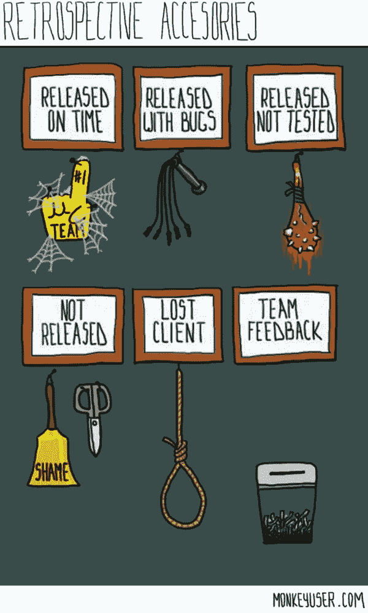

Picture Credit: [monkeyuser.com](https://www.monkeyuser.com/)

# 你熟悉这个场景吗？

Picture Credit:[https://www.reddit.com/r/ProgrammerHumor/](https://www.reddit.com/r/ProgrammerHumor/)

# 当你不知道改变一些东西有其他的依赖…

Picture Credit:[https://www.monkeyuser.com/](https://www.monkeyuser.com/)

# 当你可以为浴室选择瓷砖时，程序员会说…

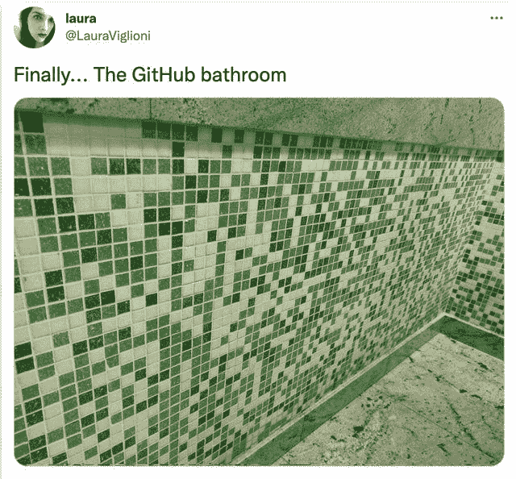

Picture Credit:[https://www.reddit.com/r/ProgrammerHumor/](https://www.reddit.com/r/ProgrammerHumor/)

# 当你从互联网上复制工作良好的代码到现有的代码库时

Picture Credit:[https://www.reddit.com/r/ProgrammerHumor/](https://www.reddit.com/r/ProgrammerHumor/)

# 如果你想在 5 秒内得到答案，这是最好的一个…

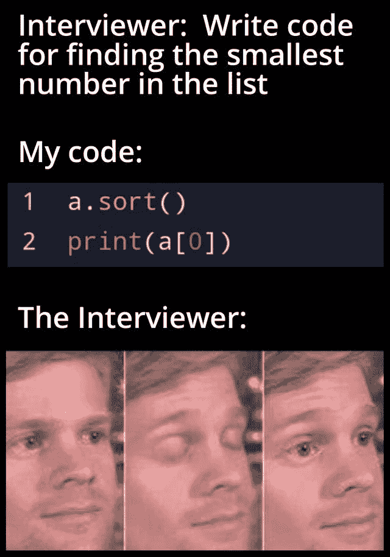

Picture Credit:[https://www.reddit.com/r/ProgrammerHumor/](https://www.reddit.com/r/ProgrammerHumor/)

# 别担心，我在这里，快回来…

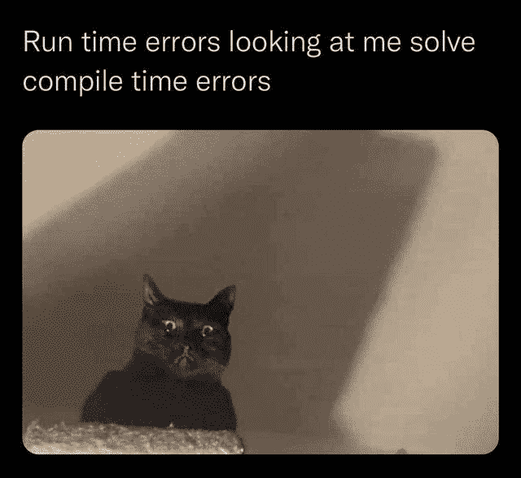

Picture Credit:[https://www.reddit.com/r/ProgrammerHumor/](https://www.reddit.com/r/ProgrammerHumor/)

# 那种感觉，当有人说我们不想要这个功能了…

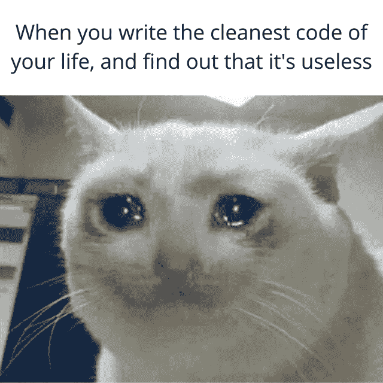

Picture Credit:[https://www.reddit.com/r/ProgrammerHumor/](https://www.reddit.com/r/ProgrammerHumor/)

# 土木工程师错过了控制台…

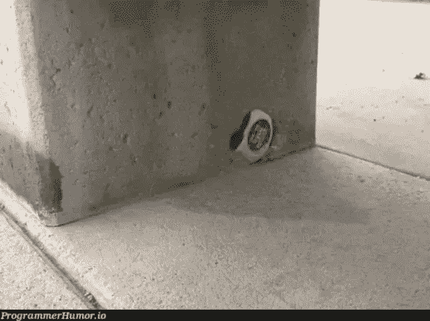

Picture Credit: [https://programmerhumor.io/](https://programmerhumor.io/)

# 谷歌会给你一切…然而，当我尝试搜索…

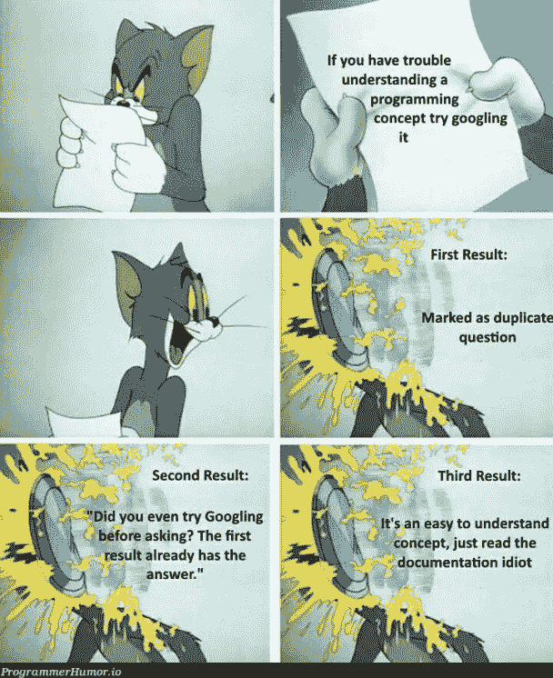

Picture Credit: [https://programmerhumor.io/](https://programmerhumor.io/)

# 有人这么做吗？我们只是重启来安装更新

Picture Credit: [https://programmerhumor.io/](https://programmerhumor.io/)

# 当你的经理强迫你参加需求收集会议时。

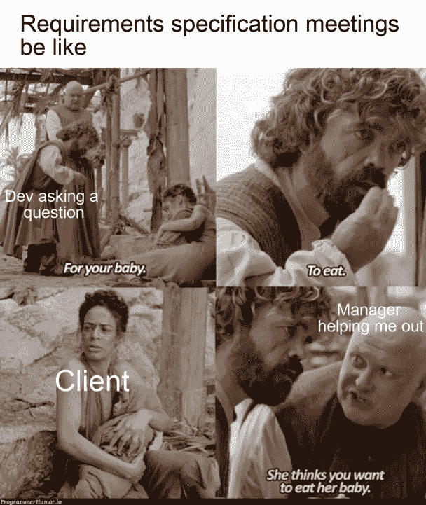

Picture Credit: [https://programmerhumor.io/](https://programmerhumor.io/)

# 积压的底部意味着杀死它…

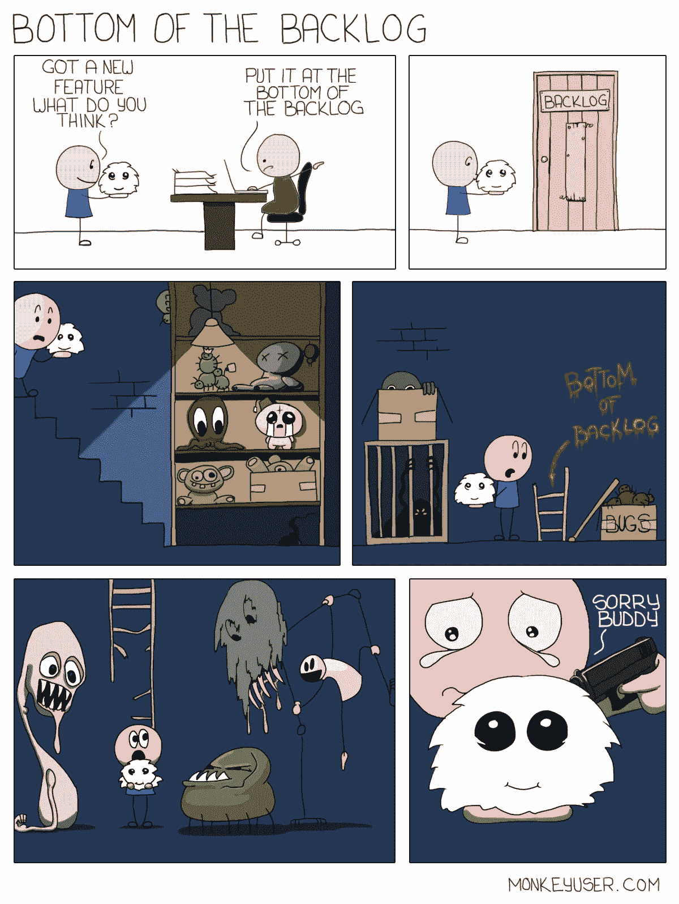

Picture Credit: [monkeyuser.com](https://www.monkeyuser.com/)

# 不懂就忽略…哈哈

Picture Credit: [monkeyuser.com](https://www.monkeyuser.com/)

# 额外剂量

# 有人属于同一个社区吗？

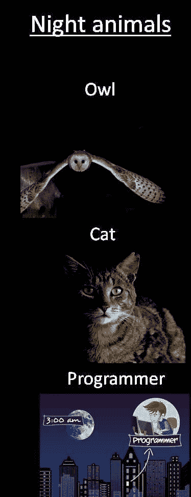

[https://www.facebook.com/techwithcodex/photos/a.137007467972178/350816823257907/](https://www.facebook.com/techwithcodex/photos/a.137007467972178/350816823257907/)

**来源:**[https://www.facebook.com/techwithcodex/](https://www.facebook.com/techwithcodex/photos/a.137007467972178/350816823257907/)

# “硬编码”程序的完美例子

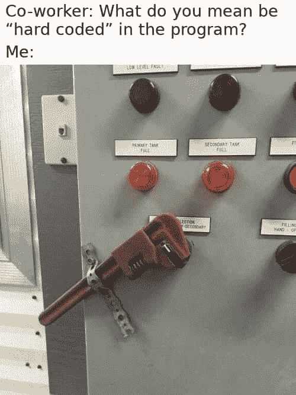

[https://www.facebook.com/photo?fbid=1297862840642289&set=gm.857233531662570](https://www.facebook.com/photo?fbid=1297862840642289&set=gm.857233531662570)

**来源:**[https://www.facebook.com/techwithcodex/](https://www.facebook.com/techwithcodex/photos/a.137007467972178/350816823257907/)

# 虫子是我最好的伙伴…

[https://www.facebook.com/photo?fbid=3924696810973376&set=gm.954427101782567](https://www.facebook.com/photo?fbid=3924696810973376&set=gm.954427101782567)

**来源:**[https://twitter.com/VishalMalvi_](https://twitter.com/VishalMalvi_)

# 100%自动化是不可行的:测试仪

[https://programmerhumor.io/programming-memes/qa_irl-2/](https://programmerhumor.io/programming-memes/qa_irl-2/)

来源:[https://programmerhumor.io/programming-memes/](https://programmerhumor.io/programming-memes/qa_irl-2/)

# 我每天都为参观 StackOverflow 感到自豪…

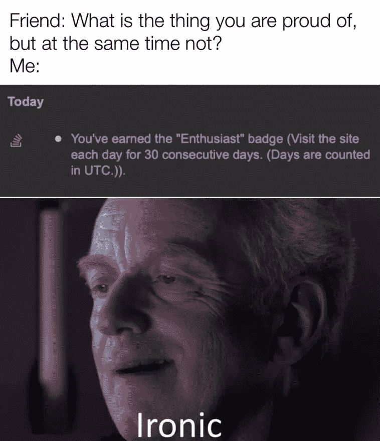

[https://programmerhumor.io/programming-memes/yea-i-know-thanks-stackoverflow/](https://programmerhumor.io/programming-memes/yea-i-know-thanks-stackoverflow/)

**来源:**[https://programmerhumor.io/programming-memes](https://programmerhumor.io/programming-memes)

# 模拟数据的快乐流程总是有效的，直到真正的集成…

[https://www.monkeyuser.com/2018/happy-flow/?sc=true&dir=random](https://www.monkeyuser.com/2018/happy-flow/?sc=true&dir=random)

**来源:**[https://www.monkeyuser.com](https://www.monkeyuser.com/2018/happy-flow/?sc=true&dir=random)

# 敏捷开发的本质得到了很好的解释…

[https://www.monkeyuser.com/2019/applied-scrum/?sc=true&dir=random](https://www.monkeyuser.com/2019/applied-scrum/?sc=true&dir=random)

**来源:**【https://www.monkeyuser.com】T2

# 你用哪种方法来修复 bug？

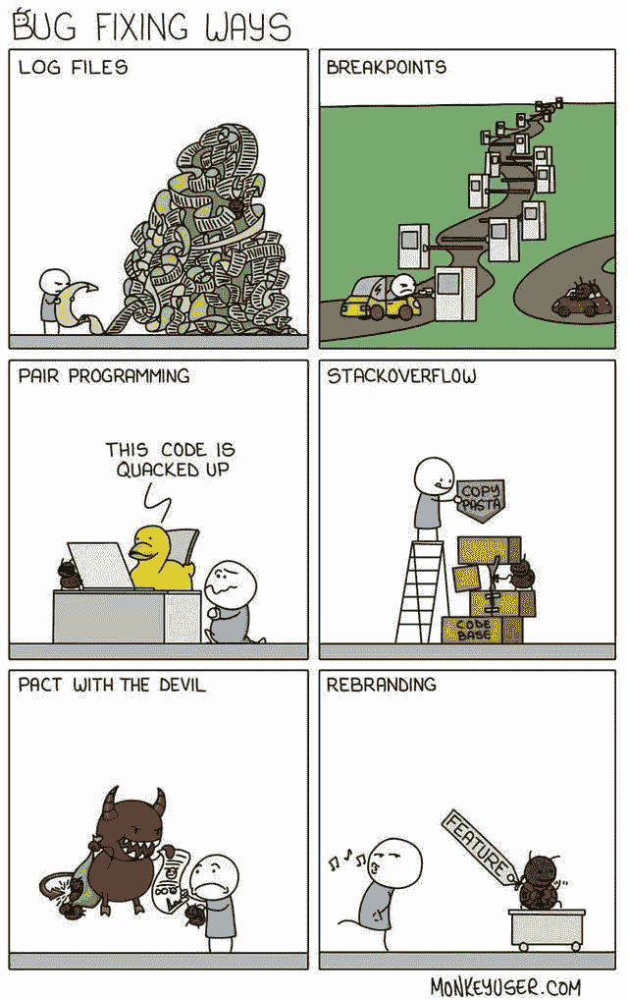

[https://www.monkeyuser.com](https://www.monkeyuser.com/2018/happy-flow/?sc=true&dir=random)

【https://www.monkeyuser.com】来源:

# 向老板证明的最佳方式…在休病假后…

[https://www.reddit.com/r/funny/comments/9b7qml/when_your_boss_ask_for_proof_youre_in_hospital/](https://www.reddit.com/r/funny/comments/9b7qml/when_your_boss_ask_for_proof_youre_in_hospital/)

**来源:**[https://www.reddit.com/r/funny/](https://www.reddit.com/r/funny/comments/9b7qml/when_your_boss_ask_for_proof_youre_in_hospital/)

# 你为什么责备我？这是你的主意…

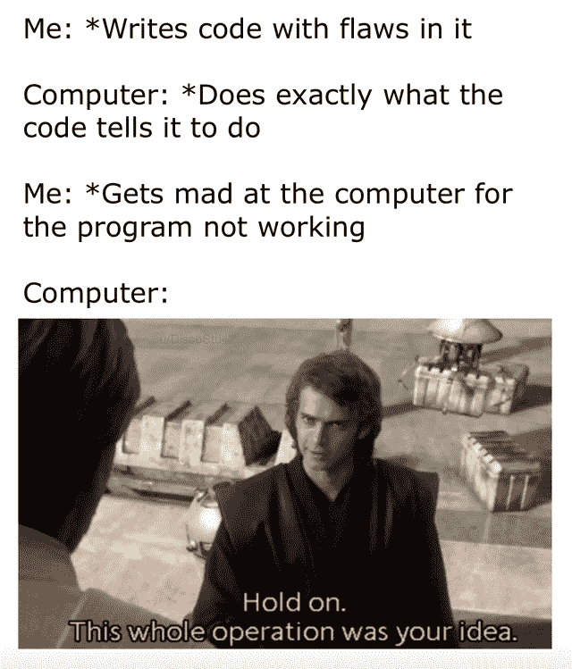

[https://www.facebook.com/DZoneInc/photos/10157380585604712](https://www.facebook.com/DZoneInc/photos/10157380585604712)

**来源:**[https://www.facebook.com/DZoneInc/](https://www.facebook.com/DZoneInc/photos/10157380585604712)

# 希望你有愉快的一天。

*更多内容请看* [***说白了就是***](https://plainenglish.io/) *。报名参加我们的* [***免费每周简讯***](http://newsletter.plainenglish.io/) *。关注我们* [***推特***](https://twitter.com/inPlainEngHQ) *和*[***LinkedIn***](https://www.linkedin.com/company/inplainenglish/)*。查看我们的* [***社区不和谐***](https://discord.gg/GtDtUAvyhW) *加入我们的* [***人才集体***](https://inplainenglish.pallet.com/talent/welcome) *。*