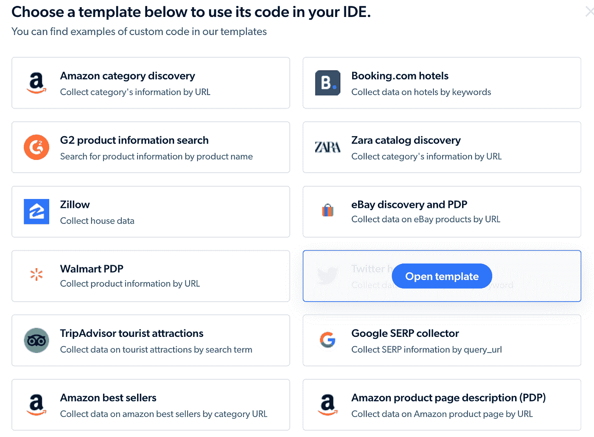

# 最佳网络抓取工具:beautiful soup vs . Regex vs . Advanced Web Scrapers

> 原文：<https://javascript.plainenglish.io/best-tool-for-web-scraping-beautifulsoup-vs-regex-vs-advanced-web-scrapers-50b8fb92950d?source=collection_archive---------4----------------------->

## BeautifulSoup、正则表达式或高级 web scraper——哪一个是 web 抓取的最佳工具？使用每种工具深入研究 web 抓取。


Photo by [Markus Spiske](https://unsplash.com/@markusspiske?utm_source=medium&utm_medium=referral) on [Unsplash](https://unsplash.com?utm_source=medium&utm_medium=referral)

从市场营销到战略发展，通过 web 抓取进行数据提取已经成为许多行业出于各种目的的重要需求。web 抓取的核心思想是从没有 API 端点来获取数据的公共网站中提取数据。

现代开发人员使用许多方法来抓取 web，最传统的方法是编写自己的脚本并抓取您需要的内容。因此，开发人员使用像 Python 和 JavaScript 这样的编程语言来编写他们的脚本。

这篇博客文章比较了三种抓取数据的方法:使用 DOM 解析(通过 Python 和 BeautifulSoup 库)、Regex(通过 JavaScript)和一个[高级 web 抓取工具](https://get.brightdata.com/web-scraper8453)。我们将研究每种方法及其优缺点，以帮助您决定满足您需求的最佳方法。

首先，我们将了解如何使用 DOM 解析来抓取网站。我们开始吧。

# 1.使用 DOM 解析的 Web 抓取(使用 Python/BeautifulSoup)

使用 DOM 遍历抓取网站相对容易，因为有大量的第三方 Python 和 JavaScript 库支持我们这样做。让我们从 Python 开始。

## 步骤 1:创建一个虚拟环境并安装所需的库。

因为我们将使用第三方依赖项(HTTP 请求的请求和 DOM 遍历的 BeautifulSoup)进行抓取，所以最好创建一个虚拟环境。

执行以下两个命令来创建并激活虚拟环境:

```
python3 -m venv venv
source venv/bin/activate
```

或者，如果你在 Windows 上，

```
> python3 -m venv venv
> cd venv/Scripts
> activate
```

激活后，虚拟环境将显示在我们的终端。


要开始 web 抓取，我们必须使用以下命令在 **venv** 中安装以下第三方库:

```
python -m pip install requests
python -m pip install beautifulsoup4
```

## 第二步:分析要刮的博客。

这里我们将使用 GeeksforGeeks 的一个博客来演示实现。我们将选择下面的博客网址开始抓取脚本:[https://www . geeks forgeeks . org/what-is-web-scraping-and-how-to-use-it/](https://www.geeksforgeeks.org/what-is-web-scraping-and-how-to-use-it/)


这个博客抓取器将使用一个 URL 并获取博客中发布的内容列表，然后它将收集文章名称等属性。


## 步骤 3:实现 Scraper

首先，创建一个名为 **scraper.py** 的 Python 文件，并添加两个导入，如下所示:

```
from bs4 import BeautifulSoup
import requests
import json
```

请求库生成一个 GET 请求来获取博客文章的数据。

```
blogUrl = “https://www.geeksforgeeks.org/what-is-web-scraping-and-how-to-use-it/"
response = requests.get(blogUrl)
```

然后，必须使用 BeautifulSoup 的 HTML 解析器将返回的文本响应解析成 HTML。

```
parsedHtml = BeautifulSoup(response.text, ‘html.parser’)
```

然后，可以通过执行一个 [DOM 操作](https://developer.mozilla.org/en-US/docs/Web/API/Document_Object_Model/Introduction)提取数据来查询故事。

```
blogDetails = []
blog = parsedHtml.find(‘article’, class_=’content post-414923 post type-post status-publish format-standard hentry category-guestblogs tag-web-scraping’)
blogTitle = blog.find(‘h1’).text
blogDetails.append({
 ‘blogTitle’: blogTitle
})

file = open(‘stories.json’, ‘w’)
file.write(json.dumps(blogDetails))
```

这里，使用`parsedHtml.find(‘div’, class_=’brd_blog_titles’)` DOM 操作抓取博文，然后相应地捕获所有数据。最后，收集的数据被追加到一个数组中，并写入一个 JSON 文件。最终结果如下:


现在，对于 web 抓取来说，DOM 解析有一些优点，也有一些缺点，让我们来看看。

## 使用 DOM 解析进行 Web 抓取的利弊

**优点:**

*   **强大的库和通用性:**这种方式进行网页抓取的最大优势之一就是通用性。例如，Python 有几个用于此目的的库，如 BeautifulSoup、Scrapy 和 Selenium。这些已经开发了多年，使得从 HTML 和 XML 文档中提取数据、处理 cookies、会话和其他 web 抓取任务变得容易。
*   **受欢迎程度和活跃社区:** DOM 解析是 web 抓取的首选方法，无论您使用的是 Python 还是 JavaScript，您都可以找到大量的教程、支持论坛和其他资源来帮助您完成 web 抓取项目。

**缺点:**

*   **耗费时间和资源的过程:**一次抓取大型网站或多个网站可能是一项耗时且耗费资源的任务。如果我们进行大规模的搜集，我们可能会发现自己在遇到服务器块之前就已经遇到了资源限制。此外，一些网站可能有防止网络抓取的措施，而 DOM 解析可能无法有效绕过这些措施。
    不用说，对于企业和个人开发者来说，这都不理想。但是，如果使用高级的 web 刮刀，这个问题就解决了(稍后将详细介绍)。
*   **抓取结构或布局不断变化的网站时，需要频繁的开发人员干预:**如果我们抓取的网站改变了其布局或结构，我们的脚本可能会中断。这可能需要经常维护我们的网络抓取脚本，以确保它们继续按预期工作。对于个人开发者和企业来说，这可能是一个痛苦的过程。为了避免这种情况，我们可以使用先进的抓取工具来处理结构或布局不断变化的动态网站。如前所述，我们将在本文后面看到更详细的内容。
*   **数据隐私——道德和法律问题:**网络搜集可能会引发道德和法律问题，这取决于您搜集的网站以及您如何使用所搜集的数据。重要的是要尊重你所浏览网站的服务条款，避免侵犯任何版权或其他知识产权。为了避免这一灰色区域，最好使用符合主要法律法规的刮擦工具或服务，包括新的欧盟数据保护监管框架、GDPR 和 2018 年加州消费者隐私法(CCPA)——尊重行使隐私权的请求。

接下来，我们将使用正则表达式(使用 JavaScript)完成 web 抓取过程。事不宜迟，我们开始吧。

# 2.使用正则表达式/JavaScript 的 Web 抓取

如果我们想在没有任何依赖性的情况下进行 web 抓取(从而保持我们的脚本轻量级)，我们最好的选择是[正则表达式](https://en.wikipedia.org/wiki/Regular_expression)(也就是“正则表达式”)。

这是如何工作的？嗯，HTML 是**语义**。它是一种使用标签来构建内容的标记语言，因此正则表达式可以很容易地匹配和提取这些标签及其内容。

例如，假设我们想要提取所有标题的文本(

# 、

## 等)。)在网页上。我们可以使用正则表达式来匹配每个标题的开始和结束标记，并提取中间的文本。我们将在本文中简要介绍这一过程，您将看到这对于从 web 页面中提取特定数据或创建页面内容的结构化数据表示非常有用。

这里，我们将抓取与 Python 示例相同的[网站](https://www.geeksforgeeks.org/what-is-web-scraping-and-how-to-use-it/)。

```
// Define an async function to fetch the page data
async function fetchPageData() {
  // Make an HTTP request to the web page
  const response = await 
  fetch(‘https://www.geeksforgeeks.org/what-is-web-scraping-and-how-to-use-it/');
  // Get the HTML content of the page
  const html = await response.text();
  // Use a regular expression to match and extract the headings
  const headingsRegex = /<h[1–6]>(.*?)<\/h[1–6]>/g;
  const headings = html.match(headingsRegex);
  // Return the extracted headings
  return headings;
}
```

总之，正则表达式允许我们从文档中匹配和提取特定的标签和属性，对于解析文档结构(如 HTML)非常有用。这对于从网页中提取数据或创建网页内容的结构化表示非常有用。

正如我们所见，与使用 BeautifulSoup 这样的外部库进行 DOM 解析相比，这是一种相对简单的方法。然而，在使用正则表达式或正则表达式进行 web 抓取之前，理解利弊是至关重要的。

我们来看看利弊。

## 正则表达式/JavaScript 网络抓取的利与弊

**优点**

*   **提取精确信息:**使用 regex 进行网页抓取的最大优势之一是，它允许我们从网页中提取非常具体和精确的信息。使用 regex，我们可以定义一个模式，只匹配我们正在寻找的文本，而忽略页面上的其他内容。这在处理包含大量不相关或嘈杂信息的网页时特别有用。在上面的例子中，我们使用这种方法从页面中提取标题，忽略其余的数据。
*   regex 的另一个优点是它得到了广泛的支持，可以在许多不同的编程语言中使用，包括 JavaScript。这意味着如果我们熟悉 regex，我们可以在我们的 web 抓取项目中使用它，而不必学习新的语言或工具。

然而，使用正则表达式进行网页抓取也有一些潜在的缺点。

## 骗局

*   **难以编写和调试:**正则表达式模式可能很复杂，难以阅读，并且很容易出错，导致我们的模式与我们要寻找的文本不匹配。此外，regex 可能运行缓慢，尤其是在应用于大量文本时。
*   **可呆板:**可脆可呆板。因为正则表达式模式非常特殊，如果网页的结构稍有变化，它们很容易被破坏。这意味着，随着网页的不断变化，我们可能需要不断地更新和维护我们的正则表达式模式。

总的来说，使用正则表达式进行网页抓取的利弊将取决于我们的具体情况和需求。如果我们需要从网页中提取非常具体的信息，并且习惯使用 regex，那么它可能是一个有用的工具。

然而，如果我们正在处理大量的文本或者需要能够适应变化的网页结构，那么其他的 web 抓取方法可能更合适。这就是 Bright Data 的 [**Web Scraper IDE**](https://get.brightdata.com/web-scraper8453) 的用武之地。我们将在下一节中找到关于这个工具的更多信息。

# 3.使用 Bright Data 的 Web Scraper IDE 进行网页抓取

我们可以不使用上面讨论的所有编码方法和技术，而是使用高级的 web 抓取工具，如 Bright Data 的 Web Scraper IDE。这个强大的工具允许我们抓取数据并以任何标准格式存储。

## 步骤 1:设置帐户以使用 Web Scraper IDE

首先，进入光明数据的[**Web Scraper IDE**](https://get.brightdata.com/web-scraper8453)，点击‘开始免费试用’。然后我们填写表格，填写我们的基本信息，并注册 Bright Data。


这里我们需要给出我们的组织 ID 来注册并开始使用 IDE。

接下来，我们将使用我的详细信息创建一个帐户，并演示如何使用 Bright Data IDE 收集数据。


## 步骤 2:访问 IDE

注册后，转到 Web 数据平台页面，在那里我们可以找到许多有用的链接来检查数据集市场、请求自定义数据集、检查 Bright Data insights 以及访问 IDE。


接下来，选择 Web Scraper IDE 卡上的“开始”按钮，并选择一个模板开始。这里，我们将选择一个 Twitter 标签搜索。



## 步骤 3:了解 IDE 并收集数据


IDE 是在 JavaScript 之上开发的，你可以根据自己的需求编写代码。它为您提供了 JavaScript 的超集函数和命令，并通过提供简化的开发人员体验缓解了 web 抓取的许多棘手问题。


IDE 本身由三个主要部分组成，它们是:

1.  **交互代码**:

这是我们配置铲运机的地方。一旦我们选择了一个模板，我们可以让这些设置保持不变。但是，如果我们正在编写自己的脚本，IDE 会为我们提供详细、有用的注释，让我们知道每个选项的作用，以及我们为什么要更改它们。举个例子，

```
//Max Time of collection (4.5m + then 30sec to collect result)
let collection_time = new Date(Date.now() + 4.5 * 60000)
```

`Date.now()`返回一个以毫秒为单位的值，因此，如果我们希望收集器收集最多 2 分钟的数据，我们可以将其改为`new Date(Date.now() + 2 * 60000)`。

此外，我们可以通过配置一个忽略数组来过滤导航到不需要的页面。

```
try {
  wait_network_idle({ignore:[/accounts.google.com/, /twitter.com\/sw.js/, /twitter.com\/i\/jot/]})
} catch (e) {}
```

**2。解析器代码**:

提取 HTML 只是第一步。在这一节中，我们编写代码，将提取的数据解析和净化成我们想要的结构。我们在交互代码中收集的每个变量都会调用这个函数。

例如，如果我们在交互代码中收集了这些…

```
// call parse() to get the data
// then call collect() to add a record to your final dataset
let data = parse();
collect({
  url: new URL(location.href),
  title: data.title,
  links: data.links,
});
```

…我们将在解析器代码中对这些变量进行整理(去掉尾随空格)和添加结构(将所有提取的链接添加到一个数组中，而不是明文)。

```
// Code that will parse page HTML into structured data.
// Use parse() in interaction code to read this data.
return {
  title: $(‘h1’).text().trim(),
  links: $(‘a’).toArray().map(e=>new URL($(e).attr(‘href’))),
};
```

3.**用户交互单元**:

在这里，我们可以:

*   **Input** —管理我们的输入(在本例中，这是我们放置所关注的标签的地方)。正如所料，我们在这里的输入将被插入到我们实际的抓取代码中。单击预览进行测试。


*   **运行日志** —我们可以通过查看运行日志来检查作业状态。


*   **浏览器控制台** —该窗口是内置的浏览器控制台，显示运行期间发生的任何错误。


*   **浏览器网络** —在这里，我们可以监控通过 IDE 传递的所有请求。


*   **最后一个错误** —在这里，我们可以监控在完成刮削任务后是否出现任何错误。


*   **输出** —我们可以看到抓取的结果并下载数据集。


那是一个包裹。接下来，我们将看看这个过程的利与弊。

## 使用 Bright Data 的 Web Scraper IDE 进行 Web 抓取的利弊

**优点:**

*   该 IDE 可通过 Bright Data 的网站访问，使其易于立即启动。它不需要任何内部数据收集基础设施。
*   基于 Bright Data 的[代理基础设施](https://get.brightdata.com/proxy-types7488)，实现可扩展性和 99.9%的准确性。
*   使用[解锁器](https://get.brightdata.com/web-unlocker9963)基础设施，有助于克服基于验证码、IP 和设备指纹的拦截(要更详细地深入了解解锁器基础设施如何帮助克服网站拦截，请访问 [**此处**](https://get.brightdata.com/web-unlocker-enables-better-fingerprinting-auto-unlocking-and-captcha-solving) )。
*   为我们提供了各种数据丰富的网站的现成模板，以及基于 JavaScript 构建的有用函数和命令，帮助我们编写 scraper，而无需手动编写所有代码。
*   与传统的 DOM 解析或使用 regex 的抓取方法不同，我们可以从动态网站中提取数据，因为 IDE 支持开箱即用的浏览器模拟，从而省去我们配置 Selenium 的麻烦。
*   在典型的 web 抓取应用程序中，每当网站更新时，我们都需要更新我们的脚本。然而，使用 Bright Data 的 IDE，我们可以从任何公开可用的网站提取数据，而不用担心，因为它是一个托管服务，可以自动为我们更新模板。
*   光明数据致力于遵守数据保护要求，包括 GDPR 和 CCPA。
*   虽然其他方法确实有广泛的社区支持，但如果我们遇到问题，我们仍然需要花时间在网上搜索资源。Bright Data 提供 24/7 实时支持，因此我们不必浪费时间在海量信息中筛选，只为找到解决问题的正确方案。

**缺点:**

*   有一个免费试用，我们需要在它结束后为明亮的数据付费。
*   作为所有方法的共同问题，只能提取公开可用的数据。

# 网页抓取最好的方法是什么？

正如我们上面讨论的，DOM 解析是首选的 web 抓取方法，但是它也有问题。它不可扩展，可能会有网站获得新更新的情况，在这种情况下，我们可能会重写超过 90%的脚本。

正则表达式是一种非常规的策略，可以很好地为我们服务，它们使我们的脚本轻量级，可以在任何地方部署。然而，正则表达式是出了名的挑剔和难以编写，而且，如果站点的结构/布局改变，它们也会崩溃。

除了这些方法，那么，考虑一个更稳定的刮擦解决方案，如 [**Web Scraper IDE**](https://get.brightdata.com/web-scraper8453) 当扩展时。要习惯光明数据这样的工具，不如选择免费试用的工具来试试，不浪费你的钱。

考虑到以上所有方法，您可以根据自己的需求决定选择什么。

***原文由*** [***查鲁卡***](https://medium.com/u/6d47b99e463c?source=post_page-----50b8fb92950d--------------------------------) ***写成。***