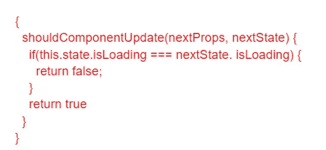

# 加快您的反应原生应用程序的最佳技巧

> 原文：<https://javascript.plainenglish.io/best-tricks-to-speed-up-your-react-native-app-56c6f0edbdad?source=collection_archive---------3----------------------->

## **如何让你的 React 原生 App 运行更快**


[Image Source](https://unsplash.com/photos/FGXqbqbGt5o)

毫无疑问，React Native 在过去几年中迅速获得了人气，但一些开发者仍在思考如何让他们的 React Native 应用运行得更快。

尽管 React Native 可以非常快，但它并不总是像本机代码那样快。然而，通过一些认真的性能优化，您可以轻松加快 React 原生移动应用程序的速度。

但问题是你如何让它跑得更快，尤其是如果你以前从未做过的话？

放心吧！我们已经介绍了一些简单而神奇的技巧，您可以使用它们来使 React 本机应用程序运行得更快，并增强应用程序的性能。在本指南中，我将带您了解基本和高级优化技巧，任何人都可以尝试加快 React 本机应用程序的速度。不管你是有经验的开发人员还是从未建立过 React 原生项目的人，这些技巧都很容易实现。

考虑到开发人员和初学者的技能，我们试图以 JavaScript 模块的形式涵盖所有这些技巧。这些技巧很容易安装，或者您可以将代码复制到自己的应用程序中。还有一些方法可以雇佣一个 React 原生应用开发者来利用一些 React 原生优化，而根本不需要你修改任何代码！

从学习如何让你的应用程序在 Android 设备和 iOS 模拟器上运行到加速你的动画，这个指南将帮助你把你的 React 原生应用程序从零到英雄在任何时候！

让我们来看看一些让你的 React 原生 app 运行更快的方法吧！

# **加速你的原生手机应用反应的简单方法**

## **1。修复缓慢渲染**

React Native 最常见的问题之一是渲染速度慢。原因是 React Native 不像 web 浏览器那样使用传统的 DOM。相反，它使用虚拟 DOM，这是本地视图层次结构的 JavaScript 表示。

当用户与 React 本机应用程序进行交互时，更改会被批量处理，然后发送到应用它们的主线程。如果有许多元素需要更新，这个过程可能会很慢。

**这里有一些修复应用渲染问题的技巧:**

*   使用 Chrome 性能工具来确定应用程序的哪些部分速度较慢。
*   检查您是否使用了不必要的复杂组件。
*   确保在一次渲染过程中没有进行太多的样式更改。
*   看看能否创建复杂组件的简单版本。
*   使用 shouldComponentUpdate 生命周期挂钩来防止不必要的重新渲染。
*   使用 memoize 函数来记忆昂贵的计算。
*   确保你没有在主线程上做太多的工作。

## **2。重新检查样式尺寸**

在 React Native 中，更改元素在屏幕上的布局或位置是最常见的性能问题，这就是为什么样式重新计算如此频繁。为了避免这种情况，找出是什么导致了样式的重新计算，并找到一种方法来阻止它。

首先，这里有七种方法可以确保这种情况不会发生:

*   **忘掉动画吧:**动画可能很有趣，但对于 React 本地应用的运行性能来说，它们也很昂贵。如果可能的话，确保你没有任何动画。例外情况是低功耗 UI 效果，如视差滚动或其他需要最小动画的运动效果，如惯性滚动。
*   **使用静态布局:**静态布局有助于减少样式的重新计算，它只在视图的新部分出现时才进行渲染，而不是像动态布局那样每次都进行布局更新。另外，你可以考虑 [**雇佣一个 React 本地开发者**](https://www.appsdevpro.com/hire-developers/hire-react-native-developers.html) 来进一步协助你。
*   使用静态布局也允许你设置渲染道具和记忆风格，而不用担心更新。不利的一面是，它们迫使开发人员以一种不自然的方式组织他们的组件。此外，这提供了组件之间可预测的交互，并消除了由顺序依赖引起的难以发现的错误。
*   **正确设置 shouldcomponentdupdate():**不正确地使用 shouldcomponentdupdate()会导致您的计算机在每次进行布局计算时都要做一些额外的工作，这会降低速度并最终导致性能下降。正确使用*shouldComponentUpdate()*并根据组件内部的逻辑大小设置合适的粒度级别——不多不少！

为了便于参考，我们分享了一份代码指南:



## **3。利用爱马仕提升性能**

Hermes 是一个开源的 JavaScript 引擎，专门用于提高移动应用程序的性能。适用于 Android，兼容 React 原生 0.60.4 版本及更高版本。

此外，Hermes 还适用于 0.64-RC.0 及以上版本的 iOS。Hermes 的主要作用是减少下载量、内存占用和应用程序交互所需的时间。在 React 本机应用程序中使用 Hermes 可以帮助您增强应用程序的性能，并使您能够确保更好的用户体验。

*通过打开 build.gradle 并添加以下行来激活 Hermes for Android:*

```
def enableHermes = project.ext.react.get(“enableHermes”, true);
```

*要为 iOS 启用 Hermes，请打开 Podfile 并使用以下命令行:*

```
use_react_native!(:path => config[:reactNativePath], :hermes_enabled => true
```

## **4。利用延迟加载来改善启动时间**

惰性加载是软件开发中使用的一个概念，用于按需加载资源。在 React Native 的上下文中，这意味着只在需要的时候加载组件。这可以通过使用 React Loadable 之类的库或者通过将你的应用程序代码分割成更小的片段来实现。

主要目标是通过减少初始加载时需要解析和执行的代码量来提高性能。如果操作正确，延迟加载可以显著改善应用程序的启动时间。

为了更好的使用，你可以考虑在印度雇佣一个移动应用开发者。使用 React Loadable，我们能够将加载时间从 3 秒减少到不到 1 秒。如果不想使用第三方包，也可以通过手动代码拆分来完成。

例如，如果您有一个 app 组件，总共有两个屏幕和五个场景(例如，App-A 屏幕+ 5 个场景)。在这种情况下，考虑创建一个应用程序——一个将所有五个场景作为孩子的屏幕。之后，在目录内为每个场景创建四个单独的文件:***【App-A/Scenes/scene 1，App-A/Scenes/scene2，*** 等。

接下来，创建一个名为 App 的索引文件，您将在其中导入这些文件，而不是导入每个单独的场景。一开始，一次导入所有内容可能会令人望而生畏，但是假设有 100 个屏幕和 1000 个场景，这意味着每个场景要导入 100 次，这很快就会增加！

## **5。在 React 本地应用中使用 interaction manager**

InteractionManager 为开发人员提供了一种对诸如触摸事件或导航转换等交互进行排队和管理的方法。默认情况下，交互是同步处理的。这可能会导致丢帧和抖动。InteractionManager 允许开发人员指定交互完成的时间，这样就可以相应地安排长时间运行的工作。

为了使用 InteractionManager，您需要将任何可能导致 jank 的代码包装在交互回调中。一旦您包装了代码，任何交互都将触发回调，允许您调度长时间运行的工作。

下面是一行代码，您可以直接在现有代码中实现:

```
InteractionManager.runAfterInteractions(() => {// …long-running synchronous task…});
```

## **6。优化你的 React 原生应用代码**

React Native 是开发移动应用程序最流行的框架之一。它因其易用性、灵活性和性能而受到开发人员的喜爱。大多数组织选择 [**雇佣移动应用开发者**](https://www.appsdevpro.com/hire-developers/hire-mobile-app-developers.html) 来构建 React 原生应用，只是为了避免性能问题。然而，即使是优化得最好的本地应用程序也会遇到性能问题。

> 以下是一些帮助您优化 React 原生应用程序代码并使您的应用程序运行更快的提示:

*   优化您的代码，使其更有效地运行。这可以通过缩小你的代码并使用一个像 Babel 这样的工具把它转换成 ES5 来实现
*   另一种提高性能的方法是使用缓存和预编译资产。
*   要提高 React 原生应用的性能，首先要优化代码。这可以通过缩减代码、减少依赖项的数量以及使用注重性能的编码风格来实现。
*   精简代码意味着从源代码中删除不必要的字符，比如空格。这可以使用像 UglifyJS 这样的工具来完成。
*   减少依赖的数量意味着确保你的应用只加载它需要运行的代码。这可以通过树抖动未使用的代码或使用像 webpack 这样的模块捆绑器来完成。
*   使用注重性能的编码风格意味着从一开始就编写针对性能优化的代码。

最后，确保您没有发出太多的网络请求，并且您使用的是像 V8 这样的高性能 JavaScript 引擎。

## **7。移除 React 本地应用中的控制台语句**

为了让 React 本机应用程序运行得更快，您需要删除任何控制台语句。控制台语句用于调试目的，可能会降低应用程序的速度。要删除它们，可以使用名为 Babel-plugin-transform-remove-console 的 Babel 插件。这个插件将从你的代码中删除所有的控制台语句。

*想知道它是如何工作的？这里有一个快速指南:*

**第一步:**你可以在你的终端运行 NPM install—save-dev babel-plugin-transform-remove-console 或者使用 Yarn(Yarn add—dev babel-plugin-transform-remove-console)来安装。

**第二步:**然后，您需要通过添加`babel-preset-react : presets/env`来告诉您的项目这是其环境的依赖项。

第三步:最后一步是更新您的。带插件的 babelrc 文件:}插件:}}

希望这些简单的步骤能帮助你提高 React 本地应用的性能。在实践这些技巧时，你们中的许多人可能会想，“如果我们考虑从头开始开发一个 React 本机应用程序会怎么样？”哪里能雇佣到印度最好的 React 原生应用开发者？创建一个具有最佳性能的 React 原生应用程序需要多少成本？如果你也对此感兴趣，那么这里是问题的答案…

## **从头创建一个 React 原生 App 需要多少成本？**

从头开始创建一个 React 原生应用的成本可以低至 10，000 美元，高至 50，000+美元。惊讶的知道为什么会有巨大的差异。

在这里我们将告诉你秘密咒语…

应用程序开发的平均成本取决于各种因素，如应用程序的复杂性、技术、应用程序开发团队、UI/UX 设计、测试、特性和功能。这些因素根据业务需求有很大的不同。由于每个企业都是不同的，因此他们需要不同的解决方案来满足他们的需求。

因此，根据这种复杂性，应用程序开发的平均价格可以相应地上下波动。如果你已经有了创建一个 React 原生应用的想法，那就值得和专家讨论一下，以获得成本估算。可以预约免费咨询时段进行讨论！

## **简单地说**

React 原生应用的许多方面都会影响其性能，包括大型图像、繁重的计算和不必要的渲染调用。然而，好的一面是你可以雇佣一个 [**React 原生应用开发者**](https://www.appsdevpro.com/hire-developers/hire-react-native-developers.html) 通过遵循最好的技术和技巧来快速克服这些问题。此外，专家将在那里使用最佳选择的工具和方法，以确保最佳的应用程序性能，而不必实施这么多的编码。

=======================================

*更多内容看* [***说白了就是 io***](https://plainenglish.io/) *。报名参加我们的* [***免费周报***](http://newsletter.plainenglish.io/) *。关注我们关于* [***推特***](https://twitter.com/inPlainEngHQ) ， [***领英***](https://www.linkedin.com/company/inplainenglish/) *，以及* [***不和***](https://discord.gg/GtDtUAvyhW) *。*