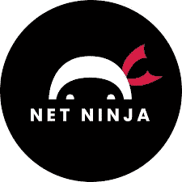

# 学习 JavaScript 的最佳 YouTube 渠道

> 原文：<https://javascript.plainenglish.io/best-youtube-channels-to-learn-javascript-1422f2cb71ce?source=collection_archive---------7----------------------->

Photo by [Alexander Shatov](https://unsplash.com/@alexbemore?utm_source=medium&utm_medium=referral) on [Unsplash](https://unsplash.com?utm_source=medium&utm_medium=referral)

2022 年要学 JavaScript 编码吗？你需要好的资源以好的方式学习它。

在 2022 年，以最高效和最愉快的方式学习东西的最佳内容是视频。在哪里可以找到大量免费的、高质量的 JavaScript 相关视频呢？答案显然是 YouTube。你需要知道学习 JavaScript 的最佳渠道。那么，让我们开始回顾一些伟大的 YouTube 频道。

# **freeCodeCamp.org**

freeCodeCamp.org

我相信这不是你第一次听说这件事。这是一个巨大的 YouTube 频道，投入了大量的精力和工作。它充满了教程，特别是长视频(超过 5 小时)的形式，你可以停下来，在你喜欢的时候移动。它非常灵活，非常独特。内容真的很丰富。事实上，找到一些它没有覆盖的话题比找到覆盖的话题更难。

有超过 500 万次观看的视频(观看次数最多的有超过 3000 万次观看)。所以，它绝对是可靠的，高质量的。而且，这一切也是免费的。在我看来，这些视频的质量甚至比我过去参加的大多数付费课程都要好。

对于 JavaScript，有一些完整的教程，从初学者到专家，也有更具体的选择。有专门的课程讲框架或者库，像 React 这种。我个人参加了 React 课程，所以如果你有兴趣，我建议你也参加。

**评分:** 9.5/10

# **网络忍者**

The Net Ninja

你喜欢更非正式的学习方式吗？那么网络忍者就是你的选择。它真的很完整，但也更简单，更容易理解。他们的课程是由多个视频组成的集合，这些视频是关于相同主题的连续视频，从开头开始，一直到复杂性。也有 JavaScript 编程概念的视频集，比如 Async one，上面有 11 个视频。

它有令人难以置信的图形，也有一个框架教程。节点速成班绝对很棒。我接受了，这是一个很好的选择。这种类型的教程被分成更多的视频，唯一的问题是，有时 YouTuber 会放一个介绍和结尾，使教程有点慢，分散，不太令人愉快。反正这是个人的一点小意见。有人可能更喜欢做这种类型的学习。

所以，为了内容的丰富和质量，绝对建议。

**评级:** 8.5/10

# **第一部分的结论**

所以，以上是我建议你想学 JavaScript 的话可以去看看的渠道。我确信它们绝对是有价值的，并且会对你学习这种难以置信的编程语言有很大的帮助。很快，本文的第二部分将接踵而至。

希望你喜欢。如果你有，请订阅。

*更多内容请看*[***plain English . io***](http://plainenglish.io/)*。报名参加我们的* [***免费周报***](http://newsletter.plainenglish.io/) *。在我们的* [***社区***](https://discord.gg/GtDtUAvyhW) *获得独家获得写作机会和建议。*