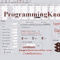

# 学习 JavaScript 的最佳 YouTube 渠道

> 原文：<https://javascript.plainenglish.io/best-youtube-channels-to-learn-javascript-b75d409112b3?source=collection_archive---------6----------------------->

## 第 2 部分:JavaScript YouTube 世界探索的继续。

JavaScript 作为编程语言还是一个好的选择吗？不，这是最好的。所以，你需要尽可能用最好的方法来学习它。如果你想增加你的知识，你需要参考那里最好的资源。最好的资源当然是 Youtube 视频，而最好的 Youtube 视频正是我们想要捕捉的。那么，你想继续了解一些更好的学习 JavaScript 的渠道吗？下面是第二部分。

如果你错过了第一条:以下是链接:

 [## 学习 JavaScript 的最佳 YouTube 渠道

### 2022 年要学 JavaScript 编码吗？你需要好的资源以好的方式学习它。

javascript.plainenglish.io](/best-youtube-channels-to-learn-javascript-1422f2cb71ce) 

JavaScript in Youtube

**编程知识**

Programming Knowlege

你知道 Youtube 上最有名的编码教程频道吗？希望如此。《编程知识》提供了最广泛的编程相关教程，几乎涵盖了所有领域、技术和水平。你是初学者吗？太完美了。您是需要开始学习 React 的高级开发人员吗？这里是完美的地方。

这个频道有很多播放列表，是一个必须至少考虑的选择，但也可能是唯一考虑的选择。在这里，你可以找到你需要的一切，一切。语言基础、Node.js、React 以及几乎所有 JavaScript 附带的东西。

如果质量是必须的，你会发现难以置信的高质量，所以你不能出错。示例、一致的代码和所有的可能性。最棒的频道之一。我会说，一切也是免费的。太棒了。看看这个。你不会错的。

比率:10 / 10

**旅游媒体**

Traversy Media

另一个可以用来有效学习 JavaScript 的渠道是 Brad Traversy。他让他的视频看起来像是现场课程，让它们尽可能真实。他准备了剧本，但也加入了他的经验带给他的每一个知识。它让你感觉像是在和某人说话，而不是看着显示器。

他有很多材料，适用于所有级别，从基础开始，通过 OOP。他有一系列视频，但也有一个更大的速成班，比如 Angular。尽管如此，他更喜欢使用普通的 JavaScript，这是我们有时容易忘记的东西。在我看来，这是一种附加值。

所有这些视频的丰富性以及它们给每个观看它们的人带来的质量并不是那么容易找到的，尤其是对于只有一个 YouTuber 维护的频道来说，这也是现实生活中的一个开发者。所以，非常好的选择。和布拉德一起去。

比率:9/10

**网页开发简化版**

Web Dev Simplified

如果你已经知道你想从事 JavaScript 的前端开发，并且对 HTML 和 CSS 的集成感兴趣，这就是你的渠道。他拥有涉及前端和 JavaScript 的一切，从基础到更复杂的东西。你将学习如何制作你的网页动画。

他不仅给了你操作 DOM 的知识和能力，还给了你写代码时要遵循的最佳实践，以及为什么要遵循它们。主持人的名字是凯尔。他还制作项目，每个人都可以跟着练习。

他还有很多视频，在这些视频中，他可以在几分钟内教授一些东西。如果您试图确定使用什么技术，并且不需要完整的演练，这真的很有用。这个频道也有自己的时事通讯，这是我有时用来阅读的。建议。

比率:9 / 10

**爱德华卡！**

这是 youtube 上技术方面最完整、装备最齐全的视频之一。他有自己的 JavaScript 教程播放列表，共有 41 个视频，但也有 3 小时 32 分钟的单个视频版本。

很棒的动画，非常完整的课程。它有高质量的内容，这肯定会帮助你的知识和可能性。这个频道最棒的一点是，如果你上了这门课，你就完全沉浸在了 edureka 的生态系统中。

这意味着你也有很多其他关于技术主题的视频，你可以观看这些视频来增强你对这个行业的总体了解。它给你一个坚实的基础，不仅如此。在我看来，这个渠道更适合缺乏经验的开发人员，但只是一个提示。

比率:8 / 10

**第二部分结束**

所以，我们讨论了编程知识、Traversy 媒体、Web Dev Simplify 和 Eudreka！巨大的资源是存在的，这就是证明。那么，JavaScript 是你的梦想职业吗？通过这些资源来学习它，以获得最佳效果。

感谢阅读本小编的第二部分。如果你认为第三方是个好主意，请告诉我。求求大家，订阅更多！

*更多内容看* [***说白了就是***](http://plainenglish.io/) *。报名参加我们的**[***免费周报***](http://newsletter.plainenglish.io/) *。在我们的* [***社区不和谐***](https://discord.gg/GtDtUAvyhW) *获得独家获取写作机会和建议。**