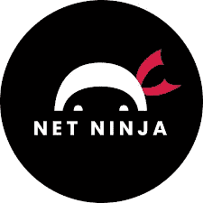

# 学习 React 的最佳 YouTube 频道

> 原文：<https://javascript.plainenglish.io/best-youtube-channels-to-learn-react-223a7d943d27?source=collection_archive---------5----------------------->

## 在 YouTube 上哪里可以找到最好的 React 教程

Photo by [Lautaro Andreani](https://unsplash.com/@lautaroandreani?utm_source=medium&utm_medium=referral) on [Unsplash](https://unsplash.com?utm_source=medium&utm_medium=referral)

React 作为 2022 年学习的前端框架是个好选择吗？是的，它是。但是，如果你想最有效地学习它，你需要知道最好的资源在哪里。

当然，最好的资源是 YouTube 视频，但不是随机的，只有高质量的。因此，这里列出了所有最好的频道和 YouTubers，这将提高你的学习曲线，并帮助你在这个神奇的框架中成为更好的程序员，这个框架叫做 React。

# freeCodeCamp.org

我相信这不是你第一次听说这件事。这是一个巨大的 YouTube 频道，投入了大量的精力和工作。

它充满了教程，特别是长视频(超过 5 小时)的形式，你可以停下来，在你喜欢的时候移动。它是灵活和独特的。内容丰富。找到一些它没有涉及到的话题比那些已经涉及到的话题更难。

有超过 500 万次观看的视频(观看次数最多的有超过 3000 万次观看)。因此，它是可靠的，高质量的。而且，这一切也是免费的。

在我看来，这些视频的质量甚至比我过去参加的大多数付费课程都要好。

对于 React，有一些完整的辅导课程，从初学者到专家，也有更具体的选择。该视频长达 12 小时，已于 2022 年制作完成，因此拥有学习 React 几乎一切所需的所有信息是完美的。更好的是，只有文档。

在频道上，也有一些视频，他们使用 React 创建了一些项目，通常带有一些后端技术，您可能也想学习。否则只能看教程里 React 相关的部分。

**评级** : 9.5/10

# 编程知识

Photo by [Mohammad Rahmani](https://unsplash.com/es/@afgprogrammer?utm_source=medium&utm_medium=referral) on [Unsplash](https://unsplash.com?utm_source=medium&utm_medium=referral)

你知道 YouTube 上最有名的编码教程频道吗？希望如此。《编程知识》提供了最广泛的编程相关教程，几乎涵盖了所有领域、技术和水平。

你是初学者吗？太完美了。您是需要开始学习基础知识和高级主题的高级开发人员吗？这里是完美的地方。

这个频道有很多播放列表，是一个必须至少考虑的选择，但也可能是唯一考虑的选择。在这里，你可以找到你需要的一切，一切。从 React 的基本概念到更复杂的额外津贴和错误捕捉。

如果质量是必须的，你会发现难以置信的高质量，所以你不能出错。示例、一致的代码和所有的可能性。

最棒的频道之一。我会说，一切也是免费的。太棒了。看看这个。你不会错的。

**评分** : 9 / 10

# 用 Mosh 编程

继续，让我们进入这个新的渠道。它是由开发商 Mosh 开发的。这个频道还谈到了 Javascript 生态系统中的 React，这种编程语言的资源可能不如其他频道丰富，但所有视频都非常有价值，值得花时间观看。

他有两种格式:第一种是速成课程(1 小时的视频，概括了许多概念)，另一种是针对一个主题的普通系列视频。他的 React 长教程真的很丰富，很有价值。关注他的教程的好处是，他通常会免费创建一些备忘单，与他的追随者分享。所以，跟随教程的人可以有一些书面笔记，如果他们喜欢的话。

这可能是初学者以及喜欢用最简单的方式处理事情的人的最佳选择。他也有自己的付费视频，如果你感兴趣，你可以付费观看。

**评级:** 8/10

# 网络忍者

你喜欢更非正式的学习方式吗？那么网络忍者就是你的选择。它是完整的，但也更简单，更容易理解。他们的课程是由多个视频组成的集合，这些视频是关于相同主题的连续视频，从开头开始，一直到复杂性。从创建第一个 React 项目，到几乎执行页面上最高级的东西。

它有令人难以置信的图形，也有一个框架教程。初级课程很棒。我接受了，这是一个很好的选择。这种类型的教程被分成更多的视频，唯一的问题是，有时 YouTuber 会放一个介绍和结尾，使教程有点慢，分散，不太令人愉快。反正这是个人的一点小意见。有人可能更喜欢做这种类型的学习。

所以，对于内容的丰富性和质量，绝对建议。

**评级:** 8.5/10

# 结论

所以，如果你想学习 React，我建议你看看这些渠道。我确信它们绝对是有价值的，并且会对你学习这种难以置信的编程语言有很大的帮助。

[希望你喜欢这篇文章，如果你考虑鼓掌和订阅，或者点击这个链接来支持这个博客和整个平台。非常感谢。](https://medium.com/@mpossamaim/membership)

*更多内容请看*[***plain English . io***](https://plainenglish.io/)*。报名参加我们的* [***免费周报***](http://newsletter.plainenglish.io/) *。关注我们关于*[***Twitter***](https://twitter.com/inPlainEngHQ)[***LinkedIn***](https://www.linkedin.com/company/inplainenglish/)*[***YouTube***](https://www.youtube.com/channel/UCtipWUghju290NWcn8jhyAw)*[***不和***](https://discord.gg/GtDtUAvyhW) ***。*****

*****对缩放您的软件启动感兴趣*** *？检查* [***电路***](https://circuit.ooo?utm=publication-post-cta) *。***