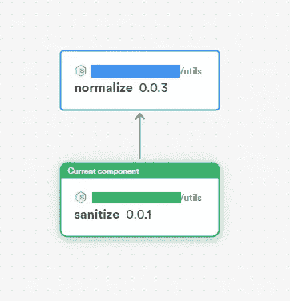

# 利用共享的 JavaScript 实用函数提高开发速度

> 原文：<https://javascript.plainenglish.io/better-developer-velocity-with-shared-javascript-utility-functions-8a528d8d1319?source=collection_archive---------8----------------------->

## 保持代码干燥的实用指南，以及跨项目正确重用 JS helper 函数的最佳实践


助手/实用程序功能的行业标准方法是维护一个专用文件夹，根据功能和强相关性标准对它们进行命名和分组，并根据需要隐式导出/导入每个功能。

到目前为止，一切顺利。但是**效用函数是非上下文特定的**。

当然，您会在其他项目中重用它们，将它们传递给团队成员，甚至在线共享它们，对吗？

但是从以前的项目中复制粘贴代码是一种幼稚的解决方案，不仅扩展性差，而且还会产生许多代码可读性和维护问题。

那么分享效用函数的正确方法是什么呢？在我看来，这里有三个从差到好的解决方案。

> *💡*使用 npm 并不是其中任何一个的严格要求——您可以使用任何其他包管理器——yarn、chocolatey、pnpm 等。

# 1.将您的模块发布到您自己范围下的 NPM 注册中心

就像罐头上写的一样。你应该这么做:

*   用`npm init`初始化包目录，添加名称和描述，并用您的用户名来确定包的范围。
*   将您的助手/实用函数放入包入口点(默认情况下是`index.js`)，并导出它们。
*   在 NPM 网站上创建一个帐户，验证您的电子邮件，然后使用`npm login`通过 CLI 登录。
*   一切就绪！用`npm publish --access=public`发布

你将拥有无限的公共访问包和基本的免费层，但这并不总是一个选择，因为你工作的大多数企业项目不会是开源的(即使你的项目是开源的，NPM 也不太适合被发现。)

没有未上市的 NPM 包这种东西，除非你[付费](https://www.npmjs.com/products)，否则你不能发布私人包。即使这样，也不可能进行粒度访问控制或协作。

> *💡* NPM 最近被 Github 收购，Github 专注于让它成为一个公共注册中心。Github 包将成为私人包的选择，每个帐户每月使用 500MB 存储空间/1GB 数据传输(**而不是**每个包)。

# 2.上传一个秘密网址的 tarball

这利用了这样一个事实，即像 NPM 这样的包管理器可以安装从提供的 URL 获取的**档案。你应该这么做:**

*   首先，通常的——`npm init` 包目录，包的名称和描述，包括版本信息等。
*   从您的包目录中创建一个 [tarball](https://en.wikipedia.org/wiki/Tarball) (一个. tar 归档文件)，您的函数位于其中的一个子文件夹中(类似于`package/`)。下面是命令。(如果在 Windows 上使用 Powershell)
    `tar cvfz FILENAME.tar.gz DIRECTORY/`
*   将这个档案上传到任何你想上传的地方——你甚至可以自己管理它。然后，您可以自由地使用任何访问控制方法来隔离它。
*   每当你在一个项目中需要它的时候，就像这样通过 NPM 安装它，并在需要的地方导入它:

```
npm i your-url.com/FILENAME
```

最后，适当的访问控制！但是有了条件——**这就完全是你的责任了**。除了软件包安装过程，NPM 不参与任何事情。这种方法是在拥有未列出+私有包和访问控制之间的一种折衷，代价是[语义版本](https://github.com/npm/node-semver)和自动更新。

不用说，可发现性将是不存在的，所以这只对私有回购有用；严格的内部用例。

# 3.通过 Bit 版本化和发布

那么，什么是理想的解决方案呢？吸取了前两个解决方案的不足，以下是我们的新标准:

*   发布功能，并简化共享/导入功能的流程。
*   拥有访问控制、自动依赖管理和版本+更新。
*   让它容易被发现和浏览，改善开发人员的体验。

钻头将完全符合我们的需求。它是一个用于发布、共享和发现新组件的开源工具链和中心——最重要的是，它还支持 Node.js 模块。我们可以将它用于普通的 JS 实用函数——忠于可组合软件开发的主题。

让我们创建并共享几个字符串实用函数——包括测试、文档和演示。要看成品，请前往 https://bit.cloud/sixthextinction/shared-utils[查看。如果你愿意，也可以随意叉它们！](https://bit.cloud/sixthextinction/shared-utils)

## 步骤 0:先决条件

首先，确保您已经安装了二进制位。

```
npx [@teambit/bvm](http://twitter.com/teambit/bvm) install
```

此外，你需要建立一个 [bit.cloud](https://bit.cloud/) 账户，并且知道如何在那里打开一个远程 scope。不要担心这个——Bit 会指导你完成这个过程。

> *💡* [作用域](https://bit.dev/docs/scope/scope-overview)允许来自不同组织的同名包通过命名空间共存。

## 步骤 1:创建一个 Bit 工作空间

导航到您的项目文件夹，并在那里初始化一个 Bit 工作空间。这很像`npm init`——创建一个暂存区，让我们在一个地方构建、导入、预览、修改可组合代码，并管理其依赖关系。

```
bit init
```

然后，在您选择的文本编辑器中打开新创建的 **workspace.jsonc** 文件，并将`defaultScope`属性的值更改为`your-bit-cloud-username.your-scope-name`。替换您自己的值，但要注意点分隔符！

## 步骤 2:我们的第一个效用函数——归一化

在您的工作区文件夹中，运行以下命令:

```
bit create node utils/normalize
```

这将创建一堆文件和目录。让我们一次解决一个问题。在 `./your-remote-scope/utils/normalize/`处的 **normalize.ts** 是你实际要导出的效用函数。所以让我们先编码。

Simple enough; we’re using a regex pattern, replacing all unicode characters in the range U+0300 — U+036F with an empty character.

这将删除所有组合字符的 unicode 块，从而使我们的字符串正常化。

> *💡*在`bit create`之后的`node`参数告诉 Bit 创建一个 Node.js 模块——相对于[其他你可以使用的](https://bit.dev/docs/getting-started/composing/creating-components)——比如 React、React Native、MDX 等等。使用`bit templates`命令了解更多信息！

## 步骤 3:测试、文档和作文。

如果没有适当的单元测试、文档，或者展示其工作原理的快速演示，我们的效用函数对任何人都没有用。首先:用 Jest 进行单元测试。

Unit tests should be self-explanatory for anyone consuming our module, even if not exhaustive.

下一个，医生。Bit 支持 [MDX](https://mdxjs.com/) ，因此使用`ts`和`tsx live`降价使您的文档**可视化**。

```
---
labels: ['normalize', 'string utils', 'remove accents']
description: 'A utility function that removes accents and diacritics from a given string'
---

import {normalize} from "./normalize";

Use this function to normalize a string by removing the unicode block of combined diacritical characters (aka accents).
U+030 - U+036F
Read this for more info : https://en.wikipedia.org/wiki/Combining_Diacritical_Marks

API:

```ts
function normalize(): string;
```

```tsx live

<div>For example, "crème pâtissière" will be normalized to "{normalize("crème pâtissière")}"</div>
```

This function leaves regular characters untouched.

```tsx live

<div>{normalize("This is a normal string with no diacritics")}</div>
```
```

甚至可以直接在 MDX 文件中使用 HTML 和 React 代码。点击阅读更多关于那个[的内容。](https://bit.cloud/blog/meet-component-driven-content-applicable-composable-l24cw7ku)

最后，组合——最小的 JSX/TSX 来预览你的代码在现实世界中的样子。

Think of compositions as the image gallery/carousel on a product’s landing page.

## 步骤 4:版本和发布

全部完成！最后一步是标记并导出我们的效用函数。

```
bit tag --message “First version”
```

标记变更运行我们项目的构建管道— —编译我们的代码并生成一个包，安装依赖项，运行我们的单元测试——并在这个过程结束时创建一个可导出的快照，完成[语义版本](https://github.com/npm/node-semver)(与 NPM 使用的版本相同)以方便依赖项管理。

> *💡*如果您在这个阶段得到任何错误，您可能会丢失依赖项。运行`bit install`来修复这些问题。

```
new components
(first version for components)> utils/normalize@0.0.1
```

让我们继续将这个快照发布到我们的远程范围。

```
bit export
```

要查看这个已发布的实用函数在测试、合成和 MDX 文档中的样子，请访问:

[](https://bit.cloud/sixthextinction/shared-utils/string-utils/normalize) [## 共享实用程序/字符串实用程序/正常化

### 从给定字符串中删除重音符号和音调符号的实用函数。标有 normalize，字符串实用程序…

比特云](https://bit.cloud/sixthextinction/shared-utils/string-utils/normalize) 

## 步骤 5:模拟与我们的第二个实用函数——Sanitize 的协作

我们到此为止。我们现在可以将`normalize`包`npm install`(在[将我们的远程作用域的注册表添加到 npm 配置](https://bit.dev/docs/packages/npmrc)之后)，导入到我们的项目中，并根据需要使用它。

不过，在今天结束之前，让我们来看一个模拟的真实场景:**嵌套实用函数**。如何创建另一个使用这个函数作为依赖项的实用函数，然后发布它，就像您创建这个函数一样？

我们的第二个实用函数(在一个全新的目录中)是一个字符串杀毒器，它从一个规范化的字符串中删除所有的 HTML 标签和标记——用浏览器仍然可以读取的符号来替换它，但是消除了潜在的危害。可以看出，这将使用我们的第一个函数(`normalize`)作为依赖项。

```
> bit init
> bit create node utils/sanitize
```

Using regex again, this time to escape HTML tags and other tokens globally.

如您所见，这个组件将我们的`normalize`函数作为一个依赖项。让我们快速安装它。

```
> bit install @your-username/your-remote-scope.utils.normalize
```

Unit tests are simple enough.

A composition to showcase each stage of the process.

最后是 MDX 文档。

## sanitize.docs.mdx

```
---
labels: [‘sanitize’, ‘string utils’, ‘escape html tags’]
description: ‘A utility function that normalizes a string to remove diacritical characters, then sanitizes it by properly escaping all HTML tags’
---import {sanitize} from “./sanitize”;Use this function to sanitize a string in two steps : 
1) Normalize the string to prep it for Step 2 — Remove the unicode block of combined diacritical characters in the range U+030 — U+036F. 
2) Properly escape all HTML tags, to safeguard against potentially malicious behavior without omitting information contained within the string.---
`&amp;` to replace &`&lt;` to replace <`&gt;` to replace >`&quot;` to replace “`&apos;` to replace ‘---API:```ts
function normalize(): string;
``````tsx live<div>For example, “<i>pâtisserie</i>” will be sanitized to “{sanitize(“<i>pâtisserie</i>”)}”</div>
```
```

照常标记和导出。

```
bit tag --message ”First version”
bit exportnew components
(first version for components)
     > utils/sanitize@0.0.1
```



Bit provides a visual dependency graph that lets you easily skim through a component/module’s structure.

同样，如果你想看看这是什么样子的出版，完成测试，文件，和组成，这里给你。

[](https://bit.cloud/sixthextinction/shared-utils/string-utils/sanitize) [## 共享实用程序/字符串实用程序/整理

### 一个实用函数，将一个字符串规格化以去除变音字符，然后通过正确转义…

比特云](https://bit.cloud/sixthextinction/shared-utils/string-utils/sanitize) 

## 额外收获:用`bit import`重构依赖关系

在我们结束之前，还有最后一个场景:如果您遇到了依赖项中的错误或设计缺陷，最终破坏了您自己的代码——一个您无法修复的错误或设计缺陷，因为您无法访问正在导入的模块，该怎么办？

让`bit import`来拯救我们吧！

该命令将远程作用域中指定的组件/模块添加到您的工作区中(与**安装**一个组件相反，该组件只是将其作为一个包添加到您的`node_modules/`)。这个**让您可以访问导入的实用函数的实际代码**，允许您编辑它并立即看到变化。

```
bit import your-username.your-remote-scope/utils/normalize
```

哎呦。事实证明，我们在`normalize` 的正则表达式没有全球`/g` 标志！它不能处理一个字符串中多次出现的音调符号。让我们解决这个问题。

Yikes. Hope no one noticed that…

对代码进行更改，当您标记这些更改时。

```
changed components
(components that got a version bump) 
   > your-username.your-remote-scope/utils/normalize@0.0.2auto-tagged dependents:utils/sanitize@0.0.2
```

…Bit 将自动更新任何使用它作为依赖项的版本号；我们例子中的`sanitize`函数。

# 两全其美

您的效用函数现在已经发布并可被发现，为选择使用它们的任何人提供了清晰的文档和预览。

借助 Bit，您可以实现以下实用功能:

1.  你的实用函数现在**完全独立**了，可以用来组成任何项目中的任何东西——无论是 Node.js 后端、React 前端还是普通的 js 应用。任何软件包管理器都可以用来安装它们。
2.  对已发布的包进行范围界定、自动依赖性解析和自动更新，并提供精确的访问控制，无论您是选择公开和开源，还是保持远程范围私有，只在需要时通过 Bit 添加协作者。
3.  **真相的单一来源**。对一个模块的更新将自动更新所有依赖它的代码库，语义版本控制使得回滚到以前的版本并停留在那里变得很简单——这对于维护遗留代码非常有用。
4.  **可发现性** —任何加入团队的人都可以快速浏览您的位存储库，发现他们可以轻松导入并构建新的、酷的东西的可组合代码。如果你的远程作用域是公开的，那将适用于世界上的任何人。

这个话题到此为止。感谢您的阅读。

## 进一步阅读

[](https://bit.cloud/blog/meet-component-driven-content-applicable-composable-l24cw7ku) [## 满足组件驱动的内容:适用的、可组合的

### 自从 React 和 Angular 等技术出现以来，我们经常将术语“组件”与…

比特云](https://bit.cloud/blog/meet-component-driven-content-applicable-composable-l24cw7ku) [](https://bit.cloud/blog/sharing-types-between-your-frontend-and-backend-applications-l5qih48g) [## 在前端和后端应用程序之间共享类型

### 您的后端 API 已经更新，可以返回新类型的数据。必须通知前端团队进行更新…

比特云](https://bit.cloud/blog/sharing-types-between-your-frontend-and-backend-applications-l5qih48g) [](https://bit.cloud/blog/how-to-reuse-react-components-across-your-projects-l4pz83f4) [## 如何在项目中重用 React 组件

### 最后，您完成了为应用程序中的表单创建一个奇妙的输入字段的任务。你对……很满意

比特云](https://bit.cloud/blog/how-to-reuse-react-components-across-your-projects-l4pz83f4)