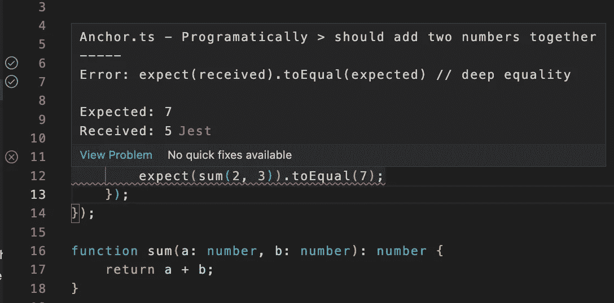
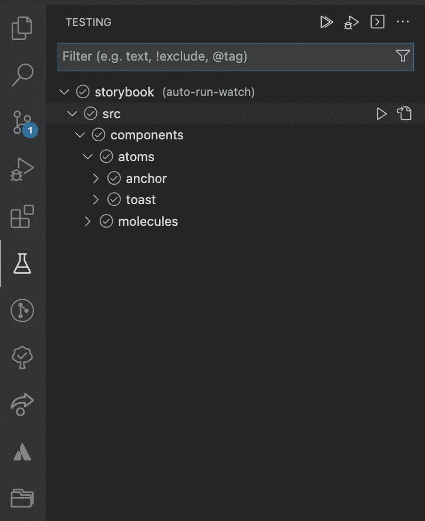
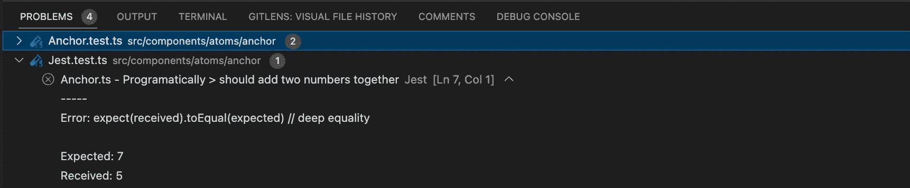
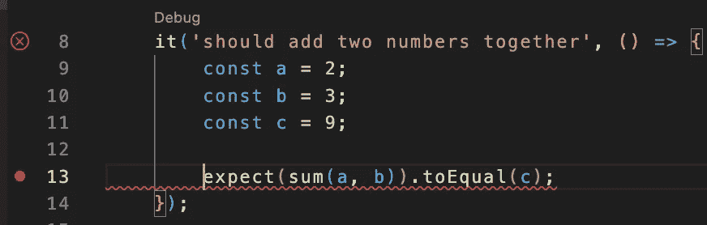
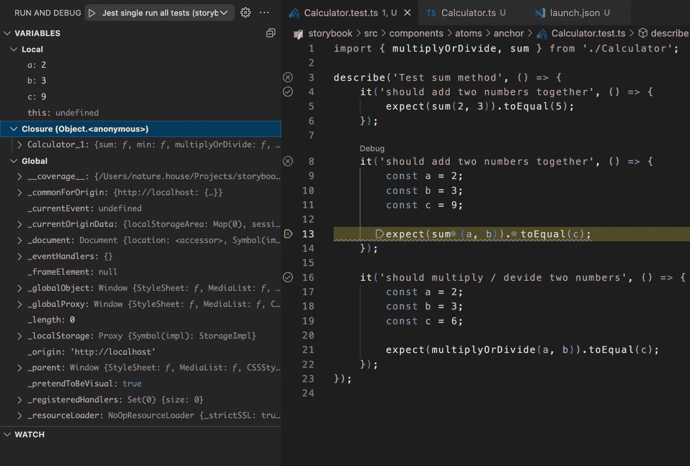
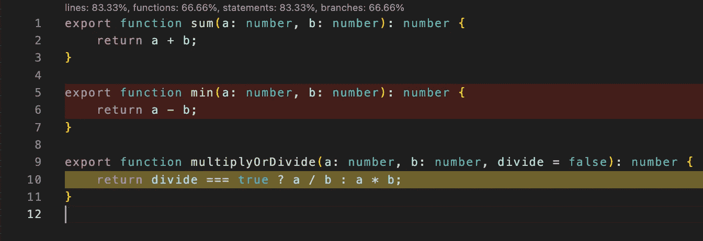

# 用 Jest 在 Visual Studio 代码中进行更好的单元测试

> 原文：<https://javascript.plainenglish.io/better-unit-testing-in-visual-studio-code-with-jest-6b2393401c33?source=collection_archive---------2----------------------->

## 使用 Jest 扩展来极大地改进您的测试流程

我用 Jest 编写单元测试已经有 5-6 年了。它总是使我能够为我的类、方法和组件编写适当的单元测试。

在我所有的项目中，我总是通过命令行运行 Jest。在初始化项目时，我设置了一个简单的`npm test`或`yarn test`命令，并在需要手动旋转测试时使用。此外，每当我创建一个新的 Pull / Merge 请求时，测试都会在我的 CI/CD 管道中运行。

然而，最近我发现了 [VSCode Jest 扩展](https://marketplace.visualstudio.com/items?itemName=Orta.vscode-jest)。这个扩展提供了比命令行更好的工作流程。让我们来看几个特性。

## 1.自动开始 Jest 测试

如果 Jest 安装在你的项目的根文件夹中，那么这个插件将开箱即用，并开始观察运行相关测试的变化。

如果您没有在根目录中安装 Jest，您可以通过工作区中的 VSCode 设置或全局 VSCode 设置轻松地设置一个自定义命令。例如:

## 2.显示单个失败/通过的测试

VSCode Jest 扩展在测试文件中提供了一个可视界面，用于显示测试是否通过。此外，您可以通过点击绿色/红色图标重新运行测试。

The Jest Extension adds an inline red underline where tests fail with a detailed error message. Additionally, you can see the status of all tests on the left side

 [## 为什么我从一个开发机构转向一个平台

### 以及为什么我永远不会回去

javascript.plainenglish.io](/why-i-switched-from-a-development-agency-to-a-platform-57b576b82c85) 

Visual Studio 侧边栏有一个测试面板，现在将显示所有 jest 测试及其状态。这给了你一个快速的概览和一个在测试之间导航的简单方法。

此外，失败的测试也会显示在底部面板的问题检查器中。

## 允许单元测试的调试

我们可以很容易地为 Jest 测试设置调试。首先，在项目的根目录下创建或打开一个`.vscode/launch.json`。应将以下配置添加到该文件中。

导航到一个测试文件，并在代码中要调试的任何位置设置一个断点。您可以通过单击行号左侧一点来设置一个圆点，从而设置断点。

Example of a breakpoint on line 13

在“*运行和调试*”面板中，您现在可以按下播放按钮开始调试。这将显示大量信息:

*   **局部变量** —所有的局部变量将显示在面板的左上方，旁边是它们的值。您可以使用调试器函数来移动您的测试行，甚至移动到您正在测试的方法中，以找出测试没有通过的原因。
*   **闭包** —在封闭范围内可访问的所有变量。
*   **全局** —所有全局可访问的变量。

## 显示文件中的代码覆盖率

VSCode Jest 扩展提供了一个通过命令面板切换代码覆盖率报告的选项。打开命令面板，寻找`Jest: Toggle Coverage`命令。

这将在您的代码文件中切换一些东西，如下面的屏幕截图所示。

*   在该文件的顶部，您可以获得关于该文件覆盖范围的全局信息。它显示单元测试覆盖的函数、语句和分支的百分比。
*   未测试的线用红色背景标记。这有助于您一眼看出代码中未测试的路径。
*   部分测试的代码用黄色背景标记。例如，下面的三元运算符只在一种情况下进行测试，但它永远不会到达 *else* 子句。

## 结论

如果你像我一样，并且只在单元测试中使用过 CLI 界面，我强烈建议你试试编辑器工具。直到亲身经历了才知道自己其实有多需要这个。

如果你喜欢我的内容，并想支持我的努力，考虑通过[我的会员链接](https://medium.com/@WesleySmits/membership)成为一个媒体订阅者。这不会花费你任何额外的费用，但 Medium 会把部分收益给我，让我推荐你。

如果你愿意，你可以在 [LinkedIn](https://www.linkedin.com/in/wesley-robert-smits/) 或 [Twitter](https://twitter.com/iamwesleysmits) 上联系我！

 [## 通过我的推荐链接加入 Medium-Wesley Smits

### 阅读韦斯利·斯密特(以及媒体上成千上万的其他作家)的每一个故事。您的会员费直接支持…

medium.com](https://medium.com/@WesleySmits/membership) 

*更多内容请看*[***plain English . io***](https://plainenglish.io/)*。报名参加我们的* [***免费周报***](http://newsletter.plainenglish.io/) *。关注我们关于*[***Twitter***](https://twitter.com/inPlainEngHQ)[***LinkedIn***](https://www.linkedin.com/company/inplainenglish/)*[***YouTube***](https://www.youtube.com/channel/UCtipWUghju290NWcn8jhyAw)*[***不和***](https://discord.gg/GtDtUAvyhW) *。对增长黑客感兴趣？检查* [***电路***](https://circuit.ooo/) *。***