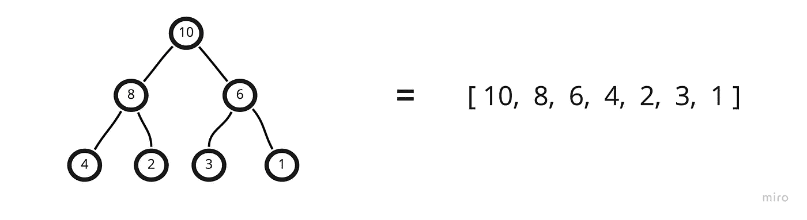
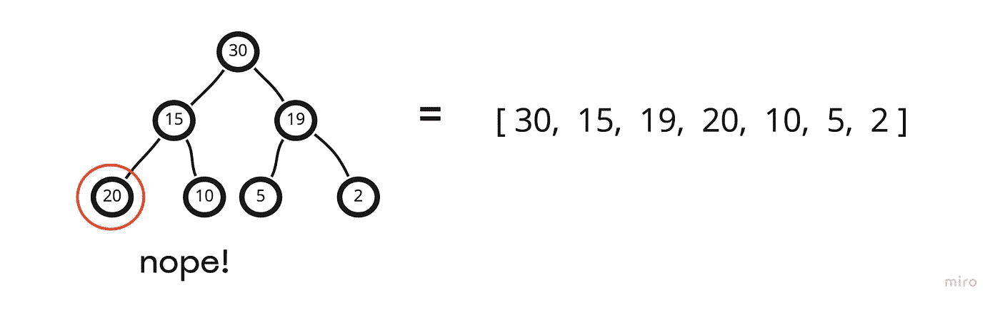

# 二进制堆&如何用 JavaScript 实现它们

> 原文：<https://javascript.plainenglish.io/binary-heaps-in-javascript-ee497d905df?source=collection_archive---------16----------------------->

## JavaScript 中二进制堆实现的详细演练。

又见面了！

今天的主题是二进制堆以及如何用 JavaScript 实现它们。二进制堆有很多用途，但是今天(为了保持我对简洁的热爱),我们将直接进入一个基本的解释/实现。

我们走吧！

***二进制堆 vs .二叉树***

在结构上，它们非常相似。我们有父母/孩子的关系，每个父母可能只有两个孩子。关键的区别在于，我们有不同的规则来规定值在树上的位置。

首先，有两种堆——最小堆和最大堆。

我将从 max-heap 开始(本文剩余部分给出的解决方案也将主要关注 max-heaps)

概念很简单。每个子节点值必须小于其父节点值。所以…

…这是有效的最大堆。

你可能会立即注意到，有了堆，我们不需要遵守一些我们通常的二叉树规则。例如，6 小于它的兄弟 8，但是它在它的父树的右边。

我们唯一关心的是所有子节点值都小于它们的父节点值。

现在(您可能已经猜到了)，最小堆正好相反。

我们的子节点值必须大于其父节点值。

现在我将提到堆的另一个规则——除了最深的层次之外，树的所有层次都必须完全填充。并且当最深层没有被完全填满时，存在的节点必须尽可能地靠左。所以…

?

简单吧？

**简化甚至*进一步……***

我最喜欢的堆特性是它们可以很容易地以数组的形式工作。因此，与其考虑使用递归爬虫遍历树并以空间方式处理数据结构，我可以同样容易地(或更容易地)只考虑数组。

怎么会？嗯…

…我们可以将这些值推入一个数组，从根开始，以广度优先的方式移动。

并且，对于数组中的每个节点，(如果我们遵循了堆的两个规则)有一个简单的、公式化的方法来定位子节点和父节点。

我现在将单步执行并定位堆中每个节点的子节点。

因此，我们的父节点在索引 0 处，它的子节点在索引 1 和 2 处。

现在，我们的父节点位于索引 1，它的子节点位于索引 3 和 4。

最后，当父节点为 2 时，其子节点位于索引 5 和 6 处。

所以现在可以说，当给定堆(数组)中的父节点索引时，我们可以用这些表达式定位它的子节点(其中 n 是父节点的索引)

**2n + 1(左子)**

**2n + 2(右子)**

相反，我们可以从子节点中找到父节点

**数学楼层((n - 1) / 2)**

其中 n =任一子节点的索引。

***实现***

现在我知道了如何存储我的堆并定位父节点和子节点，我准备设置我的 MaxBinaryHeap 类

现在，我让我的构造函数将一个空数组设置为我的堆，并且我还添加了一个实例方法，该方法在被调用时会向堆中添加一个值。

但是为了确保在我添加值时堆不会变得无序，我需要一些在值被添加到堆的末尾后立即发生的行为。通常，我听到最多的名字是“冒泡”。

在这种情况下,“冒泡”的意思是，当我们在堆的末尾添加一个值时，(max heap)我们会给它一个机会向上冒泡到它在结构中的正确位置。

以之前的例子为例，假设我加了 15。

没有。现在我们违反了我们的一个规则，一个父节点有一个值更大的子节点。因此，让我们设计一个过程，让我们的最新价值找到它的适当位置。

嗯，我们知道我们可以找到它的父节点，如果我们能做到这一点，我们可以将其与该值进行比较，如果它更大，我们将交换它们。然后，我们将重复这一过程，直到我们新增加的价值不再被交换(它找到了自己的位置)。

这是我实现的冒泡方法:

首先我建立了一个新的索引，然后是一个循环，直到我返回。

在循环中非常简单，我将建立父节点的索引，然后将父节点值与新添加的值进行比较。如果少于新增加的价值，那么我就交换它们。

最后，当不再进行交换时，我的新值将“冒泡”到它在堆中的正确位置！

**T5 从堆里提取……**

因为堆经常被用作优先级队列，所以能够移除最顶端的值也同样重要。

现在，我们遇到了一个新问题，其基本思想与之前类似——如果我们只是从堆中移除根节点，可能会导致堆的结构不正确。

因此，我们需要另一个过程来解决我们在获取最大价值时产生的任何问题。

**冒泡*下降*下降**

当我感觉有些奇怪或违反直觉时，我会很快承认，这绝对是其中之一。这是一个非常简单的过程，而且非常非常酷——只是不像以前的冒泡方法那么直观。

现在，我将遵循以下步骤:

1.  从堆中移除第一个值(我们从队列中取出它)
2.  移除堆中的最后一个*值，并将其移动到前面(根)*
3.  现在找到它的子节点值
4.  确定两者中最大的子节点值
5.  如果向下冒泡的值小于下面最大的子节点值，我们将交换这两个值
6.  然后，我们将继续这样做，直到不再进行交换(并且已经找到它在堆中的位置)

既然我们已经概述了这种方法，让我们来直观地看一下

我有一个有效的最大堆，我想从中提取最高优先级的值(根)。所以我先把它从数组中移除。

只是现在，在基于新数组重画了堆之后，很明显我现在违反了我们的规则之一，因为父节点有一个更大值的子节点。

所以我的第一步是从数组中移除最后一个值，并把它放在前面…

但是现在这一堆都是各种各样的错误…

这就是向下冒泡发挥作用的地方。为此，我们将从新的根值开始，并定位它的子值。

我们的向下冒泡的节点(2)将向它向下遇到的每一对孩子提出一个问题——

“你们俩谁的价值更高？”

我对这个概念记得最清楚的方式是，在冒泡过程的第一步，这个问题实际上是

“你们谁是新的*根*？”

答案是 30，所以我们用 30 换了 2。现在，堆离有效性又近了一步。我们将再重复一次这个过程…

20 是两者中较大的一个，所以现在我们再交换一下

就是这样！

我们之前的最后一个值向下冒泡，这样做，重新排序堆。

**都在一起……**

所以对于我们的每一个基本堆方法(push 和 extractMax)，这个过程都相对简单—

1st:对于 push，我只是添加到堆数组的末尾，对于 extractMax，我删除第一个值。

第二步:然后我将立即调用 bubble 或 bubbleDown 方法来重新调整堆的优先级。

**完整代码**

*注意——第 55 行的目的是确保我没有超出数组索引。绝对有一种更吸引人的编码方式，但是为了覆盖更多的领域，我还是保持原样。

这就是我对二进制堆的介绍。我真的很惊讶地说，这些对我来说就像二分搜索法树一样有趣…这说明了很多！

*更多内容请看*[***plain English . io***](https://plainenglish.io/)*。报名参加我们的* [***免费周报***](http://newsletter.plainenglish.io/) *。关注我们关于*[***Twitter***](https://twitter.com/inPlainEngHQ)*和*[***LinkedIn***](https://www.linkedin.com/company/inplainenglish/)*。查看我们的* [***社区不和谐***](https://discord.gg/GtDtUAvyhW) *加入我们的* [***人才集体***](https://inplainenglish.pallet.com/talent/welcome) *。*