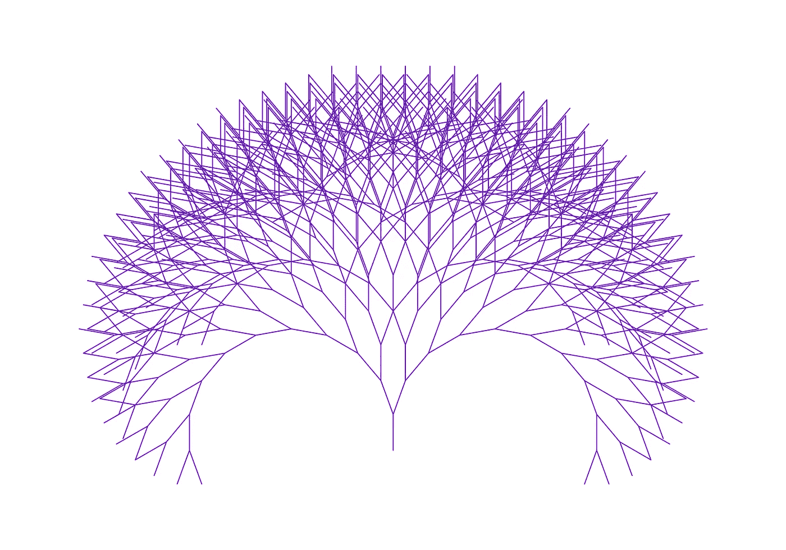

# JavaScript 中的二分搜索法

> 原文：<https://javascript.plainenglish.io/binary-search-35801fd39047?source=collection_archive---------16----------------------->

## 关于 JavaScript 中排序数组的二分搜索法的教程。

我不怕承认我对二叉树感到奇怪的兴奋。他们的搜索效率是惊人的——在每一步，我们可以消除一半的剩余可用值。

我以前写过描述递归函数遍历树的方法的文章，但今天我只想处理这些结构的一个最基本的应用:

像往常一样，二分搜索法在一个有序的数组中,,我的目标是长话短说。

首先，该函数将接收一个数组和一个目标值作为参数。如果目标出现在数组中，我们将返回它的索引。如果没有，我们将返回-1。

我将提供两个解决方案，一个是迭代的，一个是递归的。它们几乎是相同的，但有时我喜欢重构，这样我可以在迭代和递归之间画出更清晰的联系。

还值得一提的是，这些方法将以不破坏原始数组的方式实现这一点(我有时认为这是挑战问题的一个约束)。

**迭代…**

我根本不想改变原始数组，所以我的做法是利用两个指针(“start”和“end”)以及它们之间的“middle”索引。

基本想法是这样的:

1.  查找数组当前部分的中间索引(首先是数组的全长)
2.  如果中间索引处的值是我们的目标值，我们就完成了——返回那个索引。
3.  如果我们的目标值小于中间索引处的值，则将“end”重新定义为中间值- 1，并重复此过程。
4.  另一方面，如果我们的目标值大于中间索引处的值，则将“start”重新定义为 middle + 1，并重复此过程。

每次这样做，我们都会将搜索范围缩小一半，直到找到目标值。还涉及到更多的细节，但是让我们直接进入代码，从那里开始。

*分解…*

*   第 3 行和第 4 行:这里我将整个数组建立为“搜索区域”。
*   第 6 行:现在我开始我的循环，只要“start”小于或等于“end ”,它就会运行。换句话说，如果“start”遮住了“end ”,那么我将看到数组中的每个值，但没有找到匹配的值。
*   第 8 行:将“中间”定义为当前“开始”和“结束”中间的索引。
*   第 10–16 行:首先，我将检查 arr[middle]是否是我要搜索的目标值。如果是这样，我会返回它的位置。如果目标低于中间值，那么我的新“end”索引将是 middle - 1，因为现在我可以忽略数组的右半部分。类似地，如果目标值高于中间值，我现在可以忽略数组的左半部分，把我的新“开始”索引设为 middle + 1。
*   第 19 行:现在，如果循环结束，而我还没有找到目标值，我将返回-1。

搞定了。现在…

***…递归***

内部工作几乎是相同的，我们只是对它们进行不同的打包。

所以，同样的逻辑，只是现在我们将返回内部递归帮助函数的返回值。

二分搜索法——极致的简单和高效！

*更多内容请看*[***plain English . io***](https://plainenglish.io/)*。报名参加我们的* [***免费周报***](http://newsletter.plainenglish.io/) *。关注我们关于*[***Twitter***](https://twitter.com/inPlainEngHQ)*和*[***LinkedIn***](https://www.linkedin.com/company/inplainenglish/)*。查看我们的* [***社区不和谐***](https://discord.gg/GtDtUAvyhW) *加入我们的* [***人才集体***](https://inplainenglish.pallet.com/talent/welcome) *。*