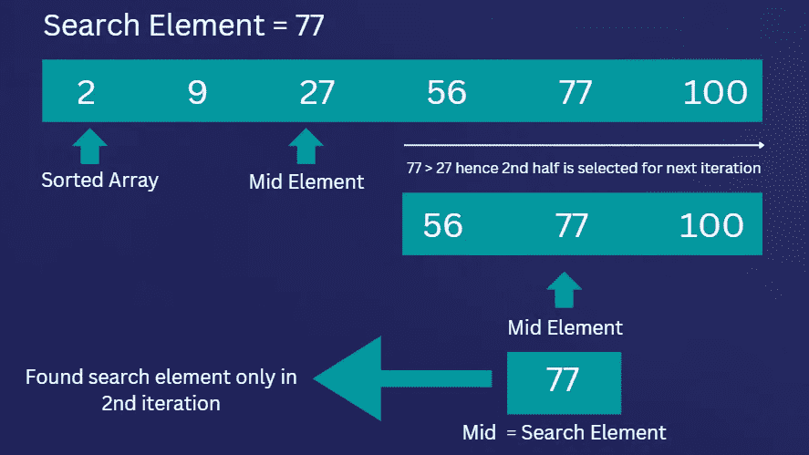
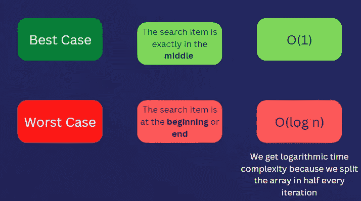

# JavaScript 中的二分搜索法及其时间复杂度

> 原文：<https://javascript.plainenglish.io/binary-search-and-its-time-complexity-in-javascript-d3f6e79fe84e?source=collection_archive---------12----------------------->

## JavaScript 算法基础—第 6 部分:理解 JavaScript 中的二分搜索法及其时间复杂性


Binary Search

作为程序员应该知道的最重要和最流行的算法之一是**二分搜索法**算法。在本文中，我们将深入研究这类算法及其时间复杂度。

## 需要搜索算法

在编程中，我们经常面对一个数据列表，在列表中寻找某个元素。为了实现这一点，我们需要实现一个解决方案，该方案可以从列表中检索元素，或者在没有找到元素时返回一条消息。

而且，我们确实有多种算法，对不同类型的具有不同时间复杂度的列表进行操作。**二分搜索法**就是其中之一，也是最受欢迎的搜索算法之一。

*   *线性搜索*
*   ***二分搜索法***
*   *跳转搜索*
*   *插补搜索*
*   *指数搜索*
*   *斐波那契搜索*

## 什么是二分搜索法？

**二分搜索法**是一种比**线性搜索时间复杂度**更好的搜索算法。然而，如果我们将其与线性搜索算法进行比较，就会发现它有一个重要的局限性。

线性搜索可以在**有序**和**无序**列表上操作，而二分搜索法只能在**有序**列表上操作。所以为了让二分搜索法工作，我们需要一个**排序列表**，可以是升序也可以是降序。

## 二分搜索法是如何工作的？

如果我们有一个已排序的数组，二分搜索法将定位**数组的中间元素**，并对照要查找的搜索元素进行检查。

例如，如果一个数组中有 6 个元素，二分搜索法将选择中间的元素，即第 3 个元素，并确定它是否是我们要寻找的元素。



如果**中间的元素是我们正在寻找的**，那么算法返回**中间的元素，而不进一步迭代整个数组**。

如果中间的元素与项目不匹配，那么**将列表分成两半**并且**选择该元素必须出现的列表**。

由于列表是排序的，它可以发现我们正在寻找的项目是小于还是大于我们刚刚检查的项目。

如果我们的**搜索元素小于中间元素**，那么它会查看数组的**前半部分，如果**搜索元素大于中间元素**，那么它会查看数组**的**后半部分。**

它继续这个划分和遍历被划分的数组的过程，直到找到搜索元素或完成所有的迭代。

由于它每次都将数组分成两半，因此它的性能确实优于线性时间复杂度。

所以让我们来看看二分搜索法在 JavaScript 中的实现

## 二分搜索法算法

作为输入，我们将得到一个排序后的数组以及要查找的搜索元素。记住，二分搜索法只处理排序数据。如果数据没有排序，那么算法应该首先排序，然后执行搜索。

## **第一步**

根据二分搜索法的核心规则，我们首先从数组中找到中间元素，并将其存储在变量**middle position**中。

```
function searchElement(arr, searchElement) {
  let startPosition = 0;
  let endPosition = arr.length - 1; **let midPosition = Math.floor((endPosition - startPosition) / 2);**
}
```

## **第二步**

计算完数组的中间元素后，我们检查中间元素是否是我们要搜索的元素。如果中间元素匹配搜索元素，那么我们返回中间元素索引。

```
function searchElement(arr, searchElement) {
 let startPosition = 0;
 let endPosition = arr.length - 1;let midPosition = Math.floor((endPosition - startPosition) / 2); **if (searchElement === arr[midPosition]) {
  return midPosition;
 }**
}
```

## 第三步

如果我们没有找到中间的元素，那么我们需要循环遍历数组，直到找到我们要找的元素。因此，为了实现这一点，我们添加了一个循环，并继续计算中间位置，直到我们的数组列表用尽。

```
function searchElement(arr, searchElement) {
 let startPosition = 0;
 let endPosition = arr.length - 1; **while (startPosition <= endPosition)** {
  let midPosition = Math.floor((endPosition - startPosition) / 2);

  if (searchElement === arr[midPosition]) {
   return midPosition;
  }
 **}**
}
```

## 第四步

这实际上会导致无限循环，因为我们没有更新**开始位置**和**结束位置**的值。

需要一个**分割逻辑来根据搜索元素是在数组的前半部分还是后半部分来分割数组**。

```
function searchElement(arr, searchElement) {
 let startPosition = 0;
 let endPosition = arr.length - 1;while (startPosition <= endPosition) {
  let midPosition = Math.floor((endPosition - startPosition) / 2);

  if (searchElement === arr[midPosition]) {
   return midPosition;
  } **if (searchElement < arr[midPosition]) {
   endPosition = midPosition - 1;
  } else {
   startPosition = midPosition + 1;
  }**
 }
}
```

第五步

如果搜索元素大于中间元素，我们还需要改进我们的**中间位置**逻辑，因为我们正在更新**开始位置**。

```
function searchElement(arr, searchElement) {
 let startPosition = 0;
 let endPosition = arr.length - 1; while (startPosition <= endPosition) {
  let midPosition = **startPosition** + Math.floor((endPosition - startPosition) / 2);

  if (searchElement === arr[midPosition]) {
   return midPosition;
  }if (searchElement < arr[midPosition]) {
   endPosition = midPosition - 1;
  } else {
   startPosition = midPosition + 1;
  }
 }
}
```

这是二分搜索法算法的基于循环的解决方案。我们也有递归方法，可以用递归来实现。

# 时间复杂度

现在，让我们看看二分搜索法的时间复杂度是多少，如果我们考虑它的最好和最坏的情况。



## **最佳情况**

最好的情况是当我们要找的东西在中间的时候。在这种情况下，我们将得到 **O(1)常数时间复杂度**，因为我们只需要一次迭代。

## **最坏情况**

当我们要寻找的项目正好在数组的开头或结尾**时，我们会得到最坏的情况。**

此外，因为我们总是将数组分成两半，所以我们总是从中间的成员开始。因此，我们只在每次迭代的最后遇到数组的开始或结束。

而且，由于我们在每次迭代中将数组分成两半，我们将得到一个**对数时间复杂度**。因此，无论我们的**数组**有多大，我们都不会遍历数组中的每一项。这采用了一个**分而治之的策略**，导致了 **O(log n)** 个步骤。

所以我们可以说，采用上述方案的二分搜索法的时间复杂度为 **O(log n)** 。

要记住的一个普遍原则是，如果我们把问题集分成两半，甚至更小，分成三四份。我们每次迭代都要处理对数时间复杂度，二分搜索法算法就是这种情况。

*更多内容请看* [***说白了就是***](https://plainenglish.io/) *。报名参加我们的* [***免费每周简讯***](http://newsletter.plainenglish.io/) *。关注我们关于* [***推特***](https://twitter.com/inPlainEngHQ) ，[***LinkedIn***](https://www.linkedin.com/company/inplainenglish/)*，*[***YouTube***](https://www.youtube.com/channel/UCtipWUghju290NWcn8jhyAw)*[***不和***](https://discord.gg/GtDtUAvyhW) *。对增长黑客感兴趣？检查出* [***电路***](https://circuit.ooo/) *。**