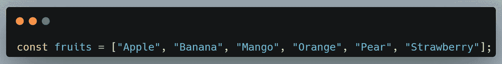
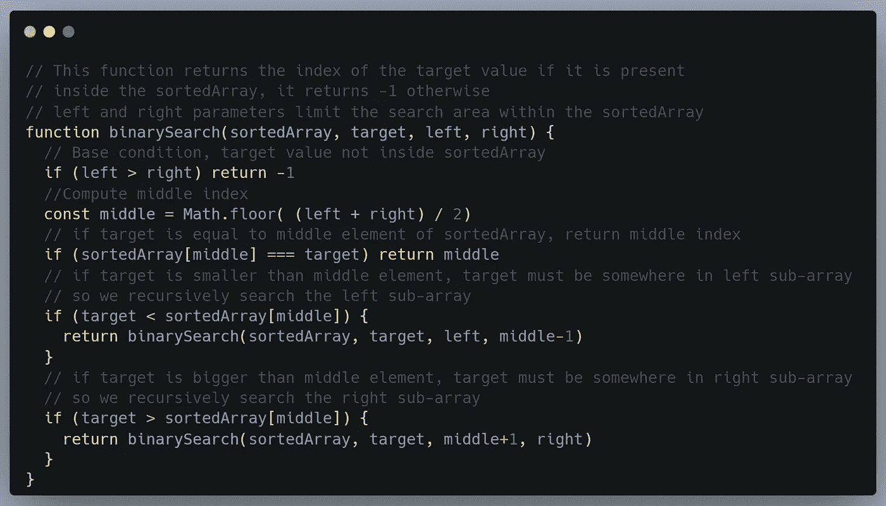
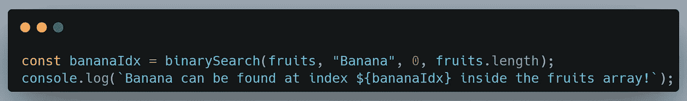
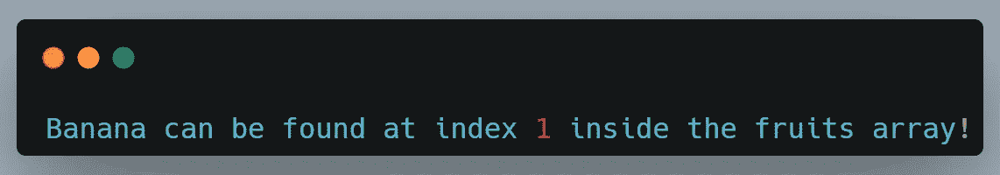

# 二分搜索法在 4 分钟内解释道

> 原文：<https://javascript.plainenglish.io/binary-search-explained-in-3-minutes-61c65cc1280a?source=collection_archive---------12----------------------->

什么是二分搜索法？这是一种用于在排序列表中查找值的算法。

对于你在编程生涯中遇到的大多数算法，你会被其复杂性吓到，或者想一想谁会想到这个。二分搜索法算法则完全是另外一个故事——你很可能在生活中多次使用这种算法而不自知。

# 定义

二分搜索法是一种用于在有序列表中查找值的算法。

要进行二分搜索法，从列表中间开始，将您要查找的值与列表中间的值进行比较。

如果要查找的值大于列表中间的值，则搜索列表的上半部分。

如果要查找的值小于列表中间的值，则搜索列表的下半部分。

一直这样做，直到找到要查找的值，或者确定该值不在列表中。

如果你仍然不理解二分搜索法算法，不要再费心去阅读定义了，只要继续看真实世界的例子——然后考虑再读一遍定义。

# 使用现实世界的问题进行解释

假设你不知道“编程”这个词是什么意思——希望你知道，否则你可能会读错文章——出于一些不明显的原因，你身边放着一本字典。

你首先在中间的某个地方打开字典，你读到的第一个词是“monkey”——因为它以字母“m”开头，你知道你应该在当前页面和书的结尾之间的某个地方打开新的一页。

您打开的下一页包含单词“red”，这意味着您超出了范围，您需要返回几页。更具体地说，您需要在包含“monkey”的页面和您当前打开的页面之间的某个位置打开一个新页面。

你不断重复这个“算法”，直到你找到“编程”这个词——编写计算机程序的活动或工作。

恭喜你刚刚在心里实现了二分搜索法算法！

# 查看代码

让我们快速编写代码，以便更好地了解这个算法的实际实现。

首先，我们需要任何类型的排序数组，让我们看看下面这个包含水果的数组。

接下来，我们开始实际的实现，我们可以采用迭代方法(使用 while 循环)和递归方法。因为递归方法类似于我们的字典示例——我将使用递归实现二分搜索法。

现在，我们可以使用我们的二分搜索法算法在对数时间内找到“香蕉”的索引！

给我们以下输出

[链接到代码](https://gist.github.com/SennR-1952135/1a52def10b5a65f52ca4ccd484de428e)。

# 该系列

本文是一个新系列的一部分，在这个系列中，我以清晰简洁的方式解释了复杂的算法和数据结构——同时消耗了最少的阅读时间。

 [## 快速清晰地解释算法(无废话)

### 开始一个新系列

medium.com](https://medium.com/@sennr/algorithms-explained-fast-and-clear-no-bs-13134a7077fc) 

请务必[关注我](https://medium.com/@sennr)、[订阅我的时事通讯](https://medium.com/subscribe/@sennr)或者看一下上面提到的文章，以获得该系列的更新。

*更多内容看* [***说白了就是***](https://plainenglish.io/) *。报名参加我们的* [***免费周报***](http://newsletter.plainenglish.io/) *。关注我们关于*[***Twitter***](https://twitter.com/inPlainEngHQ)*和*[***LinkedIn***](https://www.linkedin.com/company/inplainenglish/)*。加入我们的* [***社区***](https://discord.gg/GtDtUAvyhW) *。*