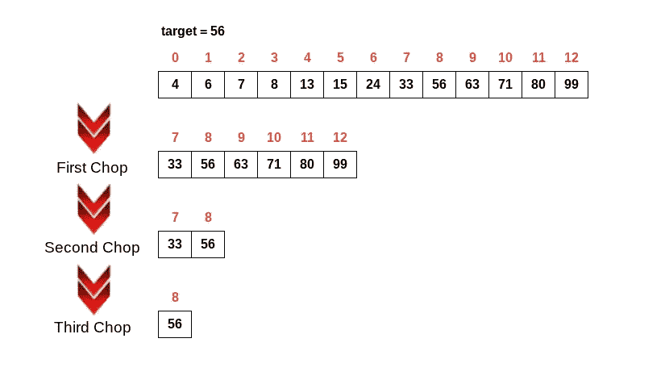
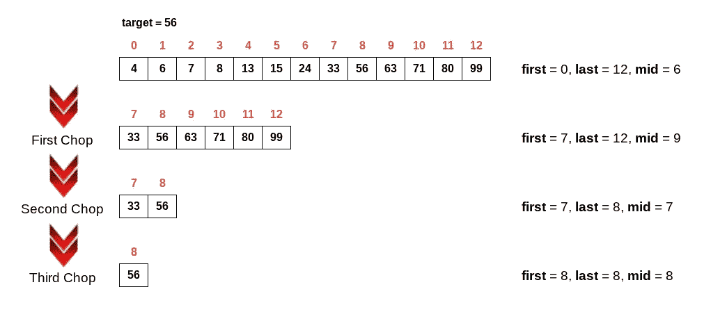

# 在 JavaScript 中使用二分搜索法

> 原文：<https://javascript.plainenglish.io/binary-search-in-javascript-e84e0cf11536?source=collection_archive---------3----------------------->

## 如何用 JavaScript 实现二分搜索法算法的指南。

Photo by [Alexander Sinn](https://unsplash.com/@swimstaralex?utm_source=medium&utm_medium=referral) on [Unsplash](https://unsplash.com?utm_source=medium&utm_medium=referral)

在任何编程语言中，数据结构和算法都是需要学习的重要概念。前几天，我的一个朋友在一次面试中被问及二分搜索法算法。这促使我使用 JavaScript 来探索这个想法。跟随我的发现…

二分搜索法是一种计算机科学算法(也称为*半区间搜索*或*二进制分割*)，用于在排序数组中查找目标值的位置。这是一种分而治之的算法，将数组一分为二，搜索，再一分为二，再一次搜索，以此类推，直到找到目标或者不再有数组需要搜索。

看看这个例子，我们可以看到目标值是 56，它存在于数组中的索引 8 处。如果我们一次遍历列表中的一个元素，我们需要循环九次迭代来找到目标值。通过使用二分搜索法算法，我们可以减少到三次迭代。这是一个非常显著的效率提升！

二分搜索法算法的时间复杂度为 **O(log n)** 。当中心索引与目标值匹配时，最好的情况是 **O(1)** 。然而，最坏的情况是目标值存在于数组的第一个或最后一个索引处。

那么我们如何用 JavaScript 实现这个算法呢？以下是我使用的方法:

那么这是如何工作的呢？为了说明，我们将使用上面的例子。该函数接受一个排序数字数组和在该数组中搜索的目标值，在本例中为 56。首先，我们将**第一个**和**最后一个**变量设置为数组的第一个和最后一个索引。我们还定义了一个**索引**变量，它将返回找到目标值的索引。如果没有找到，则该值被设置为默认值-1。

当我们开始在算法中循环时，我们希望检查第一个索引是否小于或等于最后一个索引，并且该值尚未找到(因此在 **while** 语句中有*索引< 0* )。如果这些条件中有一个不满足，那么就意味着数组中不存在该值，或者已经找到该值，从而终止 while 循环。

接下来，我们需要找到数组的中点来处理我们对列表的“删减”。我们通过将第一个**变量**和最后一个**变量**加在一起，然后应用除以 2 的取整。

现在我们有了**中间的**变量，我们将检查该中间点的值是否等于我们的目标。如果是这样(最好的情况)，我们将**指数**变量设置为等于**中间的**变量，就此结束。如果不匹配，我们必须做更多的工作。首先，我们将检查目标是否小于当前中点的值。如果是这样，我们将通过将**最后一个**变量更改为比**中间的**变量小一个来重置我们的搜索参数。如果没有，我们将反其道而行之，将**第一个**变量设置为比**中间**变量多一个。无论哪种方式，这都将在剩余的数组中切出一个新的“一半”供我们搜索。

这个过程一直持续到找到该值或搜索完整个数组。因此，该函数将返回找到目标值的索引或 **-1** ，表示没有找到该值。

再次回顾我们上面的例子，这里是变量在每次迭代中的样子:

就这样，非常简单的事情。概括地说，下面是算法的工作原理:

*   根据目标值检查排序数组的中点。
*   如果中点指数的值等于目标值，那么该指数将作为答案返回。
*   如果目标值低于中点索引处的值，则忽略数组的右半部分。
*   如果目标值大于中点索引处的值，则忽略数组的左半部分。
*   在连续“削波”的阵列上重复此过程，直到找到目标值或搜索完整个列表。

在一个已经排序的大列表中，二分搜索法算法非常有用，尤其是与线性搜索算法相比。希望这个例子能让你对这个惊人的计算工具有更多的了解。

谢谢你的关注和快乐的编码！

*多内容于***。签约为我们的* [***免费周报***](http://newsletter.plainenglish.io/) *。在我们的* [***社区纠纷***](https://discord.gg/GtDtUAvyhW) *中获得独家写作机会和建议。**