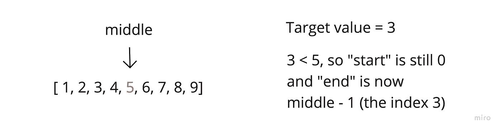
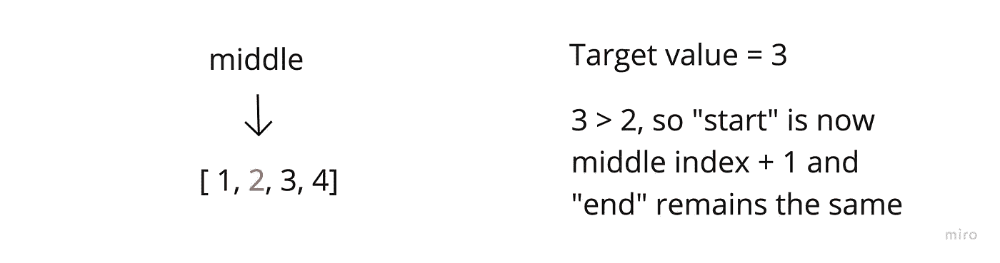
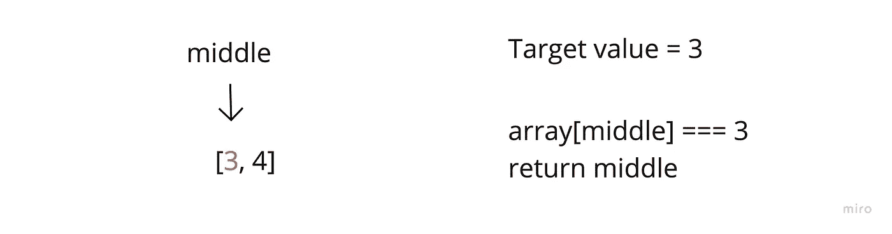

# 使用指针实现二分搜索法

> 原文：<https://javascript.plainenglish.io/binary-search-using-pointers-dae38bec9a6?source=collection_archive---------8----------------------->

## 使用 JavaScript

今天的帖子将会非常简短。

我将讲述如何以非破坏性的方式，递归地使用指针来实现二分搜索法。

继续吧！

**想清楚…**

我希望这是一个递归运行的函数，但我需要跟踪每个上下文中的一些数据…

是的……我们要去*纪念它。*

那么，在每个上下文中，我需要什么信息来允许我只检查数组的特定部分呢？开始和结束索引。

因此，我的参数将是一个数组，我的目标值和我的开始/结束索引。

现在我将创建我的基本案例，但应该是什么呢？

好吧，如果我用两个索引来检查数组，这些索引将需要在每个递归上下文中逐渐靠近，直到发生以下两种情况之一

1.  我的目标值被定位并且它的索引被返回或者
2.  目标不在输入数组中，我将返回-1

如果两个指数之间的距离逐渐缩小，那么一旦我的“结束”低于“开始”，我就可以简单地停止。

现在，让我们考虑在二分搜索法中需要发生什么。

**算法**

首先，我需要将索引定位在起始索引和结束索引的中点。

然后，我将评估目标值相对于中间索引值的位置。

因为 3 小于中间值 5，我们将相应地缩小下一个调用的参数范围—

现在最后一个电话:

**全解**

仅此而已！希望这有所帮助。

编码快乐！

*更多内容看* [***说白了。报名参加我们的***](https://plainenglish.io/) **[***免费周报***](http://newsletter.plainenglish.io/) *。关注我们上* [***推特***](https://twitter.com/inPlainEngHQ)[***领英***](https://www.linkedin.com/company/inplainenglish/)**和* [***不和谐***](https://discord.gg/GtDtUAvyhW) ***。******