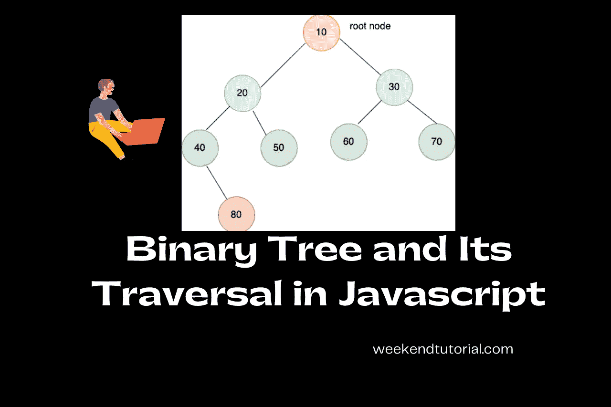
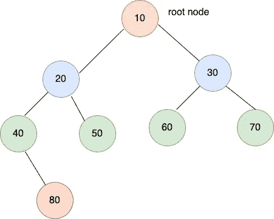

# 2022 年如何用 JavaScript 实现二叉树

> 原文：<https://javascript.plainenglish.io/binary-tree-how-to-implement-using-javascript-in-2022-8b1960fc73fa?source=collection_archive---------6----------------------->

## 二叉树数据结构实用指南。



Binary Tree

在本文中，我们将详细阅读二叉树。我们将看到如何用 JavaScript 构建和遍历它。

# 树形数据结构

树是一种遵循某种层次结构的非线性数据结构。它是树节点的集合。

树节点存储关于它的节点值、它的左子地址和右子地址的信息。

在树中，一个树节点可以有多个子节点。



Binary Tree — weekendtutorial.com

# 树木的基本术语

在深入研究代码之前，让我们先了解一下基本术语

1.  **根** —根是树的最顶端节点，例如上图中 10 是根节点。
2.  **兄弟** —父节点的孩子彼此是兄弟，例如 20 & 30 是兄弟，因为两者都是节点 10 的孩子。
3.  **表亲**——叔叔的孩子是我们的表亲，例如节点 30 是节点 40 & 50 的叔叔。因此，节点 40、50、60 和 70 都是表亲。
4.  **节点的高度** —从当前节点到最远叶子的距离，例如 Height(20) = 2，因为 80 是离节点 20 最远的叶子。
5.  **节点的深度** —从根到节点的距离，例如深度(20) = 1

整个树的高度=根节点的高度

整棵树的深度=整棵树的高度

# 二叉树数据结构

二叉树是一种树，其中一个树节点最多可以有 0、1 或 2 个子节点。

# 如何用 JavaScript 实现二叉树？

```
function TreeNode(data) {
  this.data = data;
  this.left = null;
  this.right = null;
}

function createTree() {
  let root = new TreeNode(10);

  root.left = new TreeNode(20);
  root.right = new TreeNode(30);

  root.left.left = new TreeNode(40);
  root.left.right = new TreeNode(50);

  root.right.left = new TreeNode(60);
  root.right.right = new TreeNode(70);

  root.left.left.right = new TreeNode(80);

  return root;
}
```

# 如何遍历一棵二叉树？

遍历意味着访问二叉树的每个节点。

有 3 种方法可以遍历二叉树

1.  前序遍历
2.  有序遍历
3.  后序遍历

还有一个遍历**级别顺序遍历**不在本文讨论范围内。我们会在解二叉树的左视图，右视图等时读到。


Binary Tree

# 前序遍历(使用递归)

它以下面的方式遍历树— **数据左向右。**

上述树的前序遍历是-10 20 40 80 50 30 60 70

```
function preOrder(root) {
  if (root === null) return; // print the node data
  console.log(root.data); // goto left
  preOrder(root.left); // goto right
  preOrder(root.right);
}
```

**时间复杂度:** O(n)(每个树节点处理一次)
**空间复杂度:** O(h) h 是树的高度。

# 前序遍历(无递归)

递归非常简单，但是如果你要申请一个软件开发人员的职位，你可能会被要求迭代地遍历树，也就是说不需要递归。

我们将使用一个**堆栈**来记住前一个节点，并使用一个**数组**来存储答案。

要解决这个问题，可以考虑一下前序公式— **数据左右**并将其可视化。

考虑一个只有 3 个节点的例子

5
/ \
10 15

预订时间是 5 10 15

现在，在处理完节点 5 之后，下一个将是节点 10。如果我们使用一个堆栈，并推动当前节点的左和右节点，那么将首先推动右节点，然后推动左节点，因为我们需要先遍历左子节点。

如果你理解了这一点，实现就更容易理解了。

```
function preOrder(root) { let ans = []; if (root === null) return ans; // push root into stack
  let stack = [root]; // loop while stack is not empty
  while (stack.length) { let cur = stack.pop(); // push the node data to ans
    ans.push(cur.data); // push right node into stack
    if (cur.right) {
      stack.push(cur.right);
    } // push left node into stack
    // as it pushed last so will be pop first
    // i.e this ensures data left right ordering
    if (cur.left) {
      stack.push(cur.left);
    } } return ans;
}
```

**时间复杂度:** O(n)(每个树节点处理一次)

**空间复杂度:** O(h) + O(n) ~= O(n) h 是树的高度。

# 有序遍历(使用递归)

它以如下方式遍历树— **左数据右**

上述树的顺序遍历是-40 80 20 50 10 60 30 70

```
function inOrder(root) {
  if (root === null) return; // goto left
  inOrder(root.left); // print the node data
  console.log(root.data); // goto right
  inOrder(root.right);
}
```

**时间复杂度:** O(n)(每个树节点处理一次)

**空间复杂度:** O(h) h 是树的高度。

# 有序遍历(无递归)

顺序公式:**左数据右**

根据公式，我们将遵循以下步骤—

**Step1** :我们将向左移动，继续将每个节点推入堆栈。

**步骤 2** :弹出栈顶元素

**步骤 3** :向右并跟随**步骤 1**

```
function inOrder(root) { let ans = []; if (root === null) return ans; // push root into stack
  let stack = []; let cur = root; // loop while stack is not empty
  while (cur || stack.length) { // goto left
    while(cur) {
      stack.push(cur);
      cur = cur.left;
    } // push the node data to ans
    cur = stack.pop();
    ans.push(cur.data); // push right node into stack
    cur = cur.right; } return ans.reverse();
}
```

**时间复杂度:** O(n)(每个树节点处理一次)

**空间复杂度:** O(h) + O(n) ~= O(n) h 是树的高度。

# 后序遍历(使用递归)

它以如下方式遍历树— **左右数据**

上述树的后序遍历是-80 40 50 20 60 70 30 10

```
function postOrder(root) {
  if (root === null) return; // goto left
  postOrder(root.left); // goto right
  postOrder(root.right); // print the node data
  console.log(root.data);
}
```

**时间复杂度:** O(n)(每个树节点处理一次)

**空间复杂度:** O(h) h 是树的高度。

# 后序遍历(无递归)

让我们再来考虑一下前序遍历的解决方案。这个和那个相似。

预定公式:**数据左右**

现在，颠倒左右位置，公式将变成**数据右-左**

而如果我们把整个公式反过来，最后的公式就会变成——**左右数据**

这是后序遍历的公式。

```
function postOrder(root) { let ans = []; if (root === null) return ans; // push root into stack
  let stack = [root]; // loop while stack is not empty
  while (stack.length) { let cur = stack.pop(); // push the node data to ans
    ans.push(cur.data); // push left node into stack
    if (cur.left) {
      stack.push(cur.left);
    } // push right node into stack
    if (cur.right) {
      stack.push(cur.right);
    }
  } return ans.reverse();
}
```

**时间复杂度:** O(n)(每个树节点处理一次)

**空间复杂度:** O(h) + O(n) ~= O(n) h 是树的高度。

# 结论

我们已经看到了 JavaScript 中二叉树的实现及其递归和非递归方式的遍历前序、中序和后序。

这篇文章的目的是一次性给你巩固的知识。从面试的角度来看，非递归遍历非常重要。

请跟我来！

感谢您阅读文章！

*更多内容请看*[***plain English . io***](http://plainenglish.io/)*。报名参加我们的* [***免费周报***](http://newsletter.plainenglish.io/) *。在我们的* [***社区***](https://discord.gg/GtDtUAvyhW) *获得独家获得写作机会和建议。*