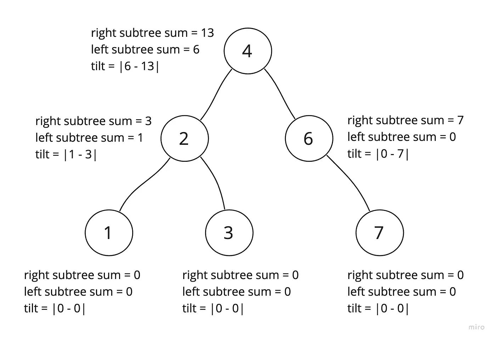

# LeetCode 问题:二叉树倾斜(JavaScript)

> 原文：<https://javascript.plainenglish.io/binary-tree-tilt-ae2650f73ea?source=collection_archive---------18----------------------->

LeetCode #563 (JavaScript)

尽管我很喜欢使用递归进行二叉树遍历，但这个问题对我来说非常困惑。倾斜是一个新概念，虽然简单，但 Leetcode 描述中的措辞似乎有点尴尬。

我会尽量简化。

以一棵二叉树为例:

现在计算每个节点的倾斜度。这是

|节点左子树值的总和减去节点右子树值的总和|

现在，对于所有倾斜的总和(问题所要求的)

似乎 LeetCode 的描述有时故意含糊不清，如果是这样的话，我可以理解。它帮助我学会了如何在涉及细节时更透彻地理解问题，并避免假设。

## ***想通了***

我的第一印象是这似乎是一个后序遍历。对于每个节点，首先我希望执行所有左子树操作，然后执行所有右子树操作。然后，计算当前节点的倾斜度很简单。

## ***翻译成递归***

我们需要一个递归过程，可以遍历树，计算每个节点的倾斜度，然后增加总倾斜度的计数器。不仅如此，我们还需要一种方法，使我们能够在前进的过程中向上传递节点值。

换句话说，为什么不-

1.  在递归爬虫之外有一个计数器用于增量
2.  使递归 crawler 的返回值成为其下节点值的当前总和

## ***上至代码:***

在这里，我已经建立了基本结构。外部 tilt 函数将接受树的根，totalTilt 准备随着我们的爬行而递增，sum 是递归函数，将返回其下节点值的运行总数。

如果这一切看起来令人困惑，那是因为它是。我不得不画了很多次图来理解它，但是，一如既往，这是值得的。啊哈时刻是巨大的。

首先是代码，然后我将把递归映射到图中

我只添加了四行代码，这就是工作所需的全部内容+帮助者在根上调用 tilt(第 24 行)

在绘制图表之前，我想大声说出第 7 行到第 16 行:

**第 7 行有条件**(基本情况)——“我们是在树的末端吗？用一个零结束这个函数—我们现在可以返回上一级了”

**第 11 行和第 12 行** →“先下行左子树。对于每个级别，打开一个新的递归函数调用。当它停止(返回 0)时，我们将从上一层开始探索右边的子树。”

**第 13 行和第 14 行** →“现在我们有了当前级别的左值和右值，计算该节点的倾斜度，然后增加 totalTilt。”

**第 16 行**(可能也是最令人困惑的)→“现在返回这个节点值，加上从较低层次上来的任何节点值。”

## ***映射递归到树***

让我们看看我是否能做一些有意义的可视化来阐明这一点。我将关注根的左子树。同样的原则也适用于右侧。

*EC =执行上下文(由新的“sum”函数调用创建的环境)

我们立即一路下降到 leaves，在每一层打开新的递归函数。

我们已经发现 1 没有子节点，所以 total tilt 什么也没有得到，我们将把节点值和它的子树值向上返回到在节点 2 打开的上下文中。现在我们可以继续下一行代码为‘右’

打开一个新的 EC3，两个子树都被评估为 0(满足基本情况)，tilt 保持为零，totalTilt 也是如此。于是 EC3 返回 EC2 并关闭。

现在 EC2 已经完成了左右两边的递归调用，啊哈时刻到了。从节点 2 的子节点向上返回的值中最终找到节点 2 的倾斜，totalTilt 反映了这种增加。

EC2 现在将关闭，将左子树的所有值返回给 EC1。由于代码现在可以继续，并且在 EC1 中定义了“right”——右边的子树将以类似的过程进行探索。

当遍历右边的子树时，总倾斜度将会一路递增。完成后，EC1 将具有左值和右值，以结束根节点的倾斜。

## ***总结***

我不能说足够的图解递归。它真的帮助我想象这样简单、简洁的代码如何在数据结构中有效地工作。

非常，*非常*酷。

*更多内容看* [***说白了。报名参加我们的***](https://plainenglish.io/) **[***免费周报***](http://newsletter.plainenglish.io/) *。关注我们关于*[***Twitter***](https://twitter.com/inPlainEngHQ)*和*[***LinkedIn***](https://www.linkedin.com/company/inplainenglish/)*。加入我们的* [***社区不和谐***](https://discord.gg/GtDtUAvyhW) *。***