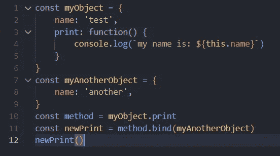
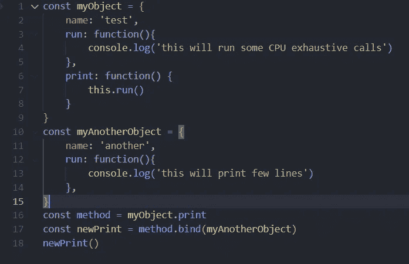
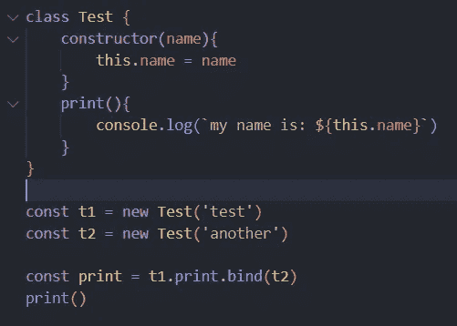
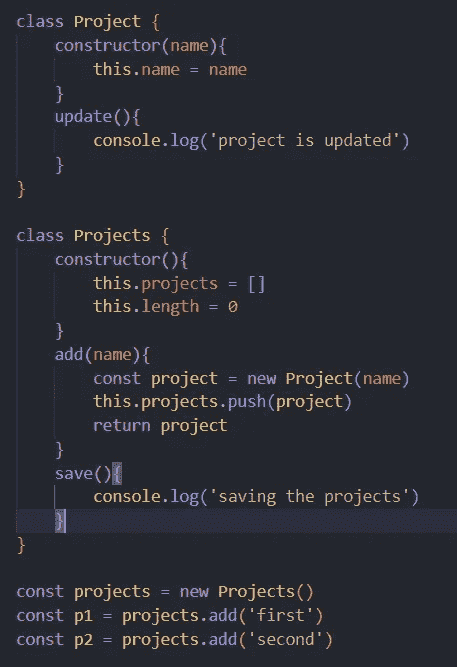
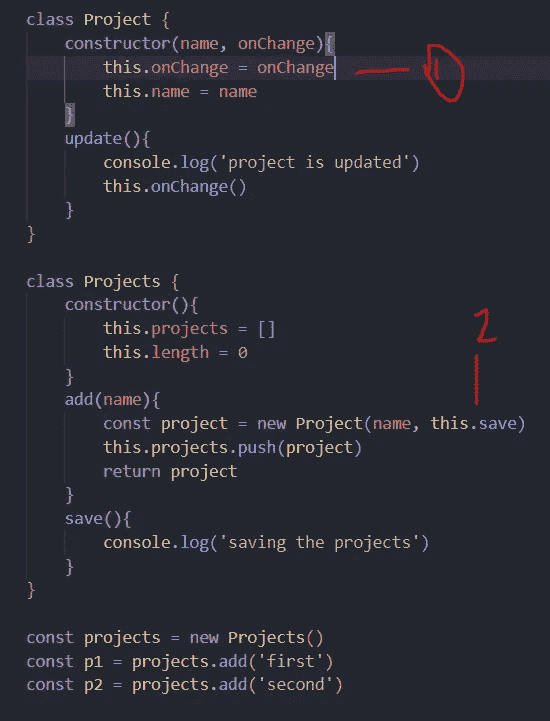
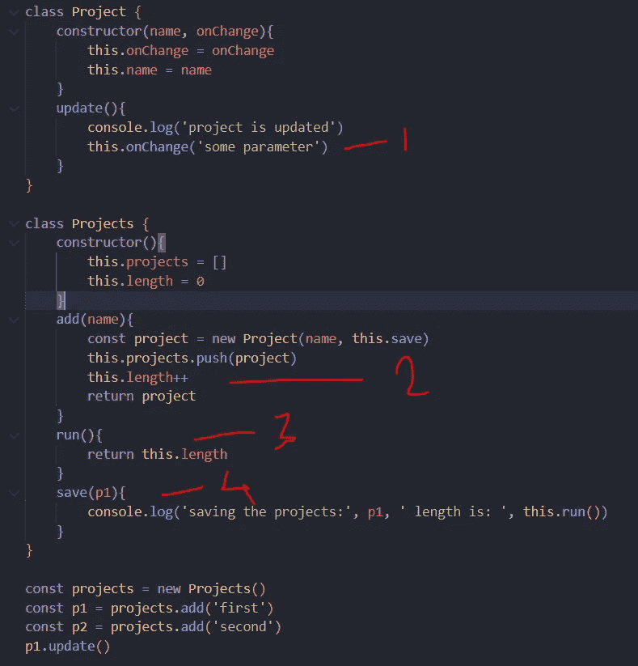
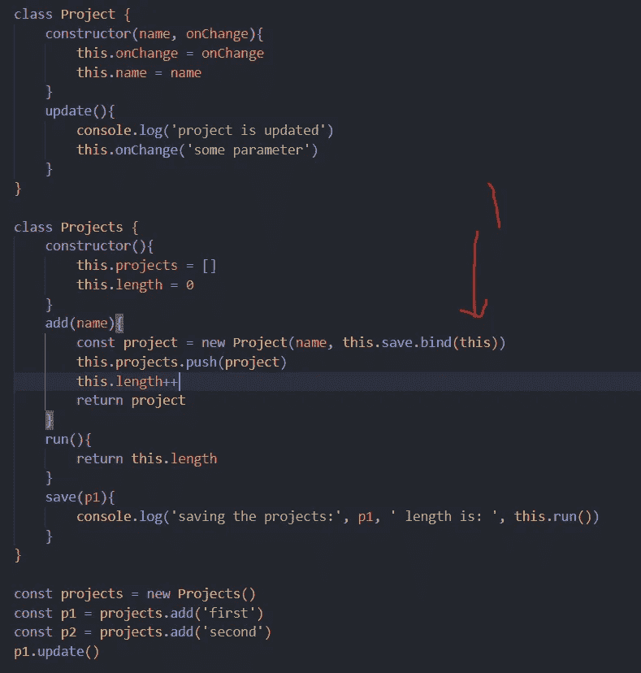

# JavaScript 中的 Bind 关键字:举例说明

> 原文：<https://javascript.plainenglish.io/bind-in-javascript-104726e8ccf2?source=collection_archive---------4----------------------->


Photo by [Greg Rakozy](https://unsplash.com/@grakozy?utm_source=medium&utm_medium=referral) on [Unsplash](https://unsplash.com?utm_source=medium&utm_medium=referral)

# JavaScript 中的 bind 关键字是什么？

在今天的主题中，我们将讨论 JavaScript 中的特殊关键字，这些关键字允许您更改关键字`this`的含义。Bind 是一个特殊的关键字，保留给对象的方法，并在重写关键字`this`的含义时创建一个新函数。我们还将检查一些例子，看看它如何适用于现实世界的应用。

## 例子

让我们在一些原始示例中测试 bind 的功能。

**示例 I —对象属性绑定**

在下面的例子中，我创建了一个名为`myObject`的对象，并分配了两个属性。第一个是名称，另一个是打印名称的方法。为了测试 bind，我添加了一个没有 print 方法的对象，并使用 binding 语法，运行最新生成的方法。



Example I

```
output:
//my name is: another
```

**示例二—对象方法绑定**

在上面的程序中，我们访问了一个对象的属性，现在让我们尝试访问另一个方法，看看哪个方法会被触发

在下面的例子中，我们创建了一个在两个对象中都存在的公共`run`方法，并用方法调用替换了打印定义。结果还是一样，它将只运行最新分配的对象。



Example II

```
output:
//this will print few lines
```

**示例三——使用类别**

让我们看看 bind 关键字在类中的表现，我们创建了一个具有 name 属性的类和一个显示其值的 print 方法。

同样，我们将第一个实例方法绑定到第二个实例，并查看结果，结果将与预期的一样。



Example III

```
output:
//my name is: another
```

**示例四——使用父子链接**

现在，让我们用一些具体的例子来看看 bind 是如何有用的。假设我们有一个`Projects`的类，项目是`Project`的集合，项目有一些内部方法来更新它的属性。

现在的用例是每当项目中有一个变更，或者从项目中调用了一个特定的方法。然后我们就需要触发项目`refetch`方法。下面是我们正在讨论的例子的框架。



blueprint of example

现在，每当从项目类触发`update`方法时，我们也需要触发`save`方法。为了实现这一点，让我们做一些改变。

让我们使用 closure 来传递 save as 属性，并从子对象中触发它。我们只需要做 2 个改变就可以实现。



Using closure

这种方法仍然有效，save 方法将从子项目类中触发。现在让我们创建 save 方法的一些详尽的定义，看看其他的变化。



save method with parameter and internal method calls

如果我们在这个例子中使用闭包方法，那么我们将面临一个错误。

```
Output:
Uncaught TypeError TypeError: this.run is not a function
```

现在，`this`指向的是项目实例而不是项目，因此 run 未定义且无法访问。

**这是实际问题**

为了解决这个问题，我们将需要使用`bind`并且我们将需要更新 onChange 定义来实现它。



Final revision with bind keyword

```
Output:
project is updated
saving the projects: some parameter  length is:  2
```

> **注意**:不能使用这种方法绑定箭头函数，因为它们总是在上下文级别定义的。

## 结论

我希望您现在对如何以及在哪里使用 bind 以及它在什么级别有效有一个更清晰的概念。在其他一些文章中，我们将涵盖`call`和`apply`的类似用例。

你可以在这里找到源代码[。编码快乐！](https://github.com/Piyush-Use-Personal/bind-javascript/blob/main/bind-examples.js)

*更多内容看* [***说白了。报名参加我们的***](https://plainenglish.io/) **[***免费周报***](http://newsletter.plainenglish.io/) *。关注我们关于*[***Twitter***](https://twitter.com/inPlainEngHQ)*和*[***LinkedIn***](https://www.linkedin.com/company/inplainenglish/)*。查看我们的* [***社区不和谐***](https://discord.gg/GtDtUAvyhW) *加入我们的* [***人才集体***](https://inplainenglish.pallet.com/talent/welcome) *。***