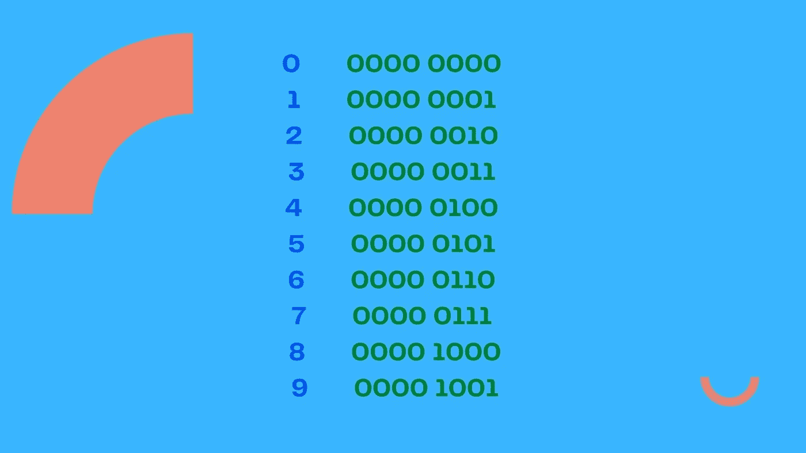
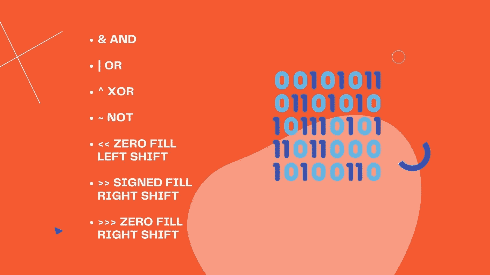

# 如何在 JavaScript 中使用按位运算符

> 原文：<https://javascript.plainenglish.io/bitwise-operators-in-javascript-c85a3e7cd32c?source=collection_archive---------1----------------------->

## 使用 JavaScript 按位运算符的教程:AND、OR、XOR、NOT、零填充左移、零填充右移和带符号右移。


## 介绍

当我们在日常生活中使用数字时，我们使用以 10 为基数的数字系统，这有时也被称为十进制数字系统。这个数字系统包含 0 到 9，所有其他数字都是用这些数字创建的。

```
0 1 2 3 4 5 6 7 8 9
```

计算机不使用以 10 为基数的数字系统。相反，他们使用二进制数字系统，有时被称为基数 2。在二进制数字系统中，所有的数字都是由 0 和/或 1 组成的。下面我们可以看到十进制和二进制数字系统的比较:



二进制中的每个数字称为一位。在计算中，一个字节是八位。JavaScript 中的数字存储为 64 位。以 64 位表示的十进制数字系统中的数字 1 如下。

```
00111111 11110000 00000000 00000000
00000000 00000000 00000000 00000000
```

注意上面的例子不是下面的，因为在 JavaScript 中我们使用双精度格式。

```
00000000 00000000 00000000 00000000
00000000 00000000 00000000 00000001
```

作为 32 位，它将表示如下:

```
00000000 00000000 00000000 00000001
```

当我们在 JavaScript 中使用按位运算时，值得理解的是运算不是直接在 64 位值上完成的。JavaScript 将该值转换为 32 位来执行操作，然后将该值转换回 64 位表示。

## 运营商

现在我们有了一些基本的理解，我们可以继续看 JavaScript 中的按位运算符。下面列出了这些:



## 和


按位 AND 运算符由 **&** 和符号表示，用于两个值。返回值为 0 或 1。这两个值排列在一起，然后比较每组值。如果两位都为 1，则该位的返回值将为 1，否则为 0。让我们看一个例子来阐明这一点。

```
const valOne = 8;  //**00000000 00000000 00000000 00001000** const valTwo = 9;  //**00000000 00000000 00000000 00001001**console.log(valOne & valTwo);
//Returns ---> 8 //**00000000 00000000 00000000 00001000**
```

在上面的例子中，我们创建了一个名为 *valOne* 的变量，我们给它赋值 8，还有一个名为 *valTwo* 的变量，我们给它赋值 9。在示例中，我列出了这些值的 32 位表示。接下来，在控制台日志中，我们对这两个变量使用按位 AND 运算符。返回值是 8。我们来分解一下结果。

在这两个变量中，除了最后四位之外的所有值都是 0，因此在此之前，每对变量都将返回 0，如下所示。

```
**00000000 00000000 00000000 0000**
```

此时，要比较的下一对位都包含 1，因此将返回 1。

```
**00000000 00000000 00000000 00001**
```

后三对将依次进行比较，但没有一对包含两组 1 位。我们得到 0 和 0。然后我们得到 0 和 0。最后，我们得到 0 和 1。因此，对于这些对中的每一对，都将返回 0。这给了我们 32 位表示的最终结果。

```
**00000000 00000000 00000000 00001000**
```

当这被转换回十进制记数法时，为了便于理解，我们得到了值 8。

## 运筹学


按位 OR 运算符处理两个值的方式与 AND 运算符相同。我们使用符号 **|** 作为 or 运算符。但是这次如果两位都是 0，那么返回位将是 0。否则，返回位将始终为 1。让我们看一个例子。

```
const valOne = 8;  //**00000000 00000000 00000000 00001000** const valTwo = 9;  //**00000000 00000000 00000000 00001001**console.log(valOne | valTwo);
//Returns 9 //**00000000 00000000 00000000 00001001**
```

在上面的例子中，我们再次使用了 *valOne* 和 *valTwo* 变量。这次在控制台日志中，我们使用了按位 OR 运算符。我们得到 9 作为返回值。让我们看看变量的最后四位的比较，直到这一点每一位都是 0。这意味着 OR 运算符将为每次比较返回 0。

```
**00000000 00000000 00000000 0000**
```

此时，我们比较了 1 的两个位。如果两位都不为 0，OR 运算符将返回 1，因此返回 1。

```
**00000000 00000000 00000000 00001**
```

接下来的两次比较都比较 0 位。OR 运算符返回 0。

```
**00000000 00000000 00000000 0000100**
```

最后，我们得到 0 和 1。因此将返回 1。

```
**00000000 00000000 00000000 00001001**
```

## 异或运算


按位异或运算符由 **^** 表示。该运算符再次比较两位。如果只有一位是 1，那么结果将是 1。否则，将为 0。让我们看一个例子。

```
const valOne = 8;  //**00000000 00000000 00000000 00001000** const valTwo = 9;  //**00000000 00000000 00000000 00001001**console.log(valOne ^ valTwo);
//Returns ---> 1 //**00000000 00000000 00000000 00000001**
```

再次使用我们的 *valOne* 和 *valTwo* 变量，我们使用带有 XOR 运算符的控制台日志，我们得到 1 作为返回值。我们得到一组不同比特的唯一时间是最后一对。在最后一对中，我们比较 0 和 1。这意味着这是唯一一次返回 1。因此，返回值为 1。

## 不


按位非运算符由符号 **~** 表示。如果该位为 1，则将返回 0，否则将返回 1。让我们看一个例子。

```
const valOne = 9; //**00000000 00000000 00000000 00001001**
console.log(~valOne);//Returns ---> -10 //**11111111 11111111 11111111 11110110**
```

当 valOne 变量中的所有 0 位都被转换为 1，而 1 到 0 则被转换为-10。

## 零填充左移


填零左移通常简称为左移，用 **< <** 表示。运算符会将所有位向左移动所用数字的数量。让我们看一个例子。

```
const valOne = 9; //**00000000 00000000 00000000 00001001** console.log(valOne << 3);//Returns ---> 72 //**00000000 00000000 00000000 01001000**
```

在上面的例子中，我们将左移运算符与 3 一起使用。返回值是 72。我们可以看到这些位向左移动了 3，原来位置上的所有内容都被填充了 0。这给了我们 72 作为返回值。

## 零填充右移


填零右移通常简称为右移或无符号右移，用 **> > >** 表示。运算符会将所有位向右移动所用数字的数量。让我们看一个例子。

```
const valOne = 9; //**00000000 00000000 00000000 00001001** console.log(valOne >>> 3);//Returns ---> 1 //**00000000 00000000 00000000 00000001**
```

在上面的例子中，我们使用右移位运算符 3。返回值为 1。我们可以看到这些位向右移动了 3，原来位置上的所有内容都被填充了 0。这给了我们 1 作为返回值。

## 有符号右移位


带符号的右移用 **> >** 表示。运算符会将所有位向右移动所用数字的数量，但会保留符号(正或负)。32 位表示形式的第一位指示一个值是正还是负。让我们看一个例子。

```
const valOne = -9; //**11111111 11111111 11111111 11110111** console.log(valOne >> 3);//Returns ---> -2 //**11111111 11111111 11111111 11111110**
```

在上面的例子中，我们对 valOne 变量使用右移位操作符 3，这次它被设置为-9。返回值为-2。我们可以看到这些位向右移动了 3，原来位置上的所有内容都被填充了 0。这给了我们-2 作为返回值。如果我们在这里使用了无符号右移位操作符，我们会得到下面的结果。

```
const valOne = -9; //**11111111 11111111 11111111 11110111** console.log(valOne >>> 3);//Returns ---> 536870910 //**00011111 11111111 11111111 11111110**
```

我希望你喜欢这篇文章。请随时发表任何评论、问题或反馈，并关注我以获取更多内容！

*更多内容看* [***说白了。报名参加我们的***](https://plainenglish.io/) **[***免费周报***](http://newsletter.plainenglish.io/) *。关注我们关于* [***推特***](https://twitter.com/inPlainEngHQ)[***LinkedIn***](https://www.linkedin.com/company/inplainenglish/)*[***YouTube***](https://www.youtube.com/channel/UCtipWUghju290NWcn8jhyAw)*[***不和***](https://discord.gg/GtDtUAvyhW) *。对增长黑客感兴趣？检查* [***电路***](https://circuit.ooo/) *。*****