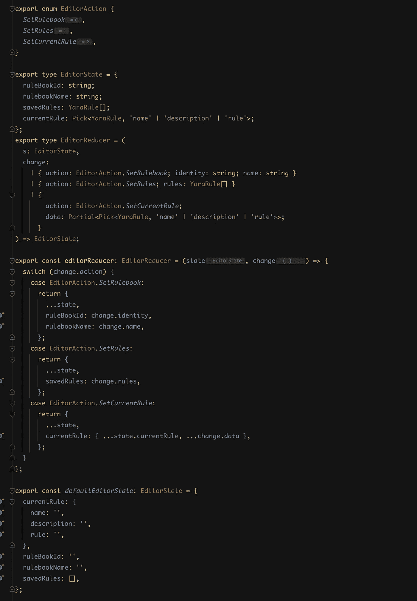

# 使用 UseReducer 提升您的 React 组件状态

> 原文：<https://javascript.plainenglish.io/boost-your-react-components-state-with-usereducer-4d8109f6bb8a?source=collection_archive---------8----------------------->

## 管理 React 组件中的本地状态需要花费时间。有许多好的实践，但是通常归结为到处使用 useState。


# 为什么 useReducer 这么好用？

因为它很灵活，所以不要忘记 useState 是在 useReducer 之上创建的。就像几乎所有的抽象概念一样，因为方便，我们失去了力量。

让我们探索一个处理和验证一些字段的基本例子。我们都爱形式。:D

我们需要至少 3 或 4 个属性附加到每个字段来处理一些变化。

```
export type FieldState = {
  value: string;
  minLength: number;
  maxLength: number;
  touched: boolean;
  valid: boolean;
  error: string|null;
};

export const fieldDefaultState: FieldState = {
  minLength: 3,
  maxLength: 10,
  touched: false,
  valid: false,
  value: '',
  error: null,
};

export type FieldReducer = (
  s: FieldState,
  value: string
) => FieldState;

export const fieldReducer: RulebookNameReducer = (s, value) => {
  if (value.length < s.minLength) {
    return { ...s, valid: false, touched: true, value, error: `Must be longer than ${s.minLength}` };
  }

if (value.length >s.minLength) {
    return { ...s, valid: false, touched: true, value, error: `Must be shorter than ${s.maxLength}` };
  }

  return { ...s, valid: true, touched: true, value, error: null };
}; 
```

简单。

# 单元测试

```
describe('fieldReducer', () => {
  it('returns the state with valid false when value is shorter than minLength', () => {
    const state = { ...fieldDefaultState, minLength: 10 };
    const value = 'test';
    const result = fieldReducer(state, value);

    expect(result).toEqual({
      ...state,
      valid: false,
      touched: true,
      value,
      error: `Must be longer than ${state.minLength}`
    });
  });

  it('returns the state with valid false when value is longer than maxLength', () => {
    const state = { ...fieldDefaultState, maxLength: 3 };
    const value = 'test';
    const result = fieldReducer(state, value);

    expect(result).toEqual({
      ...state,
      valid: false,
      touched: true,
      value,
      error: `Must be shorter than ${state.maxLength}`
    });
  });

  it('returns the state with valid true when value is within minLength and maxLength', () => {
    const state = { ...fieldDefaultState };
    const value = 'test';
    const result = fieldReducer(state, value);

    expect(result).toEqual({
      ...state,
      valid: true,
      touched: true,
      value,
      error: null
    });
  });
});
```

简单。

现在，这可以用于任何领域(在州类型的区别工会的帮助下，没有限制)

# 使用

让我们创建一个小助手来解包 React 事件

```
import { ChangeEvent } from 'react';

type E = ChangeEvent<
  HTMLInputElement | HTMLTextAreaElement | HTMLSelectElement
>;
export const unpackE = (e: E): string => {
  return e.target.value;
};

export const onChange = (handler: (v: string) => void) => (e: E) =>
  handler(unpackE(e));
```

```
import { fieldReducer, fieldDefaultState } from './state.ts';
// Just an example
import { Input } from '../somewhere/shared/Input' //
import { useReducer } from 'react';

export const Example = () => {
  const [name, changeName] = useReducer(fieldReducer, fieldDefaultState);

   ...

   // Just an example
   const createNew = useCallback(() => {
    if (name.valid)
      dispatch(
        save({
          name: name.value,
        })
      );
  }, [name]);

  return (
    <div>
      ...
      <Input
        onChange={onChange(changeName)}
        value={name.value}
        error={name.error}
      />
      ...
    </div>
  )
} 
```

，就是这样。相当整洁。

# 结论

在用户界面之外有一个状态总是一件好事。更容易进行单元测试或推理。

# 最后的话

我目前正在做的事情的例子



这让我可以做一些很酷的事情，比如

```
 const [state, changeState] = useReducer(editorReducer, defaultEditorState);
```

这让我现在可以

```
changeState({
  action: EditorAction.SetRules,
  rules: rulebook.rules,
});

OR 

changeState({
  action: EditorAction.SetRulebook,
  name: rulebook.name,
  identity: rulebook.identity,
});

...
```

我喜欢！

*更多内容请看*[***plain English . io***](https://plainenglish.io/)*。*

*报名参加我们的* [***免费每周简讯***](http://newsletter.plainenglish.io/) *。关注我们关于*[***Twitter***](https://twitter.com/inPlainEngHQ)[***LinkedIn***](https://www.linkedin.com/company/inplainenglish/)*[***YouTube***](https://www.youtube.com/channel/UCtipWUghju290NWcn8jhyAw)***，以及****[***不和***](https://discord.gg/GtDtUAvyhW) **

*****用*** [***电路***](https://circuit.ooo/?utm=publication-post-cta) *为你的科技创业建立认知和采用。***