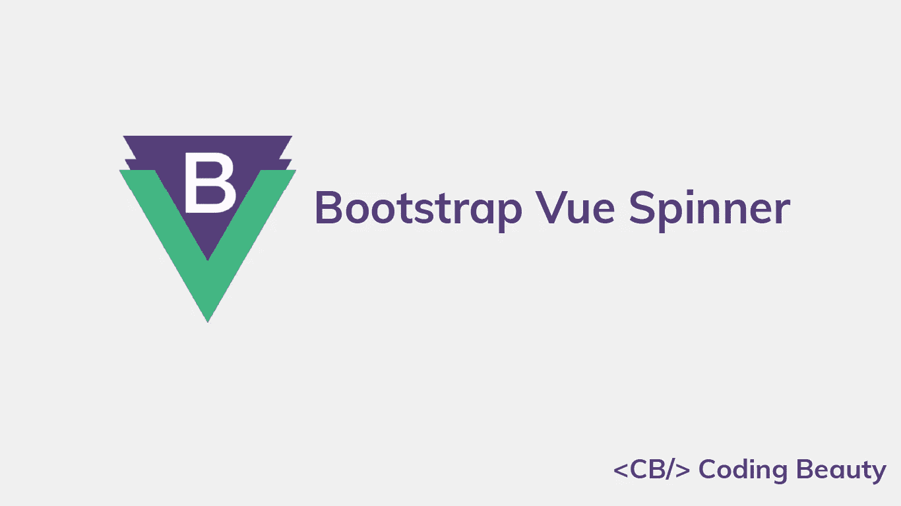

# 如何在 Bootstrap Vue 中创建微调器

> 原文：<https://javascript.plainenglish.io/bootstrap-vue-spinner-bf051a45bd3f?source=collection_archive---------13----------------------->



微调按钮用于向用户指示正在进行的进程。它们适用于不需要很长时间就能完成的操作，并且有助于提高应用程序的响应能力。请继续阅读，了解更多关于 Vue Bootstrap spinner 组件及其提供的各种定制选项的信息。

# 助推器 Vue 旋转组件(b 型旋转组件)

Boostrap Vue 提供了用于创建微调器的`b-spinner`组件。一旦呈现在页面上，它就开始旋转。

```
<template>
  <div
    id="app"
    class="text-center"
  >
    <b-spinner></b-spinner>
  </div>
</template>
```


# 边框微调器

我们可以使用`type`道具来显示特定类型的旋转器。默认情况下，`type`被设置为`border`，这使得微调器透明，并给它一个粗的圆形边框。

```
<template>
  <div
    id="app"
    class="text-center"
  >
    <b-spinner type="border"></b-spinner>
  </div>
</template>
```


# 生长微调器

或者，我们可以将`type`设置为`grow`来使微调器反复放大和淡出。

```
<template>
  <div
    id="app"
    class="text-center"
  >
    <b-spinner type="grow"></b-spinner>
  </div>
</template>
```


# 微调颜色

`b-spinner`带有一个`variant`道具，可以让我们定制旋转器的颜色。它可以取的值有一堆，包括`primary`、`secondary`、`danger`、`warning`、`success`、`info`。

在这里，我们创建了具有许多不同颜色的多个边框微调器:

```
<template>
  <div
    id="app"
    class="text-center d-flex justify-content-between"
  >
    <b-spinner
      v-for="variant in variants"
      :key="variant"
      :variant="variant"
    ></b-spinner>
  </div>
</template><script>
export default {
  data() {
    return {
      variants: [
        'primary',
        'secondary',
        'danger',
        'warning',
        'success',
        'info',
      ],
    };
  },
};
</script>
```


我们还可以使用`variant`道具自定义生长微调器的颜色:

```
<template>
  <div
    id="app"
    class="text-center d-flex justify-content-between"
  >
    <b-spinner
      v-for="variant in variants"
      :key="variant"
      :variant="variant"
      type="grow"
    ></b-spinner>
  </div>
</template><script>
export default {
  data() {
    return {
      variants: [
        'primary',
        'secondary',
        'danger',
        'warning',
        'success',
        'info',
      ],
    };
  },
};
</script>
```


对于更多的颜色定制选项，我们可以使用内嵌样式设置`color` CSS 属性。

```
<template>
  <div
    id="app"
    class="text-center m-3 d-flex justify-content-between"
  >
    <b-spinner style="color: orange"></b-spinner>
    <b-spinner style="color: blue"></b-spinner>
    <b-spinner style="color: #800080"></b-spinner>
    <b-spinner style="color: green"></b-spinner>
    <b-spinner style="color: red"></b-spinner>
    <b-spinner style="color: #424242"></b-spinner>
  </div>
</template>
```


# 旋转器尺寸

将`small`支柱设置到`b-spinner`上的`true`会产生一个较小尺寸的旋转器。

```
<template>
  <div
    id="app"
    class="text-center"
  >
    <b-spinner small></b-spinner>
    <b-spinner
      type="grow"
      small
    ></b-spinner>
  </div>
</template>
```


对于更多的尺寸定制选项，我们可以添加一些内联样式来定制`width`和`height` CSS 属性。

```
<template>
  <div
    id="app"
    class="text-center"
  >
    <b-spinner
      style="width: 50px; height: 50px"
    ></b-spinner>
    <b-spinner
      type="grow"
      style="width: 50px; height: 50px"
    ></b-spinner>
  </div>
</template>
```


# 旋转边距

我们可以给一个`b-spinner`添加任何 Bootstrap Vue margin 实用程序类来调整它的间距。这里我们使用 Bootstrap 中的`ms-4`类为第二个微调器添加一个左边距:

```
<template>
  <div
    id="app"
    class="text-center"
  >
    <b-spinner></b-spinner>
    <b-spinner
      type="grow"
      class="ms-4"
    ></b-spinner>
  </div>
</template>
```


# 微调按钮

微调按钮的一个很好的用途是用在按钮中，以指示当前正在发生的动作。

```
<template>
  <div
    id="app"
    class="text-center"
  >
    <b-button variant="primary">
      <b-spinner small></b-spinner>
      Loading...
    </b-button>
  </div>
</template>
```


下面是一个在按钮中使用微调按钮的更实际的例子。当单击按钮进行保存时，它会更改其文本并显示微调器以指示正在进行的保存操作(模拟超时)。然后，它隐藏微调器，并在保存后再次更改文本。

```
<template>
  <div
    id="app"
    class="text-center m-3"
  >
    <b-button
      variant="primary"
      @click="save"
    >
      <b-spinner
        small
        v-if="status === 'saving'"
      ></b-spinner>
      {{ buttonText }}
    </b-button>
  </div>
</template><script>
export default {
  data() {
    return {
      status: 'unsaved',
    };
  },
  computed: {
    buttonText() {
      if (this.status === 'unsaved') return 'Save';
      else if (this.status === 'saving') return 'Saving';
      else return 'Saved';
    },
  },
  methods: {
    save() {
      this.status = 'saving';
      setTimeout(() => {
        this.status = 'saved';
      }, 2000);
    },
  },
};
</script>
```

我们使用`status`数据属性来跟踪当前的保存状态，并创建一个`buttonText`计算属性来确定按钮标签应该来自`status`。


# 结论

微调按钮可用于指示正在完成的应用程序操作。在本文中，我们学习了如何使用 Bootstrap Vue ( `b-spinner`)中的 spinner 组件来轻松创建和定制 spinner。

【codingbeautydev.com】原载于[](https://cbdev.link/d68c84)

# *ES13 中 11 个惊人的新 JavaScript 特性*

*本指南将带您快速了解 ECMAScript 13 中添加的所有最新功能。这些强大的新特性将会用更短、更富于表现力的代码来更新您的 JavaScript。*

**

*[报名](https://cbdev.link/900477)立即免费领取一份。*