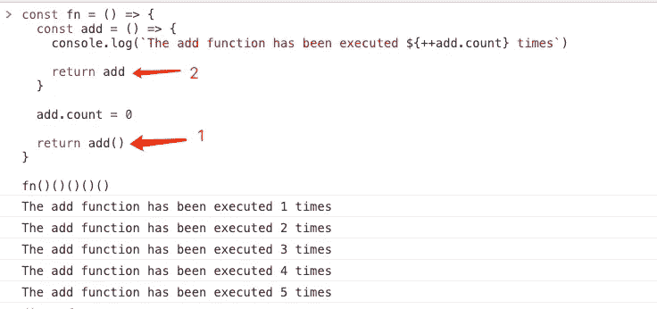
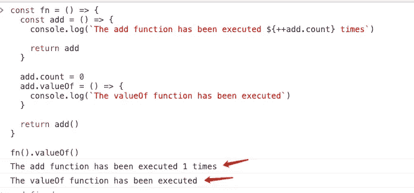

# 老板:“我可以跳过这个问题吗？”这太容易了

> 原文：<https://javascript.plainenglish.io/boss-can-i-skip-this-question-its-too-easy-cb279d399fa8?source=collection_archive---------5----------------------->

## 简单而复杂的面试经历


Photo by [Van Tay Media](https://unsplash.com/@vantaymedia?utm_source=medium&utm_medium=referral) on [Unsplash](https://unsplash.com?utm_source=medium&utm_medium=referral)

最近我一个朋友想换工作。她是一名经验丰富的前端开发工程师，但是**她面试的公司要求她先做笔试。**

朋友很无奈。说实话，她很不愿意做这个笔试，因为这让她很不舒服。

我的朋友们，当你已经工作了很多年，但仍然被要求做初级水平的笔试问题时，你会感到不舒服吗？

让我们看看她怎么了！！！

# 总和

**问题介绍:**

请完成 sum 函数的代码，它需要满足以下规则:

```
const sum = () => {
  //...
}

sum(1, 2, 3).valueOf() // 6 
sum(2, 3)(2).valueOf() // 7 
sum(1)(2)(3)(4).valueOf() // 10
sum(2)(4, 1)(2).valueOf() // 9
```

**分析:**

这个代码有什么特点？

1.  **它可以传递一个或多个参数**
2.  **支持链式调用的特性**
3.  **使用 valueOf 函数完成数字的累加**

让我们一步一步解决这些问题。

第一个特性非常简单，任何函数都可以支持任意数量的参数，所以我们忽略它。

第二个特性看起来有点复杂。如何做一个可以反复调用的函数？

```
const fn = () => {
  // ...
}

fn()()()()()
```

也许我们可以用函数本身作为返回值？

```
const fn = () => {
  const add = () => {
    console.log(`The add function has been executed ${++add.count} times`)
    return add
  }
  add.count = 0
  return add()
}

fn()()()()()
```



太棒了，`add`函数被执行然后返回自身，允许它被重复调用。

接下来需要解决第三个特性。

```
const fn = () => {
  const add = () => {
    console.log(`The add function has been executed ${++add.count} times`)
    return add
  }
  add.count = 0

  return add()
}

fn()()()()()
```

其实第三个特性也很简单，我们只需要给`add`函数添加一个`valueOf`方法。

```
const fn = () => {
  const add = () => {
    console.log(`The add function has been executed ${++add.count} times`)
    return add
  }

  add.count = 0
  add.valueOf = () => {
    console.log(`The valueOf function has been executed`)
  }

  return add()
}

fn().valueOf()
```



嗯！我打赌你知道如何实现`sum`功能！

```
const sum = (...args) => {
  // 1\. Declare an add function, which mainly plays the role of caching parameters
  // 2\. The add function will still return the add function itself when it is called, so that it can be called again and again
  const add = (...args2) => {
    args = [ ...args, ...args2 ]
    return add
  }
  // Calculation results
  add.valueOf = () => args.reduce((ret, num) => ret + num, 0)

  return add
}
// Hava a test
console.log(sum(1, 2, 3).valueOf()) // 6
console.log(sum(2, 3)(2).valueOf()) // 7
console.log(sum(1)(2)(3)(4).valueOf()) // 10
console.log(sum(2)(4, 1)(2).valueOf()) // 9
```

# 最后

**感谢阅读。**我期待着期待您的关注和阅读更多高质量的文章。

[](/i-lost-a-job-opportunity-just-because-of-promise-all-be396f6efe87) [## “我失去了一个工作机会，只是因为承诺。所有”

### 一次让我好难过的面试经历。

javascript.plainenglish.io](/i-lost-a-job-opportunity-just-because-of-promise-all-be396f6efe87) [](/interviewer-what-happened-to-npm-run-xxx-cdcb37dbaf44) [## 采访者:“npm 跑 xxx”怎么了？

### 一个大多数人都不知道的秘密。

javascript.plainenglish.io](/interviewer-what-happened-to-npm-run-xxx-cdcb37dbaf44) [](/interviewer-can-x-x-return-true-in-javascript-7e1d1fa7b5cd) [## 面试官:可以“x！== x "在 JavaScript 中返回 True？

### 你可能不知道的五个神奇的 JavaScript 知识点！

javascript.plainenglish.io](/interviewer-can-x-x-return-true-in-javascript-7e1d1fa7b5cd) [](/its-2022-don-t-abuse-the-arrow-function-anymore-905862a9c668) [## 现在是 2022 年，不要再滥用箭头功能了

### 不应该使用箭头函数的 4 种情况。

javascript.plainenglish.io](/its-2022-don-t-abuse-the-arrow-function-anymore-905862a9c668) 

*更多内容请看*[***plain English . io***](https://plainenglish.io/)*。报名参加我们的* [***免费周报***](http://newsletter.plainenglish.io/) *。关注我们关于*[***Twitter***](https://twitter.com/inPlainEngHQ)[***LinkedIn***](https://www.linkedin.com/company/inplainenglish/)*[***YouTube***](https://www.youtube.com/channel/UCtipWUghju290NWcn8jhyAw)*[***不和***](https://discord.gg/GtDtUAvyhW) *。对增长黑客感兴趣？检查* [***电路***](https://circuit.ooo/) *。***