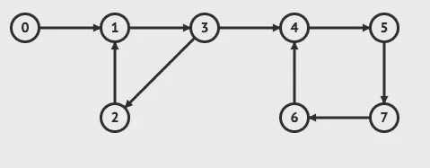
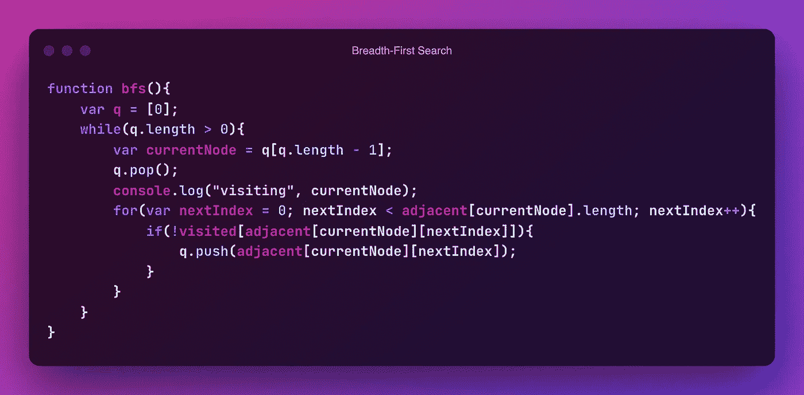

# JavaScript 中的广度优先搜索

> 原文：<https://javascript.plainenglish.io/breadth-first-search-in-javascript-daa5626323d3?source=collection_archive---------3----------------------->

## 广度优先搜索的工作原理以及如何用 Javascript 实现它

图搜索算法是竞争性编程和面试中常见问题的基础，并且经常在生产应用程序本身中使用。程序员可以使用几种算法来解决他们的特定问题，每种算法都有自己的实现和优缺点。本文将介绍广度优先搜索，也称为 BFS。BFS 使用队列遍历一个图(或树)。


Photo by [Safar Safarov](https://unsplash.com/@safarslife?utm_source=unsplash&utm_medium=referral&utm_content=creditCopyText) on [Unsplash](https://unsplash.com/s/photos/programming?utm_source=unsplash&utm_medium=referral&utm_content=creditCopyText)

广度优先搜索包括以下步骤:

1.  首先，将一个节点出队并标记为已访问。广度优先搜索需要一个数据结构来存储一个节点以前是否访问过。有多种数据结构和方法可用于确定节点之前是否被访问过。这些包括 HashMap、dictionary 或 JSON 对象，一个二维数组。然而，最直接的方法是使用一维布尔数组。有必要检查节点之前是否被访问过，因为如果图是循环的，则节点不会被重新访问。如果要重新访问节点，那么算法将永远运行下去。
2.  第二，与当前节点相邻的未被访问的每个点被添加到队列中(排队)。根据用于数据输入的数据结构，有许多方法可以确定哪些节点与当前节点相邻。这些数据结构包括邻接矩阵。如果图形是网格的形式，那么当前点周围的点可以被识别(如果它们在边界内)并被遍历。

运行广度优先搜索的时间复杂度是 O(节点+边)。时间复杂度是 O(节点+边)，因为每个顶点迭代一次，每个边迭代两次(尽管根据实现可以更少)。


Photo by [Volodymyr Hryshchenko](https://unsplash.com/@lunarts?utm_source=unsplash&utm_medium=referral&utm_content=creditCopyText) on [Unsplash](https://unsplash.com/s/photos/solving?utm_source=unsplash&utm_medium=referral&utm_content=creditCopyText)

广度优先搜索最常用于路径查找算法，其中实现了优先级队列，而不是常规队列，节点按照到达该节点所需的距离进行排序。使用优先级队列将广度优先搜索的时间复杂度增加了 log(n)倍。

让我们看看广度优先搜索如何在样本图上工作:



Courtesy of visualgo.net

广度优先搜索和深度优先搜索一样，必须从单个节点开始。在这种情况下，节点将是节点 0。

1.  节点 0 已出队。将 visited[0]设置为 true，因为当前正在访问节点 0。
2.  穿过边缘。节点 1 被添加到队列中，因为它没有被访问过。
3.  节点 1 出列，并且 visited[1]被设置为真。
4.  穿过边缘。节点 3 被添加到队列中，因为它没有被访问过。
5.  节点 3 出列，并且 visited[3]被设置为真。
6.  穿过边缘。节点 2 被添加到队列中，因为它没有被访问过。节点 4 被添加到队列中，因为它没有被访问过。
7.  节点 2 出列，并且 visited[2]被设置为真。
8.  穿过边缘。因为已经访问了节点 1，所以没有任何东西被添加到队列中。
9.  节点 4 出列，并且 visited[4]被设置为真。

这在图表的其余部分继续进行。

要在 JavaScript 中实现这一点，首先需要定义一个被访问的数组。

```
var visited = new Array(nodeCount).fill(false);
```

初始节点是队列中的第一个值，在这个基数中，是节点 0。



总之，广度优先搜索是一种有用的算法，在竞争性编程问题中很流行，在现实生活中也有应用。在本教程中，我们回顾了广度优先搜索的步骤，并完成了一个 JavaScript 实现。

*更多内容请看*[***plain English . io***](https://plainenglish.io/)*。报名参加我们的* [***免费周报***](http://newsletter.plainenglish.io/) *。关注我们关于*[***Twitter***](https://twitter.com/inPlainEngHQ)[***LinkedIn***](https://www.linkedin.com/company/inplainenglish/)*[***YouTube***](https://www.youtube.com/channel/UCtipWUghju290NWcn8jhyAw)*[***不和***](https://discord.gg/GtDtUAvyhW) *。对增长黑客感兴趣？检查* [***电路***](https://circuit.ooo/) *。***