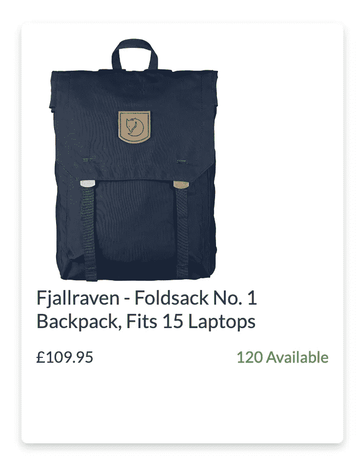

# 像资深开发者一样分解一个用户故事

> 原文：<https://javascript.plainenglish.io/break-down-a-user-story-like-a-senior-developer-194f1952e777?source=collection_archive---------5----------------------->

## 在开始一项新功能之前，我问自己的问题

Photo by [Afif Ramdhasuma](https://unsplash.com/@javaistan?utm_source=medium&utm_medium=referral) on [Unsplash](https://unsplash.com?utm_source=medium&utm_medium=referral)

在我作为一名软件开发人员的初级阶段，可能像大多数初级开发人员一样，一旦我被分配了一个特性，我就会直接跳到代码中。

虽然这可能会导致一个完整的票证，但它并不总是最高效或最有成效的方法。不是因为实现需要相当多的重构，而是因为最初花在编码上的时间本可以更明智地使用。

这些年来，我和一些优秀的开发者合作过。同时，我也有幸与一些真正杰出的开发人员一起工作并向他们学习。

在这篇文章中，我将从一个高级开发人员的角度分享分解一个用户故事的思维过程。

# 故事

首先，这里有一个示例功能。这是一个简单的卡片组件，包含产品图像、产品名称、价格和库存数量(当大于 0 时，以绿色显示)。

该卡是可按压的，并且在点击事件时，用户被带到显示关于所选产品的进一步信息的产品页面。

Product Card Component — Image by Author

# 思维过程

看到一个给定特性的设计并直接跳到代码中是很诱人的。尤其是乍一看这个特性非常简单的时候。

但是为了确保我们完整地创建这个特性，我们需要回答一些初始问题。

这些是我会问我的 PO(产品负责人)的问题:

## 我们是否拥有所有可用的数据(或端点)？

这个卡组件显示从后端获取的数据。在开罚单之前，准备好数据很重要，这样我们就可以填写卡片。

如果已经创建了一个后端端点并准备好使用，则数据将是可用的。

如果没有，那就要问更多的问题了。其中之一可能是该特性是否应该包含在当前的 sprint 中。

## **后端的回应是什么？**

一旦我们知道响应来自端点，我们就可以创建一个服务请求，只提供我们需要的数据。

想象一下，如果我们创建的服务请求调用整个响应，会对性能产生什么影响。这意味着我们有一大堆这个组件不需要的信息。

## 数据是如何结构化的？

为了用所需的数据填充卡片，我们可以使用 map 函数。

为了正确映射数据，我们需要知道数据的外观。使用 postman 之类的工具很容易就能表现出这一点。

但是如果 API 仍然没有准备好，那么我们可能需要与后端讨论数据结构，这样我们就可以创建一些模拟数据集。

## 我们什么时候调用数据？

仅在需要或需要时调用数据是需要考虑的一个要点。

例如，我们可能希望在页面加载时调用一些数据。如果是这种情况，在获取数据时是否需要加载屏幕或加载器组件？

诸如此类的问题会引出更多的问题，在特性开始时了解所有的细节可以帮助我们更好地计划我们的实现。

## 我们需要操纵数据吗？

假设我们需要显示一个日期或时间。在大多数情况下，响应调用会发送一个类似于`1970-01-01T00:00:00.000Z`的日期戳。

如果是这种情况，那么我们可能需要格式化数据，使其以 UX 团队设计的方式显示。

例如，当计算一个点到用户当前位置的距离时，检索到的数据可能以米为单位，但设计可能要求我们以英里为单位显示。

在这种情况下，可能需要编写一个函数来操作数据，以便它可以从米计算英里数。

**一旦我们有了数据，我们需要展示数据。这是我们开始询问关于 UI 的问题的时候。**

对于这个特定的例子，问题可以是关于颜色、字体、大小、间距、点击事件等等。当产品不可用时会发生什么？

## 我们需要考虑哪些测试用例？

测试是编码中极其重要的一部分。编写好的测试可以确保我们的组件是健壮的，并且做我们想让它们做的事情。

我写了一篇关于一些最佳测试实践的文章。我能想到的有 7 个。你可以点击下面的链接来阅读。

 [## 7 测试我作为开发人员学到的最佳实践

### 超过 4 年的开发经验

javascript.plainenglish.io](/7-testing-best-practices-i-have-learned-as-a-developer-b8f469778443) 

# 结果

在故事开始时问正确的问题会导致三种结果:

1.  有了你需要的所有信息，我们就有足够的信心开始这项功能。这也将有助于更快地完成。
2.  我们正在创建的组件或功能的更好(和完整)的实现，因为我们可以在开始编码之前计划所有的步骤。
3.  可以全面测试该功能。

感谢阅读！

如果这是有帮助的，如果你给这篇文章一个👏在你的社交网络中分享，如果你还没有，关注一下会很好。

也请考虑通过我的[推荐](https://mazaher-muraj.medium.com/membership)链接订阅媒体。Medium 是一个很好的学习平台，我用它来了解技术领域的最新动态，并学习其他开发人员的经验。

你的订阅将直接支持我和许多其他媒体作家。

 [## 通过我的推荐链接加入媒体

### 阅读 Mazaher Muraj(以及媒体上成千上万的其他作家)的每一个故事。您的会员费直接支持…

mazaher-muraj.medium.com](https://mazaher-muraj.medium.com/membership) 

*更多内容请看*[***plain English . io***](https://plainenglish.io/)*。报名参加我们的* [***免费周报***](http://newsletter.plainenglish.io/) *。关注我们关于*[***Twitter***](https://twitter.com/inPlainEngHQ)[***LinkedIn***](https://www.linkedin.com/company/inplainenglish/)*[***YouTube***](https://www.youtube.com/channel/UCtipWUghju290NWcn8jhyAw)*[***不和***](https://discord.gg/GtDtUAvyhW) ***。*****

*****对缩放您的软件启动感兴趣*** *？检查* [***电路***](https://circuit.ooo?utm=publication-post-cta) *。***