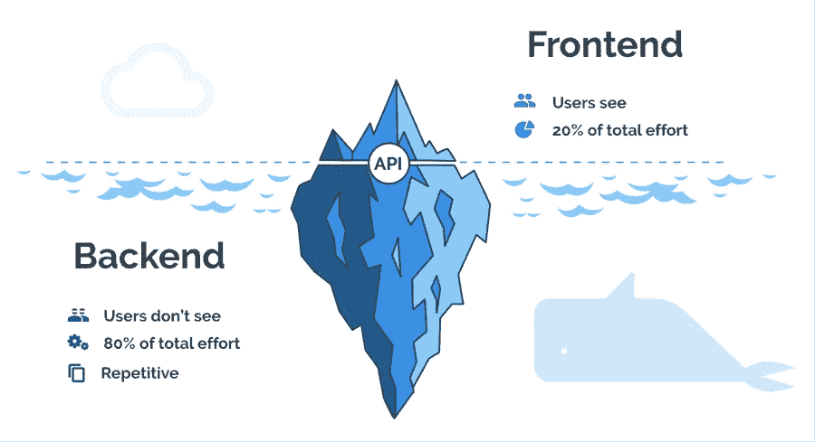

# 这些技能可以让你成为一名优秀的开发人员

> 原文：<https://javascript.plainenglish.io/breaking-down-developer-skills-b23cc7b100aa?source=collection_archive---------12----------------------->

## 作为开发人员，您需要具备的所有技能。

Photo by [Vadim Sherbakov](https://unsplash.com/@madebyvadim?utm_source=unsplash&utm_medium=referral&utm_content=creditCopyText) on [Unsplash](https://unsplash.com/s/photos/breakdown?utm_source=unsplash&utm_medium=referral&utm_content=creditCopyText)

在这篇博客中，我们将分解你需要掌握的技能，以成为前 1%的**前端**、**后端**、**数据库**、 **DevOps** 、**移动应用。**

# 前端开发

前端开发是一种**风格的计算机编程，专注于编码和创建用户可以看到的网站元素和功能**。它是关于确保一个网站的视觉方面的功能

为了擅长前端开发，你需要以下技能。

## 基础

基本的东西甚至包括互联网如何工作…

1.  HTML —网站的结构
2.  CSS —简单的样式
3.  JavaScript —交互性

## 结构

框架帮助我们轻松创建大规模的应用程序。

1.  脸书发明的 React 是最流行的一种
2.  vue . j
3.  有角的
4.  网络包

## 式样

我们甚至无法想象自己喜欢的网站没有任何风格。

为此，我们有这些**库** / **框架:**

1.  顺风 CSS
2.  引导程序
3.  材料用户界面
4.  Chakra UI

## 后端

后端是网站的服务器端。它存储和安排数据，并确保网站客户端的一切正常运行。这是网站的一部分，你看不到也无法与之互动。它是软件中不与用户直接接触的部分

1.  服务器端编程语言（Professional Hypertext Preprocessor 的缩写）
2.  节点 JS
3.  Ruby on Rails
4.  Java (Spring)
5.  ASP。网
6.  雷迪斯

## 数据库ˌ资料库

数据库是结构化信息或数据的有组织的集合，通常以电子方式存储在计算机系统中。…然后可以轻松地访问、管理、修改、更新、控制和组织数据。

**关系数据库管理系统。**

1.  MSSQL
2.  关系型数据库
3.  Postgres

**NoSQL**

1.  Mongo 数据库
2.  卡桑德拉
3.  CouchDB
4.  弹性搜索

**图形**

1.  Neo4j
2.  ArangoDB

**消息队列**

1.  卡夫卡
2.  SQS
3.  ZeroMQ
4.  兔子 MQ

## DevOps

**基建**

1.  自动警报系统
2.  蔚蓝的
3.  麋鹿
4.  NGINX

**自动化**

1.  Ansible
2.  厨师
3.  詹金斯

**虚拟化**

1.  码头工人
2.  Bladecenter
3.  库伯内特斯
4.  无赖
5.  VMware

## 移动应用程序

**安卓**

1.  Java 语言(一种计算机语言，尤用于创建网站)
2.  科特林
3.  软件开发工具包(Software Development Kit)

**IOS**

1.  目标 C
2.  迅速发生的

**跨平台**

1.  反应自然
2.  离子的
3.  艾滋病患者
4.  Xamarin
5.  一致

## 结论

我们已经涵盖了成为全栈 web 开发人员的所有基本工具/库/框架。

不断学习。不断更新。

感谢您的阅读。

*更多内容请看*[***plain English . io***](http://plainenglish.io/)*。报名参加我们的* [***免费周报***](http://newsletter.plainenglish.io/) *。在我们的* [***社区***](https://discord.gg/GtDtUAvyhW) *获得独家获得写作机会和建议。*