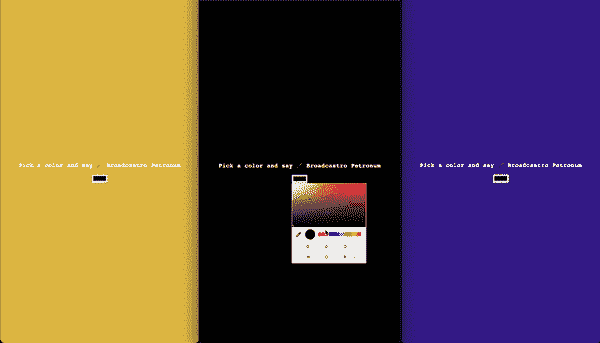
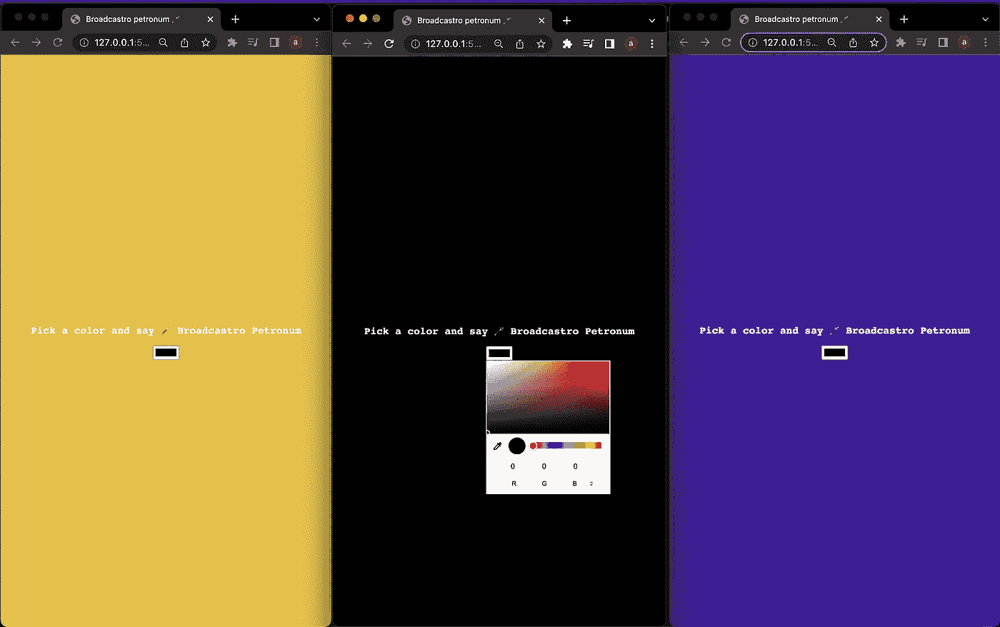
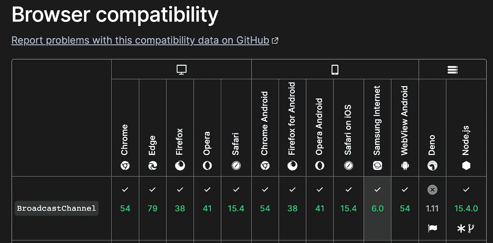

# 广播频道 API🔊

> 原文：<https://javascript.plainenglish.io/broadcast-channel-api-af9b9f1b145c?source=collection_archive---------11----------------------->

## 网络的黑魔法——Ep1


Photo by [Nikolas Noonan](https://unsplash.com/es/@nikolasnoonan?utm_source=unsplash&utm_medium=referral&utm_content=creditCopyText) on [Unsplash](https://unsplash.com/s/photos/dark?utm_source=unsplash&utm_medium=referral&utm_content=creditCopyText)

那是一个漆黑的夜晚。月亮睡着了。🌑

街道空无一人。🛣️

在大风中嚎叫的狗。🐕‍🦺

突然，一片死寂…🤫

一根黑魔法棒从灰色烟雾中出现…💨

Potter using the Broadcastro petronum spell 🪄

魔杖包含不同的魔法咒语(API ),我们将在这个系列中一个接一个地看到。

# 🪄石油公司

> 第一个咒语是最危险的。如果**和**来自同一个**，它可以用来**在两个【】浏览上下文**之间传递信息**(数据)。

Broadcastro petronum 是[广播通道 API](https://developer.mozilla.org/en-US/docs/Web/API/Broadcast_Channel_API) ，它允许我们跨窗口、标签、iframes 或 web workers 广播数据(字符串/对象/甚至 blobs ),如果它们是同源的话。同源是指具有相同的协议、url 和端口。

好吧！理论上的定义已经够多了。我们可以从创建一个彩色应用程序开始🎨



3 browser tabs which syncs background color

## 让我们编码！

我们将制作一个**颜色同步应用**，所有标签的背景颜色代码将被同步。将下面的代码复制并粘贴到你最喜欢的代码编辑器(不是 vim)中，然后启动一个服务器。

> 低语.."使用 vscode "

创建一个 js 文件 broadcast_api.js，并将其嵌入到 html 文件中。

在多个标签中打开 live 服务器，当你在一个标签中改变背景颜色时，它将与所有其他标签同步，具有 broadcastro petronum 咒语的魔力😍。



Final output of the spell

## 让我们理解工作

🪄我们正在使用输入标签创建一个颜色选择器，并使用 [addEventListener](https://developer.mozilla.org/en-US/docs/Web/HTML/Element/input/color) 监听颜色变化事件。

🪄广播频道在每个选项卡中使用唯一的名称创建。

```
broadcastChannel = new BroadcastChannel(“color_sync”);
```

🪄使用频道我们已经发送了一个 postMessage 到其他活跃的标签，这些标签在广播频道上收听。一旦接收到颜色代码，背景就被同步。

```
broadcastChannel.postMessage(message);
```

> 注意:postMessage 不会在发送它的同一上下文中接收

那太简单快捷了吧😍

Web API 是令人敬畏的，除非它的浏览器支持表是绿色的。这里不用担心，因为大多数现代浏览器都支持广播频道 API。



Browser support for broadcast channel API

广播频道 API 在实时应用程序中非常有用，在这些应用程序中，大量数据需要跨选项卡同步。它是提供多种服务的应用程序的救命稻草，比如谷歌，它提供了一套在多个标签上运行的商业应用程序。

我们可以用它来同步服务器响应，避免不必要的网络使用。可以编写微模块，并在浏览器上下文之间共享，以执行性能密集型任务。有许多这样的用例。

如果使用得当，一个非常小的代码也能创造奇迹。请在下面评论您计划如何在您的项目中使用 Broadcast Petronum。下集网络黑魔法咒语再见。😉

## 过帐学分

黑魔法在空气中渗出了更多的咒语。这次听起来像 Webardium Composa…😯

在 medium 上关注我并订阅电子邮件以接收即时通知。

*更多内容请看*[***plain English . io***](https://plainenglish.io/)*。报名参加我们的* [***免费周报***](http://newsletter.plainenglish.io/) *。关注我们上*[***Twitter***](https://twitter.com/inPlainEngHQ)[***LinkedIn***](https://www.linkedin.com/company/inplainenglish/)*[***YouTube***](https://www.youtube.com/channel/UCtipWUghju290NWcn8jhyAw)**和* [***不和***](https://discord.gg/GtDtUAvyhW) *对成长黑客感兴趣？检查* [***电路***](https://circuit.ooo/) ***。*****