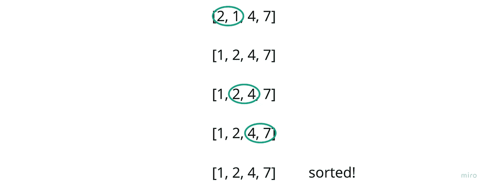

# 使用 JavaScript 进行冒泡排序

> 原文：<https://javascript.plainenglish.io/bubble-sort-807a63270656?source=collection_archive---------16----------------------->

## 如何用 JavaScript 执行冒泡排序

Photo by [Kelly Sikkema](https://unsplash.com/@kellysikkema?utm_source=medium&utm_medium=referral) on [Unsplash](https://unsplash.com?utm_source=medium&utm_medium=referral)

啊，排序算法。好满足。

今天的是冒泡排序。

## **简单地说**

简而言之，冒泡排序是一个过程，在这个过程中，我们将重复遍历一个数组，并将当前值与下一个值进行比较，如果当前值大于下一个值，我们将交换它。

这是一个循序渐进的过程:

我将从这个数组开始，按升序排序:

让我们比较一下前两个指数:

那里没什么可改变的。继续前进…

我们现在可以用 1 替换 7，并将我们的比较滑动窗口下移…

同样，7 可以向下移动:

现在让我们从头开始这个过程…

完成了完成了。

**编码完毕**

你会注意到，我在外循环中是递减的，这样做的原因是，我可以将内循环迭代建立在整个数组范围不断缩小的基础上。

换句话说，每次运行外部循环时，我都知道数组末尾多了一个不需要排序的值。

此外，如果我想检查一个已排序的数组，并提前中断迭代，我可以实现类似这样的东西…

就是这样！我将在不久的将来发表一系列完整的排序算法文章，所以如果你有兴趣看到更多，请随时订阅通知。

*更多内容看* [***说白了就是***](https://plainenglish.io/) *。报名参加我们的* [***免费周报***](http://newsletter.plainenglish.io/) *。关注我们关于* [***推特***](https://twitter.com/inPlainEngHQ) ， [***领英***](https://www.linkedin.com/company/inplainenglish/) *，*[***YouTube***](https://www.youtube.com/channel/UCtipWUghju290NWcn8jhyAw)*，以及* [***不和***](https://discord.gg/GtDtUAvyhW) *。*