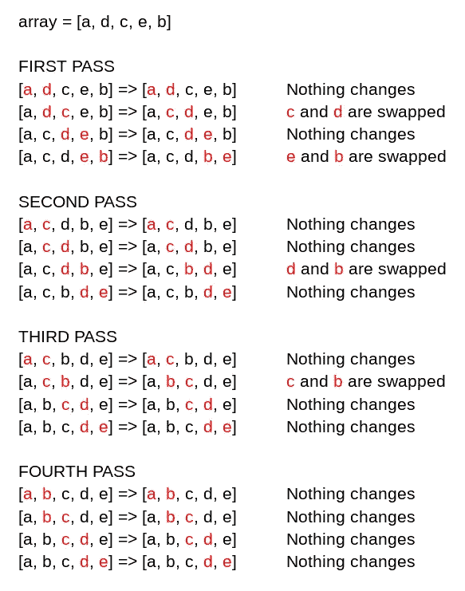

# 使用 JavaScript 进行冒泡排序

> 原文：<https://javascript.plainenglish.io/bubble-sort-with-javascript-f7878e0fc59d?source=collection_archive---------5----------------------->

## JavaScript 中的算法思维

Photo by [Pawel Czerwinski](https://unsplash.com/@pawel_czerwinski?utm_source=medium&utm_medium=referral) on [Unsplash](https://unsplash.com?utm_source=medium&utm_medium=referral)

冒泡排序是最简单的比较排序算法之一。它的工作原理是遍历一个数组，如果相邻元素的顺序不正确，就反复交换它们。因此，较小或较大的元素“冒泡”到顶部。正如我们将在下面看到的，这种算法性能很差，通常不在教学环境之外使用。

对于一般情况和最坏情况，冒泡排序的时间复杂度为 **O(n )** 。当数组已经排序后(最好的情况)，时间复杂度变成 **O(n)** 。

要了解这是如何工作的，让我们看一个例子。我们将通过一个简单的字母数组(为了更好的可读性，引用被删除了)来遍历该算法，注意每一遍都发生了什么。

请注意，在我们第四次通过时，没有任何变化。我们的算法不知道数组被排序，直到它在数组中循环，没有任何元素被交换。一旦发生这种情况，将返回排序后的数组。让我们看看代码:

在这个函数中，我们立即看到一组嵌套的 ***为*** 的循环。这通常强烈表明时间复杂度相当高。我们已经设置了外部循环来循环遍历整个数组，循环次数等于它的长度。由于在每一步中，数组的末尾已经是有序的，所以内部循环逐步循环通过数组的较小块。如果在任何时候发现两个连续的元素顺序不对，就使用赋值操作符交换它们(第 8 行)。

注意，为了避免不必要地遍历已经排序的数组，我们使用了一个 ***交换的*** 变量。一旦遍历完数组而没有交换任何元素，该函数将返回排序后的数组，从而结束循环。

就是这样！同样，这是一个功能很差的算法，所以它不应该用于任何长度的严肃数组。然而，它确实展示了算法思维的开端。在以后的文章中，我们将探索更有效、更实用、更适合实际工作的算法。

感谢跟随和快乐编码！

*更多内容看* [***说白了就是***](http://plainenglish.io/) *。报名参加我们的* [***免费周报***](http://newsletter.plainenglish.io/) *。在我们的* [***社区不和谐***](https://discord.gg/GtDtUAvyhW) *获得独家获取写作机会和建议。*