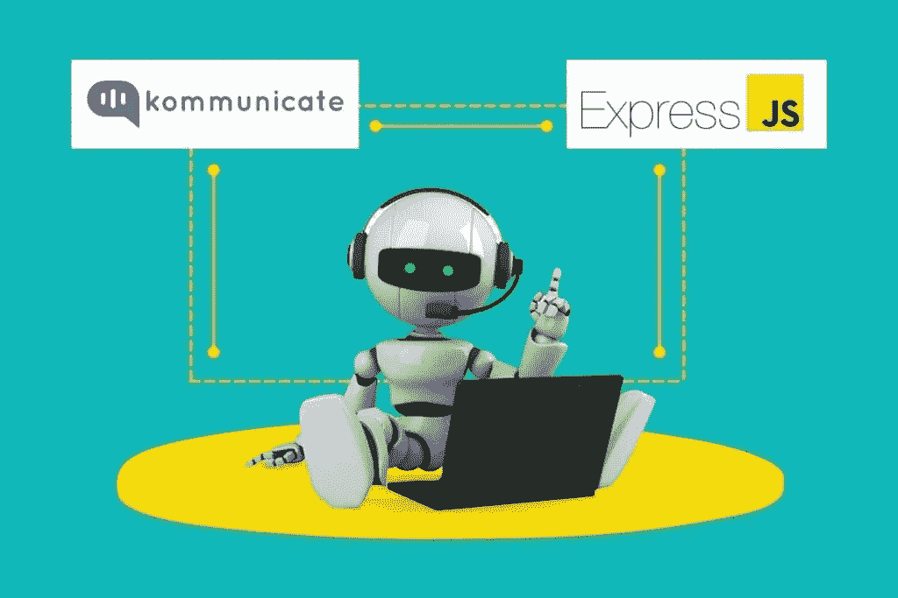
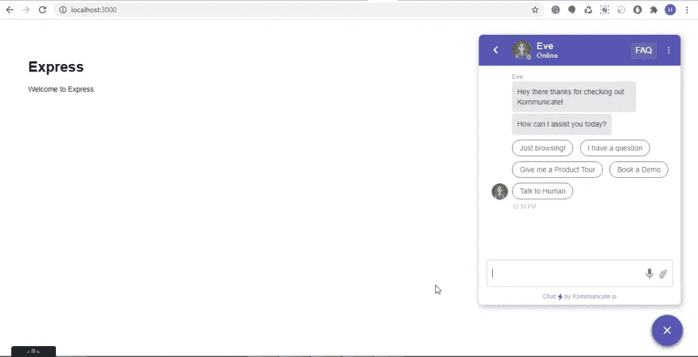

# 构建聊天机器人并添加到您的 Express 框架中

> 原文：<https://javascript.plainenglish.io/build-a-chatbot-add-to-your-express-framework-f05b416e8860?source=collection_archive---------14----------------------->



Express.js，或简称 Express，是 Node.js 后端 web 应用框架。这是一个轻量级、适应性强的 Node.js web 应用程序框架，为 web 和移动应用程序提供了一套全面的特性。

在本文中，我将让您很容易理解如何将聊天机器人集成到 Express 项目中。

# 先决条件

*   本教程使用 Node.js。您必须熟悉 JavaScript 并对 Node.js 有基本的了解。在开始之前，请确保您的计算机上安装了 Node.js。
*   除此之外，您还需要一个预构建的聊天机器人，它可以随时部署到您的 Express 项目中。在本教程中，我们将使用来自 [Kompose](https://www.kommunicate.io/product/kompose-bot-builder) 的预建聊天机器人。
*   如果你还没有聊天机器人，这里的是一个一步一步的教程，让你不用任何编码就能创建自己的聊天机器人。

# 以下是将聊天机器人添加到快速框架的 3 个快速步骤。

1.  设置您的快速应用程序
2.  创建快速应用程序生成器
3.  将聊天机器人与 Express 集成

我们来详细讨论一下。

# 1.设置您的快速应用程序

要开始创建应用程序，请在终端中键入以下几行。

```
$ mkdir myapp
$ cd myapp
$ npm init
$ npm install express --save
```

将以下代码添加到 myapp 目录下的 app.js 文件中。由于这个简单的配置，现在我们有一个 Node.js 应用程序运行在 express 框架中。

```
const express = require('express')
const app = express()
const port = 3000app.get('/', (req, res) => {
  res.send('Hello World!')
})
app.listen(port, () => {
  console.log(`Example app listening at http://localhost:${port}`)
})
```

# 2.创建快速应用程序生成器

Express-generator 是一个应用程序生成器工具，用于快速创建应用程序框架。这将有助于安装所有的依赖项，并允许我们以更结构化的方式运行静态 JS/CSS 文件。使用以下代码将应用程序生成器安装为全局 npm 包，然后启动它。

```
$ npm install -g express-generator
$ express
```

**注意:**生成器生成的 app 结构只是组织 Express apps 的众多选项之一。请随意使用或修改此结构，以最大限度地满足您的需求。

该应用程序将创建在当前工作目录的一个文件夹中，视图引擎将设置为 Pug。并使用以下命令运行项目。

```
DEBUG=myapp:* npm start
```

# 3.将通讯聊天机器人与 Express 项目集成

要将 kommunicate 与 Express 集成，在 public JavaScript 文件夹中创建一个单独的脚本文件，并使用 layout.pug 文件上的 script 标记调用它。

```
(function(d, m){
    var kommunicateSettings = 
        {"appId":"YOUR_APP_ID","popupWidget":true,"automaticChatOpenOnNavigation":true};
    var s = document.createElement("script"); s.type = "text/javascript"; s.async = true;
    s.src = "https://widget.kommunicate.io/v2/kommunicate.app";
    var h = document.getElementsByTagName("head")[0]; h.appendChild(s);
    window.kommunicate = m; m._globals = kommunicateSettings;
})(document, window.kommunicate || {});
```

Express 使用 express.static 内置中间件函数来提供静态文件，如图像、CSS 文件和 JavaScript 文件。检查 app.js 文件中是否添加了以下函数签名:

```
app.use(express.static(path.join(__dirname, 'public')));
```

您可以使用 layout.pug 文件脚本标记来访问 Kommunicate 脚本文件。

```
doctype html
html
  head
    title= title
    link(rel='stylesheet', href='/stylesheets/style.css')
    script(src="javascripts/kommunicate.js")
  body
    block content
```

既然我们已经指定了要在应用程序中使用的自定义 JavaScript 文件，那么让我们来看看它们在应用程序中是如何出现的。在浏览器中加载 [http://localhost:3000/](http://localhost:3000/) 来查看输出。



如果你运行浏览器，你应该看到一个聊天窗口弹出，这意味着你的聊天机器人准备好了。这就是你如何将 Kommunicate 聊天工具集成到 Express 应用程序中。

最初发表于 2022 年 6 月 8 日 https://www.kommunicate.io/的

*更多内容看* [***说白了就是***](https://plainenglish.io/) *。报名参加我们的* [***免费周报***](http://newsletter.plainenglish.io/) *。关注我们关于* [***推特***](https://twitter.com/inPlainEngHQ) ， [***领英***](https://www.linkedin.com/company/inplainenglish/) ***，***[***YouTube***](https://www.youtube.com/channel/UCtipWUghju290NWcn8jhyAw)***，以及****[***不和***](https://discord.gg/GtDtUAvyhW) *对成长黑客感兴趣？检查出* [***电路***](https://circuit.ooo/) ***。****