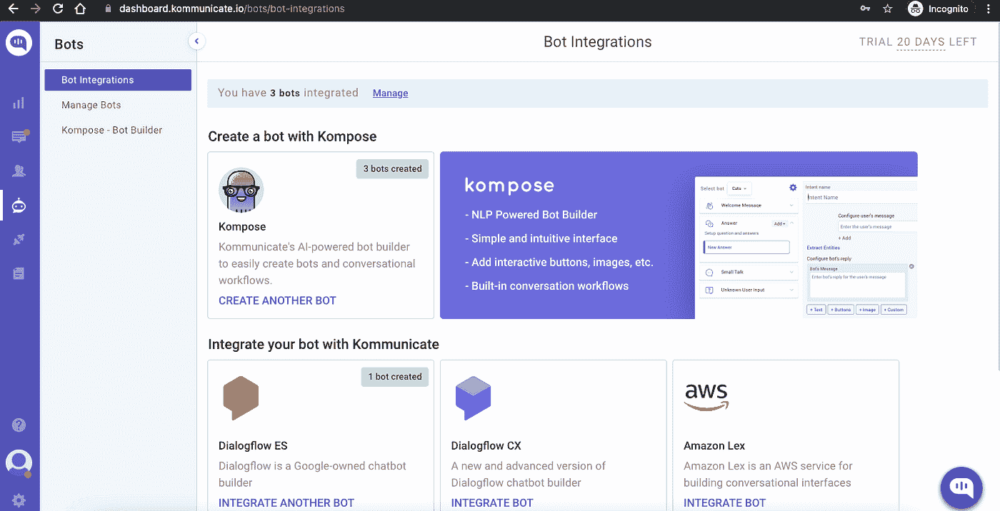
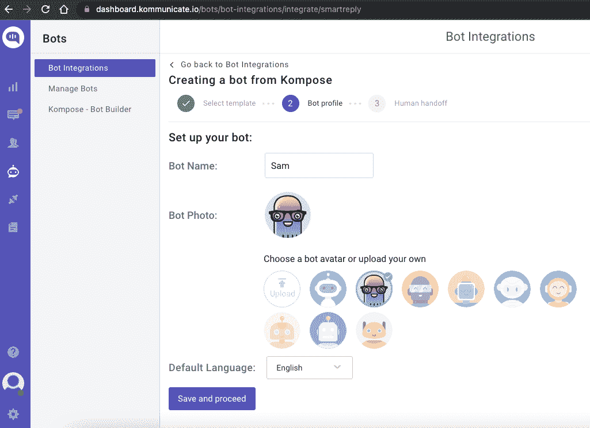
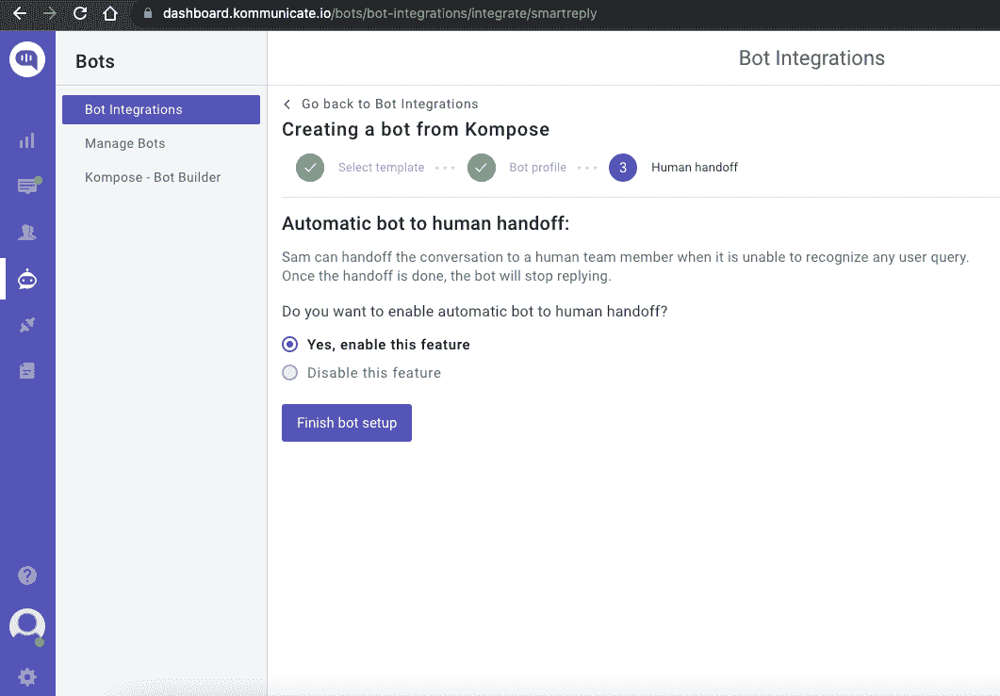
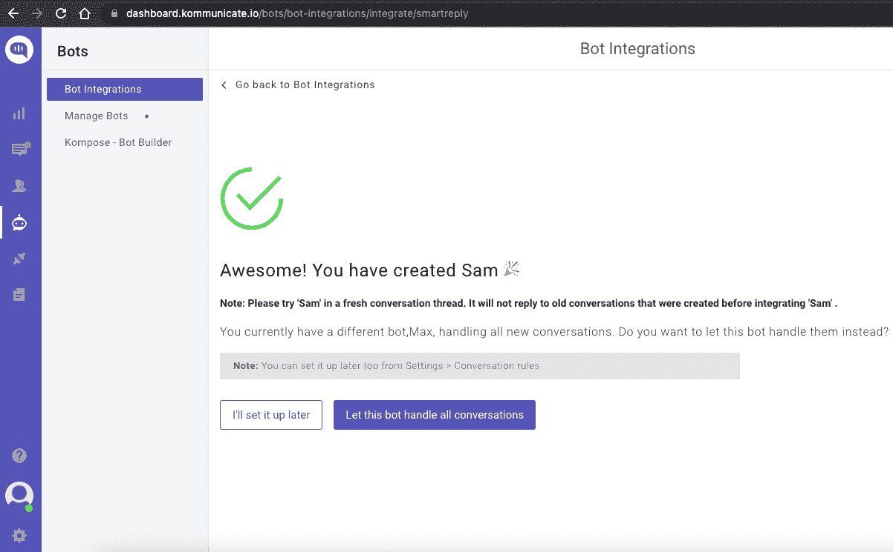
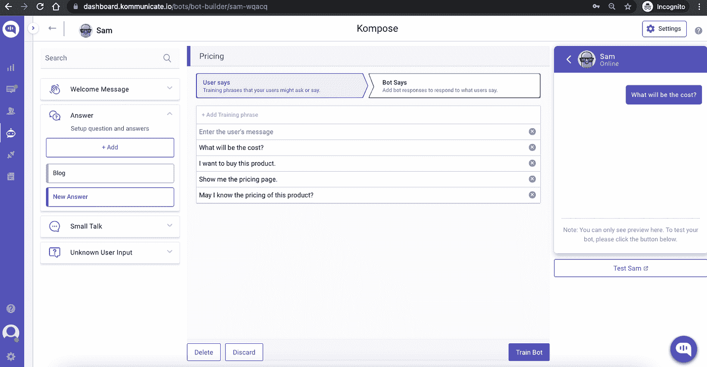
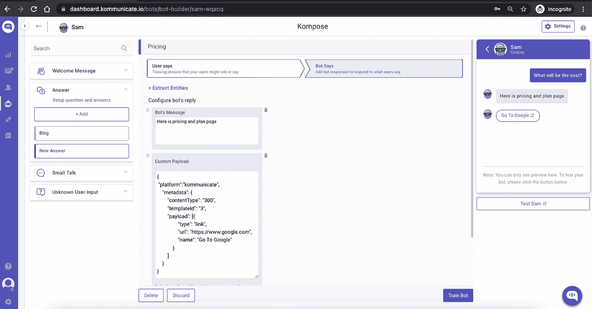
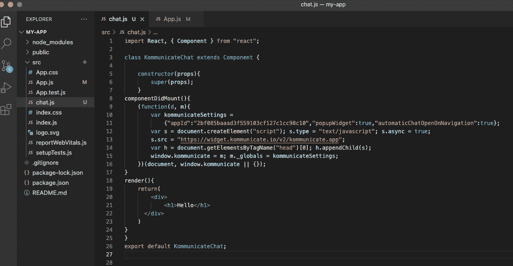
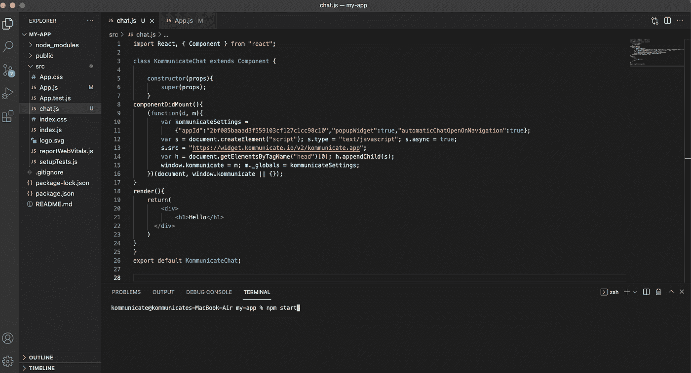
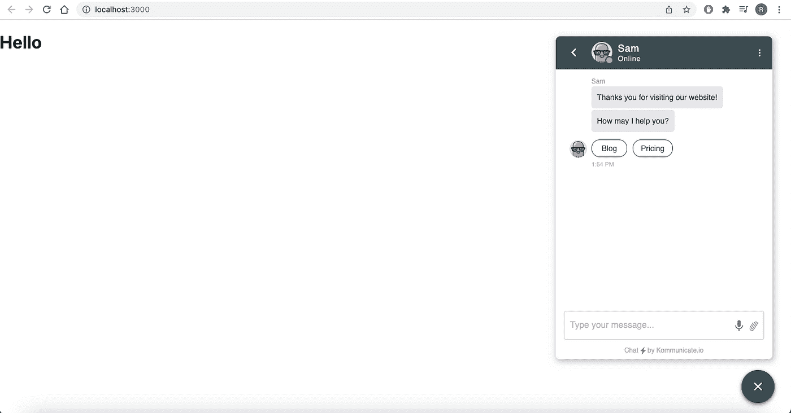

# 建立一个聊天机器人，并将其集成到 React 网站中

> 原文：<https://javascript.plainenglish.io/build-a-chatbot-integrate-it-into-react-websites-6b8d5cdd83a6?source=collection_archive---------9----------------------->


Photo by [Volodymyr Hryshchenko](https://unsplash.com/@lunarts?utm_source=medium&utm_medium=referral) on [Unsplash](https://unsplash.com?utm_source=medium&utm_medium=referral)

React 在受欢迎程度排行榜上稳步攀升，这是开发人员用来构建快速、响应迅速且美观的网站的首选 Javascript 库。

在 ReactJS 网站上创建聊天机器人在过去可能是一件复杂的事情，但现在不是了，这要归功于 Kommunicate 的 Kompose 聊天机器人生成器。

在这篇博客文章中，我们将教你如何将 Kompose 机器人集成到 React 网站中。

我们将分两个阶段进行整合:

1.  创建一个聊天机器人并设置答案。
2.  将创建的聊天机器人添加到 React 网站。

让我们直接开始吧。

第一阶段:在 [Kompose](https://www.kommunicate.io/product/kompose-bot-builder) 创建一个聊天机器人，并设置答案

# 步骤 1:在 Kommunicate 中设置一个帐户

如果您没有 Kommunicate 的帐户，您可以在这里免费创建一个[。](https://dashboard.kommunicate.io/signup)

接下来，登录到您的 Kommunicate 仪表板并导航到 Bot 集成部分。找到 Kompose 部分，点击**集成机器人**。



如果您想从头开始构建一个机器人，请选择一个空白模板，然后转到“设置您的机器人”部分。选择您的机器人的名称、您的机器人的头像和您的机器人的默认语言，然后单击“保存并继续”。



您现在已经创建好了您的机器人，现在您所要担心的是当机器人遇到它不理解的查询时“启用机器人到人类的转移”。启用此功能，然后单击“完成 Bot 安装”



从下一页，您可以选择这个机器人是否将处理所有传入的对话。点击“让这个机器人处理所有的对话”,你就可以开始了。



这里新创建的 bot:**仪表盘→Bot 集成→管理 Bot。**

# 步骤 2:为你的聊天机器人创建欢迎信息和回答

转到[‘kom pose—Bot Builder’](https://dashboard.kommunicate.io/bots/bot-builder/)部分，选择您创建的 Bot。

首先，为你的聊天机器人设置欢迎信息。欢迎消息是聊天机器人向发起聊天的用户发送的第一条消息。

单击“欢迎信息”部分。在“输入欢迎消息-聊天机器人的消息”框中，提供用户打开聊天时您的聊天机器人应该显示的消息，然后保存欢迎意图。

创建欢迎消息后，下一步是提供答案/意图。这些答案/意图可能是关于你的产品和服务的常见问题。

回答部分是你添加所有用户信息和聊天机器人回复的地方。

转到“答案”部分，点击+添加，然后给出一个“意向名称”

在“配置用户的消息”部分，您需要提及您希望用户触发的短语。



配置聊天机器人的回复部分——您需要提及聊天机器人将针对特定消息向用户发送的回复(文本或丰富消息()。您可以为聊天机器人添加任意数量的答案和后续回复。在这里，我通过选择“更多”选项中的“自定义”选项来使用自定义有效负载。

一旦你配置好响应，你需要点击**“火车机器人”**，它在预览屏幕的右边和左边的按钮。一旦训练成功，右上角会出现一个祝酒词**【安瑟训练完成】**。



# 第二阶段:将创建的聊天机器人添加到 React 网站

# 步骤 1:创建一个 React 应用程序

使用终端或命令提示符中的命令创建一个新的 React 应用程序(my-app ):

```
npx create-react-app my-app
```

# 步骤 2:现在，导航到我的应用程序文件夹

```
cd my-app
```

# 步骤 3:在 src 文件夹中创建一个新文件 chat.js

创建 chat.js 后，在 componentDidMount 中添加以下代码。下面的代码将使用集成的 Dialogflow bot 在您的网站上启动一个聊天小部件。确保用您的[通信应用 ID](https://dashboard.kommunicate.io/settings/install) 替换<your_app_id>。</your_app_id>

您也可以在 komunicate 的[安装部分获得该代码。](https://dashboard.kommunicate.io/settings/install)

```
import React, { Component } from “react”;class KommunicateChat extends Component {constructor(props){super(props);}componentDidMount(){(function(d, m){var kommunicateSettings ={“appId”:”2bf085baaad3f559103cf127c1cc98c10″,”popupWidget”:true,”automaticChatOpenOnNavigation”:true};var s = document.createElement(“script”); s.type = “text/javascript”; s.async = true;s.src = “https://widget.kommunicate.io/v2/kommunicate.app”;var h = document.getElementsByTagName(“head”)[0]; h.appendChild(s);window.kommunicate = m; m._globals = kommunicateSettings;})(document, window.kommunicate || {});}render(){return(<div><h1>Hello</h1></div>)}}export default KommunicateChat;
```

这是我的代码编辑器的截图:



# 步骤 4:在本地启动你的应用

使用以下命令启动您新创建的安装了 Kompose bot 的网站。

```
npm start
```



瞧啊。有多简单？通过这几个简单的步骤，你可以将 Kompose 机器人集成到 React 网站中。这是聊天小部件在网站上的外观:



最初于 2022 年 1 月 11 日在 https://www.kommunicate.io/[发布](https://www.kommunicate.io/blog/integrate-chatbot-in-react-js/)

*更多内容请看*[***plain English . io***](https://plainenglish.io/)*。报名参加我们的* [***免费周报***](http://newsletter.plainenglish.io/) *。关注我们关于*[***Twitter***](https://twitter.com/inPlainEngHQ)[***LinkedIn***](https://www.linkedin.com/company/inplainenglish/)*[***YouTube***](https://www.youtube.com/channel/UCtipWUghju290NWcn8jhyAw)***，以及****[***不和***](https://discord.gg/GtDtUAvyhW) *对成长黑客感兴趣？检查* [***电路***](https://circuit.ooo/) ***。*****