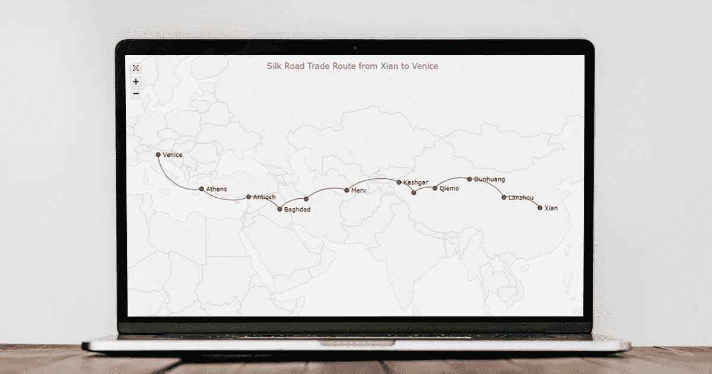
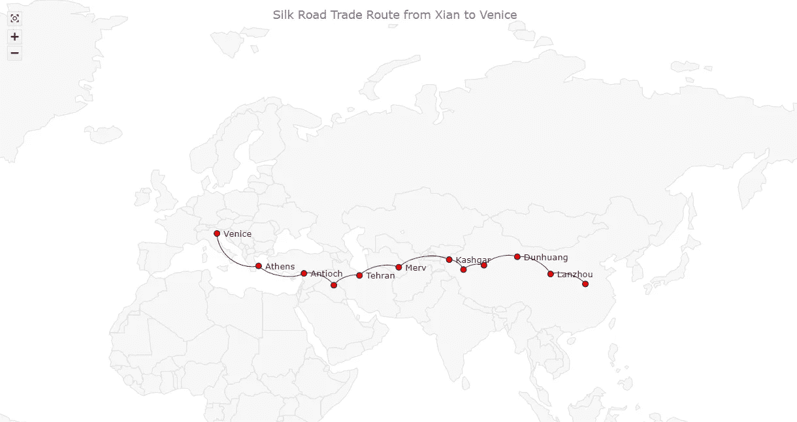
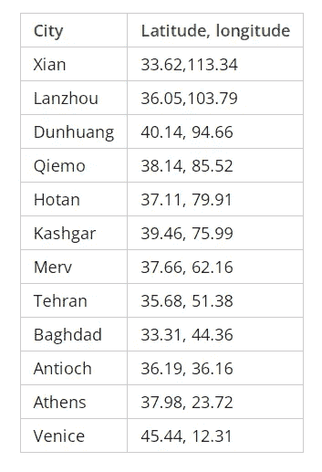
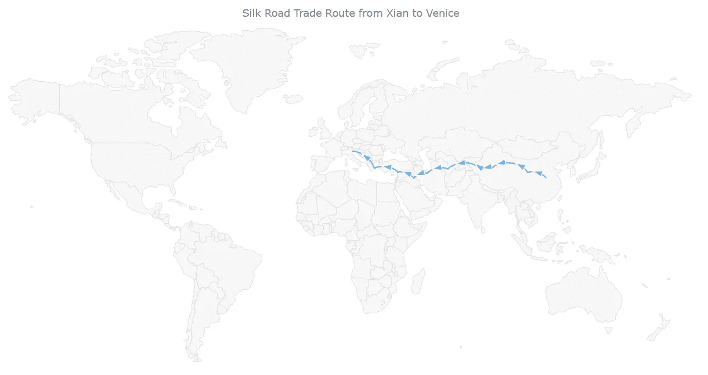
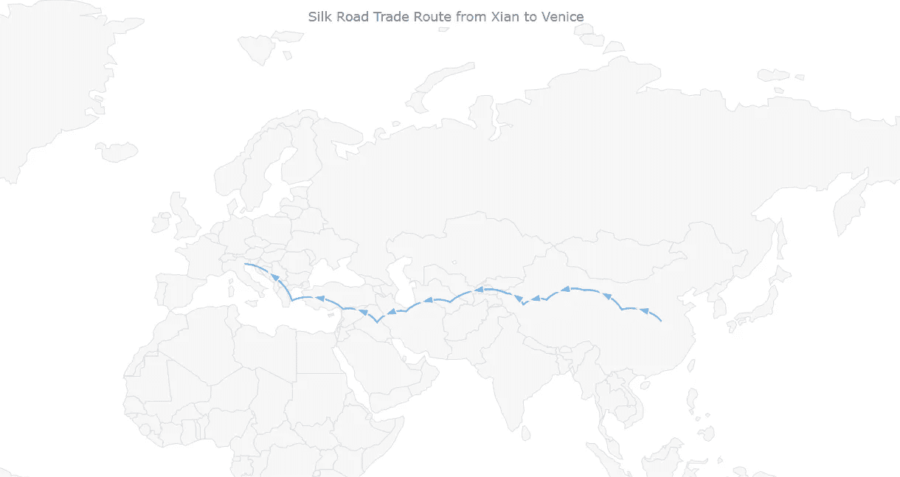
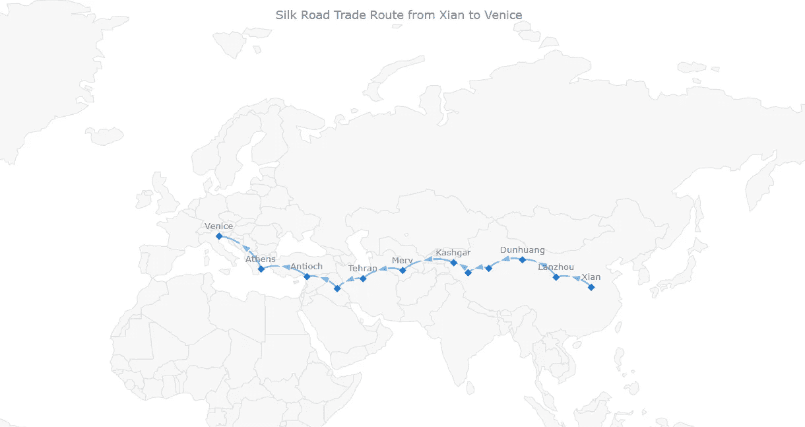
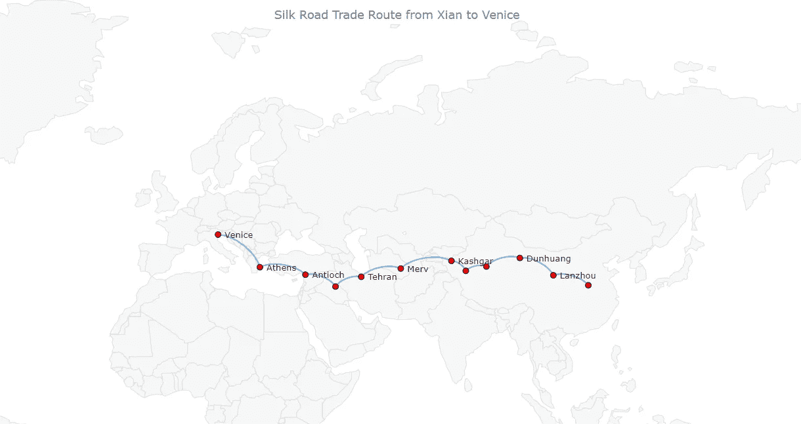
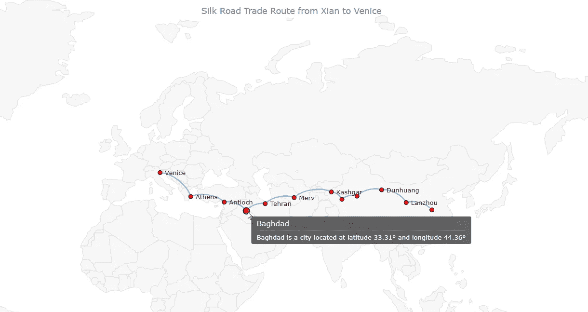
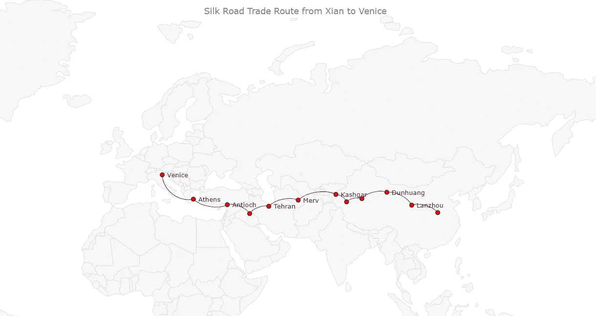

# 用 JavaScript 构建连接器映射(教程)

> 原文：<https://javascript.plainenglish.io/build-a-connector-map-in-javascript-tutorial-52fbcf79a3aa?source=collection_archive---------15----------------------->



[连接器地图](https://www.anychart.com/chartopedia/chart-type/connector-map/)旨在地理空间数据分析中可视化位置之间的路线和其他链接。在本教程中，您将学习如何使用 JavaScript 快速创建一个引人注目的交互式网站。

一步一步，我们将想象著名的古代丝绸之路的路线。我们将从开发一个基本的 JS 连接器地图开始，分四步走，然后做一些调整，使它看起来很棒。让我们开始航行吧！

# 连接器映射预览

下面是本教程最终基于 JavaScript 的连接器映射的预览。



事不宜迟，让我们开始连接器映射的工作吧！

# 构建基本的 JS 连接器映射

用 JavaScript 创建连接器映射背后的逻辑非常简单。整个过程可以分为四个基本步骤:

1.  创建一个 HTML 页面。
2.  添加必要的 JavaScript 文件。
3.  准备并加载数据。
4.  写一些 JS 代码来画连接器图。

## 1.创建 HTML 页面

首先，我们的交互连接器地图应该放在哪里？让我们创建一个基本的 HTML 页面。

就在这里，我们添加了一个 HTML 块元素，并为它分配了一个惟一的标识符。然后，我们在样式表中设置一个样式声明。

```
<!DOCTYPE html>
<html lang="en">
  <head>
    <meta charset="utf-8">
    <title>JavaScript Connector Map</title>
    <style type="text/css">      
      html, body, #container { 
        width: 100%; 
        height: 100%; 
        margin: 0; 
        padding: 0; 
      } 
    </style>
  </head>
  <body>
    <div id="container"></div>
  </body>
</html>
```

在上例中，block 元素是`<div>`。它的`id`属性被设置为“容器”该元素的`width`和`height`参数为 100%，这将确保连接器映射显示在整个屏幕上。

## 2.添加必要的 JavaScript 文件

其次，我们需要在`<head>`部分引用所有用于数据可视化的脚本。

在大多数情况下，您可以从大量的 [JavaScript 图表库](https://en.wikipedia.org/wiki/Comparison_of_JavaScript_charting_libraries)中进行选择，以处理 web 上的交互式数据可视化。每一种都有优点和缺点，所以选择哪一种总是取决于你到底想要什么，在哪里，如何。不过，基本方法对所有人来说都很相似。在本教程中，为了便于说明，我们将使用一个名为 [AnyChart](https://www.anychart.com/) 的 JS 图表库。它有支持的图表类型之间的连接器映射、详细的[文档](https://docs.anychart.com/)和免费版本。

我们需要核心和地理地图[模块](https://docs.anychart.com/Quick_Start/Modules)来处理连接器地图形式的数据可视化、[地理数据](https://cdn.anychart.com/#geodata)用于世界地图，以及 [Proj4js](http://proj4js.org/) 库来处理地理坐标。

```
<!DOCTYPE html>
<html lang="en">
  <head>
    <meta charset="utf-8">
    <title>JavaScript Connector Map</title>
    <script src="https://cdn.anychart.com/releases/8.11.0/js/anychart-core.min.js"></script>
    <script src="https://cdn.anychart.com/releases/8.11.0/js/anychart-map.min.js"></script>
    <script src="https://cdn.anychart.com/releases/8.11.0/geodata/custom/world/world.js"></script>
    <script src="https://cdnjs.cloudflare.com/ajax/libs/proj4js/2.8.0/proj4.js"></script>
    <style type="text/css">      
      html, body, #container { 
        width: 100%; 
        height: 100%; 
        margin: 0; 
        padding: 0; 
      } 
    </style>
  </head>
  <body>
    <div id="container"></div>
    <script>
 ***// The JS connector map code will be written here.***    </script>
  </body>
</html>
```

# 3.准备并加载数据

第三，让我们为基于 JavaScript 的连接器映射设置数据。

丝绸之路是一系列路线。让我们想象其中的一条，从西安到威尼斯，途经兰州、敦煌、且末、和田、喀什、梅尔夫、德黑兰、巴格达、安提阿和雅典。

在连接符地图中，每条连接线的起点和终点都使用其纬度和经度来定义。为了获得上述城市的坐标，我们可以使用多种坐标生成器工具中的一种。我已经从 LatLong.net[整理过了。以下是将被可视化的沿线城市列表及其纬度和经度:](https://www.latlong.net/)



对于连接器映射，数据可以排列为[对象或数组](https://docs.anychart.com/Maps/Connector_Maps#data)。我们将在本教程中使用对象符号。因此，我们的数据集将是一个对象数组，其中每个对象都是由四个值定义的连接器:起点的纬度、起点的经度、终点的纬度和终点的经度。这是我们连接器地图的数据集:可视化:

```
var dataSet = [    
  {points: [33.62, 113.34, 36.05, 103.79]},
  {points: [36.05, 103.79, 40.14, 94.66]},
  {points: [40.14, 94.66, 38.14, 85.52]},
  {points: [38.14, 85.52, 37.11, 79.91]},
  {points: [37.11, 79.91, 39.46, 75.99]},
  {points: [39.46, 75.99, 37.66, 62.16]},
  {points: [37.66, 62.16, 35.68, 51.38]},
  {points: [35.68, 51.38, 33.31, 44.36]},
  {points: [33.31, 44.36, 36.19, 36.16]},
  {points: [36.19, 36.16, 37.98, 23.72]},
  {points: [37.98, 23.72, 45.44, 12.31]}
];
```

现在，只需几行 JS 代码就可以让我们的连接器映射在 web 页面上运行了！

## 4.写一些 JS 代码来绘制连接器图

第四，也是最后一点，让我们将绘制连接器映射的 JavaScript 代码放在一起。

在开始，我们添加了`anychart.onDocumentReady()`函数，它将包含所有 JS 连接器映射代码。这确保了只有在 HTML 页面加载之后，它里面的所有内容才会执行。

```
<script>
  anychart.onDocumentReady(function () {
 ***// The connector map code will be written here.***  });
</script>
```

所以，我们把第三步刚准备好的数据加进去。

```
anychart.onDocumentReady(function () { var dataSet = [    
    {points: [33.62, 113.34, 36.05, 103.79]},
    {points: [36.05, 103.79, 40.14, 94.66]},
    {points: [40.14, 94.66, 38.14, 85.52]},
    {points: [38.14, 85.52, 37.11, 79.91]},
    {points: [37.11, 79.91, 39.46, 75.99]},
    {points: [39.46, 75.99, 37.66, 62.16]},
    {points: [37.66, 62.16, 35.68, 51.38]},
    {points: [35.68, 51.38, 33.31, 44.36]},
    {points: [33.31, 44.36, 36.19, 36.16]},
    {points: [36.19, 36.16, 37.98, 23.72]},
    {points: [37.98, 23.72, 45.44, 12.31]}
  ];});
```

其他的都进入同一个封闭函数。我们使用`map()`函数创建一个地图，然后使用`connector()`函数创建一个连接器地图系列(并将数据集传递给它)，并设置世界地图地理数据。

```
var map = anychart.map();
var series = map.connector(dataSet);
map.geoData(anychart.maps['world']);
```

然后我们可以添加一个标题，让它清楚地图上显示的是什么。

```
map.title("Silk Road Trade Route from Xian to Venice");
```

最后两行将地图放在сontainer 元素中，并显示在页面上。

```
map.container('container');
map.draw();
```

这就对了。我们的连接器图已经准备好了，只用几行代码就可以很容易地制作出来！



这个基本的 JavaScript 连接器映射的交互版本可以在 [JSFiddle](https://jsfiddle.net/awanshrestha/wugxeyct/) 和 [AnyChart Playground](https://playground.anychart.com/MoyQ1HA4/) 上找到，在那里你可以查看代码并使用它。我也把完整的代码放在下面。

```
<!DOCTYPE html>
<html lang="en">
  <head>
    <meta charset="utf-8">
    <title>JavaScript Connector Map</title>
    <script src="https://cdn.anychart.com/releases/8.11.0/js/anychart-core.min.js"></script>
    <script src="https://cdn.anychart.com/releases/8.11.0/js/anychart-map.min.js"></script>
    <script src="https://cdn.anychart.com/releases/8.11.0/geodata/custom/world/world.js"></script>
    <script src="https://cdnjs.cloudflare.com/ajax/libs/proj4js/2.8.0/proj4.js"></script>
    <style type="text/css">      
      html, body, #container { 
        width: 100%; 
        height: 100%; 
        margin: 0; 
        padding: 0; 
      } 
    </style>
  </head>
  <body>
    <div id="container"></div>
    <script>anychart.onDocumentReady(function () { ***// create a data set for connectors***  var dataSet = [    
    {points: [33.62, 113.34, 36.05, 103.79]},
    {points: [36.05, 103.79, 40.14, 94.66]},
    {points: [40.14, 94.66, 38.14, 85.52]},
    {points: [38.14, 85.52, 37.11, 79.91]},
    {points: [37.11, 79.91, 39.46, 75.99]},
    {points: [39.46, 75.99, 37.66, 62.16]},
    {points: [37.66, 62.16, 35.68, 51.38]},
    {points: [35.68, 51.38, 33.31, 44.36]},
    {points: [33.31, 44.36, 36.19, 36.16]},
    {points: [36.19, 36.16, 37.98, 23.72]},
    {points: [37.98, 23.72, 45.44, 12.31]}
  ]; ***// create a map***  var map = anychart.map(); ***// create a connector series***  var series = map.connector(dataSet); ***// set geodata***  map.geoData(anychart.maps['world']); ***// title the map***  map.title("Silk Road Trade Route from Xian to Venice");

 ***// set the container id***  map.container('container'); ***// draw the map***  map.draw();}); </script>
  </body>
</html>
```

# 定制 JavaScript 连接器映射

最初的，基本的连接地图已经给出了丝绸之路的大致轮廓。但是有些事情我们可以很快改变，让它变得更好。

## A.缩放地图

当您仔细查看基本的连接器图时，您可能首先注意到的一件事是，有这么多空间没有被使用。连接器系列仅从华东跨越到南欧。

我们实际上可以缩放地图，让它在打开后显示更近的路线。(您可以根据需要设置最大值和最小值。)

```
var mapScale = map.scale();
mapScale.minimumX(30);
mapScale.maximumX(70);
mapScale.minimumY(0);
mapScale.maximumY(80);
```



## B.添加城市标签

我们已经得到了从西安到威尼斯的默认箭头的连接图，一个城市接一个城市。然而，它对我来说似乎很空，因为地图上没有城市名称。

让我们添加一个标记序列，将城市名称设置为一个新的对象数组，其中每个对象都有一个名称、纬度和经度属性。

```
***// create a data set for markers*** var data_marker = [
  {"name": "Xian", "lat": 33.62, "long": 113.34},
  {"name": "Lanzhou", "lat": 36.05, "long": 103.79},
  {"name": "Dunhuang", "lat": 40.14, "long": 94.66},
  {"name": "Qiemo", "lat": 38.14, "long": 85.52},
  {"name": "Hotan", "lat": 37.11, "long": 79.91},
  {"name": "Kashgar", "lat": 39.46, "long": 75.99},
  {"name": "Merv", "lat": 37.66, "long": 62.16},
  {"name": "Tehran", "lat": 35.68, "long": 51.38},
  {"name": "Baghdad", "lat": 33.31, "long": 44.36},
  {"name": "Antioch", "lat": 36.19, "long": 36.16},
  {"name": "Athens", "lat": 37.98, "long": 23.72},
  {"name": "Venice", "lat": 45.44, "long": 12.31}
];

***// create a marker series*** var series_marker = map.marker(data_marker);
```



在 [JSFiddle](https://jsfiddle.net/awanshrestha/o8hkjnt4/) 【或者在 [AnyChart Playground](https://playground.anychart.com/nXXSuNbQ/) 上查看最终的基于 JS 的连接器图和完整代码。

## C.自定义标记

可以用简单的方式设计城市标记。让我们把它们的形状改成圆形，颜色改成红色。此外，我们将格式化标签，使它们更易于阅读。

```
***// set the marker shape and color*** series_marker
  .type('circle')
  .fill('red')
  .stroke('#000');

***// format the marker series labels*** series_marker
  .labels()
  .enabled(true)
  .position('center')
  .fontColor('#242424')
  .offsetY(0)
  .offsetX(5)
  .anchor('left-center');
```

哦，让我们也去掉箭头标记，这样它们就不会聚集前景。(不用担心，这样，当您将鼠标悬停在连接器上时，它们仍然会显示出来。)

```
***// hide arrows in the normal state*** series.normal().markers().size(0);
***// hide arrows in the hovered state*** series.hovered().markers().size(0);
***// hide arrows in the selected state*** series.selected().markers().size(0);
```



## D.增强工具提示

默认情况下，连接器地图的工具提示显示纬度和经度，这似乎很无聊。让我们通过显示更多的信息来增强它。

例如，我们可以将城市名称添加到标记系列工具提示中。

```
series_marker.tooltip().format("{%name} is a city located at latitude {%lat}° and longitude {%long}°");
```

此外，我们可以为每个连接器提供开始和结束城市的名称。这里有一种方法(使用令牌):

将信息直接添加到数据中。

```
var dataSet = [    
  {points: [33.62, 113.34, 36.05, 103.79], travel: "From Xian to Lanzhou"},
  {points: [36.05, 103.79, 40.14, 94.66], travel: "From Lanzhou to Dunhuang"},
  {points: [40.14, 94.66, 38.14, 85.52], travel: "From Dunhuang to Qiemo"},
  {points: [38.14, 85.52, 37.11, 79.91], travel: "From Qiemo to Hotan"},
  {points: [37.11, 79.91, 39.46, 75.99], travel: "From Hotan to Kashgar"},
  {points: [39.46, 75.99, 37.66, 62.16], travel: "From Kashgar to Merv"},
  {points: [37.66, 62.16, 35.68, 51.38], travel: "From Merv to Tehran"},
  {points: [35.68, 51.38, 33.31, 44.36], travel: "From Tehran to Baghdad"},
  {points: [33.31, 44.36, 36.19, 36.16], travel: "From Baghdad to Antioch"},
  {points: [36.19, 36.16, 37.98, 23.72], travel: "From Antioch to Athens"},
  {points: [37.98, 23.72, 45.44, 12.31], travel: "From Athens to Venice"}
];
```

将其添加到连接器系列工具提示中。

```
series.tooltip().format('{%travel}');
```



## E.自定义连接器

很容易改变连接器的颜色。例如，让我们把它做成棕色

```
series.stroke('brown');
```

事实上，从安提俄克到威尼斯的旅程是通过海洋。我们为什么不把那段路线变得不同呢？

我们可以修改数据中各个连接器的设置。让我们定制这两个，从安提阿到雅典，从雅典到威尼斯。首先，我们把它们变成蓝色。第二，我们改变它们的曲率。因此，连接器系列数据如下:

```
var dataSet = [    
  {points: [33.62,113.34, 36.05,103.79], travel: "From Xian to Lanzhou"},
  {points: [36.05,103.79, 40.14, 94.66], travel: "From Lanzhou to Dunhuang"},
  {points: [40.14, 94.66, 38.14, 85.52], travel: "From Dunhuang to Qiemo"},
  {points: [38.14, 85.52, 37.11, 79.91], travel: "From Qiemo to Hotan"},
  {points: [37.11, 79.91, 39.46, 75.99], travel: "From Hotan to Kashgar"},
  {points: [39.46, 75.99, 37.66, 62.16], travel: "From Kashgar to Merv"},
  {points: [37.66, 62.16, 35.68, 51.38], travel: "From Merv to Tehran"},
  {points: [35.68, 51.38, 33.31, 44.36], travel: "From Tehran to Baghdad"},
  {points: [33.31, 44.36, 36.19, 36.16], travel: "From Baghdad to Antioch"},
  {points: [36.19, 36.16, 37.98, 23.72], travel: "From Antioch to Athens", curvature: -0.3, stroke: "blue"},
  {points: [37.98, 23.72, 45.44, 12.31], travel: "From Athens to Venice", curvature: -0.5, stroke: "blue"}
];
```



## F.添加缩放动作和控制

最后一次定制。默认情况下，我们的连接器地图可以在键盘的帮助下进行缩放:按 Ctrl 和+(Mac 上的 Cmd 和+)进行放大，或者按 Ctrl 和-(Mac 上的 Cmd 和-)进行缩小；使用箭头键导航。但是我们也可以通过其他方式让它变得可缩放！

首先，我们启用鼠标缩放动作。

```
***// zoom using the mouse wheel*** map.interactivity().zoomOnMouseWheel(true);***// double-click zoom*** map.interactivity().zoomOnDoubleClick(true);
```

其次，我们添加缩放 UI 控件:

*   它们需要我们引用的以下 JS 和 CSS 文件:

```
<script src="https://cdn.anychart.com/releases/8.11.0/js/anychart-ui.min.js"></script><link rel="stylesheet" type="text/css" href="https://cdn.anychart.com/releases/8.11.0/css/anychart-ui.min.css"/><link rel="stylesheet" type="text/css" href="https://cdn.anychart.com/releases/8.11.0/fonts/css/anychart-font.min.css"/>
```

*   现在我们在 JS 代码中设置它们:

```
var zoomController = anychart.ui.zoom();
zoomController.target(map);
zoomController.render();
```

这是本教程的最终连接器图！


这个最终的交互式 JS 连接器地图可以在 [JSFiddle](https://jsfiddle.net/awanshrestha/jp71z3wu/2) 和 [AnyChart 游乐场](https://playground.anychart.com/S5T88706/)上获得，在那里你可以尝试进一步的实验。为了以防万一，完整的代码也在下面:

```
<html>
  <head>
    <meta charset="utf-8">
    <title>JavaScript Connector Map</title>
    <script src="https://cdn.anychart.com/releases/8.11.0/js/anychart-core.min.js"></script>
    <script src="https://cdn.anychart.com/releases/8.11.0/js/anychart-map.min.js"></script>
    <script src="https://cdn.anychart.com/releases/8.11.0/geodata/custom/world/world.js"></script>
    <script src="https://cdnjs.cloudflare.com/ajax/libs/proj4js/2.8.0/proj4.js"></script>
    <script src="https://cdn.anychart.com/releases/8.11.0/js/anychart-ui.min.js"></script>
    <link rel="stylesheet" type="text/css" href="https://cdn.anychart.com/releases/8.11.0/css/anychart-ui.min.css"/>
    <link rel="stylesheet" type="text/css" href="https://cdn.anychart.com/releases/8.11.0/fonts/css/anychart-font.min.css"/>
    <style type="text/css">      
      html, body, #container { 
        width: 100%; 
        height: 100%; 
        margin: 0; 
        padding: 0; 
      } 
    </style>
  </head>
  <body>
    <div id="container"></div>
    <script>anychart.onDocumentReady(function () { ***// create a data set for connectors***  var dataSet = [    
    {points: [33.62, 113.34, 36.05, 103.79], travel: "From Xian to Lanzhou"},
    {points: [36.05, 103.79, 40.14, 94.66], travel: "From Lanzhou to Dunhuang"},
    {points: [40.14, 94.66, 38.14, 85.52], travel: "From Dunhuang to Qiemo"},
    {points: [38.14, 85.52, 37.11, 79.91], travel: "From Qiemo to Hotan"},
    {points: [37.11, 79.91, 39.46, 75.99], travel: "From Hotan to Kashgar"},
    {points: [39.46, 75.99, 37.66, 62.16], travel: "From Kashgar to Merv"},
    {points: [37.66, 62.16, 35.68, 51.38], travel: "From Merv to Tehran"},
    {points: [35.68, 51.38, 33.31, 44.36], travel: "From Tehran to Baghdad"},
    {points: [33.31, 44.36, 36.19, 36.16], travel: "From Baghdad to Antioch"},
    {points: [36.19, 36.16, 37.98, 23.72], travel: "From Antioch to Athens", curvature: -0.3, stroke: "blue"},
    {points: [37.98, 23.72, 45.44, 12.31], travel: "From Athens to Venice", curvature: -0.5, stroke: "blue"}
  ]; ***// create a map***  var map = anychart.map(); ***// create a connector series***  var series = map.connector(dataSet);

 ***// set geodata***  map.geoData(anychart.maps['world']); ***// title the map***  map.title("Silk Road Trade Route from Xian to Venice");

 ***// create a data set for markers***  var data_marker = [
    {"name": "Xian", "lat": 33.62, "long": 113.34},
    {"name": "Lanzhou", "lat": 36.05, "long": 103.79},
    {"name": "Dunhuang", "lat": 40.14, "long": 94.66},
    {"name": "Qiemo", "lat": 38.14, "long": 85.52},
    {"name": "Hotan", "lat": 37.11, "long": 79.91},
    {"name": "Kashgar", "lat": 39.46, "long": 75.99},
    {"name": "Merv", "lat": 37.66, "long": 62.16},
    {"name": "Tehran", "lat": 35.68, "long": 51.38},
    {"name": "Baghdad", "lat": 33.31, "long": 44.36},
    {"name": "Antioch", "lat": 36.19, "long": 36.16},
    {"name": "Athens", "lat": 37.98, "long": 23.72},
    {"name": "Venice", "lat": 45.44, "long": 12.31}
  ];

 ***// create a marker series***  var series_marker = map.marker(data_marker);

 ***// define the scale***  var mapScale = map.scale();
  mapScale.minimumX(30);
  mapScale.maximumX(70);
  mapScale.minimumY(0);
  mapScale.maximumY(80);

 ***// set the marker shape and color***  series_marker
    .type('circle')
    .fill('red')
    .stroke('#000');

 ***// format the marker series labels***  series_marker
    .labels()
    .enabled(true)
    .position('center')
    .fontColor('#242424')
    .offsetY(0)
    .offsetX(5)
    .anchor('left-center');

 ***// customize the tooltip
  // for the connector series***  series.tooltip().format('{%travel}');
 ***// for the marker series***  series_marker.tooltip().format("{%name} is a city located at latitude {%lat}° and longitude {%long}°");

 ***// hide the connector marker (arrows) in all states***  series.normal().markers().size(0);
  series.hovered().markers().size(0);
  series.selected().markers().size(0); ***// change the connector series color***  series.stroke('brown');

 ***// enable zoom actions***  map.interactivity().zoomOnMouseWheel(true);
  map.interactivity().zoomOnDoubleClick(true);

 ***// add zoom controls***  var zoomController = anychart.ui.zoom();
  zoomController.target(map);
  zoomController.render(); ***// set the container id***  map.container('container'); ***// draw the map***  map.draw();}); </script>
  </body>
</html>
```

# 结论

您可以看到，用 JavaScript 构建一个漂亮的交互式连接器地图并不困难。如果你有任何问题，欢迎在评论中提问。为了完全掌握这种数据可视化技术，探索一下[连接器映射文档](https://docs.anychart.com/Maps/Connector_Maps)，看看它与其他 [JS 映射库](https://onextrapixel.com/8-javascript-libraries-for-interactive-map-visualizations/)的关系如何。

***经阿万·施雷斯塔许可出版。最初出现在 2022 年 7 月 14 日的***[***code mentor***](https://www.codementor.io/@awanshrestha/how-to-create-a-connector-map-in-javascript-1v6rpvb57l)***上，题目是《如何用 JavaScript 创建连接器映射》。***

***你可能也想看看去年最初发表在我们博客上的基础 JavaScript***[***连接器映射教程***](https://www.anychart.com/blog/2021/09/21/connector-map-javascript/) ***。***

***查看更多*** [***JavaScript 制图教程***](https://www.anychart.com/blog/category/javascript-chart-tutorials/) ***上我们的博客。***

*原载于 2022 年 7 月 15 日 https://www.anychart.com*[](https://www.anychart.com/blog/2022/07/15/connector-map/)**。**

**更多内容看* [***说白了就是***](https://plainenglish.io/) *。报名参加我们的* [***免费每周简讯***](http://newsletter.plainenglish.io/) *。关注我们* [***推特***](https://twitter.com/inPlainEngHQ) *和*[***LinkedIn***](https://www.linkedin.com/company/inplainenglish/)*。查看我们的* [***社区不和谐***](https://discord.gg/GtDtUAvyhW) *加入我们的* [***人才集体***](https://inplainenglish.pallet.com/talent/welcome) *。**