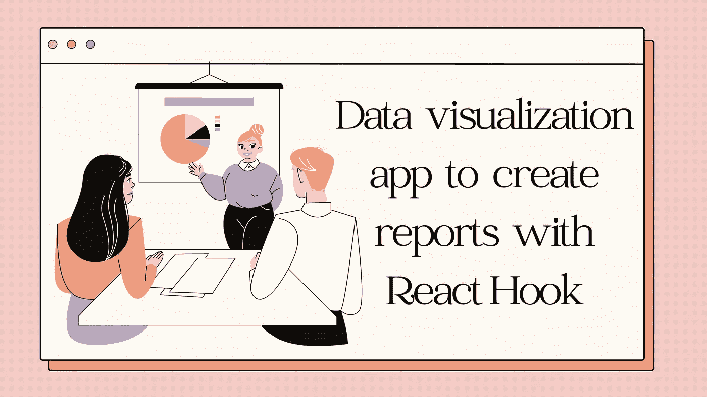
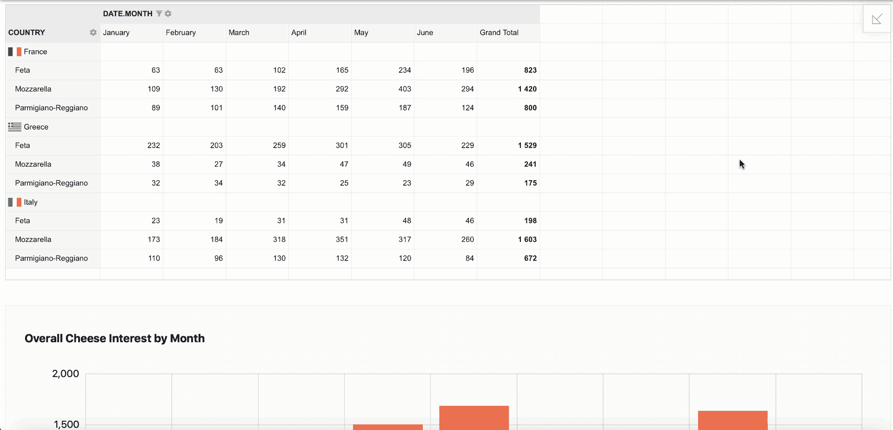
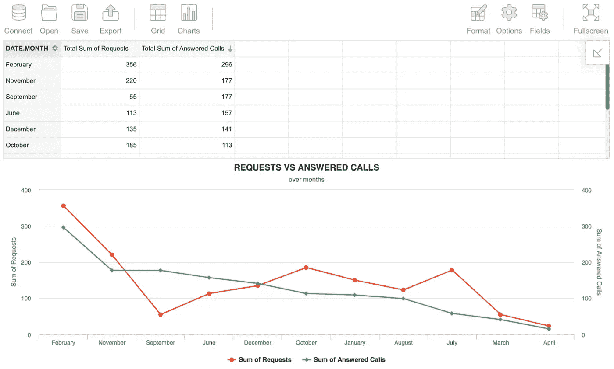

# 构建一个数据可视化应用程序，使用 React Hook 创建报告

> 原文：<https://javascript.plainenglish.io/build-a-data-visualization-app-to-create-reports-with-react-hook-c1230c23d92b?source=collection_archive---------2----------------------->

## 关于如何使用 React 从零开始构建一个用于简单报告和快速数据分析的应用程序的教程。



所以最近我一直在做我的小型大学 React 项目——一个用于简单报告和快速数据分析的应用程序。这就是为什么我搜索了大量不同的 JavaScript 工具和组件，这些工具和组件很容易与 React 集成，并能为我提供所有必要的功能。

经过几天的调查和比较 20 多个不同的数据可视化库，我终于找到了我的完美匹配。我花了不到一个小时的时间安装和连接了所有的东西。

以下是我的工作成果和我点击几下就能得到的报告:



因此，在本教程中，我想向您展示创建这样一个报告仪表板的完整过程，以便您可以重复它，并花费尽可能少的时间将这样的东西嵌入到您的项目中。

# 要使用的数据可视化库

我的报告的基础是一个表格，理想的是一个**数据透视表**。它必须在连接和配置上非常简单，因为我没有太多的时间，但这个项目必须高质量地完成。下一个需求是易用性和功能性。最后，最重要的是与 React 挂钩的良好集成。

完全符合我要求的工具是 [Flexmonster 透视表&图表](https://www.flexmonster.com/?r=qc)。此外，在他们的文档中，我发现了一些与图表的集成。该工具实际上有自己的内置图表，但为了获得更广泛的功能，您可以将它与您需要的任何其他 JS 图表库集成。我一直想尝试一下[high charts](https://www.highcharts.com/?r=qc)library，所以我决定现在正是时候。

我想要的仪表板应该是这样的:



# 如何使用 React 挂钩创建报告仪表板

## 第一步。创建 React 应用

如果你已经有了应用程序的基础，跳过这一步。否则，您运行这两个命令并得到它:

```
npx create-react-app my-appcd my-app
```

## 第二步。安装 Flexmonster

通过运行以下 CLI 命令，从包含 package.json 的文件夹中添加 *react-flexmonster* 包作为 npm 依赖项:

```
flexmonster add react-flexmonster
```

它将把 *react-flexmonster* 包安装到 *node_modules/ folder* 中。

## 第三步。设置网格样式

向 Flexmonster 表格样式的 *index.js* 添加以下导入语句:

```
import ‘flexmonster/flexmonster.css’;
```

## 第四步。导入组件

要将 Flexmonster Pivot 与 React 挂钩一起使用，我们需要将 *FlexmonsterReact* 作为类组件导入:

```
import * as FlexmonsterReact from ‘react-flexmonster’;
```

此外，您还需要导入图表库和连接器:

```
import ‘flexmonster/lib/flexmonster.highcharts.js’;import Highcharts from ‘highcharts’;
```

## 第五步。嵌入数据透视表和图表

现在，您可以将 Flexmonster 嵌入到 React Hooks 组件中，管理数据源并配置切片，切片将显示在网格上:

```
import React from 'react';import * as FlexmonsterReact from 'react-flexmonster';function PivotTableHooks (props) {const ref = React.useRef();const onReportComplete = () => {this.myRef.current.flexmonster.off(this.reportComplete);//creating charts after Flexmonster instance is launchedthis.createChart();}return <><div className="App"><FlexmonsterReact.Pivotref={ref}toolbar={true}width="100%"report="https://cdn.flexmonster.com/reports/report.json"reportcomplete={onReportComplete}/><div className="chart-container"><div id="highcharts-container"></div> //creating a charts container</div></div></>;}export default PivotTableHooks;
```

## 第六步。嵌入高图表

让我们添加一个函数，该函数将在数据上添加图表，数据透视网格通过该函数:

```
createChart = () => {//Running Flexmonster's getData method for Highchartsthis.myRef.current.flexmonster.highcharts.getData({type: "line"},function (data) {Highcharts.chart('highcharts-container', data);},function (data) {Highcharts.chart('highcharts-container', data);});}
```

# 结论

这就是要遵循的全部 6 个步骤，获得一个易于使用的带有分析仪表板的报告应用程序。正如您所看到的，这两种产品配合得很好:透视网格传递聚合数据，图表显示聚合数据。网格上的所有更改都会应用到图表上，以查看数据是如何动态可视化的。通过工具栏，您可以连接不同的数据源并更改切片或布局。

是的，这两个工具只在非商业用途上是免费的，但这正是我想测试它们的确切原因！找出更多关于他们的特点，并决定他们是否真的值得花钱购买。所以你可以把这个教程看做产品概述，自己决定用不用。因为有一些免费的更简单的选项可供选择:比如 [PivotTable.js](https://github.com/nicolaskruchten/pivottable) 、 [Google Charts](https://developers.google.com/chart) 和 [WebDataRocks](https://www.webdatarocks.com/?r=qc) 。

如果本教程对您有所帮助，我会很高兴听到您对这种集成的反馈和想法。

*更多内容看* [***说白了就是 io***](https://plainenglish.io/) *。报名参加我们的* [***免费周报***](http://newsletter.plainenglish.io/) *。关注我们关于*[***Twitter***](https://twitter.com/inPlainEngHQ)*和*[***LinkedIn***](https://www.linkedin.com/company/inplainenglish/)*。加入我们的* [***社区***](https://discord.gg/GtDtUAvyhW) *。*