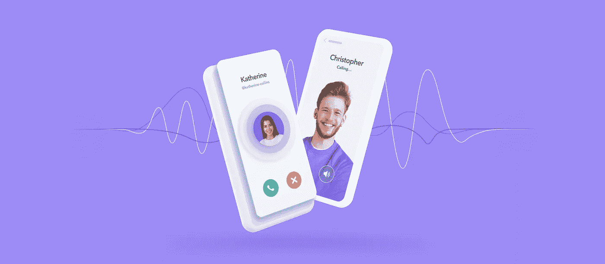
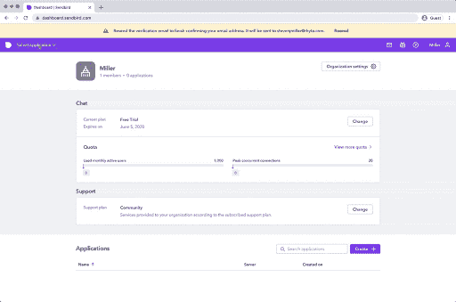
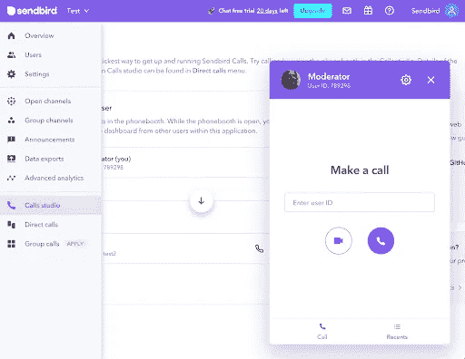
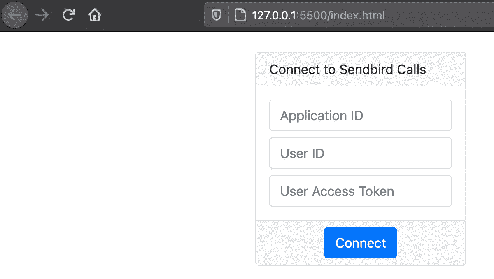
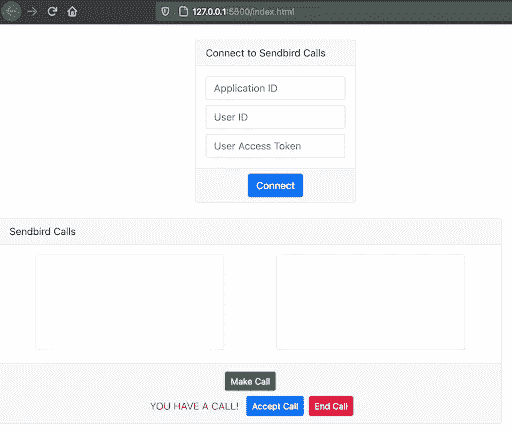
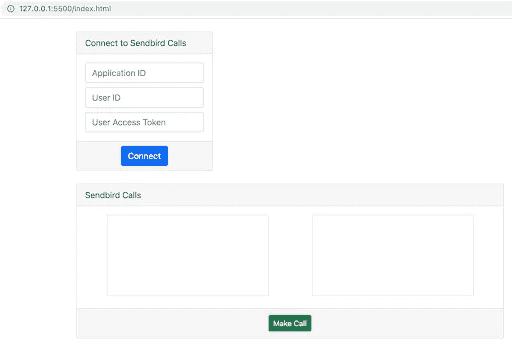

# 使用 Sendbird 调用构建一个 JavaScript 视频聊天应用程序

> 原文：<https://javascript.plainenglish.io/build-a-javascript-video-chat-app-with-sendbird-calls-f8d7a5797d55?source=collection_archive---------23----------------------->

## 关于如何使用 Sendbird JavaScript calls SDK 构建应用内视频通话的分步教程

由亚历克斯·奥尔
解决方案工程师| [森伯德](https://www.sendbird.com)

© Sendbird 2022

*您可能会发现查看 Sendbird 调用* [*示例代码*](https://github.com/warodri-sendbird/js-calls) *很有用。如果您需要更多指导，请阅读我们的* [*文档*](https://sendbird.com/docs/calls/v1/javascript/quickstart/make-first-call) *。更多关于 Sendbird 调用的信息，请参见* [*本页*](https://sendbird.com/features/voice-and-video) *。*

在我们的 [*开发者门户*](https://sendbird.com/developer) *上，你可以找到大量关于用 Sendbird 构建的教程。查看我们为 iOS、Android、JavaScript 等构建应用内聊天和通话的教程！*

# 介绍

这是用 JavaScript 构建应用内视频通话的两部分指南。第 1 部分展示了如何在 Sendbird 中设置调用，[第二部分](https://sendbird.com/developer/tutorials/screen-sharing-javascript)展示了如何在对实现进行最小改动的情况下实现屏幕共享功能。

# 步骤 1:创建一个 Sendbird 帐户

1.注册一个免费的 Sendbird 帐户。
2。使用您的电子邮件地址创建一个帐户，或者选择“继续使用 Google”。
3。通过输入“组织名称”和“电话号码”来设置您的组织。
4。在离您所在地最近的地区创建一个新的“聊天+通话”应用程序。

在屏幕的左侧，您应该会看到一个“通话”菜单。进入“工作室”并创建一个新的“电话亭”用户。

定义要调用的用户 ID。版主的 ID 将是 **789298** 。

Figure 1\. Sendbird Dashboard with Call Studio

# 第二步。创建新项目

让我们从创建一个空文件夹并添加以下文件开始:

*   **Index.html**
*   **index.js**

## Index.html

该文件包含两个部分:

**登录部分**:在这里您将输入您的 Sendbird 应用程序 ID 和用户信息。
**视频部分**:连接后，会出现两个视频元素，以及其他按钮，如拨打电话、结束通话、呼叫用户、停止共享。

## 导入库

这个项目唯一使用的库是`sendbird-calls`。我将使用 NPM 导入它。

我将通过运行下面的命令创建一个默认的 **package.json** 文件:`npm init -y`。

这将在您的文件夹中创建一个新文件。接下来，下载 Sendbird 调用并运行:

`npm install sendbird-calls`

等待下载。然后，对于您的 **package.json** 文件，您应该会看到类似下面这样的内容。

请注意，您的 Sendbird 库的这个版本(1.5.4)可能会更高。

打开你的**index.html**文件并包含这个库:

可选地，我将包括一些样式的引导。请注意，这不是必需的。

# 第 3 部分:创建 UI

## 关系

在您的**index.html**文件的标签内，添加用于输入您的 Sendbird 应用程序 ID、用户 ID(以及访问令牌，如果需要的话)的元素。添加一个 **Connect** 按钮，用于在 Javascript 中调用我们的函数。

您可以通过几种方式在浏览器中快速运行它。如果您使用的是 VSCode，那么 Live Server 插件是使这变得容易的一种方式。如果在浏览器中打开它，您应该能够看到以下结果:

Image 1.1 — Connection card

接下来，我将添加显示两个视频元素(本地和远程)的部分。本地视频显示您的图像并传输您的音频，而远程视频播放其他用户的媒体。为了避免混淆，请将自己静音。

如果您在浏览器中运行该程序，您应该会看到如下内容:

Figure 1.2 — Video area with all visible buttons

如您所见，按钮是不可见的。我将在 **index.js** 文件中应用登录，以便在适当的时候显示它们。让我们把它们都藏起来，除了打电话。检查是否使用了额外的`style=”display:none”`。

用这个新代码替换上面的代码:

如果刷新浏览器，您应该会看到类似这样的内容:

Figure 1.3 — Buttons hidden

这就是视图部分所需的全部内容。现在让我们跳到 Javascript 代码。在同一个文件夹中创建一个 **index.js** 文件。

在您的**index.html**文件中，就在结束标记之前，添加下面一行:

# 第 4 部分:实现

## 索引. js

该文件包含连接到 Sendbird、发出、接收和结束呼叫的所有 Javascript 逻辑。它还包含屏幕共享的逻辑。

## 全局变量

我们将有一个全局变量叫做`currentCall`。一旦建立，它将保持当前呼叫。

## 连接到 Sendbird

接下来，创建连接到 Sendbird 的函数。

1.  `Init` Sendbird 调用并验证您的应用程序 ID。
2.  请求浏览器允许传输音频和视频。将向用户显示一个弹出窗口。他们必须批准。
3.  在 Sendbird 平台上授权用户。

请求浏览器许可很简单:

授权用户使用 Sendbird 对于在我们的数据库中验证他们是至关重要的:

最后一步是连接到 Sendbird WebSocket。如果不这样做，您就不能拨打或接听电话。

现在您可以拨打和接听电话了！

## 打电话

在屏幕共享之前，您需要有一个连接的呼叫。为此，让我们添加以下函数:

1.  我们使用提示功能询问用户我们想要调用的`user_id`。它是 Javascript 自带的，您可以使用自己的实现。
2.  一旦我们有了目的地`user_id`，我们就可以设置拨号参数。(请注意，您必须定义您将在通话中使用哪些视频元素。)
3.  接下来，我们进行调用，即使用`SendbirdCall.dial`，并将这些参数发送到服务器。
4.  创建了一些监听器函数:
    a) `onEstablished`:它在与远程用户建立呼叫时运行您的逻辑。
    b) `onConnected`:当呼叫与远程用户连接(尚未建立)时，它运行您的逻辑。
    c) `onEnded`:通话结束时运行你的逻辑。当远程用户改变他们的音频设置时，它运行你的逻辑。当远程用户改变他们的视频设置时，它运行你的逻辑。

要了解更多信息，请查看我们的 [**官方文档**](https://sendbird.com/docs/calls/v1/javascript/getting-started/make-first-call#2-step-4-make-a-call) 。

## 测试呼叫

为了能够测试呼叫，您可以使用 Sendbird 仪表板。从你的通话工作室，你有机会打开你的电话亭，并呼吁主持人用户。版主的用户 ID 通常是一个数字。在这里，我的版主用户 ID 是 **789298。**

Figure 2 — Sendbird Dashboard with Calls Studio and open Phonebooth

## 接听电话

如果您想使用另一个客户端应用程序而不是我们的 Sendbird 仪表板来测试这一点，您需要实现接收呼叫的功能。

更新您的`waitForCalls() { … }`功能:

你只需要添加一个我们提供的监听器。这个监听器包含几个由 SDK 自动调用的函数:

*   `onRinging`:当接到一个尚未接听的电话时调用。
*   `onConnected`:接受呼叫时调用。
*   `onEstablished`:一旦通话双方接受通话，则调用。
*   `onEnded`:呼叫因任何原因结束时调用。

# 结论

这就是全部代价！祝贺您拨打了第一个电话！本指南介绍了如何在仪表板上创建新的应用程序、创建用户以及创建能够拨打和接听视频电话的示例应用程序。

正如开头提到的，这是一个由两部分组成的指南；查看我们的下一部分，展示如何实现屏幕共享！

快乐呼叫大楼！👨‍💻

*我们的* [*开发者门户*](https://sendbird.com/developer) *拥有丰富的关于如何构建应用内聊天和通话体验的资源。查看门户网站，了解更多关于 Sendbird 的教程、技巧和窍门！*

# 资源和有用的链接

1.  [开发者门户](https://sendbird.com/developer)
2.  JavaScript [文档](https://sendbird.com/docs/calls/v1/javascript/quickstart/make-first-call)
3.  关于 [Sendbird 调用](https://sendbird.com/features/voice-and-video)的详细信息
4.  GitHub 上的[样本代码](https://github.com/warodri-sendbird/js-calls)

*更多内容请看* [***说白了就是***](https://plainenglish.io/) *。报名参加我们的* [***免费每周简讯***](http://newsletter.plainenglish.io/) *。关注我们*[***Twitter***](https://twitter.com/inPlainEngHQ)*和**[***LinkedIn***](https://www.linkedin.com/company/inplainenglish/)*。加入我们的* [***社区不和谐***](https://discord.gg/GtDtUAvyhW) *。**