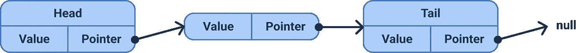

# 用 TypeScript 构建一个链表

> 原文：<https://javascript.plainenglish.io/build-a-linked-list-in-typescript-78a4414d140e?source=collection_archive---------4----------------------->

## 数据结构系列:用 TypeScript 实现链表

在本文中，我想谈谈作为 TypeScript 中的数据结构的链表。这是我的关于介质的数据结构系列的第一篇文章。

对了，我已经把这个项目上传到 [Github](https://github.com/hellokvn/linked-list-in-typescript) 上了。

Photo by [Paico Oficial](https://unsplash.com/@paicooficial?utm_source=medium&utm_medium=referral) on [Unsplash](https://unsplash.com?utm_source=medium&utm_medium=referral)

# 什么是链表？

顾名思义，这是一个链接的列表。考虑一个数组。数组是只保存值的列表。链表不仅为每个节点保存一个值，还保存一个指向下一个节点的指针。

所以一个链表包含了一组节点的**。这些节点有两个元素。保存您想要存储的数据的**值**，例如，一个字符串甚至一个对象。以及指向/链接到列表的下一个节点的**指针**。第一个节点称为**头**，而最后一个节点称为**尾**。另外，你需要知道的是，一个链表通常是一个动态的数据结构，这意味着它的大小可以增长或收缩。**

实际上，有两种不同的链表。一个单链表和一个双向链表。正如你可能猜到的，在这篇文章中，我们讨论了一个单一的链表，我将简单地称之为链表。双向链表的区别在于，它的节点甚至指向前一个节点。

我做了一个简单的单链表图:

## 主要方法和时间复杂性

链表有四个主要功能:入队、出队、查看和 isEmpty。

*   **追加:**在开头添加一个新节点— O(1)
*   **前置:**在末尾添加一个新节点— O(1)
*   **shift:** 获取并删除第一个节点— O(1)
*   **pop:** 获取并删除最后一个节点——O(1)
*   **获取:**根据节点的索引 O(n)获取节点
*   **设置:**通过索引 O(n)设置节点的值
*   **插入:**在特定位置添加一个新节点— O(n)
*   **删除:**删除特定位置的节点— O(n)

## 次要方法

除了主要方法之外，还可以有更多的方法，如反向、拼接等。但是我们今天想把重点放在它的主要方法上。

# 代码片段

下面是代码片段。记住，我已经在 Github 上上传了实际的项目和测试。

感谢您阅读我关于 TypeScript 中的链表的文章。我希望，你可以学到一些新的东西，或者至少我可以刷新你的知识。

干杯

我希望你喜欢读这篇文章。如果你愿意支持我成为一名作家，考虑注册[成为一名媒体成员](https://medium.com/@hellokevinvogel/membership)。每月只需 5 美元，你就可以无限制地使用 Medium。

想支持我？[给我买杯咖啡。](https://www.buymeacoffee.com/hellokevinvogel)

# 接下来阅读

 [## 打字稿中的坚实原则

### TypeScript 对用 JavaScript 编写干净的代码产生了巨大的影响。但是总有办法…

blog.bitsrc.io](https://blog.bitsrc.io/solid-principles-in-typescript-153e6923ffdb)  [## Node.js 事件循环:不是单线程的

### Node.js、事件循环和多线程

blog.bitsrc.io](https://blog.bitsrc.io/node-js-event-loop-and-multi-threading-e42e5fd16a77)  [## TypeScript 中的面向对象编程(OOP)

### TypeScript 对 JavaScript 中面向对象编程的实现有很大的影响。今天，我想谈谈…

blog.devgenius.io](https://blog.devgenius.io/object-orientated-programming-oop-in-typescript-c1066941f5ee)  [## 用 NestJS (2022)在 TypeScript 中构建一个简单的 API

### 如何在 TypeScript 中构建 NestJS API 的简要指南

blog.bitsrc.io](https://blog.bitsrc.io/how-to-build-a-simple-api-in-typescript-with-nest-js-876386b29753) 

*更多内容看* [***说白了就是***](https://plainenglish.io/) *。报名参加我们的* [***免费周报***](http://newsletter.plainenglish.io/) *。关注我们关于*[***Twitter***](https://twitter.com/inPlainEngHQ)*和*[***LinkedIn***](https://www.linkedin.com/company/inplainenglish/)*。加入我们的* [***社区***](https://discord.gg/GtDtUAvyhW) *。*