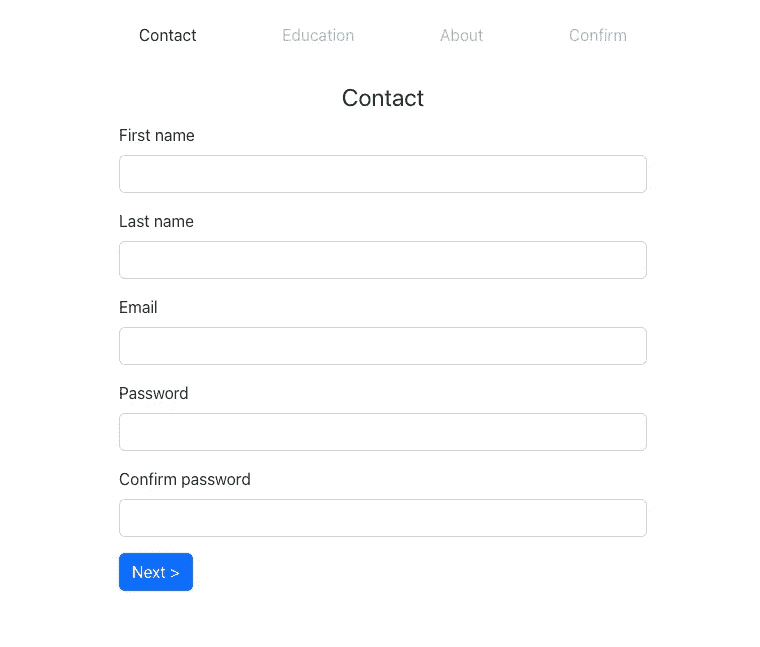

# 使用 React 钩子子程构建多步窗体

> 原文：<https://javascript.plainenglish.io/build-a-multistep-form-with-react-hook-form-24f9398dc049?source=collection_archive---------1----------------------->

## 如何使用 React Hook Form 构建多步窗体的教程。

多步窗体也称为向导或漏斗窗体，用途广泛。当将不同类型的信息收集到一个数据结构中时，它们是最常见的，但是对于将非常大的表单分解成对用户来说不太可怕的多步骤过程也很有用。多步骤表单的一些最流行的例子是结帐和用户注册表单。

在这篇文章中，我们将构建一个基本的多步注册表单，它收集用户的信息，然后在确认视图中显示，在提交之前可以查看和编辑。需要注意的是，表单被大大简化了，在实际应用中可能会有更多的字段，但是，为了更容易理解，我们将保持它的简单性。此外，重点是 JS 部分，适当的表单样式超出了本教程的范围。最终的表单看起来是这样的(也有 [CodeSandbox](https://codesandbox.io/s/hopeful-goldwasser-kmfb01) 可用):

# 选择表单结构

使用多步表单时，最困难也是最重要的事情之一是决定它们的结构。最终的选择取决于项目需求和表单应该做什么。第一种选择通常是使用一个表单组件，在其中呈现一个活动步骤。在本教程中，我们将使用不同的方法——每个步骤组件将是一个单独的表单，从其字段中收集数据并在提交时将其发送到中央存储。通过这种方式，我们实现了关注点的良好分离，从而更容易适应未来的需求变化。对于表单逻辑，我们将使用 [React Hook Form](https://react-hook-form.com/) ，这使得处理表单更加容易。对于中央存储，我们将使用 [React context](https://reactjs.org/docs/context.html) ，尽管对于更复杂的情况，单独的状态管理库(例如 [Redux](https://github.com/reduxjs/redux) )可能更合适。最后，每个表单步骤都有自己的路径，为此我们将使用 [React Router](https://reactrouter.com/en/main) 。

总结一下，应用程序流程如下:

*   每个步骤都是一个单独的表单，有自己的处理程序和本地状态。
*   按下`Next`将当前步骤的数据提交到集中存储，并重定向到下一步的路由。
*   在最后一步，所有的数据都会显示出来，用户可以在提交之前编辑任何步骤。

# 安装

如前所述，我们使用上下文来保持步骤之间的状态，稍后在提交之前在预览中显示表单数据。为了更容易使用，我们将上下文提供者和消费者抽象到一个单独的文件中。

这里我们创建一个`AppProvider`，它处理应用程序状态和相关逻辑，以及一个定制钩子`useAppState`。有了这个抽象，我们不需要将`AppStateContext`导入到每个组件中。此外，我们可以验证调用这个钩子的组件是在`AppProvider`内部使用的。

接下来，我们将路线添加到应用程序中，并为表单步骤创建组件，将所有这些包装到`AppProvider`中。

之后，让我们为每一步设置组件。因为它们都是表单组件，所以每个组件的代码都非常相似。为了抽象一些重复的功能，我们创建了一个单独的`Field`组件:

该组件还处理错误消息，并额外设置标签的`htmlFor`属性以匹配子输入的 id，从而使输入可以正确访问。我们只需要确保输入有一个 id。我们还将抽象出`Form`、`Input`和`Button`组件的逻辑，尽管它们只是应用了定制样式的原生 HTML 元素的包装器。

现在我们可以开始为每一步创建实际的组件。他们故意简单，否则，很容易迷失在所有的细节和边缘案例中。该表格有 4 个步骤:

1.  联系人—获取基本用户信息—姓名、电子邮件和密码
2.  教育——假设我们的表单被用于某种教育或职业网站，我们想知道用户的教育详细信息。
3.  关于—带有自由文本字段的步骤，供用户提供关于他们自己的更详细信息。
4.  确认—此步骤不用于输入详细信息，而是用于预览和编辑(如有必要)。

此外，第一步中的所有字段都是必需的，并且有一个基本的验证，以显示在 React Hook 表单中通常是如何完成的。

React Hook Form 在内部处理表单状态，所以我们需要做的就是在它被验证后将其保存到我们的应用程序状态。

最后一步 Confirm 略有不同，因为我们需要显示用户输入的数据。我们将添加几个 section 组件，然后组合它们来构建数据表示。

我们可以更进一步进行抽象，将显示的数据收集到一个单独的结构中，然后对其进行迭代和呈现。然而，当我们得到新的需求时，代码变得如此枯燥可能会有问题，因为代码不够健壮来适应新的需求。要记住的一条重要规则是，干燥代码比不干燥代码要容易得多。

# 添加步骤指示器

该表单虽然样式不多，但功能强大，我们可以通过填写所有细节并提交来确认这一点。目前的情况是，用户不清楚总共有多少步骤，以及他们目前在流程中的位置。这不是一个好的 UX，它让多步式比实际情况更吓人。我们将通过添加一个步进指示器来解决这个问题。`Stepper`组件基本上是表单的导航，但是链接被禁用:

现在，我们可以将此组件添加到应用程序中:

有了这个改变，我们就有了一个带进度指示器的完整的多步骤表单。

# 改进的途径

本教程中的表单示例非常简单明了。这里可以做几个不同的改进，其中一些将在以后的教程中讨论。几个最明显的改进例子是:

*   步骤指示器大大改进了 UX，然而，一旦用户返回到一个步骤进行编辑，他们需要点击`Next`直到到达最后一步。这很烦人，尤其是在进行第一步的时候。为了帮助这一点，我们可以通过步进器启用导航。
*   如果我们通过步进器启用导航，我们还需要在通过步进器导航时保存表单状态，以确保不会绕过字段验证。
*   或者，我们可以对必需的表单字段禁用验证，并在 stepper 中显示每个步骤的状态(如果缺少任何必需的数据)。当我们允许将部分数据保存为草稿时，这很有帮助。
*   目前，如果用户输入一些数据并决定离开表单，他们会丢失所有的进度。当这种导航被错误地完成时，这就成为一个问题。在这种情况下，我们可以添加一个提示，要求用户确认他们是否想要移动到另一个页面并丢失他们所有的进度。

前两个改进及其实现将在[的下一篇文章](/build-a-multistep-form-with-react-hook-form-24f9398dc049)中讨论。

# 测试表单

尽管多步表单似乎比通常的单页表单更复杂，但是这里的测试方法是相同的。我的首选方法是用基本用户流分别测试每个步骤组件——填写字段，测试它们是否经过验证，并验证提交时发送了正确的数据。从用户的角度考虑测试会使它变得更容易。我以前写过关于表单测试的文章，其中大部分也适用于这里。

【https://claritydev.net】最初发表于**。**

**更多内容看* [***说白了。报名参加我们的***](https://plainenglish.io/) **[***免费周报***](http://newsletter.plainenglish.io/) *。关注我们关于*[***Twitter***](https://twitter.com/inPlainEngHQ)，[***LinkedIn***](https://www.linkedin.com/company/inplainenglish/)*，*[***YouTube***](https://www.youtube.com/channel/UCtipWUghju290NWcn8jhyAw)*，以及* [***不和***](https://discord.gg/GtDtUAvyhW) *。对增长黑客感兴趣？检查出* [***电路***](https://circuit.ooo/) *。****