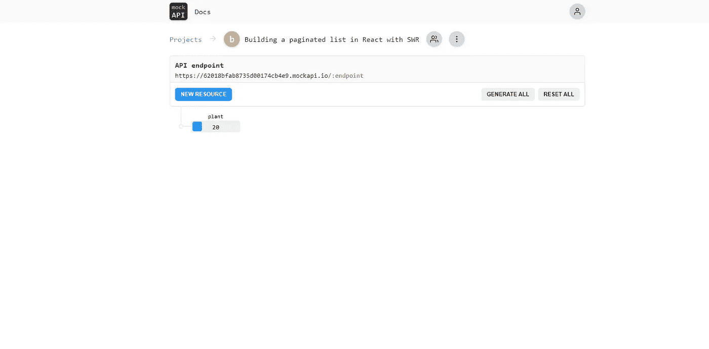
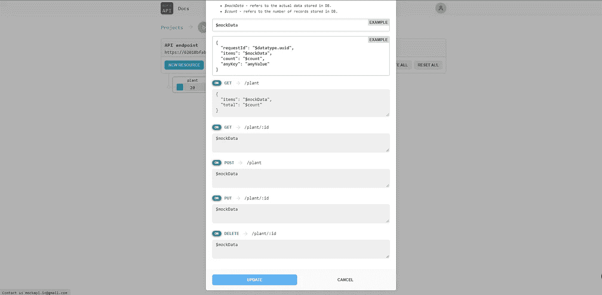
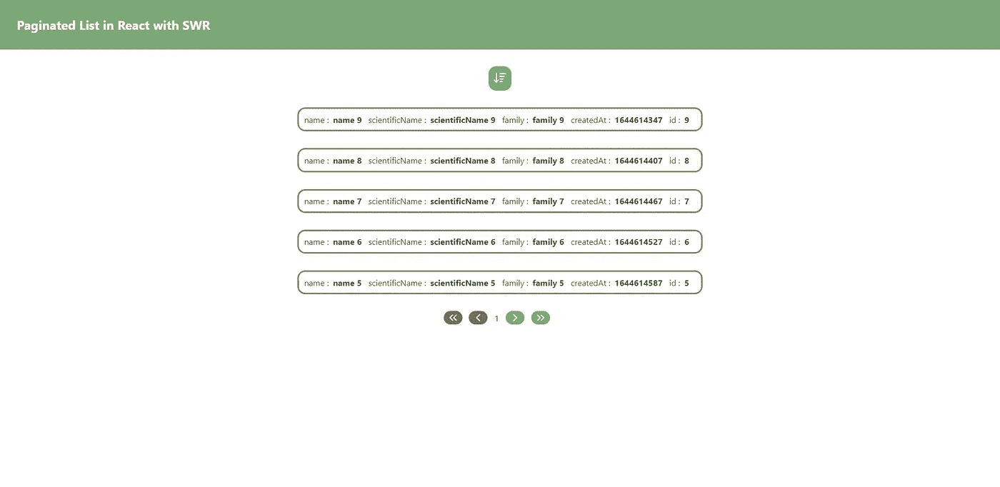

# 学习用 SWR 和样式组件反应分页

> 原文：<https://javascript.plainenglish.io/build-a-paginated-list-in-react-with-swr-and-styled-components-453b50b32a3b?source=collection_archive---------11----------------------->


在之前的一篇博客文章中，我们学习了如何构建带有分页的 API。在这篇博文中，我们将重点讨论如何通过使用 React(目前最流行的 JavaScript 前端框架)构建分页列表来使用这样的 API。

# 项目设置

为了生成项目，我们使用了流行的工具链 **Create React App :**

```
npx create-react-app build-paginated-list-in-react
```

创建项目后，我们使用 npm 安装所需的依赖项:

```
npm i swr axios styled-components
```

Axios 是一个流行的 HTTP 客户端，我们用它来消费 API 和获取分页数据。它是大多数浏览器默认提供的获取 API 的替代品[。](http://browsers.It)它易于使用，并提供开箱即用的有用特性，如自动 JSON 转换或 HTTP 拦截器。

Next.js 背后的公司 Vercel 创建了 SWR，这是一个数据获取库。它提供了一个定制的 React 钩子，具有许多功能和内置优化，并在 https://swr.vercel.app/的[之上有很好的记录。](https://swr.vercel.app/)

Styled Components 是最常用的 CSS-in-JS 样式库。CSS-in-JS 是一种样式技术，其中样式是用 JavaScript 编写的，然后被解析以生成 CSS。如果您不喜欢 CSS-in-JS，那么 React 中还有许多其他方式来样式化组件，比如像 Tailwind 这样的实用程序库、CSS 模块，甚至是普通的 CSS。

出于这个博客的目的，我们使用 mockAPI 作为后端层[https://mockapi.io/docs](https://mockapi.io/docs)。

我们通过声明单个实体并使用默认设置来简化事情:



唯一的修改是为根端点定义响应的 JSON 模板:



我们添加了在构建分页机制时有用的元素总数。

# 建造基地

让我们从构建应用程序的基本元素开始。

第一步是声明应用程序中使用的全局样式:

除了字体，这个文件的目的是声明应用程序中使用的颜色。为此，我们使用 CSS 自定义属性，这样，如果一种颜色需要稍微调整，它将应用于任何地方，而不需要在使用它的每个地方修改颜色。

我们还编辑默认的 App.js 组件:

我们保持布局简单，只有一个包含标题和 PaginatedList 组件的基本标题。

如前所述，我们利用样式组件直接在组件中声明我们的样式。通过这种方式，我们将样式保持在接近它们被使用的地方，这使得 JSX 清晰简洁。

# 构建组件

我们现在可以使用自顶向下的方法来构建组件，根据需要实现组件。

让我们首先创建主要组件，即 PaginatedList 组件:

我们使用 useState 钩子跟踪分页和排序的状态。状态和它们的 setter 函数通过 props 传递给需要它们的组件，但是如果我们希望我们的应用程序变得更加复杂，并且避免像 props drilling 这样的不良做法，我们可以使用上下文甚至全局状态管理库。

我们使用 useSWR 钩子从 MockAPI 获取数据。这个钩子接受一个键和一个 fetcher 函数，这个函数把这个键作为一个参数给出。在我们的例子中，关键只是从端点获取数据的完整 URL，而 fetcher 函数只是简单地获取所提供的 URL，这是使用 Axios 完成的…就是这样！

useSwr 还返回一个 error 对象，仅当来自 fetch 的承诺被拒绝时才定义该对象。我们在这里不处理它，但是我们可以在定义错误时返回一个不同的组件。

使用像 SWR 这样的提取库是很棒的，因为除了提供非常简单的 API 之外，它还提供了方便的特性，可以提高性能和开箱即用的用户体验，比如自动重新验证、错误处理、缓存等等。你可以查看官方文件来了解更多信息[https://swr.vercel.app/docs/getting-started](https://swr.vercel.app/docs/getting-started)。

从 MockAPI 获取数据后，我们将每个获取的工厂映射到一个工厂组件:

我们对工厂的每个属性进行循环，在键旁边显示每个值。我们再次利用样式化组件和 flexbox 来对组件进行样式化。

您可能已经注意到，由于 URL 中的 sortBy 和 order 查询字符串参数，获取的数据被排序。在我们简单的演示应用程序中，作为排序依据的字段是硬编码的，但是我们可以创建一个组件让用户动态设置它。

为了控制列表的顺序，我们定义了一个 SortButton 组件:

订单及其设置者的状态作为道具直接传递给组件。

每次按下按钮时，顺序在降序和升序之间切换。然后，该组件重新呈现以更新图像，从而显示应用于列表的新顺序。

现在让我们来看看分页组件，它控制着与分页相关的一切:

所有必需的状态、设置和参数都作为 props 传递，与前面的组件类似。

我们创建按钮来执行以下操作:

*   转到第一页
*   转到上一页
*   转到下一页
*   转到最后一页

我们利用添加到由 MockAPI 返回的模板中的元素总数来知道何时到达最后一页。

我们还利用样式化的组件属性为所有按钮提供一个基本样式，并根据按钮是否被禁用来改变颜色和光标。

# 把所有的放在一起

现在一切就绪，我们可以开始我们的项目了:

```
npm run start
```

这是最终的结果！



这个博客的项目可以在这里找到[https://github.com/Mozenn/pagination-in-react-with-useSwr](https://github.com/Mozenn/pagination-in-react-with-useSwr)。

*最初发表于*[T5【https://gauthier-cassany.com】](https://gauthier-cassany.com/posts/build-paginated-list-react-swr)*。*

*更多内容看* [***说白了。报名参加我们的***](https://plainenglish.io/) **[***免费周报***](http://newsletter.plainenglish.io/) *。关注我们关于*[***Twitter***](https://twitter.com/inPlainEngHQ)*和*[***LinkedIn***](https://www.linkedin.com/company/inplainenglish/)*。加入我们的* [***社区不和谐***](https://discord.gg/GtDtUAvyhW) *。***