# 在 React 中构建一个强大的可重用框组件

> 原文：<https://javascript.plainenglish.io/build-a-powerful-reusable-box-component-in-react-89f4e0354fa0?source=collection_archive---------2----------------------->

## 不要根据名称来判断 Box 组件

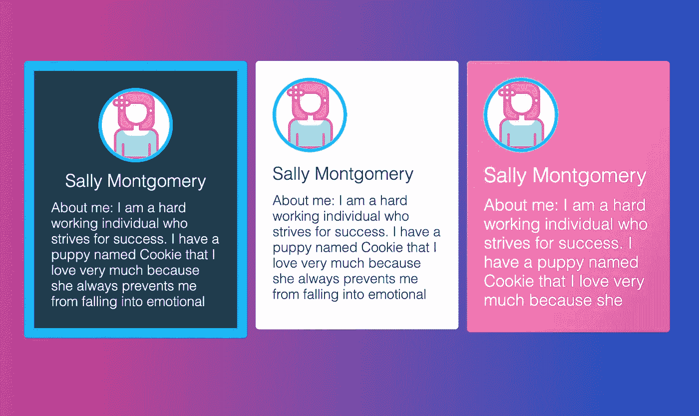

Image credit — jsmanifest

Box 组件是 React 应用程序中使用的最基本但功能强大的组件之一。它们的行为很简单，但这种简单是将更复杂的组件组合在一起的基础，为创建现代用户界面提供了无限的可能性。

在本帖中，我们将在 React 中构建一个强大的可重用框组件，只需在函数中进行一些简单的实现。

# 写基础

我们要做的第一件事是用最少的来定义我们的`Box`组件，如下所示:

这里已经有两个重要的东西可以看了:

1.  我们选择的元素是`div`。这是 DOM 中最基本的元素，每个可重用组件都需要从它开始。默认情况下，它需要一个*完整的块*。如果元素占据了我们需要配置的整个宽度，这将更直观，而不是相反。
2.  我们将*析构* `children`和*手动*应用于我们的`Box`组件。我总是喜欢对*期望子节点*的每个组件都这样做，因为这是一个*清晰的指示*父节点将期望在某个 React 节点中传递。这也是一个最佳实践，这样做比在`props`内部神秘地应用它有更多的好处。这种神秘性违背了 React 的声明性本质。

现在我们可以在我们的`App`组件中使用它:

出于本教程的目的，我们将提前在父组件中传递一些样式，以便我们可以清楚地看到在进行过程中应用了什么:

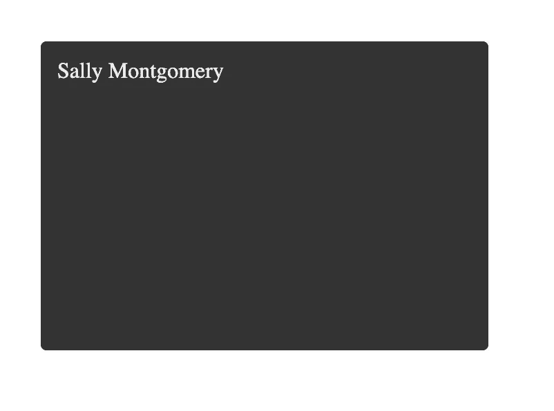

# 作为父母的父母

我们可重用的`Box`组件*可以在这里完成*，但是如果我们想在不降低其当前可重用能力的情况下向其注入更多的能力，我们可以定制我们的`Box`实现来接受更多的道具并处理它们*而不让父组件处理它们*。

有些情况下，父*应该*处理一些道具，但它们应该是*希望*处理它们，比如能够配置上面我们已经有的`style`对象。

在我们的`App`组件中，我们应用了一些风格道具:

我们为什么要这么做？因为如果我们没有我们的`Box`会是这个样子:

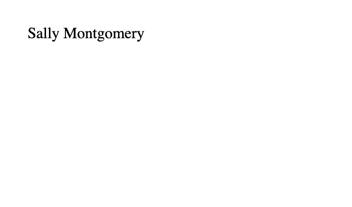

想想吧。导入我们的 Box 组件的每个组件会一直传入`style`吗？最有可能的情况是，他们可以只呈现一个`div`元素。

我们可以允许传递一些样式属性，而不需要父类每次都声明一个`style`对象:

(注意:我添加了额外的道具，我将在这篇文章的后面使用)

这样，我们的组件就不必手动传递整个`style`对象来改变一些样式:

我们还确保在我们的`Box`组件中，我们将`style`道具放在最后，这样每当父组件想要时，它就可以覆盖其他*:*

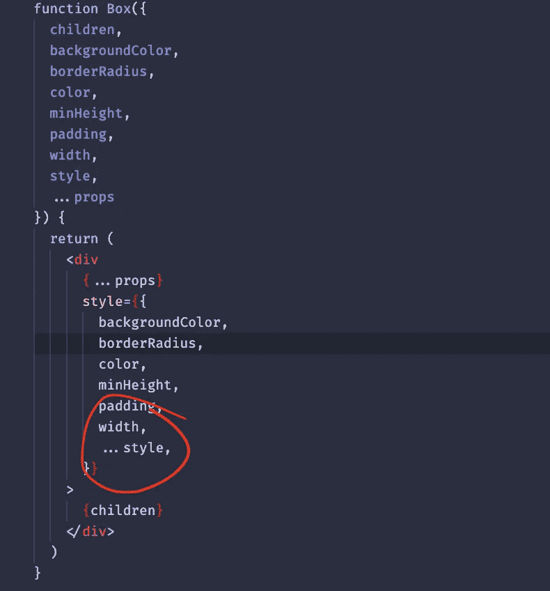

这是一个非常方便的策略，像 [@chakra-ui/react](https://chakra-ui.com/) 这样的流行库就是这样做的，它改善了开发体验(他们已经完全定制了这一点，本文不会这样做，因为这里的重点是引导用户走上那条道路)。

它更快、更容易，减少了代码和样板文件。

让我们使用我们的`Box`组件来创建一个*卡*:

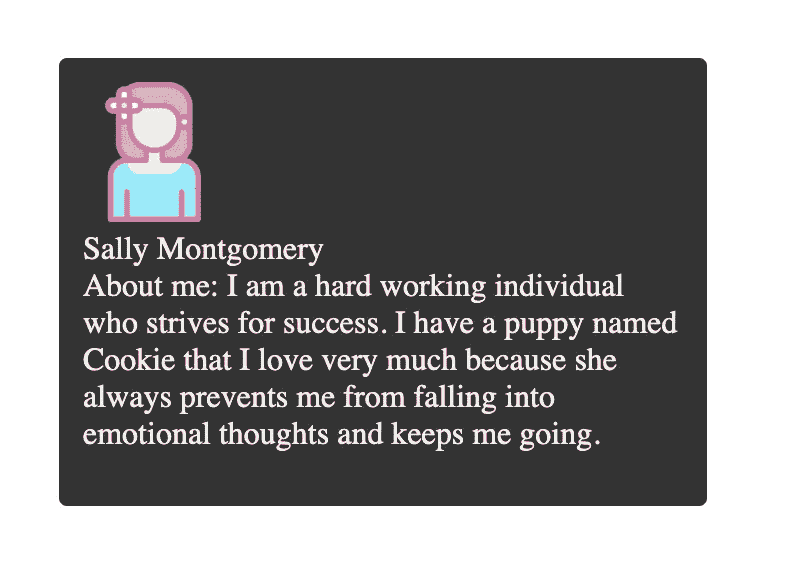

(女头像取自 [Freepik](https://www.flaticon.com/free-icons/brown-hair) )

看起来已经很好了！但是我们需要为我们的女性形象应用一些间距、字体样式和边框，这很容易做到，因为我们在`Box`中做得更容易。

# 多做事，少做事

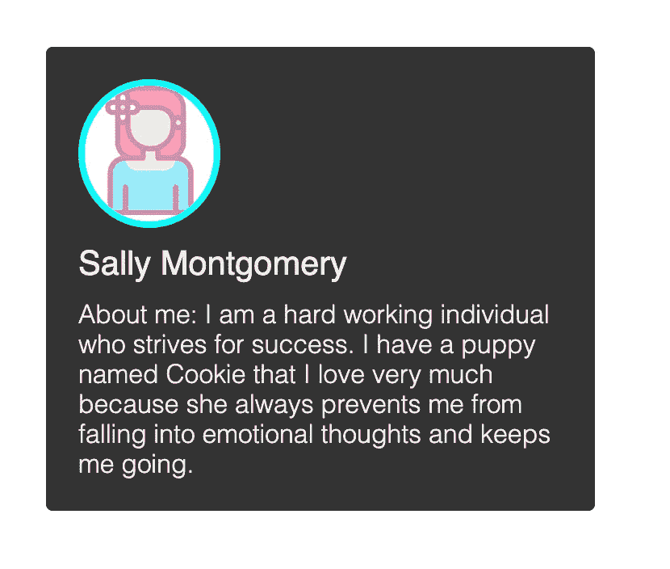

我们可以进一步优化我们的`Box`组件，通过默认它的属性，让父组件更容易使用。每个应用程序都有一组默认的*字体*样式供整个应用程序使用，所以我们将`Box`字体默认为这些属性:

现在我们可以删除`App`中的一些代码，因为默认情况下`Box`会处理它们:

我们的`Box`组件的伟大之处在于，它可以由*组合*来创建*更复杂的可重用*组件。这就是我们的可重用组件*真正*发光的地方，因为它已经抽象了基本的样板文件，所以它们可以在任何地方使用，而不用担心基本的必需品:

# 当样板文件反击时，你的反击会更猛烈

我们今天到此为止。但是如果你仔细观察，我们开始看到`Box`无处不在，所以它最终再次带来了之前写样板代码的问题。

有些 React 库利用了一个强大的策略，我们可以将它用于我们的`Box`组件。我们可以声明一个参数，允许父元素将自定义的 React 元素、元素标记或组件作为属性传入:

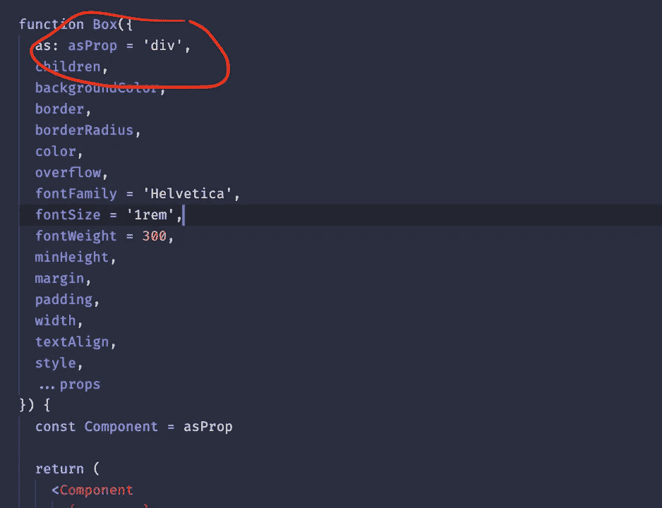

# 资源更少

有了这些，在像我们的`Card`这样的地方使用它会变得很方便:

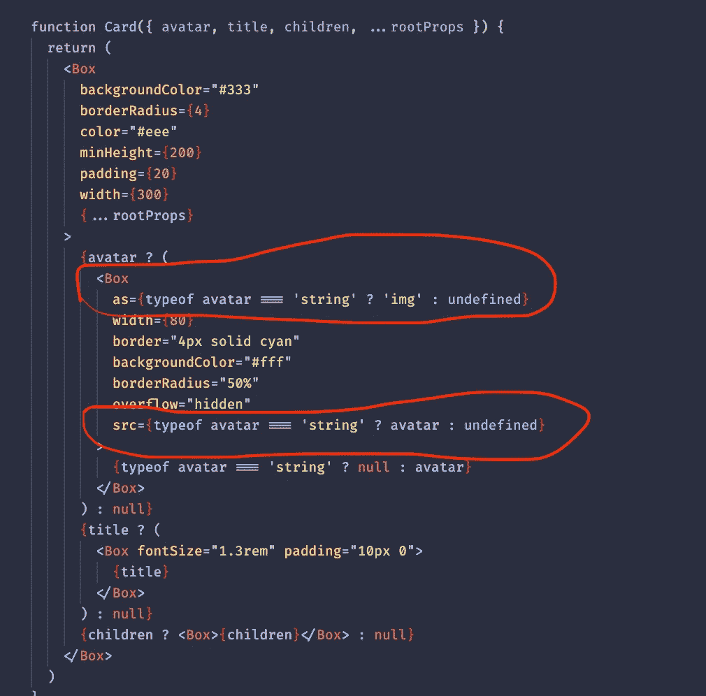

这样做有一个好处:我们减少了一个在虚拟 dom 中创建的组件。在更多组件中广泛使用时，你的 GPU 会感谢你的。

# 助长懒惰

还有一件事。还能让用户以偷懒的方式应用道具。例如下面，当我们渲染我们的头像道具时，因为`Box`可以是一个组件，我们可以直接利用它，像这样超级懒:

# 事先调整

我们可以添加到`Box`的另一个有用的东西是允许对某些道具进行一些“预设”。

例如，我们可以允许将`fontSize`作为`'xl'`、`'lg'`、`'md'`、`'sm'`或`'xs'`传入。如果都没有提供，那么它将只应用提供的值。这进一步推动了`Box`的功能，使其更易于使用:

`Card`组件甚至不需要知道它，只需要转发道具就可以获得它提供的好处。例如，在处理`title`道具时，它可以只接收一个对象并结束一天的工作:

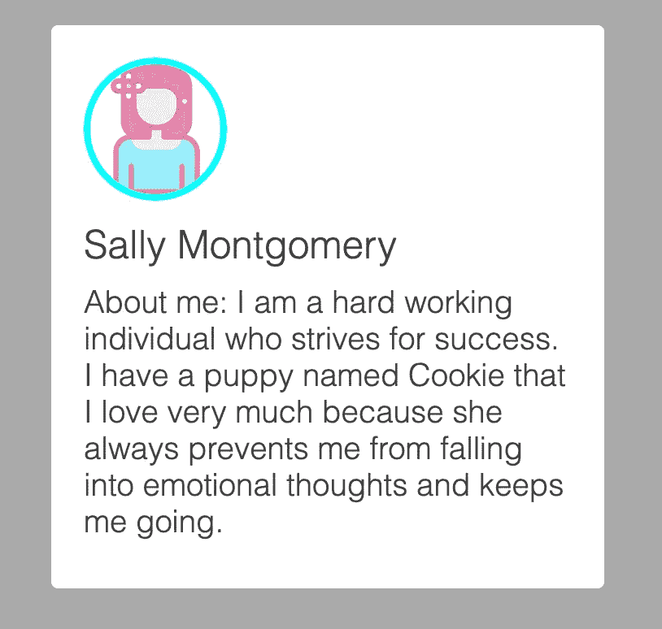

# 将它们放在一起，使其与您的应用程序相结合

这里我想提到的最后一件事是我喜欢为我的应用程序专用的`Box`组件做的事情。创建一个`mode`道具是很有用的，它会根据情况切换样式，从而触发不同的*:*

*结果:*

*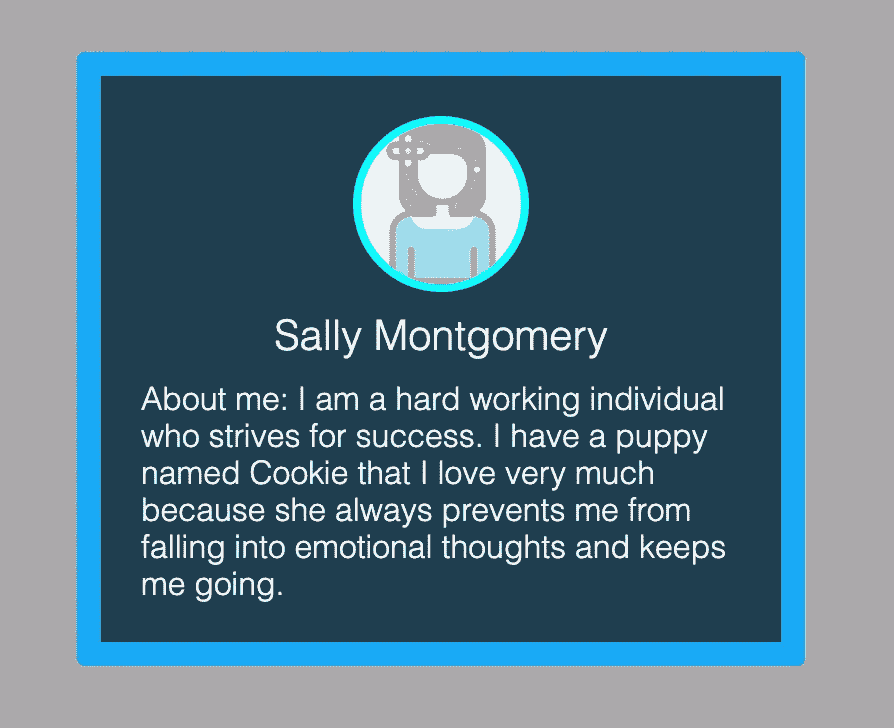*

*结果:*

*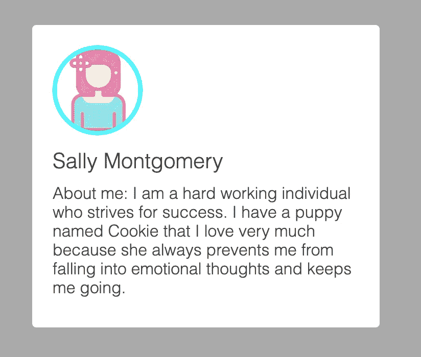*

*当实现定制样式时，最好不要调整任何宽度/高度或任何位置，而是允许父母定制它们。否则，当他们遇到像重叠元素这样的问题时，他们很难将您的`Box`与他们自己的组件结合起来。*

# *结论*

*本帖到此结束！我发现你发现这是有价值的，并期待在未来更多！*

**更多内容请看*[***plain English . io***](https://plainenglish.io/)*。报名参加我们的* [***免费周报***](http://newsletter.plainenglish.io/) *。关注我们关于*[***Twitter***](https://twitter.com/inPlainEngHQ)*和*[***LinkedIn***](https://www.linkedin.com/company/inplainenglish/)*。加入我们的* [***社区不和谐***](https://discord.gg/GtDtUAvyhW) *。**