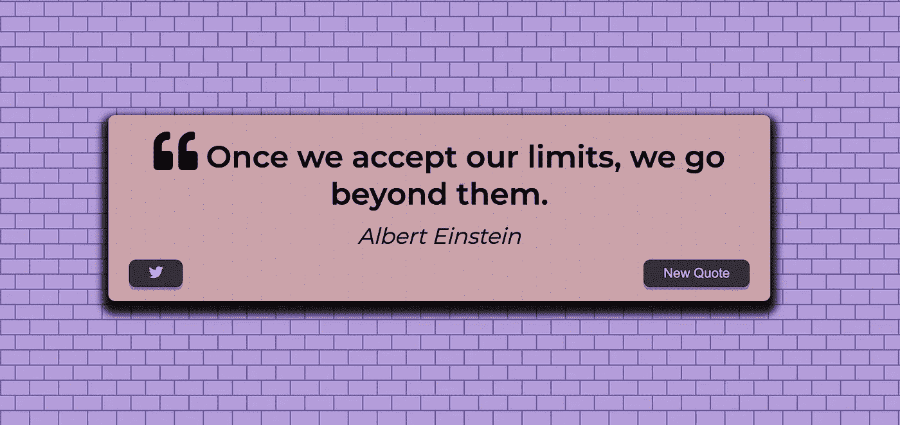

# 使用 JavaScript 构建报价生成器

> 原文：<https://javascript.plainenglish.io/build-a-quote-generator-using-javascript-3c88210f4619?source=collection_archive---------8----------------------->

## 关于如何使用 JavaScript 构建报价生成器的教程。

作为我们周末教程的一部分，这次我们将使用 JavaScript 构建一个报价生成器。在我们实现它之前，让我们看一下我们将制作的最终版本:



*Quote Generator*

这个报价生成器应用程序具有以下特性:

1.  点击生成报价的按钮
2.  一个 Twitter 按钮，点击后将引用放到 Twitter 上

# 项目目录结构

```
|-- quote-generator
| |-- css
| | |-- style.css
| |-- js
| | |-- main.js
| |-- index.html
```

在本地机器上创建了上述目录之后，请按照下面的步骤操作。

# 报价生成器实施

让我们首先实现 index.html 代码。

# index.html

index.html

在上述 HTML 文件的开头，我们包含了特定于报价的 CSS 和字体牛逼图标 CSS(这是针对报价和 Twitter 图标的)。

在 HTML 的主体中，添加了一个 quote-container div，它将保存引用的内容、引用作者、Twitter 按钮和 New Quote 按钮。

单击 New Quote 按钮，将通过 AJAX 请求生成下一个报价，其代码被写入 main.js 文件，该文件已被添加到 HTML 文件主体的底部。

# style.css

style.css

我们使用的是添加在 CSS 文件顶部的 Montserrat google 字体。主体中的引用容器 div 使用 flex 居中。

其余的 CSS 代码是不言自明的。

# 主页. js

main.js

上面的代码是用普通的 javascript 编写的。让我详细解释一下每个功能——

## 推特报价

该功能负责在 Twitter 上发布报价。它调用带有引用文本和引用作者的 [tweeter intent API](https://developer.twitter.com/en/docs/twitter-for-websites/tweet-button/overview) 作为查询参数。

## 提取报价

这是一个异步函数，负责获取报价并返回报价承诺。

Click listener 绑定在 Twitter 按钮和 New Quote 按钮上，分别调用上述函数。

# 挑战

要显示新报价按钮点击下一个报价，我们需要有报价列表，否则 UX 将非常糟糕。现在，一旦收到 API 响应，即报价可用，您会想要存储它，以避免一次点击按钮就一次又一次地点击 API。

*储存回应是没有必要的，是的，你没听错！*

要解决上述问题，而不需要在每次点击按钮时发出请求，我们可以缓存承诺。

*承诺是有状态的，一旦兑现，它的价值就不能改变。你可以用。然后()多次来获取它的内容，每次都会得到相同的结果。*

那么，通过 quotesPromise .我们将每次都获得报价列表，在那里我们随机选择一个显示在报价容器上的报价。

这就是本教程的全部内容。如果你喜欢这篇文章，请分享给你的朋友和社区。

学习数据结构？阅读我的另一篇文章— [如何实现堆栈并以 JavaScript 将其反转？](https://medium.com/@ajayverma_5579/reverse-stack-using-javascript-393592d96484)

查看更多关于[https://weekendtutorial.com/](https://weekendtutorial.com/)的文章和教程

*更内容于* [***通俗地说就是***](http://plainenglish.io/) *。报名参加我们的* [***免费周报***](http://newsletter.plainenglish.io/) *。在我们的* [***社区获取独家写作机会和建议***](https://discord.gg/GtDtUAvyhW) *。*