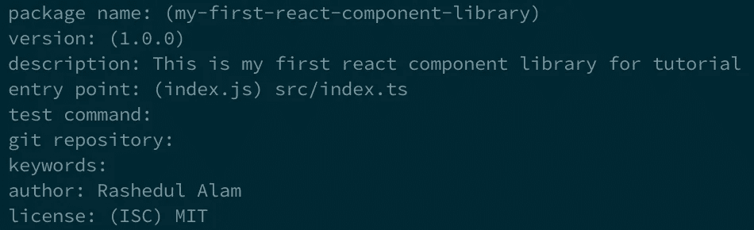
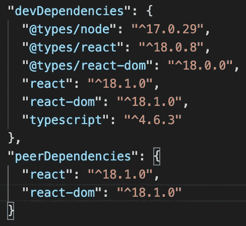
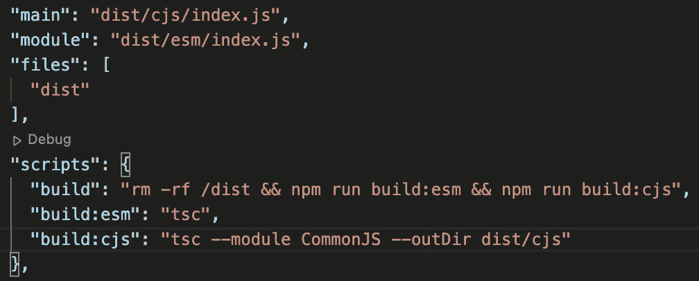
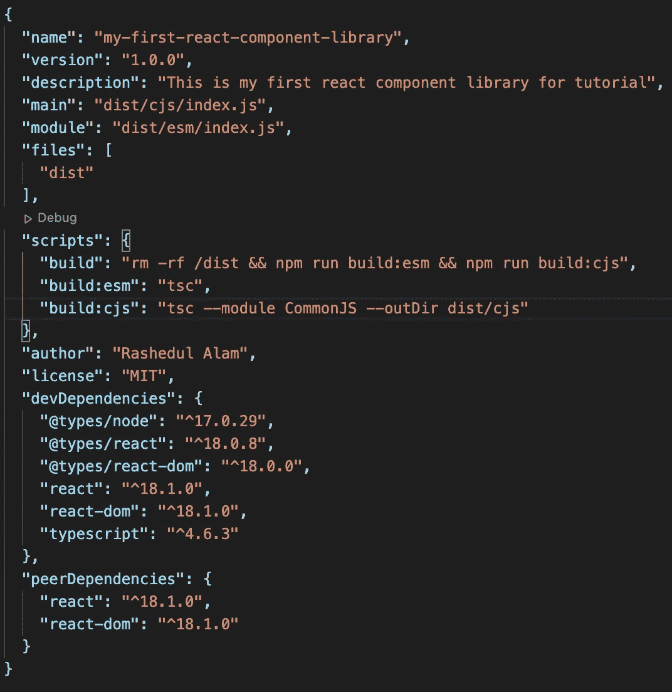
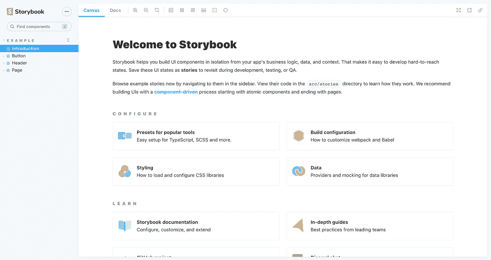
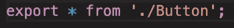
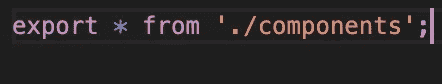
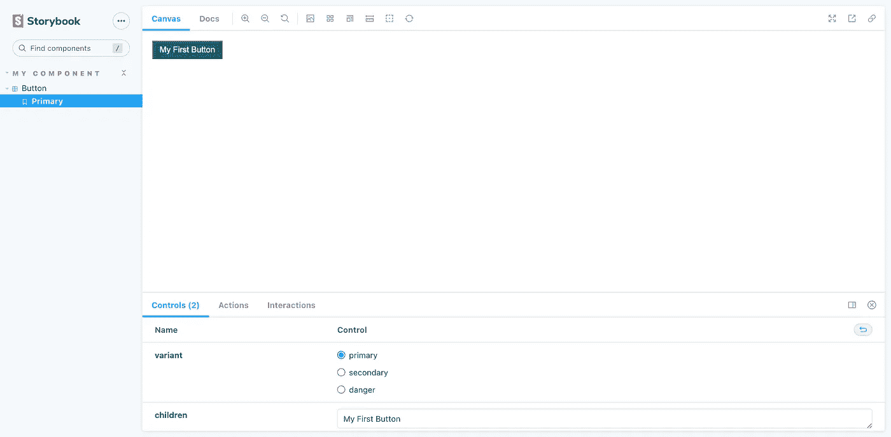

# 使用 TypeScript & StoryBook 构建 React 组件库

> 原文：<https://javascript.plainenglish.io/build-a-react-component-library-using-typescript-storybook-86d3562aa53a?source=collection_archive---------2----------------------->

## 关于如何创建和发布您的第一个 React 组件库的教程


Photo by [AbsolutVision](https://unsplash.com/@freegraphictoday?utm_source=medium&utm_medium=referral) on [Unsplash](https://unsplash.com?utm_source=medium&utm_medium=referral)

React 组件库有助于在许多不同的项目中重用它们。如果项目变得更加复杂并且需要扩展，那么创建单独的组件库通常是一个好主意。

本文将教你如何使用 TypeScript 和 StoryBook 创建我们的第一个 React 组件库包，并将其发布到 NPM。

# 步骤 1:启动一个新的 NPM 项目

让我们首先创建一个新文件夹，并通过在终端中键入以下命令来初始化一个新的 NPM 项目:

```
npm init
```

让我们给出它所要求的属性。在我的例子中，我给出了以下属性:



***注意:*** *您可能需要给出一个单独的包名，因为 npm 包必须是唯一的。*

之后，你会在项目根目录下得到一个`package.json`文件。

# 步骤 2:安装必要的软件包

下一步是安装必要的包来支持 React 和 TypeScript。

让我们通过在终端的根项目目录中输入下面的命令来安装下面的包:

```
npm install --save-dev react react-dom [@types/node](http://twitter.com/types/node) [@types/react](http://twitter.com/types/react) [@types/react-dom](http://twitter.com/types/react-dom) typescript
```

这将在我们的项目中安装 React、React-Dom 和 TypeScript，并安装所有其他必需的节点包。

# 步骤 3:添加 React 和 React-Dom 作为对等依赖

让我们从`package.json`文件中复制`react`和`react-dom`依赖项，并将其粘贴到对等依赖项中，如下所示:



***注意:*** *不要从 devDependencies 中删除* `*react*` *和* `*react-dom*` *。*

# 步骤 4:在 Package.json 中添加其他必要的属性

接下来，在`package.json`文件中更改以下属性。



我们正在构建两种不同的类型，因为我们允许使用普通 JavaScript 和 TypeScript 的人使用我们的包。

修改完所有的更改后，我们的`package.json`应该看起来像下面这样:



# 步骤 5:将 TSConfig 添加到我们的项目中

接下来，我们将 ts 配置文件添加到我们的项目中。我们可以通过在终端中键入以下命令来添加它:

```
tsc --init
```

这将在项目的根目录下创建一个`tsconfig.json`文件。

现在，我们需要修改`tsconfig.json`文件，如下所示:

# 步骤 6:将故事书安装到我们的项目中

在这一部分，我们将为我们的项目安装故事书。让我们通过在终端中编写以下命令来启动故事书:

```
npx sb init
```

这将在我们的项目根文件夹中创建两个目录:`stories`和`.storybook`。我们可以通过在终端中键入以下命令来运行故事书:

```
npm run storybook
```

我们将得到如下所示的界面:



# 步骤 7:创建我们的组件

这是最好玩的部分，也是构建 react 组件库的首要功能。

在本文中，我们将构建一个用于演示的按钮。但是您可以在 React 组件库中实现任何东西。

首先，让我们创建一个`src`文件夹，并在其中创建一个`index.ts`文件。让我们在`src`目录下创建一个`components`文件夹。

让我们在`components`文件夹中创建`Button.tsx`组件。

下面是我对一个简单按钮组件的实现:

现在，让我们在`components`文件夹中创建一个`index.ts`文件，并粘贴下面的代码:



让我们也改变我们的`src`文件夹中的`index.ts`文件，如下所示:



当我们构建我们的组件时，我们还需要可视化它们并记录它们。现在是在 StoryBook 上查看我们的组件的最佳时机。

让我们删除`stories`文件夹中的所有文件，因为我们是从头开始创建它们的。让我们在故事文件夹中制作`Button.stories.tsx`。

这是我的`Button.stories.tsx`文件。保存文件后，我们可以在故事书中看到我们的组件，如下所示:



# 步骤 8:构建我们的项目

创建了我们的项目之后，是时候构建我们的项目了。我们可以键入以下命令来构建我们的库:

```
npm run build
```

如果一切构建正确，我们可以在项目的根目录中看到`dist`文件夹。

# 步骤 9:将我们的库发布到 NPM

在创建了组件并成功构建了项目之后，是时候将我们的库发布到 NPM 了。为此，我们需要首先在 [NPM 网站](https://www.npmjs.com)上创建一个账户。

然后我们需要通过在终端中键入`npm login`从我们的终端登录到 NPM。

成功登录后，我们可以通过在终端中键入以下命令来发布我们的库:

```
npm publish
```

***注意:*** *您需要先验证您的电子邮件，才能将包发布到 npm。*

# 结论

恭喜你出版了我们的第一个 NPM 套餐！在本文中，我们看到了如何将我们的第一个 React 组件库发布到启用了 TypeScript 和 Storybook 的 NPM。

感谢阅读我的文章。祝您愉快！

## 进一步阅读

[](https://bit.cloud/blog/building-a-composable-ui-component-library--l33jy1vs) [## 构建可组合的 UI 组件库

### 如何构建组件库？React 组件库，包含可组合的组件。

比特云](https://bit.cloud/blog/building-a-composable-ui-component-library--l33jy1vs) 

*更多内容请看*[***plain English . io***](https://plainenglish.io/)*。报名参加我们的* [***免费周报***](http://newsletter.plainenglish.io/) *。关注我们关于*[***Twitter***](https://twitter.com/inPlainEngHQ)[***LinkedIn***](https://www.linkedin.com/company/inplainenglish/)*[***YouTube***](https://www.youtube.com/channel/UCtipWUghju290NWcn8jhyAw)***，以及****[***不和***](https://discord.gg/GtDtUAvyhW) *对成长黑客感兴趣？检查* [***电路***](https://circuit.ooo/) ***。*****