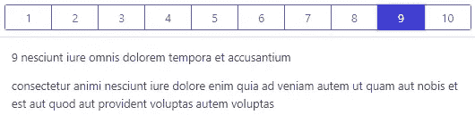
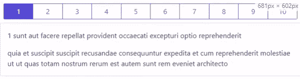
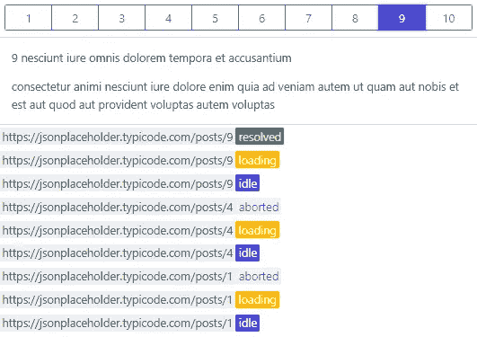
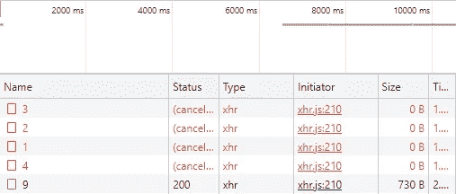

# 构建一个获取数据的 React 钩子

> 原文：<https://javascript.plainenglish.io/build-a-react-hook-for-fetching-data-262aabcf9d7e?source=collection_archive---------9----------------------->

## 让我们把它钩起来！


Photo by [Taylor Beach](https://unsplash.com/@taylor65s?utm_source=unsplash&utm_medium=referral&utm_content=creditCopyText) on [Unsplash](https://unsplash.com/s/photos/hook?utm_source=unsplash&utm_medium=referral&utm_content=creditCopyText)

钩子改变了 React 的使用方式。钩子支持的事情之一是代码的可重用性。许多著名的库，如 [react-router](https://reactrouter.com/) 、 [react-query](https://react-query.tanstack.com/) 都更好地采用了钩子。钩子的另一个特点是它们是可组合的。您可以使用基本的钩子，如 [useState](https://reactjs.org/docs/hooks-reference.html#usestate) 和 [useEffect](https://reactjs.org/docs/hooks-reference.html#useeffect) 来编写您自己的定制钩子，并在您的应用程序中重用它们。

今天，我们将为这样一个获取数据的常见场景编写一个钩子。没有任何进一步的延迟，让我们马上看看这个钩子—

让我们一步一步地分解它——

# 存储状态、数据和错误。

我们的自定义钩子中的数据由 useState 钩子`Line 5`管理。数据和错误属性是相当自描述的。状态变量使它变得有趣。它可以取 idle、loading、resolved 和 errored 中的任何值。初始状态设置为空闲`Line 8`，从那里转换到加载状态`Line 14`。此后，它可以取值为已解决或出错。如果已解析，则使用来自 API `Line 19`的响应设置数据属性。如果有错误，用错误对象`Line 23`设置错误属性。

很简单，对吧。我们继续。

## 为什么是状态变量而不是 isLoading，isError 这样的变量？

你可能会问为什么只有一个 string 类型的状态变量，而不是像 isLoading 和 isError 这样的布尔变量。boolean 难道不会让 API 更干净一点吗？

```
**// consuming hook using status varible**if(status === "loading")
  return <div className="loading"></div>
else if(status === "errored")
  return <div>An error occured.</div>
else
  return <div>{data.id}</div>**// consuming hook using boolean variables like isLoading, isError**if(isLoading)
  return <div className="loading"></div>
else if(isError)
  return <div>An error occured.</div>
else
  return <div>{data.id}</div>
```

嗯，这有两个原因—

*   因为只有一个变量(状态变量),所以最大限度地减少了混淆。我们需要做的就是设置当前状态，而不用担心设置其他变量的状态。让我们考虑有两个布尔变量。理论上，应该有四种不同的状态组合。此外，用单个变量扩展状态相当简单。
*   你总是可以写一个有布尔变量的实用程序—

```
const mapStatus = (status) => {
  return {
    isIdle: status === "idle",
    isLoading: status === "loading",
    isResolved: status === "resolved",
    isError: status === "errored",
  }
}/* Only one amongst the four properties from the above object will be true at any given time.*/
```

# 有效地进行 API 调用。

自定义钩子使用 useEffect 通过使用 [axios](https://axios-http.com/) 进行外部 API(在本例中为 [jsonplaceholder](https://jsonplaceholder.typicode.com/) )调用。使用 [async-await](https://developer.mozilla.org/en-US/docs/Web/JavaScript/Reference/Statements/async_function) 从服务器获取数据是非常标准的。然而，有两件事需要讨论—

## shouldSetData 变量的使用。

假设您正在列出帖子，单击其中一个列出的帖子会获取相应帖子的详细信息。假设你有一个 10 篇文章的列表。理想情况下，用户点击帖子 5 并看到其详细信息。然后他们点击第 9 篇文章并查看其详细内容。效果相当好！



List of 10 posts and details of post 9.

然而，假设用户点击 post 1，在它完成获取之前，他们点击 post 4，在完成加载之前，他们点击 post 9，最后等待它加载。

刚刚发生了什么？让我们开始吧。

*   我们不知道服务器会以什么样的顺序满足我们的请求。然而，我们知道用户只对第 9 篇文章感兴趣。所以基本上所有花在 post 1 和 post 4 上的时间在前端和服务器上都是不必要的。
*   此外，在卸载组件的情况下(可能是因为您离开了),由于在卸载的组件中设置了状态，会引发以下错误。

```
**Warning: Can’t call setState (or forceUpdate) on an unmounted component. This is a no-op, but it indicates a memory leak in your application. To fix, cancel all subscriptions and asynchronous tasks in the componentWillUnmount method**
```

*   即使在组件重新呈现的情况下，它可能会在最终显示 post 9 之前闪烁 post 1 和 post 4 的结果响应。



Notice how the screen flashes for 2 before finally showing details of 3rd post.

实际发生的情况是，当用户点击按钮`Line 35`来获取 post 1 的详细信息时(没有等待它完成)，它触发了一个 API 调用`Line 2`。但是，当 API 完成调用时，用户已经点击了另一个帖子(或者可能已经离开了组件)。但是，react 仍然会尝试设置与 post 1 对应的数据、状态和错误变量。

变量 shouldSetData 帮助我们控制应用程序在任何情况下的行为(卸载或重新渲染)。观察作为效果清理的一部分，shouldSetState 如何设置为 false。它确保数据、错误和状态仅在需要时为正确的 URL 设置。

这是处理这种行为的前端部分。不过，还有一点需要考虑。

## 使用堕胎控制器

我们已经处理了组件中的行为。但是网络请求仍然被触发。[中止控制器](https://developer.mozilla.org/en-US/docs/Web/API/AbortController)允许我们取消网络请求。

每次更改 URL 时都会触发一个网络请求`Look at the dependency array for useFetch`。清理功能中的 controller.abort()确保对帖子 1 和帖子 4 的请求被取消，用户只等待帖子 9 的数据。



Observe the request for post 1 and post 4 is aborted without getting resolved.



Network tab cancelling requests.

希望你喜欢这篇文章。下面的沙箱提供了演示示例。

A sample of code.

*多内容见于* [***通俗易懂的英语中***](http://plainenglish.io/) *。报名参加我们的* [***免费周报***](http://newsletter.plainenglish.io/) *。在我们的* [***社区纠纷***](https://discord.gg/GtDtUAvyhW) *中获得独家写作机会和建议。*