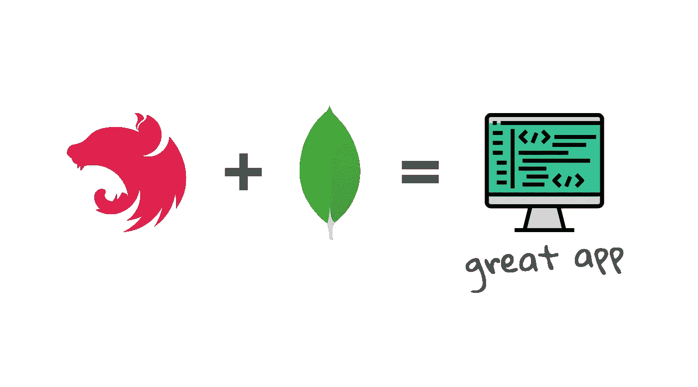

# 用 TypeScript，NestJS 和 MongoDB 构建一个服务器端的 App

> 原文：<https://javascript.plainenglish.io/build-a-server-side-app-with-typescript-nestjs-and-mongodb-d29d26ac1ab3?source=collection_archive---------3----------------------->

## 简单快速地构建高效的应用程序。



# 介绍

使用 NestJS 框架构建的 Node.js 服务器端应用程序可能比其他一些应用程序更高效、耦合性更低。背后的一个原因是 NestJS 对如何开发应用程序有强烈的看法。换句话说，它是一个[固执己见的框架](https://stackoverflow.com/a/802064/7950893)。

## 这篇文章献给谁？

因为我们将要讨论一些概念，比如 ODM 或依赖注入，所以我建议您在深入研究之前先熟悉这些概念。
如果你不是，但仍然想构建一个基本的服务器端应用程序，你可以阅读我的另一篇关于如何使用 TypeScript 和 Express 构建应用程序的文章。

[](/typescript-node-js-express-js-create-a-backend-application-f5110dbe5c19) [## 使用 TypeScript、Node.js 和 Express 构建后端应用程序

### 从头开始创建您的后端应用程序](/typescript-node-js-express-js-create-a-backend-application-f5110dbe5c19) 

## 要求

你首先需要在你的电脑上安装 [Node.js](https://nodejs.org/en/download/) 。

*   你最喜欢的 IDE
*   安装[类型脚本](https://www.typescriptlang.org/download)
*   安装 [MongoDB](https://docs.mongodb.com/manual/installation/) 或使用 [MongoDB 图集](https://www.mongodb.com/atlas/database)
*   用这个`npm`命令安装 Nest CLI:

```
**npm** **install** -g @nestjs/cli
```

您可以直接在专用的[库](https://github.com/fairyfingers/ts-nestjs-mongodb-sample)中查看代码。
本教程的每一步都匹配一个特定的提交。

## 摘要

1.  **设置项目** |快速初始化和 npm 包安装
2.  **设置环境** |环境变量和配置服务
3.  集成 mongose|在你的项目中使用 ODM 工具
4.  **功能演示**

# 设置项目

## 快速初始化

您需要做的第一件事是初始化您的 NestJS 项目。为此，请使用以下 Nest CLI 命令:

```
**nest new** ts-nestjs-mongodb-sample
```

Nest CLI 将提示您选择一个[包管理器](https://github.com/pnpm/benchmarks-of-javascript-package-managers#readme)。选择一个你想用的，但要知道我们这里要用`npm`。

## 软件包概述

安装完成后，快速浏览一下您要添加到项目中的三个依赖项:

```
📦 [**@nestjs/config**](https://www.npmjs.com/package/@nestjs/config)
📦 [**mongoose**](https://www.npmjs.com/package/mongoose)
📦 [**@nestjs/mongoose**](https://www.npmjs.com/package/@nestjs/mongoose)
```

*   `@nestjs/config`是一个 NestJS 包，它允许您使用环境变量来配置应用程序，就像 Node.js 应用程序中经常做的那样
*   `mongoose`是一个 MongoDB **对象文档映射**工具(ODM ),用于在您的应用程序中对 MongoDB 数据库执行操作
*   `@nestjs/mongoose`是一个围绕`mongoose`包的简单包装器，用于 NestJS 应用程序的上下文。它包括你需要的每一个类型声明

使用您选择的软件包管理器安装这三个软件包:

```
**npm install @**nestjs/config mongoose @nestjs/mongoose
```

# 设置环境

## 环境变量

将数据库与应用程序连接起来会要求您编写一些配置。例如，您可能想将数据库的[连接字符串](https://docs.mongodb.com/manual/reference/connection-string/)放在代码中的某个地方，这样您的应用程序就知道从哪里获取它，但仍然不会将其暴露给整个世界。

你可能已经知道了，但是有一个地方可以存放它，它叫做`.env`文件。在那里，你可以放置所有的[环境变量](https://en.wikipedia.org/wiki/Environment_variable)，并让你的应用程序在任何时候使用它们。

在项目的根目录下创建包含以下内容的`.env`文件:

现在，记得我告诉过你不要把敏感数据暴露给全世界。如果你来提交这个`.env`文件，那么你会做你*不想做的事情，也就是暴露你的连接字符串。*

因此，如果您目前正在一个存储库中工作，请将`.env`文件添加到项目的`.gitignore`中，这样您就不会将它推送到您的遥控器上:

如果您仍然想留下项目运行所需的环境变量的线索，您仍然可以在另一个文件中提交您的`.env`文件的结构，但是永远不要**提交敏感数据。**

## 应用程序配置

`@nestjs/config`包允许您从您创建的`.env`文件中检索任何数据。你唯一需要做的就是“封装”这个包，告诉它你想要什么。

为此，在`src`文件夹中创建以下文件夹结构:

```
📂src
└- 📂infrastructure
    └- 📂configuration
         └- 🗒️**app-configuration.service.ts**
```

现在，请阅读下面的代码，并确保您理解所有代码:

1.  在这里，我们创建了自己的(可注入的)配置服务
2.  我们从`@nestjs/config`中注入我们的类`ConfigService`
3.  我们用它从我们的`.env`文件中检索`MONGODB_DB_URI`

除了你的`app-configuration.service.ts`文件，创建另一个文件:

```
📂src
└- 📂infrastructure
    └- 📂configuration
         └- 🗒️**app-configuration.module.ts**
         └- 🗒️app-configuration.service.ts
```

同样，阅读并尝试理解下面的代码:

它基本上是一个[模块](https://docs.nestjs.com/modules)级。这就是 NestJS 用来组织应用程序结构的东西。

*   `exports`是您想要向任何导入这个模块的模块公开的`providers`
*   `imports`自然是导入模块的列表，它导出您在这个模块中需要的提供者(在这种情况下是`ConfigService`)
*   `providers`在本模块中共享，由嵌套注入器注入

总而言之:我们导入了`ConfigModule`，它导出了检索环境变量所需的`ConfigService`。我们也出口我们唯一的供应商，但是为了什么？为了使其对`AppModule`可用:

这样，当启动您的应用程序时，它将知道您的连接字符串及其当前值。

## 数据库配置

您已经得到了 NestJS 应用程序和连接字符串。将应用程序与数据库连接之前的最后一次推动。

进入您的`app.module.ts`并粘贴以下代码:

我们导入`MongooseModule`的方式看起来和其他的不太一样。背后的原因是因为它是一个[动态模块](https://docs.nestjs.com/fundamentals/dynamic-modules#dynamic-module-use-case)。

*   给定一个连接字符串，`MongooseModule`允许你的应用程序连接到你的数据库
*   要给这个模块你的数据库的连接字符串，你必须从你的`.env`文件中获取它，唯一的方法是使用你的`AppConfigurationService`
*   因此，您需要将它注入到`MongooseModule`中，这样您就可以配置`MongooseModuleOptions`来使用正确的连接字符串

恭喜你！🎉您的应用程序和数据库已连接。

# 整合猫鼬

## 创建您的第一个模式

现在你的应用程序和你的数据库连接上了，你终于可以使用 mongoose 并享受一点乐趣了(不要太多，乐趣是不好的，我讨厌乐趣)。

在您的`src`文件夹中创建以下文件夹结构:

```
📂src
└- 📂user
   └-🗒️**user.ts**
```

`user.ts`文件将包含我们用户的[模式](https://mongoosejs.com/docs/guide.html#schemas)。将以下代码粘贴到您的文件中:

这些装饰者和未知方法是什么？让我告诉你。

*   `UserDocument`类使用来自`@nestjs/mongoose`包的`@Schema()`装饰器。这个装饰器将我们的类标记为模式定义，并将其映射到同名的 MongoDB 集合
*   `@Prop()`decorator 在我们的用户文档中定义属性。我们集合中这些属性的模式类型是由 TypeScript 元数据自动推断出来的
*   `userSchema`是使用`SchemaFactory` 从`UserDocument`构建的，本质上是一个用于构建 mongoose 模式的类
*   `User`交集类型结合了`UserDocument`和 mongose`Document`类型来获得它需要的所有特性

欲了解更多详情，请阅读关于[模型注射](https://docs.nestjs.com/techniques/mongodb#model-injection)的 NestJS 文件。

## 准备你的模块

在您的代码中，您的应用程序需要知道应该注册哪些 mongoose 模型。为此，您需要创建一个模块来注册您的`userSchema`，因此除了您的`user.ts`文件之外，还要创建另一个文件:

```
📂src
└- 📂user
   └-🗒️**user.module.ts**
   └-🗒️user.ts
```

该模块将在以后的章节中更新，但现在，只需粘贴您需要的以下代码:

正如你所看到的，我们只是在这里的`MongooseModule`中注册了我们的`userSchema`，所以这个应用知道 mongoose 有一个用户特性。

## 添加存储库

有了用户模式，现在可以做的是添加第一个存储库。

在用户文件旁边创建另一个文件:

```
📂src
└- 📂user
   └-🗒️**user.repository.ts**
   └-🗒️user.module.ts
   └-🗒️user.ts
```

`user.repository.ts`文件将包含使用 mongoose 与数据库交互的代码。将以下代码粘贴到您的文件中:

这个文件本身并不复杂。有几件事你应该看看，面团:

*   我们把我们的`UserRepository`做成可注射的，这样它就可以在我们`UserModule`的任何一个类中被注射到我们想要的任何地方
*   我们将用户 mongoose 模型注入到类构造函数中，这样我们就可以直接从存储库中与 MongoDB 集合进行交互

因为我们希望这个类被注入到我们模块中的任何地方，所以我们需要将它添加到`UserModule`提供者:

# 功能演示

## 添加您的控制器

你最终会看到你到目前为止做了多少工作。为此，创建除用户文件之外的最后一个文件:

```
📂src
└- 📂user
   └-🗒️**user.controller.ts**
   └-🗒️user.repository.ts
   └-🗒️user.module.ts
   └-🗒️user.ts
```

`user.controller.ts`文件将包含所有的 HTTP 路由和逻辑。将以下代码粘贴到您的文件中:

正如你所看到的，我们正在控制器内部注入我们的`UserRepository`。这允许我们在类中的任何地方使用它。

您可以看到的各种装饰器都记录在 NestJS 控制器[文档](https://docs.nestjs.com/controllers)中。我在这里没有详细说明，因为我发现它们的用法很容易理解。你不觉得吗？

不要忘记在您的`UserModule`中添加`UserController`:

## 完成你的应用模块

一切都准备好了。你所要做的就是把你的`UserModule`导入到你的`AppModule`里面，然后用`RouterModule`注册一条特定的路线，这样你就可以到达你的`UserController`。

我们开始吧。进入您的`AppModule`并粘贴以下代码:

然后用`nest start`启动你的 app，用[邮递员](https://www.postman.com/)或者[失眠](https://insomnia.rest/)甚至[卷毛](https://curl.se/)打用户路线。不要忘记使用`POST`方法。你的应用程序应该给你一个很好的工作响应。

**搞定！🥳这是你用 TypeScript、NestJS 和 MongoDB 构建的服务器端应用程序。如果你有任何问题，请随时提问。**

*更多内容请看*[***plain English . io***](http://plainenglish.io/)*。报名参加我们的* [***免费周报***](http://newsletter.plainenglish.io/) *。在我们的* [***社区***](https://discord.gg/GtDtUAvyhW) *获得独家获得写作机会和建议。*