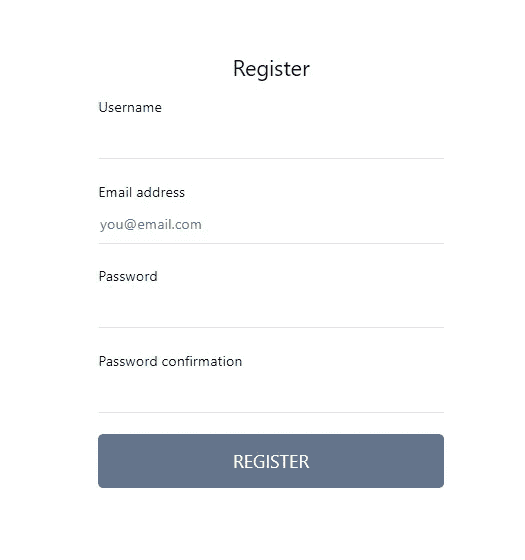
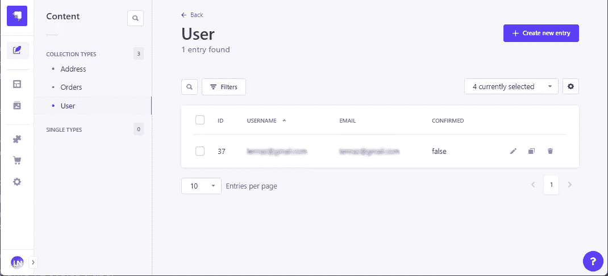
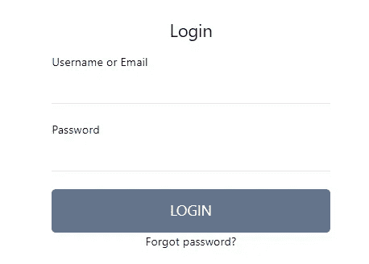

# 使用 Strapi 在 Next.js 中构建一个可靠且安全的登录工作流

> 原文：<https://javascript.plainenglish.io/build-a-solid-and-secure-login-workflow-in-next-js-with-strapi-part-2-register-and-login-4971cc7176f5?source=collection_archive---------4----------------------->

## 第 2 部分:注册和登录——用 NextJS 和 Strapi 构建一个可靠、安全、可伸缩的登录系统


在过去的 3 个月里，我们在 NextJs 中使用[Strapi](https://medium.com/u/ace2e82e28e6?source=post_page-----4971cc7176f5--------------------------------)([https://strapi.io/](https://strapi.io/))作为后端，从零开始构建了一个完整的电子商务，在这个开发过程中，我们遇到了一些问题，我们需要大量的试验和错误来实现我们一直在寻找的行为，因为 Strapi(尤其是 v. 4)并不总是被很好地正确记录。无论如何，我们能够克服困难，我们记录了我们的发展道路。和我们的项目一样，我们从最烦人的任务开始:**构建一个可靠、安全、可伸缩、可靠和可重用的登录工作流**

Strapi 提供了一个内置的用户管理和登录系统，可以通过社交登录进行扩展。不幸的是，本教程的大部分内容都是关于这个系统和外部库的使用(例如 [next-auth](/passwordless-authentication-in-next-js-with-nextauth-js-and-mongodb-19760c79184) )，而且文档并不总是与 v. 4 保持同步，所以我们决定在本教程中分享我们的经验。

由于构建生产就绪的登录系统是一项漫长而复杂的任务，我们将本教程分为 3 个部分:

*   [第 1 部分:概念和设置](https://popeating.medium.com/build-a-solid-and-secure-login-workflow-in-next-js-with-strapi-part-1-concept-and-setup-5155ebe622bb)
*   第 2 部分:注册和登录
*   [第 3 部分:社交登录和密码重置](https://popeating.medium.com/build-a-solid-and-secure-login-workflow-in-next-js-with-strapi-part-3-social-login-and-password-7409bfad28fb)

您还可以下载或克隆这个项目的存储库，以便跟进:

[](https://github.com/popeating/fullcomm) [## GitHub — popeating/fullcomm

### 此时您不能执行该操作。您已使用另一个标签页或窗口登录。您已在另一个选项卡中注销，或者…

github.com](https://github.com/popeating/fullcomm) 

## 允许用户注册

Strapi 公开了一个 api 端点，允许用户通过使用以下参数向`/api/auth/local/register`提交来注册:*用户名、密码、电子邮件*(您可以通过修改用户的内容类型向用户模式添加更多的字段，但我们会将其保持在最低限度)。所以在我们的项目中，我们需要:

*   一个允许用户输入注册数据的表单:这将是一个在`pages/user/register.js`的注册页面，我们将在其中添加一个表单组件`components/RegisterForm.js`。
*   UserContext 中的 register ( *doRegister()* )函数将获取所有的表单数据，并发送到 NextJs API 路由，然后等待响应。
*   Next.js API Route `pages/api/auth/register.js`将接收到的数据发送到 Strapi API，获得响应，并将其传递回函数。

让我们从 NextJs API 路径开始，创建文件`pages/api/auth/register.js`

这个端点将把接收到的主体发送到注册的 Strapi API 端点，并返回一条消息和状态，所有这些都基于 Strapi API 响应。我们现在需要一个访问端点的函数，我们将通过向我们的上下文添加一个 *doRegister()* 函数来将该函数添加到 UserProvider 上下文:

*doRegister()* 将发送到我们的本地 API(它将发送到 Strapi)并获取一个数组。一旦一切就绪，我们就可以构建一个表单，并让它与注册交互。
创建文件`pages/register.js`

它应该看起来像一个空白页面，显示我们将在`/components/RegisterForm.js`中创建的 *RegisterForm* 组件

在这个文件中，我们有效地构建了表单，在 *react-hook-form* 的帮助下，我们还验证了它并处理了提交动作。
我们准备了几个状态(*警报*和*正在提交*)，我们将使用它们来显示返回消息和启用/禁用提交按钮。我们声明 doRegister 函数，从上下文中获取它

```
const { doRegister } = useContext(UserContext);
```

我们在表单提交时执行它:

```
const onSubmit = async (values) => {
    //...
    const ret = await doRegister(values);
    //...
}
```

我们用返回值设置警告，如果返回值不是 *alert* 我们也会重置表单。

您还应该创建一个文件`/pages/users/index.js`，点击确认邮件后，您将被重定向到该页面:

如果你去`http://localhost:3000/user/register`，你应该会得到一个注册表单，你可以注册新用户(或者尝试已经注册的用户得到错误)



如果您注册了一个新用户，并且一切正常，您将在您的 Strapi 面板中发现一个新用户，其中**确认**标志设置为 false。



您还将收到一封带有链接的电子邮件，如果您单击它，您将被重定向到`http://localhost:3000/user`(我们之前创建的空白页面)，并且**确认**标志将被设置为真，用户现在可以登录了。

## 用户登录

用户登录比注册容易，它遵循相同的模式，所以我们需要:

*   用户输入其用户名和密码的表单(和以前一样，是一个带有表单组件的页面)。
*   UserContext 中的 login ( *doLogin()* )函数将获取所有表单数据，并发送到 NextJs API 路由，然后等待响应。
*   Next.js API Route `pages/api/auth/login.js`将接收到的数据发送到 Strapi API，获得响应，并将其传递回函数。
*   UserContext 中的一个函数( *checkLogin()* )，该函数将检查用户是否已经登录(通过调用 NextJs API 路由)，以便可以保护页面并根据用户更改内容。
*   Next.js API Route `pages/api/auth/user.js`将根据 Strapi 验证用户 JWT，以检查用户是否登录。

正如我们之前所说的，我们将 JWT 存储在 httpOnly cookie 中，这样它就可以被服务器访问，并且在客户端也是非常安全的。
首先，我们创建 API 路由来检查`pages/api/auth/user.js`中的用户状态

我们从 cookie 中获取令牌，并用授权头向 Strapi 端点`api/users/me`发出请求。如果用户是登录 id(令牌被验证)，我们返回一些用户数据以及 200 响应，否则，我们返回 403 响应。

这些响应由 *checkLogin()* 函数处理，我们将把它添加到我们的 UserContext 中:

现在在每个页面上(甚至在 _app.js 中)我们都可以访问 *checkLogin()* ，如果该函数返回一个用户，就意味着该用户已经登录，我们可以据此采取行动。我们可以将该检查添加到我们的注册页面，这样登录的用户就不会看到注册表单，而是被重定向到:

在 *useEffect* 钩子的帮助下，我们调用 *checkLogin()* ，如果它返回 200 状态，我们重定向到用户而不是显示注册表单。

回到登录，我们现在准备 Next.js API 路由，它将有效地登录用户`pages/api/auth/login.js`:

我们根据`api/auth/local` Strapi 端点验证用户提交的数据(req.body ),如果用户通过了身份验证，我们将存储两个 cookies，一个包含返回的 JWT(用于请求期间的授权),另一个包含用户 id(在许多情况下都很有用)。然后我们回到应用程序。
我们使用 doLogin()函数扩展用户上下文，该函数链接到我们用于用户授权的本地 API:

在任何需要登录用户的地方，我们只需调用 *doLogin()* ，传递*标识符*和*密码*(在 Strapi 中，我们使用可以是用户名或电子邮件的标识符登录)

让我们制作一个基本的登录表单:

这里我们检查用户是否已经登录，如果没有，我们显示位于`components/LoginForm.js`中的 LoginForm 组件

和前面一样，我们使用 *react-hook-form* 来处理和验证表单，提交调用 *doLogin()* ，如果登录成功，组件会将用户设置在一个状态，当页面检测到用户时，会重定向到`/user`

如果您导航到`http://localhost:3000/user/login`,您会看到一个登录表单，如果使用确认的用户登录，您将被重定向到`[http://localhost:3000/user](http://localhost:3000/user)`



我们还可以修改`pages/user/index.js`页面，为登录用户显示不同的内容。

如果用户已经登录(我们使用 *checkLogin()* 函数)，我们将显示用户数据和一个注销按钮(我们接下来将准备这个按钮)，如果用户没有登录，我们将显示一个注册链接和一个登录链接。

## 注销

通过注销，您只需删除 cookie 并清理状态，不需要调用任何 API，但为了保持一致性，我们坚持我们的设计模式(page->UserContext->NextJs API)，而且，由于 cookie 是 httpOnly，只能由服务器头请求设置和修改。

Next.js API 路由简单删除 cookie `pages/api/out/logout.js`:

注销的 UserContext 函数(通过向`context/user.js`添加一个 *doLogout()* 函数):

*doLogout()* 函数现在可以从我们的应用程序中访问，在我们的例子中，我们制作了一个可以添加到页面中的注销组件，它呈现一个注销按钮，单击该按钮后执行 *doLogout()* `components/Logout.js`。

在下一部分，我们将看到用户如何使用他们的社交账户登录。

*更多内容请看*[***plain English . io***](https://plainenglish.io/)*。报名参加我们的* [***免费周报***](http://newsletter.plainenglish.io/) *。关注我们关于*[***Twitter***](https://twitter.com/inPlainEngHQ)*和**[***LinkedIn***](https://www.linkedin.com/company/inplainenglish/)*。加入我们的* [***社区***](https://discord.gg/GtDtUAvyhW) *。**