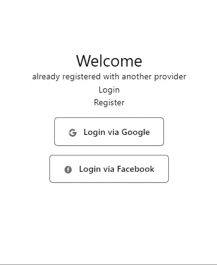
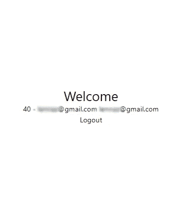
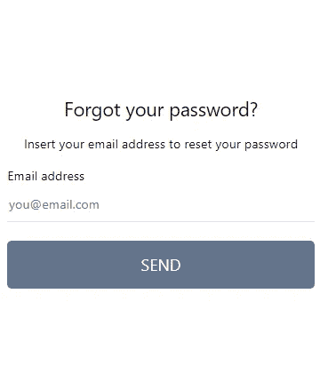

# 使用 Strapi 在 Next.js 中构建一个可靠且安全的登录工作流

> 原文：<https://javascript.plainenglish.io/build-a-solid-and-secure-login-workflow-in-next-js-with-strapi-part-3-social-login-and-password-7409bfad28fb?source=collection_archive---------5----------------------->

## 第 3 部分:社交登录和密码重置

在过去的 3 个月里，我们使用[Strapi](https://medium.com/u/ace2e82e28e6?source=post_page-----7409bfad28fb--------------------------------)(【https://strapi.io/】T3)作为后端，在 Next.js 中从头开始构建了一个完整的电子商务应用。

在这个开发过程中，我们面临一些问题，我们需要大量的试验和错误来实现我们所寻找的行为，因为 Strapi(尤其是 v. 4)并不总是被很好地和正确地记录。无论如何，我们能够克服困难，并且我们记录了我们的发展道路。和我们的项目一样，我们从最烦人的任务开始:**构建一个可靠、安全、可伸缩、可靠和可重用的登录工作流**

Strapi 提供了一个内置的用户管理和登录系统，可以通过社交登录进行扩展。不幸的是，大部分教程都涉及了这个系统与外部库的使用(例如 [next-auth](/passwordless-authentication-in-next-js-with-nextauth-js-and-mongodb-19760c79184) )，并且文档并不总是与 v. 4 保持同步，所以我们决定在本教程中分享我们的经验。

由于构建生产就绪的登录系统是一项漫长而复杂的任务，我们将本教程分为 3 个部分:

*   [第 1 部分:概念和设置](https://popeating.medium.com/build-a-solid-and-secure-login-workflow-in-next-js-with-strapi-part-1-concept-and-setup-5155ebe622bb)
*   [第二部分:注册和登录](https://popeating.medium.com/build-a-solid-and-secure-login-workflow-in-next-js-with-strapi-part-2-register-and-login-4971cc7176f5)
*   第 3 部分:社交登录和密码重置

您还可以下载或克隆这个项目的存储库，以便跟进:

 [## GitHub — popeating/fullcomm

### 此时您不能执行该操作。您已使用另一个标签页或窗口登录。您已在另一个选项卡中注销，或者…

github.com](https://github.com/popeating/fullcomm) 

## 社交登录

在这一部分中，我们将只使用 Strapi 内置功能，将社交登录添加到我们的 web 应用程序中。作为一个例子，我们添加了谷歌和脸书，但它可以扩展到添加更多的提供商，Strapi 提供了超过 15 个现成的集成，包括像 Auth0 和 Cognito 这样的第三方服务，以达到更多的提供商。接下来，我们假设您已经为 Google 和脸书配置了环境，如第 1 部分所述。

## **基本工作流程**

社交认证工作流如下工作(这包括我们的实现层):

*   用户单击指向 Strapi API 端点的按钮/链接。
*   用户被重定向到提供商身份验证页面。
*   一旦用户在提供者上通过身份验证，提供者就将用户发送回 Strapi API，向它传递一些数据(包括 access_token)。
*   Strapi API 将 access_token 传递给指定的前端 URL。
*   前端 URL 调用一个连接到 Next.js API 路由的函数，传递 access_token **我们的实现。**
*   Next.js API 路由调用一个 Strapi API 端点`api/auth/google/callback`仍然传递 access_token，这个端点创建用户，如果用户已经存在它检查它是否可以登录，如果用户可以登录我们设置登录 cookies(就像我们在正常登录中做的一样)**我们的实现。**

这个工作流非常复杂(也许可以通过删除一些步骤来缩小范围)，但是我们发现它是一个很好的工作流，可以使事情保持有序，并与模式的其余部分保持一致。

> **注意**:如果一个用户已经存在于用户群中，但是它是由不同的提供者创建的(例如，我们正在尝试使用 Google 登录，但是用户的电子邮件已经注册为普通登录)，Strapi 会发回一个普通的 **405(不允许使用方法)，**没有更多的细节。我们假设所有 405 意味着“已经向另一个提供商注册了”,并通知用户。

## 谷歌登录

首先，我们创建回调页面`pages/user/googleCallback.js`

如果通过一个访问令牌访问这个页面，我们调用一个 *doGoogleCallback()* 函数(我们将在我们的 UserContext 中创建下一个函数)，如果这个函数返回一个‘alert ’,我们将警报消息添加到一个错误状态，我们重定向到`user?msg={error}`,否则，我们设置用户状态，我们仍然重定向到`user`。而登录页面会显示一个“登录谷歌”的通知。

让我们将 *doGoogleCallback()* 添加到我们的用户上下文:

我们只需将页面中收到的 access_token 传递给本地 API。本地 API `pages/api/auth/google/callback.js` 将如下所示:

API 将获得 Strapi 的 google 回调端点(仍然传递 access_token)，如果 Strapi 创建了用户(或登录了用户)，我们设置 cookie(就像我们在正常登录中所做的那样)并返回到我们的页面，带有一个用户对象或带有一个错误。

我们修改了`pages/user/index.js`，这样我们可以添加一个 Google 登录按钮并处理错误:

这是完整的索引页面，已经包括了用于登录的谷歌和脸书组件，让我们在`components/GoogleLogin.js`中添加谷歌组件

这是一个标准的按钮，一旦点击就会重定向到`http://localhost:1337/api/connect/google`,它是启动社交登录过程的 Strapi 端点；您还可以让按钮连接到一个函数，并让该函数执行重定向。

如果您现在连接到`http://localhost:3000/user`，您将看到一个带有社交登录按钮的页面。请注意，只有当您尝试使用已经向另一个提供商注册的电子邮件进行社交登录时，才会出现已经向另一个提供商注册的*。*

如果您点击“通过谷歌登录”按钮，您将通过谷歌登录过程，如果您使用尚未在 Strapi 上注册的电子邮件，在最后您将登录，在 Strapi 管理面板上您将看到一个新用户已经确认了来自社交提供商的数据(用户名和电子邮件)。

## 脸书登录

脸书登录的工作方式与谷歌登录相同，所以我们有相同的工作流程和相同的文件，但是我们将它们指向不同的 API

> **注意**:出于组织目的，我们将所有的社交登录保存在不同的文件中(即使它看起来像是重复的)，以便我们可以处理单个提供商，而不会触及其他提供商(提供商可能会不时地改变他们发送数据的方式或修改他们工作流程的某些内容

至于谷歌，我们有`pages/user/facebookCallback.js`:

用户上下文中的一个 *doFacebookCallback()* 函数

将发布到本地的`pages/api/aut/facebook/callback.js`:

最后一块是`components/FacebookLogin.js`中的 FacebookLogin 组件

此时，所有的登录方法都在工作(凭据、谷歌、脸书)，我们有一个页面进行注册，主页面`user/index.js`正在显示已登录用户的用户数据(用户 id —用户名—电子邮件)，还有一个注销按钮:

## 密码丢失和密码重置

对于使用电子邮件注册的用户，Strapi 提供了一种重置密码的方法。有两个端点(`api/auth/forgot-password`和`api/auth/reset-passord`)，第一个允许用户请求带有重置密码链接的电子邮件，第二个允许用户保存新密码。

为了实现这一点，我们将一如既往地使用相同的模式(UserContext 中的函数，Next.js API 路由中间件)，我们还需要几个页面:用户通过输入电子邮件地址请求链接的表单和用户设置新密码的页面(该页面地址在第 1 部分中进行了配置)。

第一个页面是`pages/user/forgotpassword.js`，该页面只能由未登录的用户访问，并显示 ForgotForm 组件，这是一个请求电子邮件的基本表单:

前表格组件`components/ForgotForm.js`:

将使用 *react-hook-form* 处理和验证表单，提交时将执行我们添加到用户上下文的 *doRemind()* 函数:

*doRemind()* 函数将发布到我们的本地 API `pages/api/auth/reminder.js`

如果该电子邮件存在于系统中，则会向用户的电子邮件地址发送一条消息，其中包含重置密码的链接(在我们的例子中是`http://localhost:3000/user/resetpassword`)。这个 URL 包含一个应该传递给我们的 API 请求的代码，以及新的密码。

页面`pages/user/resetpassword.js`

仅对未登录的用户可用，它包含一个位于`components/ResetForm.js`的 ResetForm 组件

表单将密码和代码(来自查询字符串)发送给另一个 UserContext 函数: *doReset()* 。如果密码更改正确，用户将被重定向登录。这是添加到用户上下文的 *doReset()* :

该函数将新密码和代码发布到本地 API 端点`pages/api/auth/reset.js`

然后将其发送给 Strapi，后者对用户执行更新。

如果一切正确，用户现在可以使用新密码登录。

## 下一步是什么

即使这个例子可以被认为是非常安全和完整的，它还可以在许多方面进行改进，例如，更复杂的错误管理可能是有用的，在 localStorage 中存储非敏感数据(如用户名)在某些情况下可能是有用的。

*更多内容请看* [***说白了就是***](https://plainenglish.io/) *。报名参加我们的* [***免费每周简讯***](http://newsletter.plainenglish.io/) *。关注我们*[***Twitter***](https://twitter.com/inPlainEngHQ)*和*[***LinkedIn***](https://www.linkedin.com/company/inplainenglish/)*。加入我们的* [***社区不和谐***](https://discord.gg/GtDtUAvyhW) *。*