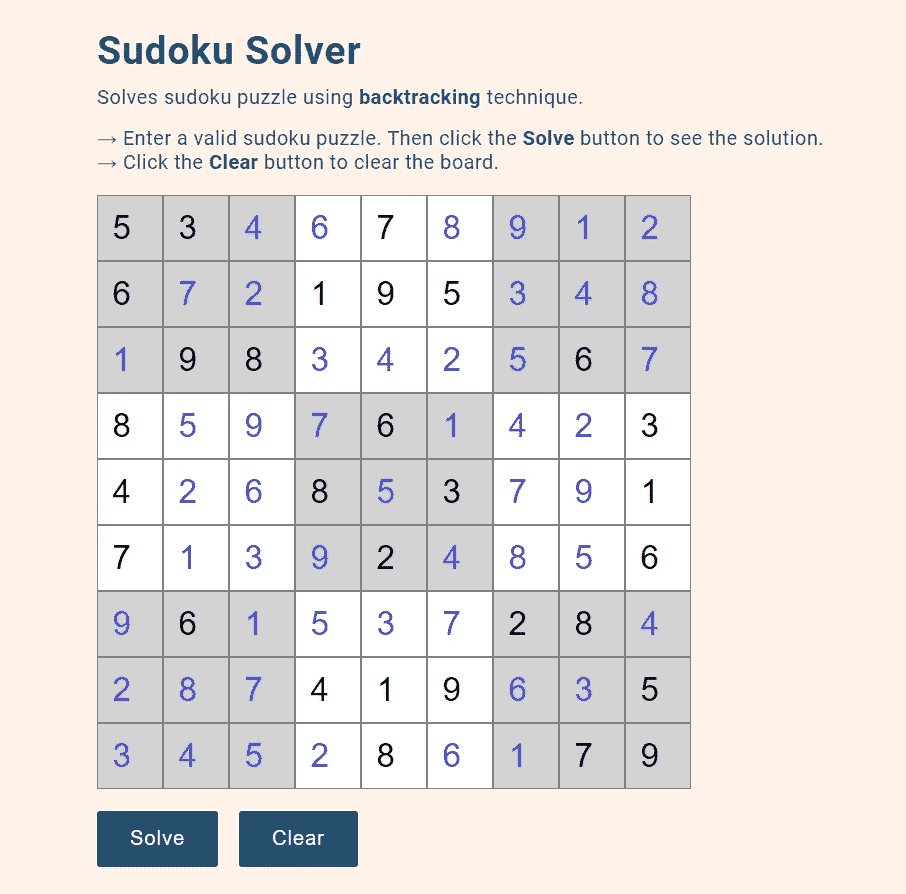
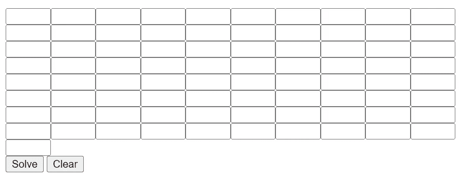
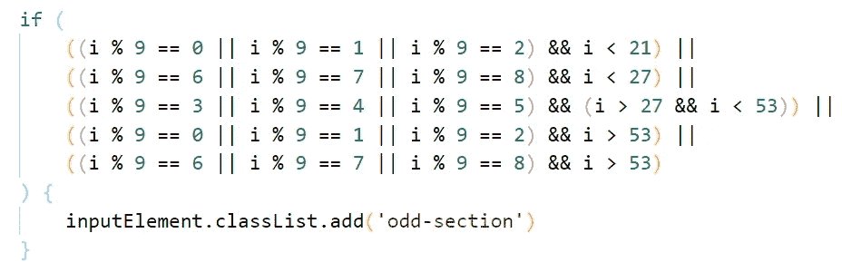
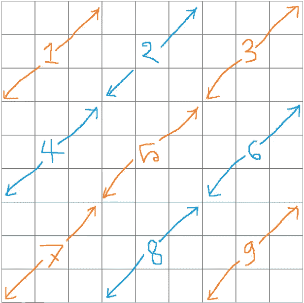
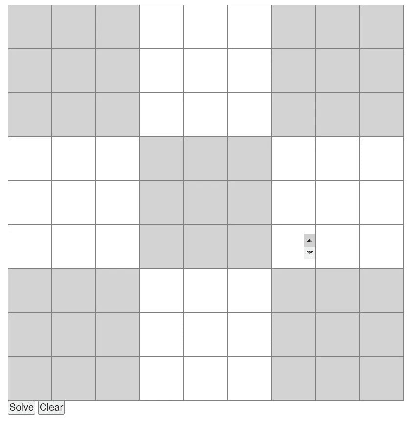
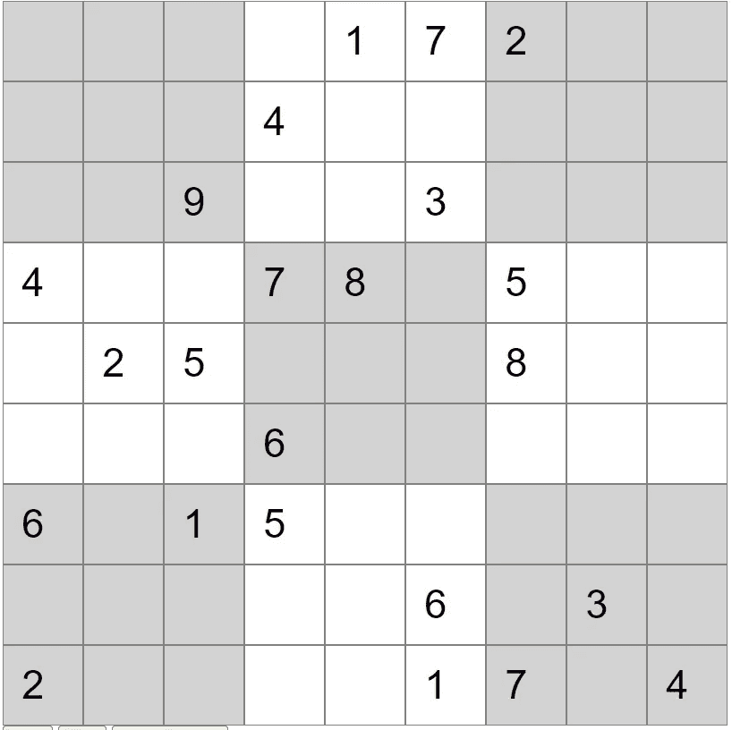

# 用 JavaScript 构建一个数独求解程序

> 原文：<https://javascript.plainenglish.io/build-a-sudoku-solver-app-with-javascript-32afbe384d1e?source=collection_archive---------1----------------------->

## 一个使用回溯来解决数独谜题的 JavaScript 应用程序


Photo by [Richard Bell](https://unsplash.com/@maplerockdesign?utm_source=medium&utm_medium=referral) on [Unsplash](https://unsplash.com?utm_source=medium&utm_medium=referral)

[数独](https://en.wikipedia.org/wiki/Sudoku)是一款很受欢迎的益智游戏。人类在解决数独难题时会采取不同的方法。但是如果你想让一台计算机解一个数独，你必须告诉它一个特定的规则来遵循。[回溯](https://en.wikipedia.org/wiki/Backtracking)就是那种特定的技术。

如果你学过算法和数据结构，你可能熟悉用回溯法解决数独难题。你拿一个未解的数独谜题，用回溯法解决它，然后返回答案。

今天我们将使用 JavaScript 制作一个 web 应用程序，人们可以输入一个数独谜题并得到答案。这是完成的项目的外观:



Sudoku solver app

# 主要组件

该项目的主要组成部分是:

*   一块 9x9 的板子。为此，我们总共需要 9x9=81 个输入字段。
*   “求解”按钮。它会触发算法并解开谜题。
*   “清除”按钮清除先前的输入。

# 项目布局

以下是项目结构:

```
.
├── index.html
├── scripts
│   ├── app.js
│   ├── draw_board.js
│   └── solver.js
└── styles
    └── style.css
```

`index.html`是主 HTML 文件。在`styles`目录中，CSS 文件将存在。我们只有一个 CSS 文件，T2。

`scripts`目录将包含所有的 JavaScript 文件。我们不是将所有代码放在一个 JavaScript 文件中，而是将项目分成三个不同的模块:

*   `draw_board.js`将 81 个输入域画成一个 9x9 的数独棋盘。
*   `solver.js`将接受用户输入，使用回溯求解，并显示结果。
*   `app.js`将是我们的主 JavaScript 文件。在这里，我们将导入其他两个模块，并使按钮工作。

将 JavaScript 代码分解成不同的模块是可能的，因为有了 [ES6 模块](https://www.tutorialspoint.com/es6/es6_modules.htm)。[这个视频](https://www.youtube.com/watch?v=cRHQNNcYf6s)帮助我理解了 ES6 模块的概念。

# 创建董事会

我们从构建数独板开始，在这里我们可以输入一个谜题。

将以下代码放入`index.html`:

我们将在`#puzzle`分区创建我们的电路板。然后我们有两个按钮，一个解决难题，一个清除棋盘。

此时，我们的页面上只有两个按钮。因为我们将使用 JavaScript 创建输入字段。让我们在`scripts/draw_board.js`中编写以下代码:

我们在`#puzzle` div 中创建了 81 个`type=”number”`输入字段:



Input fields are created

但是我们需要把它转换成 9x9 的板。我们可以使用 CSS 来实现。在`styles/style.css`文件里说吧:

现在棋盘看起来像这样:


Input fields converted into a 9x9 board

如果能把每个 3x3 的小节分开就好很多了。我们可以为两个连续的 3x3 部分设置不同的颜色。为此，我们需要回到`scripts/draw_board.js`并在 For 循环中添加以下代码:



`draw_board.js`全集:

这个 if 语句将在奇数位置向每个 3x3 子部分添加一个`#odd-section`类。从下图来理解一下我说的奇位是什么意思:



Separating odd sections

现在我们简单地在`styles/style.css`中给`#odd-section`一个不同的颜色:

```
.odd-section {
    background: #d3d3d3;
}
```

棋盘是完整的:



The completed board

# 将用户输入放入数据结构

首先，我们需要将用户输入放入一些数据结构中。为此我们将使用一个数组。让我们考虑以下输入:



An unsolved puzzle

我们将把这个输入放到一个名为`board`的数组中。空白输入将由数组中的 0 表示。上述输入的`board`数组如下:

我们需要编写一些逻辑，以便我们的代码理解空白输入，并将值正确地放入数组中。

让我们转到`scripts/solver.js` ，把这段代码:

这里我们查询所有的输入字段。如果有一个值，我们把它放在数组中。如果没有值，那意味着空输入，我们在数组中放一个 0。

现在我们有了一个包含未解之谜的数组，是时候解决它了！

# 解开谜题

我们将使用回溯来解决这个难题。解出谜题后,`board`数组将包含答案。

我写过一篇关于回溯技术如何解决数独的文章。您可以阅读它，以便更好地理解我们在这里所做的事情:

[](https://python.plainenglish.io/solve-a-sudoku-puzzle-using-backtracking-in-python-8e9eb58e57e6) [## 使用 Python 中的回溯来解决数独难题

### 通过解决数独难题学习回溯的基本原理

python .平原英语. io](https://python.plainenglish.io/solve-a-sudoku-puzzle-using-backtracking-in-python-8e9eb58e57e6) 

在本文中，我使用一个二维数组来解决这个难题。但是对于这个项目，我决定使用一维数组，因为它使得获取输入和显示结果更容易。下面是我学习使用一维数组的博文:

 [## JavaScript 数独求解器

### 我妻子对数独产生了热情。我不同意，我一直认为这是一个问题…

lisperator.net](https://lisperator.net/blog/javascript-sudoku-solver/) 

将以下代码添加到`scripts/solver.js`:

现在，如果我们运行`solve()`函数，`board`数组将会给出谜题的答案。

我们需要在我们的网站上展示解决方案。将此功能添加到`scripts/solver.js`:

该函数将使用`board`数组的元素填充输入字段。

我们有我们的解决方案！大部分工作已经完成。现在我们只需要把所有的小代码放在一起，完成`scripts/app.js`文件。

# 完成代码

在`scripts/app.js`中，我们将导入另外两个模块:`dreaw_board.js`和`solver.js`。我们将使“解决”按钮和“清除”按钮起作用。

下面是完整的`app.js`:

现在，如果我们输入一个难题，然后点击“解决”,我们就会得到答案。

对于“清除”按钮，我们将简单地重新加载浏览器，就像我们使用浏览器上的刷新按钮刷新任何页面一样。这将删除以前的输入，并为新输入清除电路板。

# 最后一击

最后，我们将向 HTML 添加一些文本，并向页面添加一些样式。

完成`index.html`:

完成`style.css`:

项目完成了！现在，我们有了一个为我们解决数独难题的应用程序。

# 查找项目

您可以从 GitHub 资源库中找到该项目的源代码:

[](https://github.com/FahadulShadhin/Sudoku-Solver) [## GitHub-FahadulShadhin/Sudoku-Solver:使用回溯的 Sudoku 解谜程序

### 此时您不能执行该操作。您已使用另一个标签页或窗口登录。您已在另一个选项卡中注销，或者…

github.com](https://github.com/FahadulShadhin/Sudoku-Solver) 

使用代码来制作您自己的版本，并随时提供任何建议来使它变得更好。

点击此处查看现场演示:

 [## 数独求解器

### 使用回溯技术解决数独难题。→输入有效的数独谜题。然后单击求解按钮查看…

sudokoo.netlify.app](https://sudokoo.netlify.app/) 

# 结论

通过建立这个项目，我们学到了一些有价值的东西。我们学会了如何将一个算法问题转化为人们可以实际使用的网络应用程序。我们学习了如何在 ES6 模块的帮助下模块化 JavaScript 代码。

希望对你有帮助。感谢阅读。

# 资源

*   [https://lisperator.net/blog/javascript-sudoku-solver](https://lisperator.net/blog/javascript-sudoku-solver/)
*   [https://www.tutorialspoint.com/es6/es6_modules.htm](https://www.tutorialspoint.com/es6/es6_modules.htm)
*   [https://python . plain English . io/solve-a-sudoku-puzzle-using-backtracking-in-python-8e 9 EB 58 e 57 e 6](https://python.plainenglish.io/solve-a-sudoku-puzzle-using-backtracking-in-python-8e9eb58e57e6)

如果你喜欢阅读这样的文章，考虑成为一个媒体成员。这让你可以无限制地访问媒体上的所有故事。如果你使用我下面的[推荐链接](https://fahadulshadhin.medium.com/membership)注册，我将从你每月 5 美元的费用中赚取一小笔佣金。这样你就可以支持我这个作家了。

[](https://fahadulshadhin.medium.com/membership) [## 通过我的推荐链接加入 Medium-Fahadul shad hin

### 阅读 Fahadul Shadhin(以及媒体上成千上万的其他作家)的每一个故事。您的会员费直接支持…

fahadulshadhin.medium.com](https://fahadulshadhin.medium.com/membership) 

*更多内容看* [***说白了。报名参加我们的***](https://plainenglish.io/) **[***免费周报***](http://newsletter.plainenglish.io/) *。关注我们关于*[***Twitter***](https://twitter.com/inPlainEngHQ)*和*[***LinkedIn***](https://www.linkedin.com/company/inplainenglish/)*。查看我们的* [***社区不和谐***](https://discord.gg/GtDtUAvyhW) *，加入我们的* [***人才集体***](https://inplainenglish.pallet.com/talent/welcome) *。***