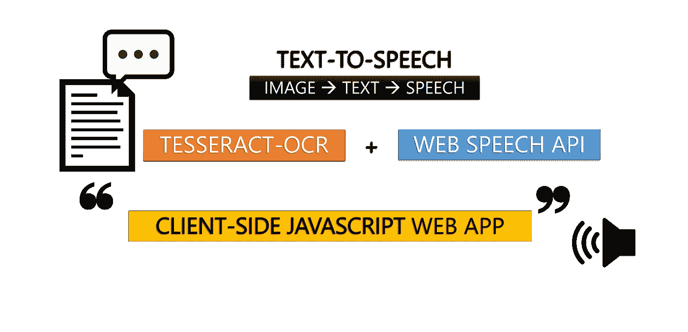
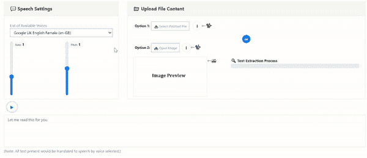
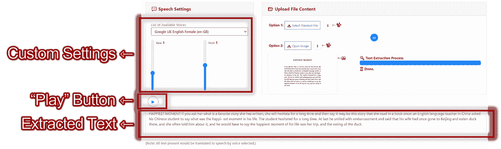

# 使用客户端 JavaScript 构建一个文本到语音的应用程序

> 原文：<https://javascript.plainenglish.io/build-a-text-to-speech-app-using-client-side-javascript-98cd72df73bb?source=collection_archive---------10----------------------->

## OCR 技术(Tesseract.js)和 Web 语音 API 的融合。包括完整的代码实现。



Image by Author

在当今的信息时代，数字化转型的影响遍及各行各业。随着全球疫情的到来，医疗保健和金融等多个领域开始认识到数据的重要性，以及对数字工具的需求，以支持这些正在进行的范式转变。

## [**OCR(光学字符识别)技术**](https://www.techtarget.com/searchcontentmanagement/definition/OCR-optical-character-recognition)

特别是，OCR 技术已经成为推动这个数字时代的游戏规则改变者，以加强数据驱动的职业，如**数据科学(AI & ML)和数据分析。**

> *最值得注意的是，OCR 技术提取图像中文本内容的能力消除了重新键入文本的大量手动需要，有效地节省了开销成本(时间+人力)。*

# 使用 Tesseract OCR 构建文本到语音转换应用程序

以下实施被分解为 **2 部分** —

## 第一部分.使用 Tesseract-OCR 提取图像到文本

一个成熟的开源实用程序是 [Tesseract OCR](https://github.com/tesseract-ocr/tesseract/) 。衷心感谢媒体作家 [Jerome Wu](https://medium.com/u/8d7beadc096e?source=post_page-----98cd72df73bb--------------------------------) ，这个( [Tesseract.js](https://tesseract.projectnaptha.com/) )的纯 JavaScript 版本已经发布到[在线社区](https://github.com/naptha/tesseract.js)。

> *对于该应用，需要实现一个* ***自托管*** *版本的 Tesseract.js v2，以支持* ***离线使用*** *和* ***移植*** *。*

## **步骤一。**检索 Tesseract.js v2 的以下 4 个文件

-[tessera CT . min . js](https://raw.githubusercontent.com/incubated-geek-cc/Text-To-Speech-App/main/js/tesseract/tesseract.min.js)
-[worker . min . js](https://raw.githubusercontent.com/incubated-geek-cc/Text-To-Speech-App/main/js/tesseract/worker.min.js)
-[tessera CT-core . wasm . js](https://raw.githubusercontent.com/incubated-geek-cc/Text-To-Speech-App/main/js/tesseract/tesseract-core.wasm.js)
-[eng.traineddata.gz](/incubated-geek-cc/Text-To-Speech-App/blob/main/js/tesseract/lang-data/4.0.0_best/eng.traineddata.gz?raw=true)*

*为简单起见，所有要提取的文本都假定为**英文**

*   导入插件

```
<script src='js/tesseract/tesseract.min.js'></script>
```

*   继续设置工人属性

```
const worker = Tesseract.createWorker({
  workerPath: 'js/tesseract/worker.min.js',
  langPath: 'js/tesseract/lang-data/4.0.0_best',
  corePath: 'js/tesseract/tesseract-core.wasm.js'
});
```

**注意:**由于 app 是自托管的，相对路径需要重新定义为本地相对路径。

## **第二步。**创建上传图像的用户界面

*   HTML 文件输入

```
<input id='uploadImg' type='file' />
```

*   JavaScript 代码片段

```
var uploadImg=document.getElementById('uploadImg');
function readFileAsDataURL(file) {
  return new Promise((resolve,reject) => {
    let fileredr = new FileReader();
    fileredr.onload = () => resolve(fileredr.result);
    fileredr.onerror = () => reject(fileredr);
    fileredr.readAsDataURL(file);
  });
}
uploadImg.addEventListener('change', (ev) => {
  const worker = Tesseract.createWorker({
    workerPath: 'js/tesseract/worker.min.js',
    langPath: 'js/tesseract/lang-data/4.0.0_best',
    corePath: 'js/tesseract/tesseract-core.wasm.js'
  });

  let file = ev.currentTarget.files[0];
  if(!file) return;
  readFileAsDataURL(file).then((b64str) => {
    return new Promise((resolve,reject) => {
      const img = new Image();
      img.onload = () => resolve(img)
      img.onerror = (err) => reject(err);
      img.src = b64str;
    });
  }).then((loadedImg) => {
    /* TO DO LOGIC HERE */ // In Step 3)
  });
}, false);
```

*   注意，前面实例化`worker`的代码片段已经嵌套在事件函数中。
*   由于`worker`只读入一个``元素，`new Image()`被初始化为 src 属性，作为上传图像的 base64 编码数据。

## **第三步。**实现 Tesseract API 提取图像文本

```
(async () => {
  await worker.load();
  await worker.loadLanguage('eng');
  await worker.initialize('eng');

  let result=await worker.recognize(loadedImg);
  let extractedData=result.data;

  let wordsArr=extractedData.words;
  let combinedText='';
  for(let w of wordsArr) {
    combinedText+=(w.text)+' ';
  }
  inputTxt.value=combinedText;
  await worker.terminate();
})();
```

## 第一部分实施的预览:



Screencapture by Author | Upon upload of image, Tesseract-OCR processes file and extracts text into the textarea

## 🚩检查点——如图所示，第一部分利用 Tesseract-OCR 来实现这个应用程序的图像到文本方面。

## 第二部分。使用[网络语音 API](https://developer.mozilla.org/en-US/docs/Web/API/Web_Speech_API) 将文本转换为语音

为了将 web 文本转换成浏览器语音，应用程序的第二部分利用了 Web API: [语音合成](https://developer.mozilla.org/en-US/docs/Web/API/SpeechSynthesis)

重用来自[GitHub Repo we b-Speech-API](https://github.com/mdn/web-speech-api/tree/master/speak-easy-synthesis)的 JavaScript 代码片段，该应用的文本到语音方面呈现如下:



Illustration by Author | After text extraction from image, selecting the “Play” Button would convert input text to browser speech. | Language Dialect + Speed + Pitch can be customised with displayed form inputs.

## 完整的源代码可以在我的 GitHub repo: [文本到语音转换应用](https://github.com/incubated-geek-cc/Text-To-Speech-App)或者在[演示](https://incubated-geek-cc.github.io/Text-To-Speech-App/)中试用！

## 潜在的使用案例

*   业务文档的数据输入
*   视障者辅助设备
*   将扫描的文档转换为机器可读的文本以进行数据处理

## 个人评论

虽然对数据分析和人工智能/机器学习等数据驱动领域的期望继续呈指数级增长，但对数字数据收集的需求也在不断增长。

随着 [WASM](https://webassembly.org/) (例如 C/C++到 JavaScript)的同步创新与现有工具(例如[JavaScript Web API](https://developer.mozilla.org/en-US/docs/Web/API))的结合使用，这一一次性实现证明了使用客户端 JavaScript 创建的独立文本到语音(即“朗读”)应用程序是可行的🤩

非常感谢你坚持到这篇文章的结尾！❤希望你已经发现这个实现令人敬畏和有见地。如果您想了解更多与 GIS、数据分析& Web 应用相关的内容，请随时[关注我的 Medium](https://medium.com/@geek-cc) 。会非常感激—😀

— 🌮请给我买一份玉米卷🎀˶❛◡❛)

[](https://geek-cc.medium.com/membership) [## 通过我的推荐链接加入灵媒——李思欣·崔

### 获得李思欣·崔和其他作家在媒体上的所有帖子！😃您的会员费直接…

geek-cc.medium.com](https://geek-cc.medium.com/membership) 

*更多内容看* [***说白了。报名参加我们的***](https://plainenglish.io/) **[***免费周报***](http://newsletter.plainenglish.io/) *。关注我们关于*[***Twitter***](https://twitter.com/inPlainEngHQ)*和*[***LinkedIn***](https://www.linkedin.com/company/inplainenglish/)*。加入我们的* [***社区***](https://discord.gg/GtDtUAvyhW) *。***