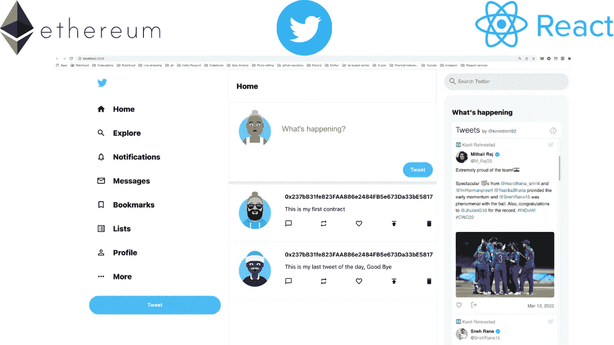
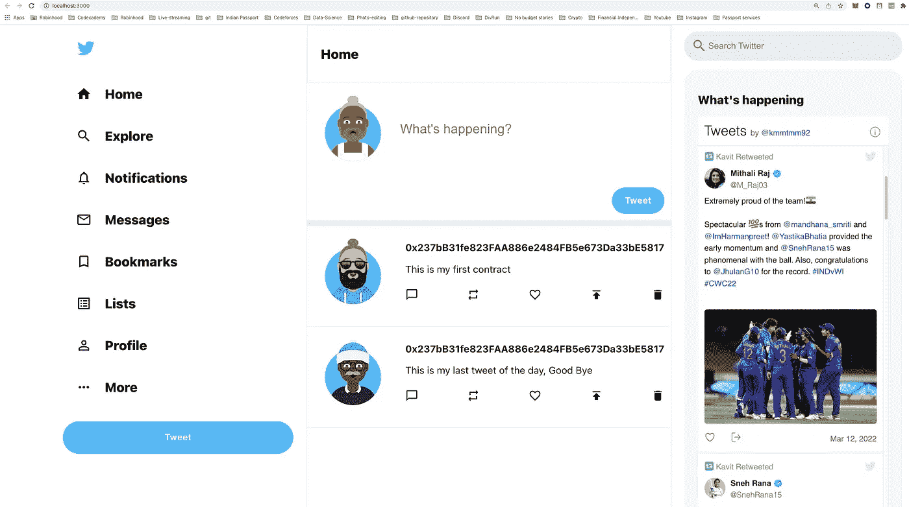
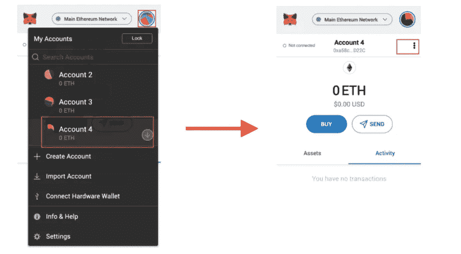
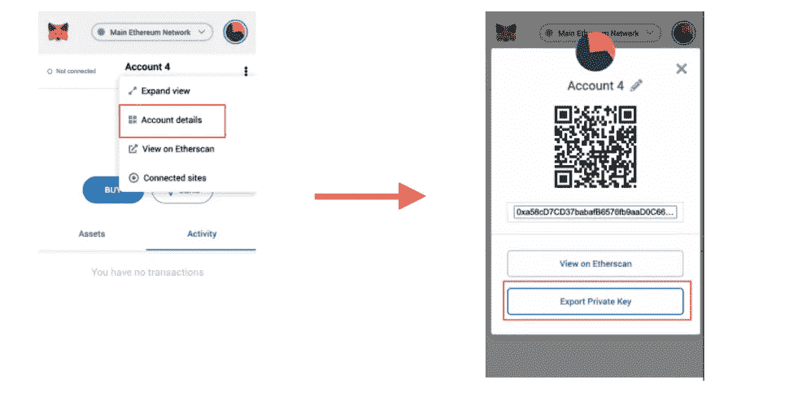
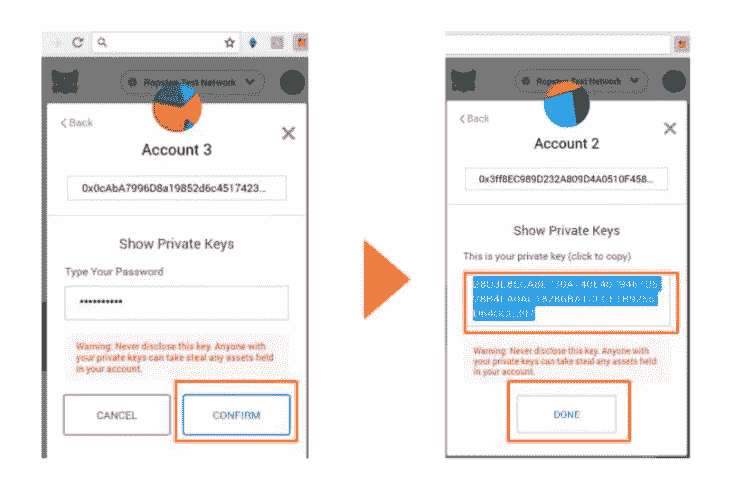

# 使用 React 和 Solidity 构建 Twitter 克隆

> 原文：<https://javascript.plainenglish.io/build-a-twitter-clone-using-react-and-solidity-8aa8a1715186?source=collection_archive---------4----------------------->



# 先决条件

请确保您了解以下内容:

*   [Node.js](https://nodejs.org/en/) 安装在你的机器上。
*   [**Metamask**](https://metamask.io/) 钱包扩展安装完毕。
*   关于 [**ETH 区块链**](https://ethereum.org/en/) 如何工作的知识。

# 资源

*   [坚固性概述](https://docs.soliditylang.org/en/v0.8.11/)
*   关注我的 YouTube 频道[了解即将推出的课程](https://www.youtube.com/channel/UCV-_hzlbVSlobkekurpLOZw)

# 项目概述

在本文中，我们将首先编写自己的基于 Solidity 的智能合约，在区块链联邦理工学院部署该智能合约，然后构建一个 Twitter 克隆 web 应用程序，允许我们发布和查看所有推文。



*   要查看有关该项目的详细视频:

*   要查看该项目的完整源代码，这里是[库](https://github.com/Kavit900/twitter_clone_react_solidity_dapp)。

# 后端项目设置

要开始，我们需要创建一个安全帽项目。为此，请打开您的终端。创建或更改到一个新的空目录，并运行以下命令:

```
npm install ethers hardhat @nomiclabs/hardhat-waffle \
ethereum-waffle chai @nomiclabs/hardhat-ethers \
@openzeppelin/contracts dotenv
```

接下来，让我们初始化一个新的开发环境，为此，我们将使用 hardhat 命令:

```
npx hardhat
```

运行此命令后，我们将得到一堆设置问题，只需选择`Create a basic sample project`选项，其他选项按`yes`。

现在，您应该可以在根目录中看到为您创建的以下文件和文件夹:

**hardhat.config.js** —您的整个 hardhat 设置(即您的配置、插件和自定义任务)都包含在这个文件中。

**脚本** —包含名为 sample-script.js 的脚本的文件夹，该脚本将在执行时部署您的智能合约。

**test —** 一个包含测试脚本示例的文件夹。

**合同** —保存示例 Solidity 智能合同的文件夹。

# 使用炼金术获取以太坊 API 密钥

Alchemy 是一个区块链开发者平台，致力于简化区块链开发。他们构建了一套开发人员工具、增强的 API 和卓越的节点基础设施，以无缝地构建和运行区块链应用程序。

要创建 API，请遵循以下步骤:-

1.  在[炼金术](https://www.alchemy.com/)报名。

2.转到[仪表板](https://dashboard.alchemyapi.io/)。

3.选择网络作为 rinkeby。

4.在这之后，在 alchemy 上创建 app 之后复制 HTTP key。

完成上述步骤后，在项目根目录下创建一个`.env`文件，并将这个 HTTP 密钥存储为:

```
ALCHEMY_RINKEBY_URL = "ALCHEMY_HTTP_API_KEY"
```

# 从元掩码获取您的帐户私钥

这个私有帐户密钥是我们的智能合同部署脚本所需要的，以便执行它并从我们的钱包中取出煤气费。

1.  点击图标
2.  选择您想要导出的帐户
3.  在账户页面上，点击右上角的菜单(三个点):



4.点击“账户详情”按钮

5.单击“导出私钥”:



6.输入您的密码并点击“确认”

7.你的私钥泄露了。单击以复制它，并将其保存在安全的地方。

8.点击“完成”关闭屏幕:



现在，一旦你有了你的私有密匙，把它复制并粘贴到你的`.env`文件中。

```
ACCOUNT_KEY = "YOUR_ACCOUNT_PRIVATE_KEY
```

**重要提示**:不要将`.env`文件推送到 GitHub，因为它包含你的私人数据。

# 更新 hardhat.config.js

此后，用以下内容更新 **hardhat.config.js** 中的配置:

```
require("[@nomiclabs/hardhat-waffle](http://twitter.com/nomiclabs/hardhat-waffle)");
require('dotenv').config()module.exports = {
  solidity: "0.8.4",
  networks: {
    rinkeby: {
      url: process.env.ALCHEMY_RINKEBY_URL,
      accounts: [process.env.ACCOUNT_PRIVATE_KEY],
    }
  }
};
```

# 创建智能合同逻辑

接下来，我们将创建我们的智能合约！我们将为 Twitter 创建一个智能合同，以保存我们在区块链联邦理工学院的推文。

在 contracts 目录中创建一个名为`TwitterContract.sol`的新文件。在这里，添加以下代码:

我不会详细介绍如何在`solidity`中编码，但很快我会在`solidity`上制作视频教程。敬请期待！

## 合同细节

1.  我们首先创建一个名为 tweet 的结构，它为我们存储了 4 个字段:-
    (i) id(存储 tweet id)
    (ii) username(存储发 Tweet 的人的钱包地址)
    (iii) tweetText(存储该人的实际 Tweet)
    (iv)is deleted(跟踪 Tweet 是否被删除的标志)。
2.  函数 **addTweet()** 接受两个参数 **tweetText** 和 **isDeleted** 。我们基本上是将推文添加到我们的列表中，跟踪所有推文，并且还有一个存储**推文 Id** = > **推文所有者**的全球地图。之后，我们发出一个名为 **AddTweet** 的事件，基本上就是给区块链添加一个新的区块。
3.  函数 **getAllTweets()** 非常简单，它返回到目前为止发生的所有推文。我们在这里检查的一件事是，一条推文是否被删除，并基于此将其添加到我们的推文结果列表中。
4.  函数 **getMyTweets()** ，类似于 **getAllTweets()** ，除了一个额外的东西，我们检查 tweet 是否属于请求它的人。
5.  最后一个函数 **deleteTweet()** 接受两个参数， **TweetId** 和 **isDeleted** 标志，我们检查该 tweet 是否属于当前试图删除它的人，然后我们发出一个 deleteTweet()事件以在区块链级别进行更改。

# 测试智能合约

现在智能合约代码已经完成，我们可以尝试使用`unit tests`进行测试。

要创建一个`unit test`，创建并打开`test/TwitterContractTest.js`，用下面的代码更新它:

现在我们可以使用下面的命令运行`unit test`

```
npx hardhat test
```

所有的单元测试都是不言自明的，所以我不会详述。查看视频以获得更深入的理解。

# 在 Rinkeby 网络上部署智能合约

现在，我们已经创建了我们的智能合同，并且已经过单元测试，我们有信心将其部署到我们的区块链联邦理工学院。

要部署合同，在`scripts`文件夹中创建一个名为`deploy.js`的`file`，并添加以下内容:-

```
const main = async() => {
  const twitterContractFactory = await ethers.getContractFactory('TwitterContract')
  const twitterContract = await twitterContractFactory.deploy()
  await twitterContract.deployed()console.log("Contract deployed to: ", twitterContract.address)
}const runMain = async() => {
  try {
    await main()
    process.exit(0)
  } catch(error) {
    console.log(error)
    process.exit(1)
  }
}runMain()
```

当我们运行以下脚本时，它将使用`ethers.js`包获取 **TwitterContract** 合同，然后我们将使用`deploy()`内置方法部署它。

要运行该脚本，请使用以下命令:-

```
npx hardhat run scripts/deploy.js --network rinkeby
```

现在，我们脚本中的`console`命令将显示我们的契约被部署的`address`。

```
console.log("Contract deployed to: ", twitterContract.address)
```

将那个`contract address`复制并粘贴到一个安全的地方，因为我们将在前端文件中使用它。

# 前端设置

现在，我们需要为 **Dapp** 的前端创建一个新的 **React.js** 项目。为此，请在终端中运行以下命令:

```
npx create-react-app client 
```

这将在文件夹`client`中创建一个新的 React 项目。

在此之后，在`client`文件夹中安装前端的依赖项。为此，请在终端中运行以下命令:

```
cd client 
npm install axios ethers 
npm install avataaars @material-ui/core @material-ui/icons
npm install react-twitter-embed react-flip-move
```

# 构建前端

现在**智能契约**正在工作，我们可以开始构建 UI 了。

首先，我们需要在**前端**和**智能契约**之间建立一个连接，这样它就可以利用契约中的函数与来自区块链的数据进行交互。

现在，为了让前端知道基于用户交互调用什么函数，我们需要从文件夹`artifacts/contracts/TwitterContract.sol`中导入一个`TwitterContract.json`文件，并将这个文件放在`client`文件夹中一个新的`utils`文件夹中。

接下来，在`client`文件夹的根目录下创建一个`config.js`文件，并将`contract`部署地址粘贴为:-

```
export const TwitterContractAddress = "DEPLOYED_CONTRACT_ADDRES"
```

现在，让我们再次看看 Twitter 用户界面模拟


如果你清楚地看到，我们有三个部分:-

1.  最左边的叫做**侧边栏**，它显示了在页面中移动的导航按钮。
2.  中间的一个叫做 **Feed** ，显示所有最新的推文
3.  最右边的一个叫做 **Widgets** ，它显示了所有的流行标签和相关的东西。

## 侧栏组件

现在，让我们来看看，我们在顶部有一个 twitter 的标志，然后我们有一系列的导航按钮:-主页，探索，通知等。

下面是我们的**侧栏**组件的实现:-

让我们简单看一下 **Sidebar.js** 文件中发生了什么:-

1.  我们使用另一个名为 **SidebarOption** 的自定义 React 组件来显示图标和旁边的描述文本。
2.  我们使用内置图标的材质 UI 包。

## 饲料成分

从 UI 模拟中可以看出，中间的组件将是我们的 Feed React 组件，它包含所有用户的所有最新推文。

下面是 **Feed** 组件的实现:-

让我们简单看看 **Feed.js** 文件里面发生了什么:-

1.  我们在这个文件中有两个方法，其中一个是 **getAllTweets()** ，它基本上意味着使用 **ethers.js** npm 模块与区块链联邦理工学院进行交互，然后点击我们作为智能合约的一部分实现的 **getAllTweets()** 方法。
2.  类似于 **getAllTweets()** 方法，我们有 **deleteTweet()** ，这个方法基本上被调用，当用户点击他们拥有的 Tweet 的删除图标时，它然后使用 **ethers.js** npm 模块与 ETH 区块链交互，然后添加一个新块，其中包含所选 tweet 被删除的信息。
3.  在我们的 **getAllTweets()** 中，我们为我们的 **posts** 变量设置值，然后我们使用该变量进行迭代，并使用 **Post** 组件来显示推文。
4.  我们还有一个 **TweetBox** 组件，用于用户创建新的 tweet。

下面是 **TweetBox** 组件的实现

## 小部件组件

从 UI 模拟中可以看出，最右边的组件是我们的 Widget 组件，它包含所有最新的热门推文和标签。目前为了简单起见，我只显示我发布的推文。

下面是 **Widgets** 组件的实现

上面的组件非常简单，不言自明。

要在浏览器中测试 dapp，请在终端中运行以下命令:

```
cd client
npm run dev
```

# 结论

恭喜你！将您的 Twitter 智能合约部署到区块链联邦理工学院，并创建 Dapp 来显示和创建新的推文。

与我联系:-

推特👦🏻:-[https://twitter.com/kmmtmm92](https://twitter.com/kmmtmm92)

油管（国外视频网站）📹:-[https://www . YouTube . com/channel/UCV-_ hzlbVSlobkekurpLOZw/关于](https://www.youtube.com/channel/UCV-_hzlbVSlobkekurpLOZw/about)

开源代码库💭:-[https://github.com/Kavit900](https://github.com/Kavit900)

照片墙📸:-[https://www.instagram.com/code_with_kavit/](https://www.instagram.com/code_with_kavit/)

*更多内容看* [***说白了就是***](https://plainenglish.io/) *。报名参加我们的* [***免费周报***](http://newsletter.plainenglish.io/) *。关注我们* [***推特***](https://twitter.com/inPlainEngHQ) *和*[***LinkedIn***](https://www.linkedin.com/company/inplainenglish/)*。加入我们的* [***社区不和谐***](https://discord.gg/GtDtUAvyhW) *。*