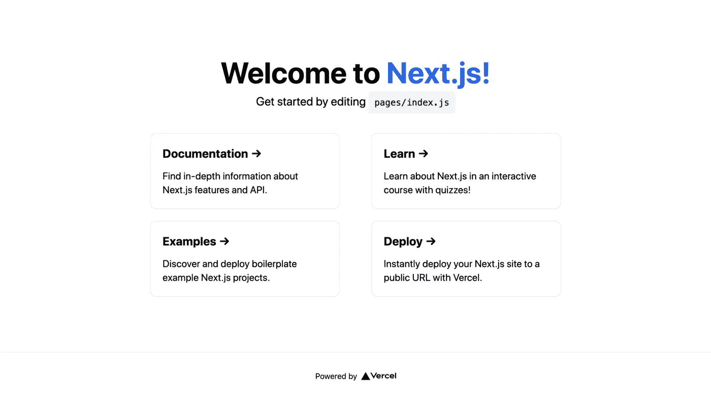
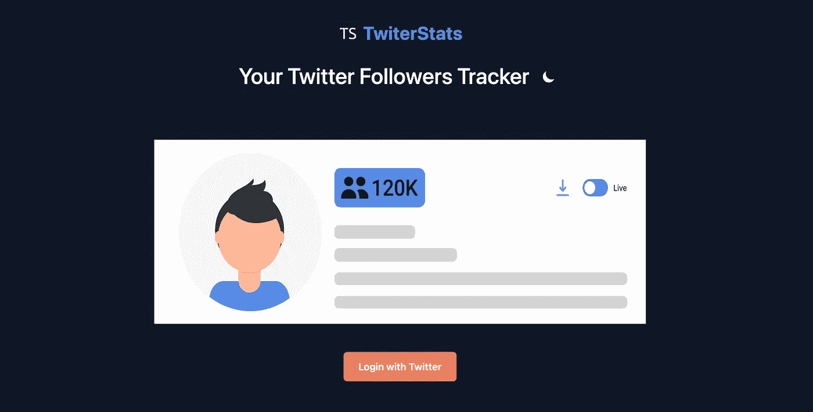

# 使用 Next.js、NextAuth 和 Tailwind 创建一个 Twitter 关注者计数器

> 原文：<https://javascript.plainenglish.io/build-a-twitter-followers-counter-using-next-js-nextauth-and-tailwind-dc8a99152af5?source=collection_archive---------5----------------------->

使用 Next.js、NextAuth、SWR、支持黑暗模式的 Tailwind 构建 Twitter 追随者计数器的步骤


TwiterStats Placeholder

要学习新东西，仅仅阅读文档是不够的。我们应该实际应用它。同样，在学习新技术时，我们应该通过开发简单的应用程序来应用它们，以获得实践经验。

为了学习一些新的技术，让我们构建一个小的应用程序。在这里，我们将通过开发一个 Twitter 关注者计数器应用程序来学习 [Next.js](https://nextjs.org/docs/getting-started) 、 [NextAuth](https://next-auth.js.org/getting-started/introduction) 、 [SWR](https://swr.vercel.app/docs/getting-started) 和 [Tailwind](https://tailwindcss.com/) CSS。

我们将建立一个类似于 [TwiterStats](https://twiter-stats.vercel.app) 的应用程序。

# 技术堆栈

1.  Next.js 用于构建 ReactJS 应用程序。
2.  用 Twitter 实现 OAuth 的 NextAuth。
3.  用于从 API 获取数据的 SWR。
4.  UI 的顺风
5.  [Twitter Lite](https://github.com/draftbit/twitter-lite) 用于从 Twitter APIs 获取数据。

# Next.js 和顺风设置

我们可以使用一个命令用 next.js 设置 tailwind，如下所示:

```
npx create-next-app -e with-tailwindcss twitter-count
```

上面的命令基于官方的 Next.js 示例自动配置顺风设置。

安装完成后，使用`cd twitter-count`导航到您的项目文件夹，并使用`yarn dev`命令启动开发服务器。如果你在浏览器中点击`http://localhost:3000`，你会看到下面的页面。



# 配置 NextAuth.js

## 什么是 NextAuth？

[NextAuth](https://next-auth.js.org/) 是 Next.js 的开源认证包，NextAuth 简化了 Twitter、Google、Apple、Github 等社交认证登录。它还支持电子邮件或无密码登录和数据库集成。

使用下面的命令将`next auth`添加到您的项目中

```
yarn add next-auth
```

接下来，在`pages/api/auth`文件夹中创建一个名为`[…nextauth].js`的文件，并添加以下代码

让我们分解上面的代码

上面的 NextAuth 函数处理所有社交认证的动态路由。这里我们将使用 Twitter OAuth，所以我们在 providers 中添加了**twiterprovider**。为了执行成功的 OAuth，我们需要 **TWITTER_ID** 和 **TWITTER_SECRET** ，通过几个简单的步骤从 [**Twitter 开发者平台**](https://developer.twitter.com/en) 获取它们。

按照这个[链接](https://developer.twitter.com/en/docs/twitter-api/getting-started/getting-access-to-the-twitter-api)中的步骤获得 Twitter API 访问权限。

从开发者门户获取秘密后，如上所述在 **env** 中更新并添加到**提供者**中。

在与 Twitter 的 OAuth 成功后，使用**回调**在会话中设置所需的数据。在成功的 OAuth 上，我们从 Twitter 获得许多细节，在这里我们将定制我们需要的数据并保存在会话中。

我们不应该将诸如`authToken`和`authSecret`这样的秘密暴露给客户端，所以我们将它们保存在 JWT 令牌对象中。然后我们可以使用`getToken`助手方法在服务器端访问用户凭证。

`**secret**`用于散列令牌、签名或加密 cookies 以及生成密钥的随机字符串。

# 配置会话提供程序

扭曲顶层组件的`SessionProvier`上下文，使用`useSession`钩子获取子组件中的会话数据，如下所示

`**refetchInterval**`用于在后台定期获取会话。

在我们的应用程序中，`_app.js`是顶层组件，所以我们已经包装了会话提供者。这里我们包装了来自 [next-theme](https://github.com/pacocoursey/next-themes) 的 ThemeProvide 上下文，以启用黑暗模式支持。

# 追随者计数器组件

在 Followers 组件中添加以下代码

# 分解追随者组件

## 什么是 SWR？

SWR 是 Next.js 团队开发的一个用于数据获取的 React 钩子。它支持实时数据提取、内置缓存、自动重新验证、预取等等。

在 followers 组件中，我们调用了`/api/twitter/user` API 来获取 Twitter 用户的基本信息，比如姓名、关注者数量、个人资料描述和位置。我们使用 SWR 在一段时间内从 API 获取数据。

因为我们从 NextOAuth 获得的数据不是实时数据。因此，我们使用 **Twitter Lite** API 来实时获取 Twitter 用户的详细信息。

# Twitter Lite 集成

Twitter Lite 是一个小巧、功能全面、灵活的 Twitter APIs 服务器库。

在 Next.js 中，你也可以构建 API，`api/*`中的文件被认为是 API 端点。它们在服务器上处理，而不是在客户端。Twitter APIs 只能从服务器端访问，所以我们在`api/`文件夹中有一个用户 API 来使用 Twitter lite 包访问 show API。

添加下面的代码`pages/api/twitter/user.js`，使用`/api/twitter/user` API 访问用户详细信息。

如下所示，在`index.js`文件中添加追随者组件。

这里我们使用`signIn`和`signOut`来自`next-auth`的方法来启动 OAuth 登录。要使用 Twitter 登录，我们将 Twitter 参数传递给登录方法，如下所示

```
signIn('twitter');
```

现在只需点击浏览器中的 URL，就可以看到如下的变化



Login

在调用`**signIn**`方法时，应用将被重定向到 Twitter OAuth 页面，单击 OAuth 页面上的**授权应用**按钮将重定向回我们的 followers 组件，如下图所示。

> 注册时，我们需要在 Twitter 开发人员门户中配置 OAuth 重定向 URL。


Counter Component

您可以根据自己的需要定制 UI，这里我只介绍了集成部分，以及使用 tailwind 的基本 UI。

# 在韦尔塞尔部署

您可以通过以下两步在 Vercel 中部署您的计数器应用程序:

1.  创建一个 [Vercel 账户](https://vercel.com/signup)
2.  连接您的存储库，然后单击部署。

# 链接

**GitHub 回购**->[https://github.com/Nilanth/twiter-stats](https://github.com/Nilanth/twiter-stats)

**现场演示**->[https://twiter-stats . vercel . app](https://twiter-stats.vercel.app/)

# 结论

我们已经成功地将 Twitter 与 NextAuth 集成在一起，并使用 Next 和 tailwind 显示了关注者的数量。我们现在已经有了使用这些技术的实际经验。

感谢您的阅读。

*更多内容看* [*说白了。报名参加我们的*](http://plainenglish.io/) [*免费每周简讯*](http://newsletter.plainenglish.io/) *。在我们的* [*社区*](https://discord.gg/GtDtUAvyhW) *获得独家写作机会和建议。*