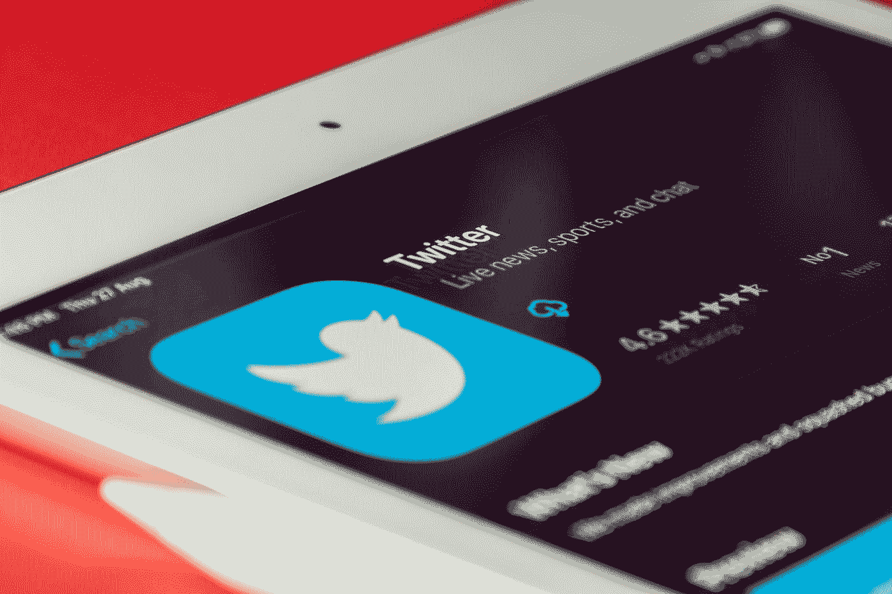

# 用 Next.js 和 Upstash Redis 免费构建一个 Twitter 调度器

> 原文：<https://javascript.plainenglish.io/build-a-twitter-scheduler-for-free-with-next-js-aa57d73eaa4d?source=collection_archive---------2----------------------->



Photo by [Souvik Banerjee](https://unsplash.com/@rswebsols?utm_source=medium&utm_medium=referral) on [Unsplash](https://unsplash.com?utm_source=medium&utm_medium=referral)

Twitter 是一个流行的社交媒体平台，开发者可以通过它与全球观众分享他们的想法、想法和观点。这是与其他开发人员联系、了解最新趋势和技术以及向全世界展示他们的工作的好方法。

为了充分利用 Twitter，你需要定期发帖。通过提前计划和安排你的推文，你可以节省时间并增加你的参与度。有许多付费 SaaS(软件即服务)解决方案允许用户在社交媒体平台上安排帖子。然而，这些服务可能很贵，并且需要订阅。

在本文中，我们将使用 Next.js 构建自己的解决方案，这是一个用于构建全栈应用程序的 React 框架。首先，我们需要将我们的 tweets 保存到 Redis 数据库中，在 T1 之上。然后，我们将创建一个 Next.js API 路由来从数据库中获取 tweets。最后，我们将使用 Twitter API 将推文发布到我们的帐户。

# **UI 和表单**

我们首先创建一个简单的 UI 来安排我们的推文。作为 Next.js 样板文件的创建者，我使用自己的样板文件开始。Next.js 样板是一个 Next.js starter 模板，它包括一个完全配置的项目，其中包含构建生产就绪应用程序所需的所有工具。这个项目的源代码可以在 GitHub 的 [Next.js 样板](https://github.com/ixartz/Next-js-Boilerplate)上找到。

为了开始，我们需要向我们的项目添加以下依赖项:

```
npm install react-hook-form @upstash/redis @upstash/qstash axios
```

我们使用 *react-hook-form* 库来处理表单状态。在 *src/pages* 文件夹中，我们创建一个新的页面 *add-tweet.tsx* 并添加一个简单的表单:

```
import axios from 'axios';
import { useForm } from 'react-hook-form';

const AddTweet = () => {
  const { register, handleSubmit, reset } = useForm();

  const onSubmit = handleSubmit(async (data) => {
    await axios.post('/api/add-tweet/', {
      ...data,
    });

    reset();
  });

  return (
    <form onSubmit={onSubmit}>
      <label>
        Message:
        <input type="text" {...register('message')} />
      </label>

      <label>
        Scheduled date:
        <input
          type="datetime-local"
          {...register('scheduledDate', { valueAsDate: true })}
        />
      </label>

      <input type="submit" value="Submit" />
    </form>
  );
};

export default AddTweet;
```

# **全球 Redis 数据库**

对于数据库部分，我们使用 [Upstash](https://upstash.com/?utm_source=remi2) ，一个完全托管的 Redis 数据库。Upstash 是为那些希望构建应用程序而无需担心和管理数据库的开发人员提供的解决方案。Upstash 的另一个优点是它可以在边缘运行，这导致了更快的响应时间。它与 Edge API 路由配合得非常好。

首先，我们需要在 Upstash 上创建一个新帐户。一旦你创建了一个帐户，你就可以创建一个新的数据库。我们对这个项目使用免费计划，其中包括每月 10，000 个请求(2，000 个用于全局数据库)。

一旦创建了一个 Upstash 帐户，您需要创建一个新的数据库:


Redis global database on Upstash

# **连接到 Redis 数据库**

为了连接到 Upstash Redis 数据库，我们使用了 *@upstash/redis* 包。我们还需要创建一个名为 *src/utils/Redis.ts* 的新文件:

```
import { Redis } from '@upstash/redis';

export const redis = new Redis({
  url: process.env.UPSTASH_REDIS_REST_URL || '',
  token: process.env.UPSTASH_REDIS_REST_TOKEN || '',
});
```

要访问*upstresh _ REDIS _ REST _ URL*值，请转到您的 upstresh 仪表板。一旦你复制了 Redis REST 的 URL，你可以把它粘贴到*中。env* 文件。

```
UPSTASH_REDIS_REST_URL=https://XXXXXXXX.upstash.io
```

除了*upstresh _ REDIS _ REST _ URL*值之外，您还需要从您的 upstresh 仪表板中复制*upstresh _ REDIS _ REST _ TOKEN*变量。但是，这一次，请将该值传递到` . env.local `文件中:

```
UPSTASH_REDIS_REST_TOKEN=XXXXXXXX
```

为了保证我们的秘密变量的安全，将它们存储在 *.env.local* 文件中是一个很好的做法。因为这个文件没有提交给 Git 存储库，所以我们的秘密不会暴露给任何可以访问存储库的人。

# **存储在数据库中的 Edge API 路由**

我们需要通过创建一个新文件 *src/types/Tweet.ts* 来定义一个模式:

```
export type IAddTweet = {
  message: string;
  scheduledDate: string;
};
```

接下来，我们创建一个新文件*src/pages/API/add-tweet . ts*来处理表单提交。我们使用 *@upstash/redis* 库连接到我们的 redis 数据库并保存 tweet。

```
import type { NextRequest } from 'next/server';

import type { IAddTweet } from '@/types/Tweet';
import { redis } from '@/utils/Redis';

export default async function handler(req: NextRequest) {
  const reqJson: IAddTweet = await req.json();

  await redis.zadd('tweet', {
    score: new Date(reqJson.scheduledDate).getTime() / 1000, // convert to seconds
    member: reqJson.message,
  });

  return new Response(
    JSON.stringify({
      success: true,
    }),
    {
      status: 200,
      headers: {
        'content-type': 'application/json',
      },
    }
  );
}

export const config = {
  runtime: 'experimental-edge',
};
```

为了使我们的 API 路由可以非常快速地访问，我们使用 Next.js 的 Edge API 路由功能。Edge API 路由是在边缘上运行的无服务器函数。这意味着我们的 API 路由将在靠近用户的地方执行，这导致了更快的响应时间。

# **使用代码**在 Twitter 上发帖

我们已经成功地以编程方式创建了我们的第一条 tweet，但是为了更进一步，我们需要将我们的 tweet 安排在未来的特定时间。这样，我们可以确保我们的推文在最有效的时间发出，以获得最大的参与度和影响力。

不幸的是，只有当我们手动运行 API 路由时，它才起作用。为了自动化这个过程，我们需要使用 cron 作业。cron 作业是在指定时间定期运行的任务。而且，对于无服务器功能，我们无法访问 cron 作业。为了解决这个问题，我们可以使用一个像 Upstash QStash 这样的外部服务。QStash 是一个无服务器应用程序的调度解决方案。

现在，我们需要更新 API 端点，我们可以从数据库中检索推文，并检查是否有任何推文计划发布。在*src/pages/API/schedule-tweet . ts*中，我们添加以下代码:

```
import { verifySignature } from '@upstash/qstash/nextjs';
import axios from 'axios';
import type { NextApiRequest, NextApiResponse } from 'next';

import { redis } from '@/utils/Redis';

async function handler(_req: NextApiRequest, res: NextApiResponse) {
  const currentTimestamp = Date.now() / 1000;
  const list = await redis.zrange('tweet', 0, currentTimestamp, {
    byScore: true,
  });

  for (let i = 0; i < list.length; i += 1) {
    // Run sequentially the requests to prevent overloading Twitter API
    await axios.post(
      'https://api.twitter.com/2/tweets',
      {
        text: list[i],
      },
      {
        headers: {
          Authorization: `Bearer ${process.env.TWITTER_BEARER_TOKEN}`,
        },
      }
    );
  }

  await redis.zremrangebyscore('tweet', 0, currentTimestamp);

  res.status(200).json({
    success: true,
  });
}

export default verifySignature(handler);

export const config = {
  api: {
    bodyParser: false,
  },
};
```

*验证签名*需要两个环境变量:*QSTASH _ CURRENT _ SIGNING _ KEY*和*QSTASH _ NEXT _ SIGNING _ KEY*。这些变量用于验证请求的签名。因此，我们可以确保请求来自 QStash，而不是来自一个坏演员。您可以从您的仪表板上获取这些变量值。

您还需要将 Next.js 应用程序部署到可公开访问的 URL。例如，您可以在 Vercel 上部署。因此，QStash 可以向 API 端点 *api/schedule-tweet* 发送请求。

部署完 Next.js 应用程序后，在 Upstash 仪表板中，您可以转到 QStash 部分并创建一个新的*请求构建器*。您还需要添加端点 URL 和 cron 作业的频率。在本例中，它将每天运行 cron 作业。


QStash Next.js Cron job

此外，您可以根据需要更改 cron 作业的频率。例如，您可以将其更改为每分钟或每小时。

# **结论**

在本文中，我们使用 Next.js 和 [Upstash](https://upstash.com/?utm_source=remi2) 构建了一个 Twitter 调度器。我们使用 Next.js API 路由将 tweets 存储在 Redis 数据库中，并在未来的特定时间对它们进行调度。我们还使用 Twitter API 将推文发布到我们的帐户。

通过构建自己的 Twitter 调度程序，你可以避免使用昂贵的 SaaS 解决方案，节省资金。您也可以将此项目作为起点，并根据您的需求进行改进。

*报名参加我们的* [***免费每周简讯***](http://newsletter.plainenglish.io/) *。关注我们关于* [***推特***](https://twitter.com/inPlainEngHQ) ， [***领英***](https://www.linkedin.com/company/inplainenglish/) *，*[***YouTube***](https://www.youtube.com/channel/UCtipWUghju290NWcn8jhyAw)*，以及* [***不和***](https://discord.gg/GtDtUAvyhW) ***。***