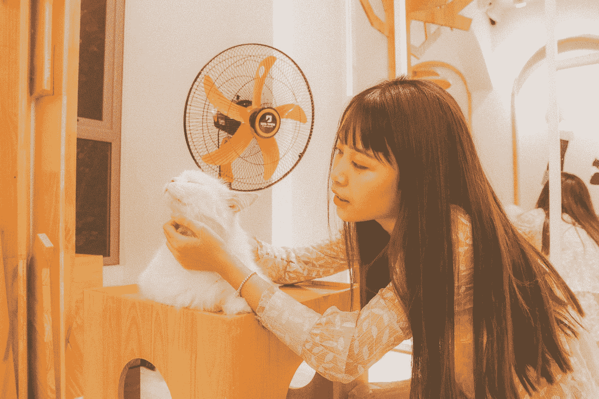
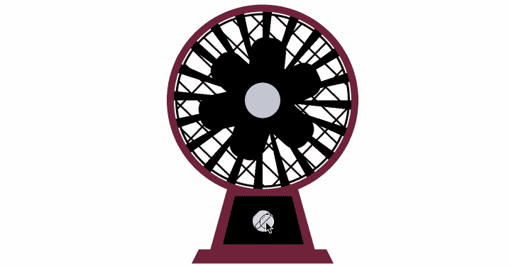
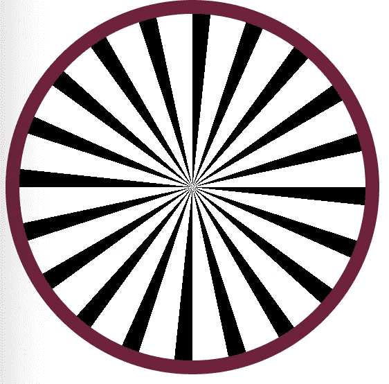
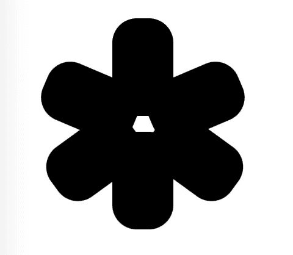

# 打造一个很酷的 CSS 品牌电风扇

> 原文：<https://javascript.plainenglish.io/build-a-very-cool-css-brand-electric-fan-17a0043fce31?source=collection_archive---------10----------------------->

Photo by Nguyễn Hiệp on Unsplash

夏天来了，你还在吃着冰淇淋，吹着屋里的空调吗？记得小时候会调皮地往电风扇上喷水，看着水滴四处飞溅。我当时太开心了，一个电风扇就能玩这么多花样。今天送你一台 CSS 牌电风扇，希望把快乐传递给你。

# 定义全局变量

主要底色是黑色，经典的红色轮廓，内饰以黑色为主。

# 头

## 1.后脑勺

首先画电风扇头部的后盖。它的轮廓是经典的红色`#70233b`，里面是黑色。重点是用`background-image`的 r `epeating-conic-gradient`方法实现后盖。

## 2.标题风扇页

网格主要应用于背景。通过`-webkit-linear-gradient`方法和`background`的`background-size`属性可以实现宽度和高度不等的网格。

二是用一个伪类实现中间的圆。如果你愿意，也可以使用伪类中的`background-image`来 DIY 一个属于自己的粉丝。

## 3.内部风扇叶片

共有六片黑色扇叶，通过定位和旋转来旋转。需要注意的是，因为后期母元素带动内部风叶一起旋转，所以必须在外面再包一层。

# 控制区和基地

主要的困难是梯形的绘制。同样，底部其实也是梯形。在这里，我将高度设置为零，然后设置边界来实现梯形。目前这里只展示了一个梯形图。其他代码相对简单。有兴趣可以根据 [CodePen](https://codepen.io/OMGZui/pen/JjpeZdW) 的代码试试。

# 转换

在开关上绑定一个`changeControl`方法，通过控制`control`变量来改变档位。总共有三个档位。如果小于三档，可以继续加另一档。当等于三档时，会归零，重新启动。设置不同的`class`使用`rotateZ`触发不同角度的旋转，每次可以通过`45deg`旋转按钮。

# 最后

**感谢阅读**。期待您的关注，阅读更多高质量的文章。

[omgzui](https://medium.com/@omgzui?source=post_page-----17a0043fce31--------------------------------)

## 更好的编程

[View list](https://medium.com/@omgzui/list/better-programing-9b4c9bb174aa?source=post_page-----17a0043fce31--------------------------------)109 stories

[omgzui](https://medium.com/@omgzui?source=post_page-----17a0043fce31--------------------------------)

## Java Script 语言

[View list](https://medium.com/@omgzui/list/javascript-48bfc7b5f93c?source=post_page-----17a0043fce31--------------------------------)57 stories

[omgzui](https://medium.com/@omgzui?source=post_page-----17a0043fce31--------------------------------)

## 新闻

[View list](https://medium.com/@omgzui/list/news-67ec0a972660?source=post_page-----17a0043fce31--------------------------------)23 stories

*更多内容看* [***说白了就是 io***](https://plainenglish.io/) *。报名参加我们的* [***免费周报***](http://newsletter.plainenglish.io/) *。关注我们关于*[***Twitter***](https://twitter.com/inPlainEngHQ)*和*[***LinkedIn***](https://www.linkedin.com/company/inplainenglish/)*。查看我们的* [***社区不和谐***](https://discord.gg/GtDtUAvyhW) *加入我们的* [***人才集体***](https://inplainenglish.pallet.com/talent/welcome) *。*