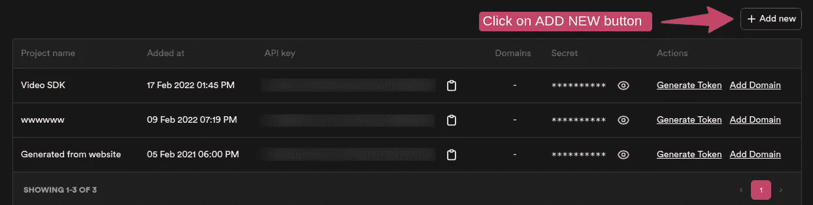
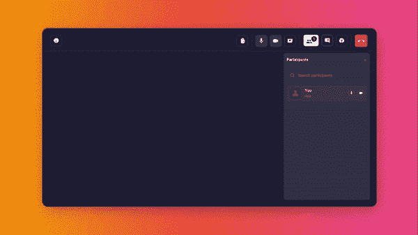

# 用 JavaScript 和视频 SDK 在 5 分钟内构建一个视频通话应用

> 原文：<https://javascript.plainenglish.io/build-a-video-calling-app-in-5-minutes-with-javascript-and-video-sdk-224c60013a40?source=collection_archive---------13----------------------->

## 本教程将带您了解使用 Video SDK 构建可伸缩、响应迅速的 JavaScript 视频通话应用的过程。


Build a Video Calling App in 5 minutes with JavaScript and Video SDK

预构建的 SDK 支持集成实时通信 SDK，而无需编写显式代码。只需要 10 分钟整合。

它支持所有现代框架，如普通 JavaScript、React、Vue.js 和 Angular。

*   每月免费 10，000 分钟
*   完全低代码，无服务器。
*   富媒体聊天支持。
*   高清和全高清屏幕共享。
*   将它与脸书、Youtube 等社交媒体联系起来(RTMP 支持)。
*   在云上记录您的会议
*   内置白板支持
*   根据您的需求定制用户界面。

# 嵌入式视频通话仅需 5 个步骤

## 第一步:注册 videosdk.live

访问[https://app.videosdk.live/settings/api-keys](https://app.videosdk.live/settings/api-keys)，注册你的 Google 或 Github 账户，生成一个新的 API 密匙来运行预构建。



Go to Dashboard, navigate to [API Keys](https://app.videosdk.live/settings/api-keys) and click on ADD NEW button.

## 步骤 2:在 HTML 页面中导入脚本

```
<script src="https://sdk.videosdk.live/rtc-js-prebuilt/0.2.6/rtc-js-prebuilt.js"></script>
```

注意:你也可以使用官方的 npm 包:[RTC-js-pre build](https://www.npmjs.com/package/@videosdk.live/rtc-js-prebuilt)

## 步骤 3:添加脚本并设置会议[](https://docs.videosdk.live/docs/tutorials/realtime-communication/prebuilt-sdk/quickstart-prebuilt-js/#step-2-add-script-and-setup-the-meeting)

创建一个`index.html`文件，并在代码的`<body>`标签末尾添加下面的`<script>`标签。脚本加载后初始化`VideoSDKMeeting`。将`apiKey`替换为步骤 1 中生成的那个。

## 步骤 4:在代码中插入 API 键来运行它。

```
10: apiKey: **"<API KEY>"**, // generated in Step 1
```

## 步骤 5:运行演示

```
$ npm install -g live-server
$ live-server --port=8000
```

## **结论**

在本文中，我已经用 JavaScript 解释了视频聊天。您可以根据需要修改代码中的几个参数。这是对视频 SDK 预构建 SDK 的简单介绍。

这里是同样的视频版本。

**查看官方指南** : [Video SDK 预建 SDK](https://docs.videosdk.live/prebuilt/guide/prebuilt-video-and-audio-calling/getting-started) 了解更多信息。



就这样，我们用 JavaScript 中的视频 SDK 成功搭建了视频通话 app。如果您希望添加更多功能，您可以随时查看我们的[文档](https://docs.videosdk.live/prebuilt/guide/prebuilt-video-and-audio-calling/getting-started/)。

如果你想更深入地研究，你可以阅读这篇深入讨论这个例子的博客。该项目是 [React 开源](https://github.com/videosdk-live/videosdk-rtc-react-prebuilt-ui)；可以去看看 GitHub 回购。

如果您在使用 Video SDK 预构建 SDK 时有任何问题，我邀请您加入 [Video SDK 开发者不和谐社区](https://discord.gg/Gpmj6eCq5u)。你可以在`#prebuilt-sdk channel`中提出你的问题。或者你可以在推特上联系我。

*更多内容看* [***说白了。报名参加我们的***](https://plainenglish.io/) **[***免费周报***](http://newsletter.plainenglish.io/) *。关注我们关于*[***Twitter***](https://twitter.com/inPlainEngHQ)*和**[***LinkedIn***](https://www.linkedin.com/company/inplainenglish/)*。加入我们的* [***社区***](https://discord.gg/GtDtUAvyhW) *。****