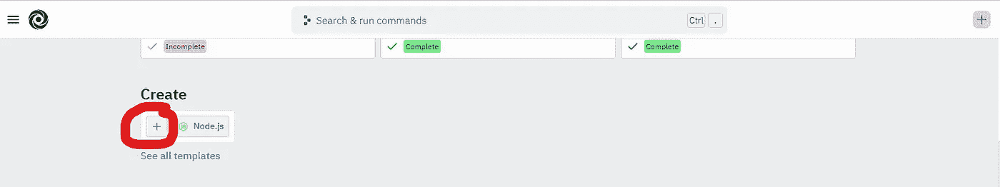
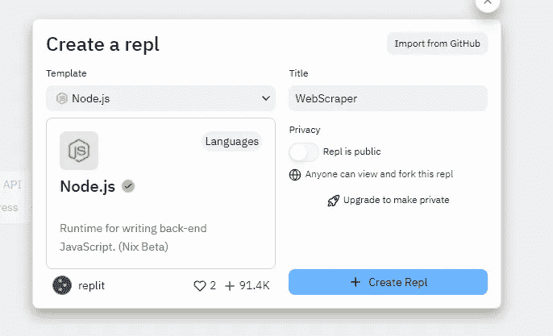

# 和我一起做一个网络刮刀

> 原文：<https://javascript.plainenglish.io/build-a-web-scraper-with-me-beginner-friendly-19d2d98ac8d1?source=collection_archive---------3----------------------->

## 关于如何使用 Node.js & Cheerio 构建 web scraper 的初学者友好指南。


Photo By [Le Buzz](https://www.instagram.com/lebuzz_magazine/)

朋友们好，

今天，我们要做一些很酷(也很容易——所以不要离开)的事情。我们将使用 Javascript 构建一个 web scraper。我将向您展示一个非常简单、易于理解的例子，从这个例子中，您将能够构建它，将其应用到其他项目中，并有望构建出很酷的东西。

# 什么是 Web Scraper？

web scraper 基本上是一种从 web 中提取数据并以有意义的方式使用它的工具。

今天，对于我们的项目，我们将从维基百科的页面“[Spotify](https://en.wikipedia.org/wiki/List_of_most-streamed_artists_on_Spotify)上流量最大的艺术家列表”中提取数据。

更具体地说，我们将从该表中获取数据:


这张表显示了 Spotify 每月听众最多的顶级艺术家(显然是过去 30 天)。随着时间的推移，数据会发生变化。我们将得到艺术家的名字，他们的排名，和他们每月的听众。

我们收集完这些数据后，你可以做任何你想做的事情。例如，你可以在你的网站上展示它。就我个人而言，我用它创建了一个 API——但这超出了本教程的范围。跟着我，也许你会在不久的将来看到那个教程。

所以让我们开始吧。

# 准备

首先，我们需要一些工具。

通常情况下，如我的 [Axios 教程](https://blog.bitsrc.io/the-beginners-guide-to-get-started-with-axios-85a5e8caa2dd)或 [React 教程](/say-hello-world-in-reactjs-63018c533d5e)所示，我推荐安装 Node.js 和 VS 代码。*如果你不知道什么 NodeJS，我鼓励你去看看我的*[*NodeJS 简介*](https://medium.com/bitsrc/nodejs-learn-nodejs-and-npm-d7ebdc235f) 。

但是对于这个项目，我想我们会走一条更容易的路线，这样这个过程就不会那么漫长和令人生畏。

如果您已经安装了 NodeJS 和 VS 代码，请随意使用。这很容易理解。否则，如果你是初学者，请前往[回复](https://replit.com/)。

## 回复说明

Replit 是一个可以编译 NodeJS 的在线 IDE。你不需要在电脑上安装任何东西。所以很容易上手。

首先，创建一个新帐户。

然后创建一个项目，如下所示:



将出现一个弹出窗口，如下所示:



对于模板，**选择 Node.js** 。然后，您可以随意命名您的项目。我将把我的命名为“网络刮刀”。完成后，创建您的项目。跳过下一节“VS 代码准备”，直接进入“安装包”开始。

## VS 代码准备

如果你用的是 VS 代码，这就是指令集。如果你正在使用 VS 代码，我假设你知道你在做什么，所以我不会深入研究。

创建您的项目，在您的终端中运行`npm init`，并创建一个 index.js 文件。

# 安装软件包

首先，我们需要安装两个包:Request 和 Cheerio。

[请求](https://www.npmjs.com/package/request)是一个 npm 包，允许我们发送 HTTP 请求。我们使用**请求**，这样我们就可以得到一个页面的 HTML。如果我们想从网页上收集数据，我们需要访问网页的 HTML。

例如:

```
<body>
    <h1>Hello World</h1>
</body>
```

如果我们想得到一个页面的标题——在这个例子中是“Hello World”——你可以清楚地看到我们将从 HTML 中提取它。希望这一点很清楚。

继续，我们需要啦啦队。因此**请求**给了我们 HTML，但是我们需要 **Cheerio** 以便我们可以挑选 HTML。我们只需要 HTML 的某些部分。我们不需要全部。Cheerio 帮助我们提取我们确实需要的零碎信息。因此，使用 cheerio，我们可以将“Hello World”从整个 HTML 代码中分离出来，并以有意义的方式使用它。

希望这是有意义的。如果没有，这里有另一种思考方式。

对于这个项目，我们从维基百科文章页面“[Spotify 上流量最大的艺术家列表](https://en.wikipedia.org/wiki/List_of_most-streamed_artists_on_Spotify)”获取 Spotify 的月度流量数据。

**请求**将发送整个网页的 HTML。我们不需要这些。因此，为了获得我们确实需要的信息，比如艺术家姓名和每月听众人数，我们将使用 **cheerio** 。

## 如何安装软件包


在 Replit 中安装包非常容易，对初学者也很友好。在左侧边栏中，单击如上所示的按钮。它会展开一个菜单，你可以在里面输入你想要安装的软件包。

输入“cheerio”。


我们想要只写着“cheerio”的。点击+按钮进行安装。

接下来，我们要安装**请求**。虽然您可以使用我们刚刚使用的过程来安装请求包，但是我想向您展示我们可以安装包的另一种方法。


你的屏幕应该看起来像这样。在右边，打开你的外壳。我用红色圈了起来。这将打开您的终端。

在您的终端中，编写以下命令来请求安装。

```
npm install request
```

上面也显示了该过程。它应该安装成功。

一旦安装了这两个包，我们就可以继续了。

# 需要我们的包裹


现在我们的包已经安装好了，我们终于可以从 index.js 文件开始了。要访问该文件，请转到侧边栏并单击顶部的文档图标。我给你圈出来了，在上面的截图里。

如果(出于某种原因)您没有 index.js 文件，那么就创建一个。

所以我们要做的第一件事是让我们的包在 Javascript 文件中可用。在 index.js 文件的顶部编写以下内容:

```
const request = require("request");const cheerio = require("cheerio");
```

发生什么事了？

require("package-name ")基本上是让包在我们的脚本中可用。注意，包名是区分大小写的。不要写`require('Request')`举例。

你可以看到我们将它们存储在一个常量变量中。这个常量变量就是我们如何访问这些包提供的功能。为了清楚起见，您可以将这些包视为库。包有使我们的编码体验更容易的函数/方法。

所以，如果我们想使用 cheerio 的 load 函数，我们应该写`cheerio.load()`。

# 获取 HTML

现在，我们将获得我们想要抓取的网页的 HTML。如果你想浏览《华尔街日报》、斯坦福的主页或迪士尼的招聘页面，你可以这么做。

在这个项目中，我们在网上搜集维基百科的文章[Spotify](https://en.wikipedia.org/wiki/List_of_most-streamed_artists_on_Spotify)上流量最大的艺术家名单。

所以网络抓取的第一步是获取你想要抓取的网页的 URL。网址是:

[](https://en.wikipedia.org/wiki/List_of_most-streamed_artists_on_Spotify) [## Spotify - Wikipedia 上流量最大的艺术家列表

### 该列表包含音频流媒体平台 Spotify 上播放量最大的艺术家。截至 2022 年 2 月，威肯…

en.wikipedia.org](https://en.wikipedia.org/wiki/List_of_most-streamed_artists_on_Spotify) 

下一步是输入 URL 作为**请求**函数的参数。

请求函数看起来像这样:

```
request("URL-here", function());
```

第一个参数是您想要抓取的网页的 URL。

第二个参数是一个函数，它提供了在发出 HTTP 请求后您希望发生什么的指令。

到目前为止，我们的请求函数是这样的:

```
request("[https://en.wikipedia.org/wiki/List_of_most-streamed_artists_on_Spotify](https://en.wikipedia.org/wiki/List_of_most-streamed_artists_on_Spotify)", function(**error, response, html**){ ...code here});
```

你看到函数有参数了吗:错误、响应和 HTML？所以 HTTP 请求发出后，会有 HTTP 响应。响应将包括是否发生错误、响应状态代码(表明响应是否成功)和 HTML 代码。

函数中的这些参数允许我们在 HTTP 响应中使用信息——是的，顺序很重要。

```
request("https://en.wikipedia.org/wiki/List_of_most-streamed_artists_on_Spotify", function(error, response, html){ if(!error && response.statusCode == 200){ }});
```

因此，在我们的函数中，我们将添加一个 if 语句，如下所示。它基本上是说，“如果没有错误，并且响应是成功的，让我们继续。

对吗？因为如果有错误并且 HTML 没有被检索到，那么我们什么也做不了。

## 打印 HTML

所以让我们做一个小小的检查。在 if 语句中，让我们将 HTML 打印到控制台。我们这样做只是为了看看我们是否成功地检索到了 HTML。

```
const request = require("request");const cheerio = require("cheerio");request("https://en.wikipedia.org/wiki/List_of_most-streamed_artists_on_Spotify", function(error, response, html){ if(!error && response.statusCode == 200){ console.log(html) }});
```


如果您运行它，您将看到我们成功地检索了 HTML。HTML 是在我们的控制台中打印出来的(显示在右边)。

现在我们有了 HTML，我们可以使用 Cheerio 来收集我们确实需要的零碎信息。

# DOM 操作

在我们深入研究 cheerio 之前，您需要了解选择器。如果您有使用 jQuery、DOM 操作甚至 CSS 选择器的经验，可以跳过这一节。否则，请花时间了解它们。

W3 Schools 有一个很棒的[选择器参考](https://www.w3schools.com/cssref/css_selectors.asp)页面。看看这个。和他们一起玩，看看他们是如何工作的。

这里有一个例子:

```
<div>
   <h2> Kyle </h2>
   <p> is a developer </p>
</div>
```

要选择 h2，我们可以使用以下选择器:

`div h2`或者仅仅是`h2`

显然，随着 HTML 文档变得越来越长、越来越庞大，选择器就不那么容易了。但是如果你明白这一点，请继续。否则，了解更多信息，

# Cheerio 负载

所以我们有了 HTML。现在我们需要给 Cheerio 那个 HTML。

```
const $ = cheerio.load(html);
```

这是如何做到的。这是标准的做法。现在，我们可以使用$作为从 HTML 中选择元素的方法。例如，如果我们想从 HTML 中选择元素，我们可以写`$("body")`。

如果我们想从 HTML 中选择 h1 元素，我们可以写`$("h1")`

如果我们想选择一个 id 为`img-container`的元素，我们可以写`$("#img-container")`等等。这就是啦啦队的全部。它允许我们提取东西。


不幸的是，维基百科的 HTML 非常复杂。在上面的截图中，我在左边显示维基百科页面，右边显示 HTML 代码。

(要访问任何网页的 HTML 代码，只需右键单击并点击 Inspect。)

如截图所示，要获得 83.95 的数据点，HTML 很复杂。数字实际上嵌套在十亿个不同的元素中。因此，我将把选择器给你。本教程的重点是 cheerio，而不是选择器；所以让我们把注意力放在啦啦队上。

# 收集艺术家数据

我们的第一个任务是收集一组艺术家的名字。

```
const request = require("request");const cheerio = require("cheerio");request("https://en.wikipedia.org/wiki/List_of_most-streamed_artists_on_Spotify", function(error, response, html){ if(!error && response.statusCode == 200){ const $ = cheerio.load(html); let names = []; $(".mw-body .mw-body-content .mw-parser-output .wikitable tbody td a").each((i,el) => { const item = $(el).text().replace(/[0-9]/g, '').replace(/[\[\]']+/g,''); if(names.length < 20 && item != ""){ names.push(item); } }) console.log(names) }//end if statement});
```


运行它，你应该会看到艺术家的名字数组。

我们来分解一下，这样你就明白了。

#1

```
const $ = cheerio.load(html);let names = [];
```

我们首先将 HTML 加载到 cheerio 中，并创建一个名为 names 的空数组。数组名是我们存储歌手名字的地方。

#2

接下来，我们使用 cheerio 的选择器:

```
$(".mw-body .mw-body-content .mw-parser-output .wikitable tbody td a")
```


被选择的项目是表中艺术家的名字。你看到我们在选择器的最后写了`td a`吗？所以 a 是锚定标签。而锚文本就是艺人的名字。

#3

连接到选择器，您可以看到每个功能:

```
$(".mw-body .mw-body-content .mw-parser-output .wikitable tbody td a")**.each((i,el) => {** **const item = $(el).text().replace(/[0-9]/g, '').replace(/[\[\]']+/g,'');** **if(names.length < 20 && item != ""){** **names.push(item);** **}****})**
```

它在做什么？看上面的维基百科表格。你看到那张桌子上有多位艺术家了吗？所以我们提供的选择器(“`.mw-body .mw-body-content .mw-parser-output .wikitable tbody td a`”)可以描述该表中的所有条目。选择器可以用来获取所有艺术家的名字。

如果你不明白这一点，想想选择器`h2`。选择器可用于选择文档中的所有 h2 元素。对吗？或者想想`.img-container`是哪一个阶层。该类选择器可用于选择使用该类的所有元素。对吗？

类似地，我们的选择器可以用来选择所有这些艺术家。所以每个函数基本上都要选择选择器可以选择的所有元素。换句话说，它将收集所有艺术家的名字。

#4

```
$(".mw-body .mw-body-content .mw-parser-output .wikitable tbody td a").each((i,el) => {**const item = $(el).text().replace(/[0-9]/g, '').replace(/[\[\]']+/g,'');**if(names.length < 20 && item != ""){names.push(item);}})
```

这里我们看到的是一条粗粗的线。发生了很多事。

所以在这里，变量`el`代表一个艺人的名字。你可以看到我们做了$(el)。文本()。

如果我们不添加`text()`，那么您将会收到一个 HTTP 响应。它看起来像这样:


这是一大堆什么都没有。但是如果我们添加`text()`，我们将得到嵌入元素中的实际文本。

例如，从 `<a href=””> text </a>`或 `<div> text</div>`我们只能得到文本。这就是我们想要的。


你看到所有的数字和方括号了吗？我们不想要那些数字。

为了消除这一点，我们添加了`.replace(/[0–9]/g, ‘’).replace(/[\[\]’]+/g,’’)`


你看到所有的空弦了吗？上面写着“还有 84 个项目”？

我们只想要前 20 名的艺人，不要空弦。为了解决这个问题，我们添加了以下内容:

```
if(names.length < 20 && item != ""){ names.push(item);
}
```

基本上，如果数组少于 20 位艺术家&字符串不为空，那么将字符串添加到数组中。


太美了。

然后我们重复这个过程来计算每月的听众人数。

# 收集每月听众计数

我们创建了一个新的空数组来保存每月的侦听器计数。

```
let numbers = [];
```

然后我们添加我们的选择器:

```
$(".mw-body .mw-body-content .mw-parser-output .wikitable tbody tr td").each((i,el) => {const item = $(el).html();if(numbers.length < 20 && !isNaN(parseFloat(item))){numbers.push(item);}})
```

上一节中的逻辑同样适用。我们的选择器可以用来选择许多不同的元素。这就是我们使用每项功能的原因。

注意，在这个例子中，我们使用了 `$(el).html()`，这与之前我们使用`text()`的部分不同。这是因为维基百科的 DOM 设置方式。`html()`将返回一个 HTML 字符串——这正是我们能够提取数字的方式。使用 text()是不可能的。

为了了解更多，我认为最好的学习方法就是通过实验。自己测试一下吧。

# 运行代码

```
const request = require("request");const cheerio = require("cheerio");request("https://en.wikipedia.org/wiki/List_of_most-streamed_artists_on_Spotify", function(error, response, html){if(!error && response.statusCode == 200){const $ = cheerio.load(html);let names = [];let numbers = [];$(".mw-body .mw-body-content .mw-parser-output .wikitable tbody td a").each((i,el) => {const item = $(el).text().replace(/[0-9]/g, '').replace(/[\[\]']+/g,'');;if(names.length < 20 && item != ""){names.push(item);}})console.log(names)$(".mw-body .mw-body-content .mw-parser-output .wikitable tbody tr td").each((i,el) => {const item = $(el).html();if(numbers.length < 20 && !isNaN(parseFloat(item))){numbers.push(item);}})console.log(numbers)}//end if statement});
```

这是完整的代码。

它也可以在我的 GitHub 库[spotifymonthystreams](https://github.com/kyledeguzmanx/fDev-API-SpotifyMonthlyStreams)中找到。看看这个。

希望这篇教程有所帮助。在我写的时候，选择器确实变得越来越复杂。或许在不久的将来，我会制作一个更基础的教程。

感谢您的阅读。

## 进一步阅读

[](/overcoming-3-major-web-scraping-challenges-that-developers-face-1e664ffe4783) [## 克服开发者面临的 3 大网络抓取挑战

### 如何克服 3 个主要的网络抓取限制—动态网站、网站交互和指纹管理…

javascript.plainenglish.io](/overcoming-3-major-web-scraping-challenges-that-developers-face-1e664ffe4783) [](/automate-web-scraping-with-an-easy-to-use-browser-extension-cb6073f1e61d) [## 使用易于使用的浏览器扩展自动抓取网页

### 如何使用 Listly，一个初学者友好的无代码工具，轻松实现 web 抓取过程的自动化。

javascript.plainenglish.io](/automate-web-scraping-with-an-easy-to-use-browser-extension-cb6073f1e61d) 

*更多内容看* [***说白了。报名参加我们的***](https://plainenglish.io/) **[***免费周报***](http://newsletter.plainenglish.io/) *。关注我们关于* [***推特***](https://twitter.com/inPlainEngHQ)[***LinkedIn***](https://www.linkedin.com/company/inplainenglish/)*[***YouTube***](https://www.youtube.com/channel/UCtipWUghju290NWcn8jhyAw)*[***不和***](https://discord.gg/GtDtUAvyhW) *。*****